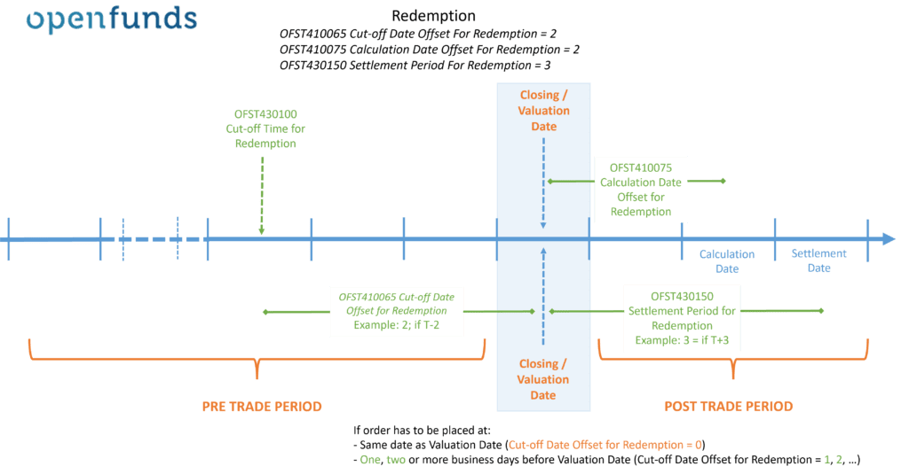

## Table of Contents

## What is a mutual fund order?

A mutual fund order is a request to buy or sell shares in a mutual fund. When you want to invest in a mutual fund, you place an order to buy shares. This order tells the mutual fund company how many shares you want to buy and at what price. The price is usually based on the mutual fund's net asset value (NAV), which is calculated at the end of each trading day.

When you decide to sell your mutual fund shares, you place a sell order. This order instructs the mutual fund company to sell a specific number of shares from your account. Like buying, the price you get for your shares is based on the NAV at the end of the trading day. Mutual fund orders are typically processed after the market closes, ensuring all investors get the same price for that day.

Mutual fund orders are important because they allow investors to easily enter or exit their investments. They provide a straightforward way to manage your money in mutual funds, whether you are looking to grow your investment or need to access your funds.

## Why is the timing of mutual fund order execution important?

The timing of mutual fund order execution is important because it affects the price you pay or receive for your shares. Mutual funds calculate their net asset value (NAV) at the end of each trading day. If you place your order before the cutoff time, usually around 4 PM Eastern Time, your order will be executed at that day's NAV. If you miss this deadline, your order will be processed the next day, at the next day's NAV. This means the price could be different, and it might be higher or lower than what you expected.

This timing can impact your investment strategy. For example, if you are investing a large amount of money, even a small difference in the NAV can affect the total cost of your investment. Similarly, if you are selling shares, the timing can influence the amount of money you get back. Knowing when your order will be executed helps you plan better and make more informed decisions about buying or selling mutual fund shares.

## How does the timing of mutual fund orders affect investment returns?

The timing of mutual fund orders can change how much money you make or lose. When you buy or sell a mutual fund, the price you get is based on the net asset value (NAV), which is figured out at the end of each day. If you put in your order before the cutoff time, usually around 4 PM, it will be done at that day's NAV. If you miss this time, your order waits until the next day, and the NAV could be different. This means you might pay more or get less money than you planned.

This timing can make a big difference in your investment returns. For example, if you want to buy a lot of shares, even a small change in the NAV can affect how much you spend. The same goes for selling; the timing can change how much money you get back. Knowing when your order will be done helps you plan better and can help you make more money over time.

## What are the typical cut-off times for placing mutual fund orders?

The usual time to place a mutual fund order is before 4 PM Eastern Time. If you get your order in before this time, it will be done at that day's price. This is important because the price of a mutual fund changes every day, and you want to know what price you will get.

If you miss the 4 PM cutoff, your order will wait until the next day. This means you might pay more or get less money than you expected, depending on what the price does overnight. So, it's a good idea to plan your orders carefully to make sure you get the price you want.

## How do weekends and holidays impact the execution of mutual fund orders?

Weekends and holidays can change when your mutual fund order gets done. If you place an order on a Friday after the cutoff time, it won't be processed until Monday, or the next business day if Monday is a holiday. This means the price you get for your shares might be different because the market is closed over the weekend or holiday.

This delay can affect your investment plans. For example, if you want to buy shares on a Friday but miss the cutoff, you might end up paying more if the price goes up over the weekend. On the other hand, if you're selling and the price drops, you could get less money than you hoped. Knowing how weekends and holidays work can help you plan better and avoid surprises with your mutual fund orders.

## What is the difference between the trade date and the settlement date for mutual fund orders?

The trade date for a mutual fund order is the day when the order is placed and the price is set. If you place your order before the cutoff time, usually around 4 PM Eastern Time, the trade date is that same day. The price you get for your shares is based on the net asset value (NAV) calculated at the end of that day. If you miss the cutoff time, the trade date becomes the next business day, and you get the next day's NAV.

The settlement date is when the actual exchange of money and shares happens. For mutual funds, the settlement date is usually one to three business days after the trade date. This means if you buy shares, the money leaves your account on the settlement date, and if you sell shares, the money goes into your account on that date. Knowing the difference between these dates helps you plan your finances and understand when your money will move.

## Can mutual fund orders be placed after the market closes, and how does this affect execution?

Yes, you can place a mutual fund order after the market closes, but it won't be done right away. If you place your order after the cutoff time, usually around 4 PM Eastern Time, it will be processed the next business day. This means the price you get for your shares will be based on the net asset value (NAV) calculated at the end of the next day, not the day you placed the order.

This delay can affect your investment. For example, if you want to buy shares and the price goes up overnight, you'll end up paying more than you expected. If you're selling and the price drops, you might get less money. Knowing this can help you plan your orders better and avoid surprises with your mutual fund investments.

## How do different types of mutual funds (e.g., equity, bond, money market) handle order timing?

Different types of mutual funds like equity, bond, and money market funds all have the same rule about when you can place orders. You need to get your order in before the cutoff time, usually around 4 PM Eastern Time, to get that day's price. If you miss this time, your order will be processed the next business day, no matter what kind of mutual fund it is. This means the price you get for your shares could be different because it's based on the next day's net asset value (NAV).

Even though the timing rules are the same, the way the NAV changes can be different for each type of fund. Equity funds, which invest in stocks, might have bigger changes in their NAV because stock prices can go up and down a lot. Bond funds, which invest in bonds, usually have smaller changes in their NAV because bond prices are more stable. Money market funds, which invest in short-term, safe investments, have the smallest changes in their NAV. Knowing this can help you understand how the timing of your order might affect the price you pay or get for different types of mutual funds.

## What are the implications of same-day versus next-day execution for mutual fund orders?

When you place a mutual fund order before the cutoff time, usually around 4 PM Eastern Time, it gets done the same day. This means you get that day's price for your shares. This can be good if you want to buy or sell right away and know exactly what price you're getting. For example, if you think the price might go up, buying on the same day can save you money. On the other hand, if you think the price might go down, selling on the same day can help you get more money.

If you miss the cutoff time, your order will be done the next business day. This means you'll get the next day's price, which could be different. This can be a problem if the price changes a lot overnight. For example, if you want to buy shares and the price goes up the next day, you'll end up paying more than you planned. If you're selling and the price drops, you'll get less money. Knowing whether your order will be done the same day or the next day can help you plan better and make smarter choices with your investments.

## How do automated trading systems affect the timing of mutual fund order execution?

Automated trading systems can change how quickly mutual fund orders are placed and done. These systems can place orders right up to the cutoff time, usually around 4 PM Eastern Time, without you having to do it yourself. This means you can be sure your order will be done the same day if the system is set up right. It's like having a helper who makes sure you don't miss the deadline.

Even with automated systems, if an order is placed after the cutoff time, it will still be done the next business day. The system can't change the rules about when orders are processed. So, while automated trading can help you get the best price by placing orders on time, it can't stop the price from changing if your order has to wait until the next day. It's good to know how these systems work so you can use them to make your investments easier and maybe even better.

## What are the regulatory requirements regarding the timing of mutual fund order execution?

The rules about when mutual fund orders are done come from the U.S. Securities and Exchange Commission (SEC). They say that mutual fund orders must be done at the end of the trading day, using the net asset value (NAV) that's figured out at that time. This means if you place your order before the cutoff time, usually around 4 PM Eastern Time, it gets the price for that day. If you miss this time, your order waits until the next business day, and you get the next day's price.

These rules are there to make sure everyone gets a fair price. They stop people from trying to time the market by quickly buying or selling based on last-minute news. By using the NAV at the end of the day, all orders placed before the cutoff time are treated the same way. This helps keep things fair and clear for everyone who invests in mutual funds.

## How can investors optimize the timing of their mutual fund orders to maximize returns?

To get the most out of your mutual fund investments, it's important to place your orders before the cutoff time, usually around 4 PM Eastern Time. This way, your order will be done at that day's price. If you think the price might go up, buying before the cutoff can save you money. If you think the price might go down, selling before the cutoff can help you get more money. Keeping an eye on the market and news can help you decide when to place your order to get the best price.

Sometimes, using automated trading systems can help you place orders right before the cutoff time without missing it. These systems can work for you, making sure your orders are in on time. But remember, if you miss the cutoff, your order will be done the next business day, and the price could be different. Knowing how the timing works and planning your orders carefully can help you make smarter choices and maybe even get better returns on your investments.

## References & Further Reading

[1]: Bergstra, J., Bardenet, R., Bengio, Y., & Kégl, B. (2011). ["Algorithms for Hyper-Parameter Optimization."](https://proceedings.neurips.cc/paper/2011/file/86e8f7ab32cfd12577bc2619bc635690-Paper.pdf) Advances in Neural Information Processing Systems 24.

[2]: ["Advances in Financial Machine Learning"](https://www.amazon.com/Advances-Financial-Machine-Learning-Marcos/dp/1119482089) by Marcos Lopez de Prado

[3]: ["Evidence-Based Technical Analysis: Applying the Scientific Method and Statistical Inference to Trading Signals"](https://www.wiley.com/en-us/Evidence+Based+Technical+Analysis%3A+Applying+the+Scientific+Method+and+Statistical+Inference+to+Trading+Signals-p-9780470008744) by David Aronson

[4]: ["Machine Learning for Algorithmic Trading"](https://github.com/PacktPublishing/Machine-Learning-for-Algorithmic-Trading-Second-Edition) by Stefan Jansen

[5]: ["Quantitative Trading: How to Build Your Own Algorithmic Trading Business"](https://books.google.com/books/about/Quantitative_Trading.html?id=j70yEAAAQBAJ) by Ernest P. Chan