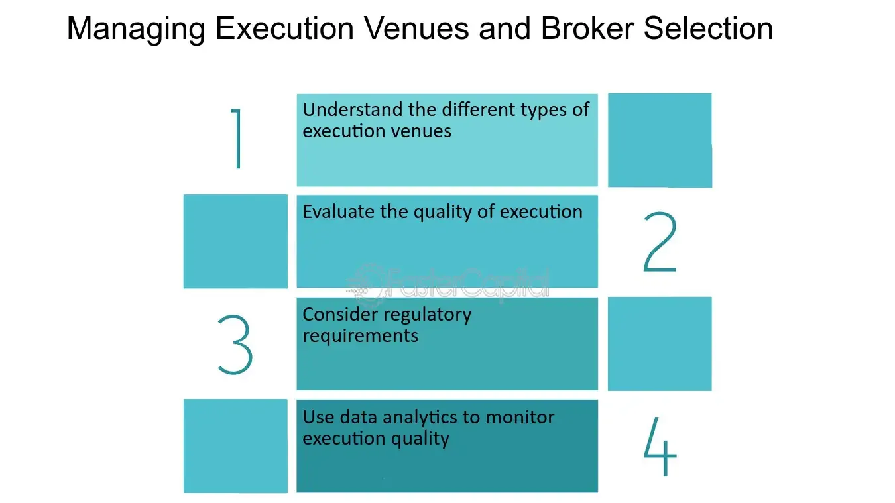

## Table of Contents

## What is an execution venue in trading?

An execution venue in trading is a place where you can buy or sell financial products like stocks, bonds, or commodities. It can be a stock exchange, like the New York Stock Exchange, or an electronic trading platform where people from all over the world can trade with each other. The main job of an execution venue is to match buyers and sellers so that trades can happen smoothly and quickly.

Different execution venues might have different rules and costs for trading. For example, some might charge a fee every time you make a trade, while others might have different fees depending on how much you are trading. Traders often choose an execution venue based on things like how fast trades can be made, how much it costs, and how easy it is to use. This helps them get the best deals and manage their money better.

## Why is selecting the right execution venue important?

Choosing the right execution venue is important because it can affect how much money you make or lose when trading. Different venues have different costs, like fees for buying or selling. If you pick a venue with high fees, it can eat into your profits. Also, some venues are faster at matching buyers and sellers, which can be important if you're trying to buy or sell quickly before prices change.

Another reason is that some venues might be better for certain types of trades. For example, if you're trading a lot of a certain stock, you might want a venue where that stock is traded a lot, so you can get the best price. Also, some venues might be easier to use or have better tools for tracking your trades. Picking the right venue can help you trade more smoothly and make better decisions.

## What are the common types of execution venues?

Common types of execution venues include stock exchanges and electronic trading platforms. Stock exchanges are big organizations where people come together to buy and sell stocks, bonds, and other financial products. Examples include the New York Stock Exchange and the London Stock Exchange. These places have strict rules and are often seen as more trustworthy because they are regulated by governments.

Electronic trading platforms are another type of execution venue. These are online systems where people can trade with each other from anywhere in the world. They are often used for trading things like currencies, commodities, and sometimes stocks. Examples include platforms like E-Trade and [Interactive Brokers](/wiki/interactive-brokers-api). These platforms can be easier to use and might have lower fees than traditional stock exchanges.

Both types of venues have their own benefits and drawbacks. Stock exchanges might offer more security and better prices for big trades, while electronic platforms might be faster and cheaper for smaller trades. Choosing the right type depends on what you are trading, how much you are trading, and what you need from the venue.

## How do execution venues differ from one another?

Execution venues differ from one another mainly in how they work and what they offer. Some are big places like stock exchanges where people come to trade stocks and other financial products. These places have strict rules and are watched by governments to make sure everything is fair. They are good for trading a lot of stocks because they often have the best prices for big trades. On the other hand, electronic trading platforms are online systems where people can trade from anywhere. These are often easier to use and might be cheaper, especially for smaller trades. They can be used for trading things like currencies and commodities, not just stocks.

Another way execution venues differ is in their costs and speed. Some venues charge higher fees for trading, which can affect how much money you make. If you choose a venue with high fees, it might eat into your profits. Also, some venues are faster at matching buyers and sellers. This is important if you need to buy or sell quickly before prices change. The speed and cost can make a big difference in how well you do when trading. So, [picking](/wiki/asset-class-picking) the right venue depends on what you are trading, how much you are trading, and what you need from the venue.

## What factors should a beginner consider when selecting an execution venue?

When you're just starting out with trading, it's important to think about how easy the execution venue is to use. A good platform should have a simple interface that makes it easy to buy and sell things without getting confused. If the platform is too complicated, you might make mistakes or miss out on good trading chances. Also, look for venues that offer helpful tools like tutorials or customer support. These can help you learn how to trade better and feel more confident about what you're doing.

Another thing to consider is the cost of trading on the venue. Some places charge a lot of fees for each trade, which can eat into your profits, especially if you're just starting out and not trading big amounts. It's a good idea to pick a venue with low fees so you can keep more of your money. Also, think about how fast the venue is at matching buyers and sellers. If it's slow, you might miss out on good prices. So, choosing a venue that's quick and cheap can help you do better when you're trading.

## How does liquidity impact the choice of an execution venue?

Liquidity is how easy it is to buy or sell something without changing its price too much. If a trading place has a lot of people wanting to buy and sell, it has high [liquidity](/wiki/liquidity-risk-premium). This is good because you can trade quickly and get a good price. When choosing where to trade, you should think about how much liquidity the place has. If you pick a place with high liquidity, you can be sure that you can buy or sell what you want without waiting too long or getting a bad price.

For someone just starting out, high liquidity is really important. It makes trading easier and less risky. If you choose a place with low liquidity, it might be hard to find someone to trade with, and you might have to accept a worse price. So, looking for a trading place with high liquidity can help you feel more confident and make better trades, especially when you're still learning how everything works.

## What role does transaction cost play in execution venue selection?

Transaction costs are the fees you pay every time you buy or sell something on a trading platform. These costs can add up and affect how much money you make or lose. When picking a place to trade, it's smart to look at how much they charge for each trade. If you choose a place with high fees, it might eat into your profits, especially if you're not trading big amounts. For someone just starting out, finding a place with low transaction costs can help you keep more of your money.

Besides just looking at the fees, you should think about how these costs fit with your trading plan. If you trade a lot, even small fees can add up over time. On the other hand, if you trade less often, you might be okay with a place that charges a bit more per trade but offers other benefits, like better tools or faster trading. So, when choosing where to trade, think about how the transaction costs will affect your overall trading and pick a place that helps you save money while meeting your needs.

## How can technology and automation influence execution venue decisions?

Technology and automation can make a big difference in choosing where to trade. They help make trading faster and easier. Some trading places use advanced tech to match buyers and sellers really quickly. This is important if you need to buy or sell something before the price changes. Also, automation can help you trade without having to watch the market all the time. You can set up rules for your trades, and the computer will do them for you. This can save you time and help you make better trades.

Another way technology helps is by making trading platforms easier to use. Good technology can make the website or app simple and clear, so you don't get confused. This is especially helpful if you're new to trading. Plus, some platforms use tech to give you tools like charts and alerts that can help you make smarter decisions. So, when picking a place to trade, think about how their technology can help you trade better and more easily.

## What are the regulatory considerations in choosing an execution venue?

When choosing a place to trade, it's important to think about the rules they have to follow. Some trading places are watched closely by governments to make sure they are fair and safe. These places have strict rules that help protect you from fraud and make sure your trades are done right. If you pick a place like this, you can feel more secure because there's less chance of something going wrong. But, these places might also have more rules about what you can trade and how you can trade it.

On the other hand, some trading places might not be watched as closely by governments. These places might have fewer rules, which can make trading easier in some ways. But, they can also be riskier because there's less protection if something goes wrong. As a beginner, it's usually better to choose a place that's well-regulated. This can help you avoid problems and feel more confident about your trades. So, when picking where to trade, think about how the rules and oversight can affect your trading experience and safety.

## How do market conditions affect the performance of different execution venues?

Market conditions can really change how well different trading places work. When the market is busy and lots of people are trading, places with high liquidity do better. They can match buyers and sellers quickly and give you good prices. But if the market is slow, these busy places might not be as good because there aren't as many people trading. On the other hand, smaller trading places might do better in a slow market because they can still find people to trade with, even if there aren't many.

Also, when the market is moving a lot, like during big news events, fast trading places are important. If prices are changing quickly, you want a place that can handle your trades fast so you don't miss out on good deals. But if the market is calm, speed might not matter as much, and you might care more about low fees or easy-to-use tools. So, the kind of market you're trading in can help you decide which trading place will work best for you.

## What advanced strategies can be used to optimize execution venue selection?

To optimize execution venue selection, traders can use smart order routing (SOR) strategies. This means using special computer programs that look at different trading places and pick the best one for each trade. The program thinks about things like how much it costs to trade, how fast the trading place is, and how many people are trading there. By using SOR, you can get the best prices and save money on fees. This is really helpful if you're trading a lot or if you need to buy or sell things quickly.

Another advanced strategy is algo-trading, or [algorithmic trading](/wiki/algorithmic-trading). This is when you use computers to make trades based on rules you set up. These rules can look at many trading places at once and pick the one that fits your plan the best. For example, if you want to trade a certain stock, the computer can find the place where that stock is most popular and has the best price. Algo-trading can help you trade more often without having to watch the market all the time, and it can help you make better choices about where to trade.

## How can one evaluate the effectiveness of their execution venue selection strategy over time?

To see if your way of picking trading places is working well, you need to keep an eye on how your trades are doing over time. Look at things like how much money you're making or losing, how quickly your trades are happening, and how much you're paying in fees. If you're using a smart order routing system, check if it's really finding the best places for your trades. You can do this by comparing the prices you get with the prices on other trading places. Also, think about if you're happy with how easy the trading places are to use and if they have the tools you need.

Another way to check your strategy is to see if it's helping you reach your trading goals. If you're trying to trade a lot without spending too much on fees, make sure the places you're picking have low costs. If speed is important to you, see if your trades are happening fast enough. You can also look at how your strategy handles different market conditions. If it works well when the market is busy and when it's slow, that's a good sign. By keeping track of these things, you can figure out if you need to change your strategy or if it's working the way you want it to.

## References & Further Reading

[1]: Harris, L. (2003). ["Trading and Exchanges: Market Microstructure for Practitioners."](https://www.amazon.com/Trading-Exchanges-Market-Microstructure-Practitioners/dp/0195144708) Oxford University Press.

[2]: O'Hara, M. (1998). ["Market Microstructure Theory."](https://books.google.com/books/about/Market_Microstructure_Theory.html?id=udXjR2Dg7bwC) Blackwell Publishers.

[3]: Hasbrouck, J. (2007). ["Empirical Market Microstructure: The Institutions, Economics, and Econometrics of Securities Trading."](https://academic.oup.com/book/52241) Oxford University Press.

[4]: Lopez de Prado, M. (2018). ["Advances in Financial Machine Learning."](https://www.amazon.com/Advances-Financial-Machine-Learning-Marcos/dp/1119482089) Wiley.

[5]: Madhavan, A. (2000). "Market Microstructure: A Survey." ["Journal of Financial Markets,"](https://www.sciencedirect.com/science/article/pii/S1386418100000070) 3(3), 205-258.

[6]: Rindi, B., & Werner, I. M. (2017). ["Dark Pools: Internalization, Fragmentation, and Investor Welfare."](https://papers.ssrn.com/sol3/papers.cfm?abstract_id=1630499) The Review of Financial Studies, 30(5), 1464-1508.