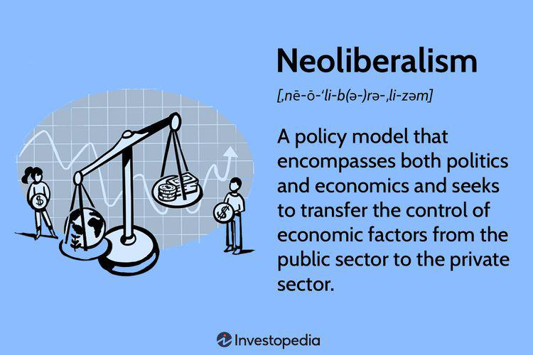

The U.S. economy, one of the world's largest and most intricate systems, is constantly molded by an interplay of governmental policies, market forces, and technological innovations. Among the tools available to U.S. presidents, executive orders are pivotal in directing economic strategy, especially in fostering healthy competition and regulating diverse industries. With the aim of ensuring a fair and balanced marketplace, recent executive orders have targeted issues such as monopolistic practices and corporate consolidation.

A critical example of technological advancement in the financial sector is algorithmic trading (algo trading), where transactions are executed automatically based on predefined criteria and algorithms. This innovation has redefined market operations, offering improved efficiency and liquidity. However, it also surfaces challenges related to market manipulation and the equitable distribution of opportunities.



In exploring the intersection of executive mandates and market operations, this article examines a recent U.S. executive order focusing on enhancing economic competition, highlighting its potential effects on algorithmic trading. This introduction sets the stage for an analysis of key components of the executive order, its anticipated impacts on the economy, and the varying repercussions for consumers, businesses, and regulators alike.

## Table of Contents

## Understanding the Executive Order on Promoting Competition

Signed by President Biden, the Executive Order on Promoting Competition in the American Economy is a pivotal policy initiative aimed at fostering competitive practices across numerous sectors. It specifically targets the pervasive issue of market concentration, which can hinder economic versatility and consumer welfare. By addressing these challenges, the order seeks to make a tangible impact on the U.S. economy through several key objectives: reducing consumer prices, increasing wages, and promoting innovation.

The order outlines a comprehensive approach by identifying priority sectors such as healthcare, technology, agriculture, and financial services. These areas have been scrutinized for monopolistic behavior and high barriers to entry, which can stifle competition. For instance, in the healthcare sector, the order aims to lower prescription drug prices by facilitating the entry of generic drugs into the market, thereby enhancing accessibility for consumers.

A crucial component of the Executive Order is its call for enhanced cooperation between federal agencies to enforce antitrust laws more rigorously. By doing so, it aims to prevent market dominance by large corporations that could lead to unfair pricing and consumer exploitation. This involves taking active measures against corporate consolidation and exploring avenues to break up existing monopolies or oligopolies.

To ensure the effective implementation of these goals, the order establishes the White House Competition Council. This entity is tasked with overseeing a coordinated government-wide strategy to strengthen competitive dynamics. By bringing together various stakeholders and leveraging inter-agency collaboration, the council is positioned to tackle competition-related challenges and drive policy reforms that support smaller businesses and innovative ventures.

The Executive Order represents a significant shift in U.S. economic policy, reflecting a commitment to revitalizing competition as a core economic principle. By targeting critical sectors and fostering government collaboration, it seeks to create a more equitable and dynamic marketplace that benefits not only consumers but also small and medium-sized enterprises.

## Impact on Economic Competition

The recent U.S. executive order on promoting competition is anticipated to bring transformative changes to the economic landscape by targeting monopolistic practices and facilitating the entry of new participants into various markets. By addressing these issues, the order seeks to redefine competition in a manner that benefits both consumers and businesses.

For consumers, the impact of this executive order could be profound. By dismantling monopolistic structures, the order aims to provide consumers with a wider array of products and services at more competitive prices. The reduction in market dominance by large corporations can lead to improved quality, greater choices, and innovations tailored to consumer needs. This aligns with economic theories where increased competition among firms typically leads to decreased prices and increased product variety for consumers, assumimg elastic demand.

From a business perspective, particularly for small and medium enterprises (SMEs), the executive order is poised to reduce barriers to entry. Historically, large corporations have maintained their market positions through practices that hinder the entry and growth of smaller competitors. By enforcing stricter antitrust measures, the order aims to create an environment where SMEs can compete on more equal footing. This could result in a more dynamic market with increased opportunities for innovation and entrepreneurship, fostering a climate conducive to new business models.

However, not all reactions to the executive order are positive. Critics caution that heightened regulatory measures could introduce bureaucratic obstacles that may impede business operations. There is a concern that an excessive regulatory burden might inhibit innovation, particularly in fast-evolving sectors where agility is key to maintaining a competitive edge. The possibility that these regulations may slow down decision-making processes and introduce compliance costs is a point of contention among industry analysts.

There is also an ongoing debate regarding the potential overreach of governmental authority in enforcing these laws. Critics argue that excessive intervention could limit the autonomy of industries to make independent decisions, potentially stifling the innovative processes that drive economic growth. This raises questions about the appropriate balance between regulation and market freedom, with fears that too much interference may lead to a less dynamic economic environment.

In summary, while the executive order on promoting competition offers promising pathways to a more equitable market landscape, it is also met with skepticism regarding its regulatory implications. Balancing the intended benefits with potential drawbacks will be vital in ensuring effective implementation and achieving the desired economic outcomes.

## Algorithmic Trading: An Intersection with the Executive Order

Algorithmic trading has become a pivotal force in modern financial markets, utilizing sophisticated algorithms to execute trades at speeds and efficiencies beyond human capabilities. This method leverages advanced computational techniques and data analytics to automate trading strategies, hence optimizing execution and minimizing transaction costs.

A primary advantage of [algorithmic trading](/wiki/algorithmic-trading) is its capacity to enhance market efficiency. By enabling rapid transactions, it contributes to increased [liquidity](/wiki/liquidity-risk-premium) and tighter bid-ask spreads, theoretically leading to fairer pricing for assets. However, this technological advancement also poses significant concerns. The highly automated nature of algorithmic trading may exacerbate market [volatility](/wiki/volatility-trading-strategies) and raise the potential for manipulative practices such as spoofing and front-running, where traders attempt to deceive the market by placing false orders.

With the signing of recent executive orders promoting economic competition, algorithmic trading stands at a crossroads of regulatory evolution. The initiative's focus on fostering fair competition and scrutinizing monopolistic tendencies may profoundly influence the regulatory landscape of algorithmic trading. The executive order's directives encourage heightened vigilance over trading activities, particularly those that may unfairly advantage dominant market players, thus ensuring a more level playing field.

In response to these regulatory shifts, potential reforms in algorithmic trading practices are anticipated. The implementation of increased transparency requirements is one such reform, where algorithmic strategies and data usage might be subjected to more rigorous disclosure standards. Additionally, there may be a push towards limiting high-frequency trading activities that contribute to systemic risks, creating a more balanced market environment. The goal is to mitigate any adverse impacts while preserving the positive aspects of algorithmic trading, such as improved market efficiency.

Ultimately, aligning algorithmic trading practices with the principles of fair competition is pivotal to nurturing a robust and equitable financial market. By promoting regulations that tame potential excesses, the executive order seeks to sustain algorithmic trading as a tool that not only drives economic growth but also respects the integrity and transparency of financial markets. Through careful regulatory oversight, algorithmic trading can continue to be an integral part of a competitive and inclusive economic landscape.

## Challenges and Opportunities

The implementation of policies stemming from the executive order on promoting competition presents both challenges and opportunities. A crucial challenge is ensuring that there are adequate enforcement mechanisms across the various regulatory bodies tasked with implementing these policies. Effective enforcement requires collaboration and coordination among agencies such as the Federal Trade Commission (FTC) and the Department of Justice (DOJ), which are responsible for antitrust regulations. Furthermore, balancing regulation with the need for innovation poses a significant challenge. Overly stringent regulations could stifle technological advancements and hinder the growth of industries reliant on constant innovation, such as the technology and financial sectors.

Nevertheless, these challenges are accompanied by substantial opportunities. By promoting fair competition, the executive order seeks to level the playing field across industries. This can lead to the emergence of new business models and drive innovation, providing consumers with a wider range of choices. For small and medium-sized enterprises, it means potentially reduced barriers to entry and increased opportunities to compete with established market players.

In the context of algorithmic trading, this shift could foster the development of technologies that are not only efficient but also operate within a framework that ensures fair competitive practices. Developers of algorithmic trading systems may need to adapt their strategies to comply with new transparency requirements and limits on practices that confer an unfair advantage. This could encourage the creation of novel algorithms designed to enhance market fairness and efficiency, benefiting the financial ecosystem as a whole.

Python, as a versatile programming language, can be employed to model and simulate the potential impacts of these regulatory changes. For instance, developers can use Python libraries such as NumPy and pandas for data analysis, alongside [machine learning](/wiki/machine-learning) libraries like scikit-learn to test new algorithmic strategies in a regulated environment. Here is a simple example of what such a simulation might look like:

```python
import numpy as np
import pandas as pd
from sklearn.linear_model import LinearRegression

# Simulate a simple market environment
np.random.seed(0)
market_data = pd.DataFrame({
    'price': np.random.rand(100),
    'volume': np.random.rand(100)
})

# Implement a basic trading algorithm with linear regression
X = market_data[['price', '[volume](/wiki/volume-trading-strategy)']]
y = market_data['price'] * 1.5 + market_data['volume'] * 0.5 + np.random.rand(100) * 0.1  # Simulated target
model = LinearRegression().fit(X, y)

# Predict future market movements
predictions = model.predict(X)
market_data['predicted_price'] = predictions

# Evaluate algorithm performance under new regulations
# Assume regulations require the algorithm to maintain a certain prediction accuracy
accuracy_threshold = 0.8
accuracy = model.score(X, y)

# Adjust algorithm parameters based on regulatory requirements
if accuracy < accuracy_threshold:
    # Modify algorithm parameters or input feature set
    print("Algorithm needs refinement to meet regulatory accuracy threshold.")
else:
    print("Algorithm meets regulatory standards.")
```

The code simulates a basic linear regression-based trading algorithm, assessing its performance to ensure it aligns with hypothetical regulatory standards. This illustrates the iterative process of developing compliant and efficient algo trading technologies in response to regulatory changes, highlighting the potential for innovation driven by these new policies.

## Conclusion

The executive order on promoting competition is a significant initiative aimed at addressing market power imbalances within the U.S. economy. By focusing on enhancing competitive dynamics, it seeks to revitalize economic growth and ensure fairer market conditions across various sectors. A critical area of focus within this framework is algorithmic trading, which stands at the intersection of technological innovation and financial regulation. As the order enacts measures to promote accountability and fairness, it underscores a broader trend towards ensuring equitable practices in financial markets.

Algorithmic trading, while introducing efficiencies, also poses challenges related to market manipulation and fairness. The executive order's implications for this sector reflect an intent to introduce reforms that align trading practices with competitive principles. This might involve enforcing transparency requirements and curbing practices that disproportionately benefit large market players, thus fostering a more level playing field.

The successful implementation of these policies requires ongoing dialogue among policymakers, industry leaders, and the public. This collaborative approach is essential to ensuring that the objectives of the executive order are met while considering the diverse interests at stake. Moreover, the balance between fostering competition and encouraging innovation will be crucial. Policymakers must navigate these dual goals to create an environment where technological advancements, such as algorithmic trading, do not overshadow the imperative of maintaining fair and competitive market structures.

Ultimately, the executive order represents a pivotal step towards reinforcing the foundational principles of competition in the U.S. economy, promising potential benefits for consumers, businesses, and the overall market landscape.

## References & Further Reading

[1]: ["Executive Order on Promoting Competition in the American Economy"](https://www.whitehouse.gov/briefing-room/presidential-actions/2021/07/09/executive-order-on-promoting-competition-in-the-american-economy/), The White House, July 9, 2021.

[2]: Budish, E., Cramton, P., & Shim, J. (2015). ["The High-Frequency Trading Arms Race: Frequent Batch Auctions as a Market Design Response."](https://academic.oup.com/qje/article/130/4/1547/1916146) The Quarterly Journal of Economics.

[3]: Aitken, M., Harris, F., & McInnes, M. (2015). ["Market Design and Evolution: Trading and Financial Market Structure for the 21st Century,"](https://pmc.ncbi.nlm.nih.gov/articles/PMC5454818/) Global Policy.

[4]: O'Hara, M. (2015). ["High Frequency Market Microstructure."](https://www.sciencedirect.com/science/article/pii/S0304405X15000045) Annual Review of Financial Economics.

[5]: Tesla, A. (2013). ["Regulating High Frequency Trading: A Critical Examination."](https://teslamotorsclub.com/tmc/threads/s60-battery-issue-car-build.181681/?__cf_chl_rt_tk=sTalx_avU6S0vaHSr7o.KjJObeV0Hl7j5WRNRb4yuy8-1734465009-1.0.1.1-a1tNk1tEFrF9tI_LIZgfN2Obz8kZ5CIKuRyoWyDdedM) Economics International.

[6]: ["Algorithmic Trading and DMA: An Introduction to Direct Access Trading Strategies"](https://archive.org/details/algorithmictradi0000john) by Barry Johnson

[7]: Posner, R. A. (2001). ["Antitrust Law, Second Edition."](https://www.amazon.com/Antitrust-Law-Second-Richard-Posner/dp/0226675769) University of Chicago Press.