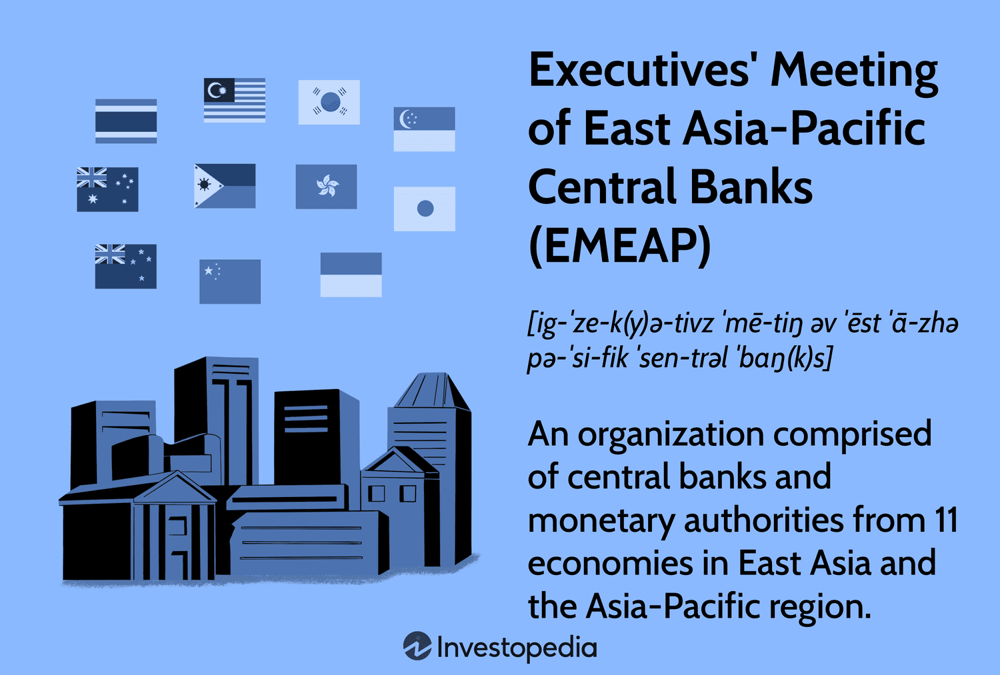

The Executives' Meeting of East Asia-Pacific Central Banks (EMEAP) stands as a vital entity that plays a crucial role in fostering financial cooperation and stability across the East Asia-Pacific region. Founded in 1991, EMEAP serves as a platform for dialogue and collaboration among central banks to address common financial challenges, enhance regional financial integration, and ensure economic stability. With members comprising central banks and monetary authorities from key economies in East Asia and the Pacific, EMEAP's influence is substantial in the region's financial world.

Algorithmic trading has become a linchpin in modern finance, revolutionizing the way financial markets operate. It involves the use of complex algorithms and high-speed computation to execute trades at speeds and frequencies impossible for human traders. This technological advancement has increased market efficiency, reduced transaction costs, and provided liquidity. As algorithmic trading continues to evolve and expand, it has become increasingly significant, particularly in the East Asia-Pacific region, where financial markets are burgeoning.

This article focuses on exploring EMEAP's pivotal role in the development and integration of algorithmic trading within the East Asia-Pacific region. It examines how EMEAP is facilitating the adoption of advanced financial technologies and supporting member economies in navigating the challenges and opportunities presented by this rapidly evolving landscape. By fostering collaboration and enhancing regulatory frameworks, EMEAP continues to underpin the growth and stability of financial markets in this dynamic part of the world.

## Table of Contents

## EMEAP: Background and Structure

The Executives’ Meeting of East Asia-Pacific Central Banks (EMEAP) was founded in 1991, amidst a changing global economic landscape that saw increasing financial interdependence and the need for cooperative efforts among central banks in the region. Initially established to enhance monetary and financial collaboration, EMEAP now comprises eleven central banks and monetary authorities from the East Asia-Pacific area. These include the Reserve Bank of Australia, People's Bank of China, Hong Kong Monetary Authority, Bank Indonesia, Bank of Japan, Bank of Korea, Bank Negara Malaysia, Reserve Bank of New Zealand, Bangko Sentral ng Pilipinas, Monetary Authority of Singapore, and Bank of Thailand. Through this membership, EMEAP brings together a diverse and economically significant consortium that plays a critical role in the region’s financial stability.

At its core, EMEAP operates with a meticulously structured framework to streamline its collaborative and policy-oriented objectives. Central to this framework is the Governors’ Meeting, which is conducted annually. This meeting serves as the principal governing body where the heads of member institutions convene to discuss macroeconomic issues, financial system stability, and policy coordination efforts. The collaborative ethos of EMEAP is further extended through its Working Groups, which focus on specific operational areas such as payments and market infrastructure, financial markets, and banking supervision. These groups consist of representatives from member organizations who engage in technical exchanges and develop best practices.

EMEAP’s organizational structure is designed to allow fluid communication and efficient resolution of issues pertinent to the East Asia-Pacific region's economic well-being. The integration of high-level policy discussions among Governors and targeted work within specialized groups helps to foster an environment conducive to sustained financial innovation and regional economic resilience. As EMEAP continues to evolve, its foundational aims remain focused on enhancing financial stability and fostering a mutually beneficial economic landscape through dialogue and innovation.

## Algorithmic Trading in the East Asia-Pacific Region

Algorithmic trading refers to the use of computer programs and algorithms to execute a large number of trades in financial markets. This type of trading relies on complex mathematical models and high-speed data processing to make transaction decisions at speeds impossible for human traders. Algorithmic trading is essential for modern finance due to its ability to enhance market [liquidity](/wiki/liquidity-risk-premium), reduce transaction costs, and minimize the impact of human emotion on trading. 

In the East Asia-Pacific region, [algorithmic trading](/wiki/algorithmic-trading) has seen considerable growth, driven by advancements in technology, regulatory reforms, and the increase in financial market activity. Financial hubs such as Hong Kong, Singapore, and Tokyo have embraced algorithmic trading, contributing to their status as leading global financial centers. The increasing [volume](/wiki/volume-trading-strategy) of electronic trading on stock exchanges in these locations further underscores the expansion of algorithmic trading in the region.

Central banks in East Asia-Pacific have played a pivotal role in the adoption and regulation of algorithmic trading. They recognize the potential of automated systems to contribute to efficient market functioning, price discovery, and risk management. For instance, the Monetary Authority of Singapore (MAS) has implemented policies that promote financial innovation while ensuring robust risk management frameworks are in place. Similarly, the Bank of Japan has been engaged in monitoring the implications of automated trading systems on financial stability as part of its broader market oversight responsibilities.

Furthermore, central banks' commitment to improving financial market infrastructures has facilitated algorithmic trading. Initiatives aimed at enhancing electronic trading platforms and implementing real-time data dissemination are critical to the operation of algorithmic traders, who rely on up-to-date market information and swift execution capabilities.

Overall, the growth of algorithmic trading in the East Asia-Pacific region can be attributed to the combined efforts of technological advancements, supportive regulatory environments, and the proactive roles of central banks. These factors collectively contribute to the evolution and sophistication of financial markets across the region.

## EMEAP's Initiatives and Impact

The Executives' Meeting of East Asia-Pacific Central Banks (EMEAP), through several initiatives, has played a crucial role in enhancing financial stability and market integration across the East Asia-Pacific region. One of the organization's most prominent initiatives is the Asian Bond Fund (ABF), which was launched to develop local bond markets and reduce the region's dependency on foreign currency-denominated bonds. This initiative has fundamentally contributed to deepening regional bond markets and providing stability against external financial shocks. The ABF is divided into two funds: ABF1, which invests in US dollar-denominated bonds issued by Asian sovereign and quasi-sovereign issuers, and ABF2, investing in local currency sovereign and quasi-sovereign bonds.

The impact on regional markets from the introduction of the Asian Bond Fund is noteworthy. Firstly, it has enhanced market liquidity and provided a larger platform for infrastructure investments. It also reduced exchange rate mismatches, facilitating greater financial resilience. By diversifying funding sources within the region, the ABF mitigates exposure to global market volatilities, thereby promoting economic stability.

EMEAP also strives to enhance financial stability and integration through continuous promotion of policy coordination and dialogue among its member economies. The annual Governors' Meetings serve as a platform for discussing prevailing economic issues and facilitating coherent policy responses that align with regional and global economic trends. This cohesive strategy enhances the robustness of financial systems within the member economies, strengthening their ability to withstand global economic pressures.

In recent years, EMEAP has been pivotal in advancing financial technology, acknowledging the growing importance of digital innovation in finance. Initiatives facilitated by EMEAP have encouraged the adoption of fintech solutions which, in turn, increase the efficiency and accessibility of financial services in the region. By supporting frameworks for safe innovation, EMEAP helps harness technological advancements that can enhance financial inclusion and drive economic growth.

Overall, the strategic initiatives spearheaded by EMEAP have significantly contributed to financial development in the East Asia-Pacific region, bolstering stability, integration, and technological advancement. These efforts underscore the crucial role of central banks in shaping a resilient and dynamic financial environment.

## Challenges and Opportunities

The EMEAP nations face several challenges in adopting and integrating algorithmic trading within their markets. One of the primary hurdles is the disparity in technological infrastructure across member economies. While some countries boast advanced trading platforms and robust technological ecosystems, others struggle with legacy systems that lack the capability to support sophisticated algorithmic processes.

Furthermore, regulatory frameworks within the EMEAP region exhibit significant variation, complicating the establishment of a unified approach to managing the implications of algorithmic trading. Diverse rules and oversight mechanisms can hinder the seamless integration of algorithmic trading practices across borders, impacting liquidity and market efficiency.

Rapid technological advancements pose potential risks, notably in maintaining market stability. Algorithmic trading can increase [volatility](/wiki/volatility-trading-strategies) due to its high-speed nature and the potential for erroneous trades, resulting from flawed algorithms or data discrepancies. Such mistakes can quickly cascade through the financial system, causing significant disruptions. Additionally, as trading algorithms become more complex, the risk of malicious activities, such as algorithmic manipulation and cyber threats, becomes more pronounced, demanding sophisticated cybersecurity measures.

Despite these challenges, the EMEAP region is ripe with opportunities for collaboration and development. Joint initiatives aimed at harmonizing regulatory standards could propel EMEAP nations towards greater financial integration. By leveraging shared knowledge and resources, member countries can develop robust frameworks that accommodate the rapid pace of technological change while safeguarding market integrity.

Moreover, collaboration can extend into the development of shared technological platforms that facilitate cross-border trading and data sharing, enhancing transparency and efficiency in regional markets. EMEAP can also play a pivotal role in fostering innovation by supporting research and development in financial technology, providing a fertile ground for emerging fintech solutions that can integrate seamlessly with algorithmic trading systems.

In conclusion, while EMEAP nations face certain challenges in aligning their algorithmic trading practices, the region holds enormous potential for growth and innovation through strategic collaboration and technological advancement. By addressing the risks and embracing the opportunities, EMEAP can position itself as a leader in the increasingly algorithm-driven financial world.

## Future Outlook for EMEAP and Algo Trading

Future Outlook for EMEAP and Algo Trading

Algorithmic trading in the East Asia-Pacific region, an area keenly influenced by the policies and initiatives of EMEAP (Executives' Meeting of East Asia-Pacific Central Banks), is poised for considerable growth. As digital transformation continues to reshape financial markets, algorithmic trading is expected to play an increasingly pivotal role in enhancing market liquidity, efficiency, and resilience.

**Projections for the Role of Algorithmic Trading in the EMEAP Region**

The integration of technology in financial trading is likely to deepen across EMEAP economies. Algorithmic trading, characterized by high-speed data processing and automated decision-making, promises to consolidate its position as a dominant method of trading. The fast-paced nature of markets, combined with the voluminous data flows in financial systems, ensures that algorithmic trading systems, driven by sophisticated models and real-time analytics, will be integral to the comprehensive trading strategies employed by financial institutions across the region. 

The expansion of market structures accommodating algorithmic trading can be anticipated, with increased volume-driven market activity. Enhancements in computational power and data analytics capabilities suggest an exponential growth potential in both the complexity and effectiveness of algorithms used. This trend underlines the importance of EMEAP’s role in fostering market stability and ensuring proper regulatory frameworks are in place.

**Future Initiatives Planned by EMEAP to Enhance Market Frameworks**

EMEAP is expected to continue its efforts in developing sound financial infrastructures conducive to progressive trading practices. Future initiatives may include the strengthening of cross-border regulatory coherence and the enhancement of technological infrastructure, supporting more seamless integration among member economies. Investments in infrastructure capable of handling high-frequency trading volumes may also be a focal point, alongside initiatives to safeguard against systemic risks associated with such rapid transactions.

Additionally, EMEAP could explore partnerships with technology firms to drive innovation in financial technology. These collaborations may facilitate the creation of platforms capable of processing vast datasets required for advanced algorithmic strategies. Such developments would play a crucial role in adapting to the evolving global financial landscape and maintaining competitive advantage.

**The Evolving Role of Central Banks in a Digitized Financial Environment**

Central banks within EMEAP are likely to experience a shift in their operational paradigms as digitalization accelerates. Their role will expand beyond traditional policy-making to encompass responsibilities that ensure technological adaptations fortify market integrity and stability. Central banks will need to lead or support the development of robust regulatory frameworks that address the nuances of algorithmic trading, focusing on issues such as price manipulation, market volatility, and data security.

In response to the nascent challenges posed by increasing digitalization, central banks might enhance their own technological capabilities, investing in surveillance systems and analytic tools to monitor market activities effectively. Moreover, their cooperation with other international regulatory bodies could facilitate knowledge exchange and the adoption of best practices in managing algorithm-driven markets.

In conclusion, the future of algorithmic trading within the EMEAP region looks promising, driven by technological progress and strategic initiative from central banks and financial institutions. EMEAP’s initiatives will continue to be crucial in steering the region towards a secure and innovative financial future, ensuring that the benefits of technological advancements are fully realized while mitigating the associated risks.

## Conclusion

The EMEAP (Executives' Meeting of East Asia-Pacific Central Banks) has played a crucial role in the development of algorithmic trading within the East Asia-Pacific region. By fostering a collaborative environment among its member economies, EMEAP has facilitated the integration of advanced trading technologies that embody efficiency, speed, and transparency in financial markets. Through its initiatives, such as the Asian Bond Fund, EMEAP has promoted market liquidity and enhanced the stability and integration of regional financial markets. These efforts have formed a foundational platform for the burgeoning growth of algorithmic trading, as member countries leverage technological advancement to improve market operations and investor participation.

The continued collaboration among EMEAP members is pivotal in addressing the complexities and challenges of rapid technological advancements, such as cybersecurity threats and the need for stringent regulatory frameworks. By working together, EMEAP countries are better positioned to harness collective expertise and resources, thereby fostering an environment conducive to the safe and effective implementation of algorithmic trading mechanisms. Furthermore, this collaboration enables the sharing of best practices and facilitates the establishment of unified regulatory standards that can enhance cross-border trading efficiency and ensure market resilience.

Looking to the future, EMEAP has immense potential to transform financial landscapes across the East Asia-Pacific region. As the technological infrastructure and regulatory environments continue to evolve, EMEAP is poised to lead efforts in the integration of cutting-edge financial technologies that can revolutionize traditional trading paradigms. Its proactive initiatives and adaptive strategies will likely play a central role in shaping a digital financial ecosystem that is both secure and inclusive. By fostering innovative financial solutions and encouraging sustainable growth, EMEAP stands as a cornerstone in the ongoing development and modernization of the financial markets in the East Asia-Pacific region.

## References & Further Reading

[1]: Bergstra, J., Bardenet, R., Bengio, Y., & Kégl, B. (2011). ["Algorithms for Hyper-Parameter Optimization."](https://dl.acm.org/doi/10.5555/2986459.2986743) Advances in Neural Information Processing Systems 24.

[2]: ["Advances in Financial Machine Learning"](https://www.amazon.com/Advances-Financial-Machine-Learning-Marcos/dp/1119482089) by Marcos Lopez de Prado

[3]: ["Machine Learning for Algorithmic Trading"](https://github.com/stefan-jansen/machine-learning-for-trading) by Stefan Jansen

[4]: ["Quantitative Trading: How to Build Your Own Algorithmic Trading Business"](https://www.amazon.com/Quantitative-Trading-Build-Algorithmic-Business/dp/1119800064) by Ernest P. Chan

[5]: ["The Asian Bond Markets Initiative: Policy Maker Achievements and Challenges"](https://www.adb.org/publications/asian-bond-markets-initiative) Asian Development Bank

[6]: ["The Impact of Algorithmic Trading on the FX Market"](https://www.forex.academy/the-impact-of-artificial-intelligence-on-forex-algorithmic-trading-strategies/) by Will Kerr, Bank of England

[7]: ["Electronic Trading in Financial Markets"](https://www.edx.org/learn/economics/new-york-institute-of-finance-electronic-trading-in-financial-markets) Reserve Bank of Australia

[8]: De Luca, F. (2019). ["Algorithmic and High-Frequency Trading"](https://www.researchgate.net/profile/Swishchuk-Anatoliy/publication/384043673_Algorithmic_and_High-Frequency_Trading_Problems_for_Semi-Markov_and_Hawkes_Jump-Diffusion_Models/links/66e5f6472390e50b2c8d731e/Algorithmic-and-High-Frequency-Trading-Problems-for-Semi-Markov-and-Hawkes-Jump-Diffusion-Models.pdf) Springer International Publishing