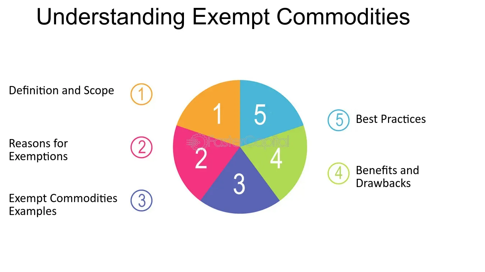

## Table of Contents

## What is an exempt commodity?

An exempt commodity is a product that does not have to pay certain taxes or follow some rules that other products do. Governments decide which products are exempt, and this can change from one country to another. Common examples of exempt commodities include basic food items, medicines, and sometimes even books or educational materials. The reason for making these items exempt is often to help people afford necessities or to support important areas like health and education.

When a commodity is exempt, it means that businesses selling these items do not have to add sales tax to the price. This can make the products cheaper for customers. However, being exempt can also mean that the product might not be tracked or regulated as closely as other items. This can be good because it reduces the burden on businesses, but it can also lead to issues if the product needs to be monitored for safety or quality.

## What are some common examples of exempt commodities?

Common examples of exempt commodities include basic food items like fruits, vegetables, bread, and milk. These items are often exempt from sales tax because they are essential for people's daily lives. By not taxing these foods, governments help make sure that everyone can afford to eat healthy, even if they don't have a lot of money.

Another example of exempt commodities is medicine. Many countries do not tax medicines because they are important for people's health. This includes prescription drugs and sometimes even over-the-counter items like pain relievers. Making medicine exempt helps keep healthcare costs down, which is good for everyone.

Educational materials like [books](/wiki/algo-trading-books), textbooks, and sometimes even school supplies can also be exempt commodities. Governments want to encourage learning, so they often do not tax these items. This can make it easier for students and families to afford the things they need for school.

## Why are certain commodities exempt from taxes or regulations?

Certain commodities are exempt from taxes or regulations to help people afford things they need every day. Governments choose to not tax basic food items like fruits, vegetables, bread, and milk because everyone needs to eat to stay healthy. By not adding taxes to these foods, they become cheaper, which helps families save money. This is important because it makes sure that even people who don't have a lot of money can still buy healthy food.

Another reason for exemptions is to support important areas like health and education. Medicines are often not taxed because they help people stay healthy or get better when they're sick. If medicines were taxed, they would cost more, and some people might not be able to afford them. Educational materials like books and school supplies are also sometimes exempt. This helps students and their families by making these necessary items cheaper, which encourages learning and makes education more accessible to everyone.

## How does the exemption of commodities affect the economy?

When commodities like food, medicine, and books are exempt from taxes, it can help people save money. This is good for families because they can spend less on things they need every day. When people save money on these items, they might have more money to spend on other things, like going out to eat or buying new clothes. This can help the economy grow because more people are spending money in different places.

However, when commodities are exempt, the government gets less money from taxes. This can be a problem because the government needs money to pay for things like schools, roads, and hospitals. If they get less money from taxes, they might have to find other ways to get money, like raising taxes on other things or cutting back on some services. So, while exemptions can help people save money, they can also make it harder for the government to do everything it needs to do.

## What is the process for a commodity to be classified as exempt?

To become an exempt commodity, a product must go through a process decided by the government. First, people who make laws, called lawmakers, look at different products and decide which ones are important for people's daily lives or for things like health and education. They might talk to experts or listen to what people want. After they decide which products should be exempt, they write new rules or change old ones. These rules are then voted on, and if most people agree, the product becomes exempt.

Once a product is classified as exempt, businesses that sell it don't have to add sales tax to the price. This makes the product cheaper for customers. The government keeps an eye on these exempt commodities to make sure they are still important and that the exemption is helping people. If things change, like if a new product becomes important, the government might start the process again to make it exempt too.

## Who has the authority to grant exemptions for commodities?

The government has the power to decide which commodities can be exempt. This means that lawmakers, who are people elected to make laws, look at different products and choose which ones should not have to pay certain taxes. They might talk to experts or listen to what people need to help them make these choices.

Once the lawmakers agree on which commodities should be exempt, they write new rules or change old ones. These rules are then voted on, and if most people agree, the product becomes exempt. This process helps make sure that important items like food, medicine, and books can be cheaper for everyone.

## How do exemptions vary by country or region?

Exemptions for commodities can be very different from one country to another or even between different regions within the same country. Each place has its own rules about which items should not have to pay taxes. For example, in some countries, all food might be exempt from taxes, while in others, only certain types of food like fruits and vegetables are exempt. This can make a big difference in what people pay for their groceries depending on where they live.

These differences come from what each government thinks is important for its people. Some countries might focus more on making medicine cheaper, so they exempt more types of medicine from taxes. Other countries might want to help students, so they exempt school supplies or books. The choices can also change over time as new needs come up or if the government decides to try something different. So, what is exempt in one place might not be exempt in another, and this can affect how much people have to spend on things they need every day.

## What are the criteria used to determine if a commodity should be exempt?

Governments decide if a commodity should be exempt by looking at how important it is for people's everyday lives. They think about if the item is something everyone needs, like food or medicine. They also consider if not taxing the item would help make it cheaper for everyone, especially people who don't have a lot of money. Sometimes, they talk to experts or listen to what people say they need to help them make these choices.

Another thing governments look at is how the exemption might help important areas like health and education. For example, if they exempt medicine from taxes, it can help people afford to stay healthy. If they exempt books or school supplies, it can make education easier for students and their families. The goal is to support things that are good for everyone in the community.

## How do exemptions impact the supply chain and logistics of exempt commodities?

When commodities are exempt from taxes, it can change how they move through the supply chain. Businesses that sell exempt items don't have to add sales tax to the price. This can make it easier for them to keep prices low, which might mean they can sell more of the product. Because of this, companies might want to move more of these exempt items around to meet the higher demand. They might need to use more trucks, ships, or planes to get the products to stores faster. This can make the supply chain busier, but it also helps make sure that people can get the things they need.

Exemptions can also affect how much paperwork and tracking businesses have to do. Since exempt commodities don't have to follow as many rules, companies might not need to keep as many records or go through as many checks. This can make things simpler and faster for them. However, it can also mean that these products are not watched as closely, which can be good for keeping costs down but might make it harder to make sure everything is safe and of good quality. So, while exemptions can help make products cheaper and easier to move, they can also change how closely the supply chain is managed.

## What are the potential drawbacks or abuses of commodity exemptions?

Exemptions for commodities can sometimes be used in ways that are not fair. Some people might try to cheat the system by saying something is exempt when it's not. This can mean the government loses money because it's not getting the taxes it should. Also, if too many things are exempt, the government might not have enough money to pay for important things like schools and hospitals. This can make it hard for the government to help everyone in the community.

Another problem is that exemptions can make it harder to keep track of products. When items don't have to follow as many rules, it can be easier for bad products to slip through. This can be dangerous if the product is something like medicine, where safety is really important. Also, if a lot of products are exempt, it might make some businesses unhappy because they have to pay taxes while others don't. This can lead to arguments about what's fair and what's not.

## How are exemptions monitored and enforced by regulatory bodies?

Regulatory bodies keep an eye on exemptions to make sure they are used the right way. They check if businesses are following the rules about which items can be exempt. If a business says something is exempt when it's not, the regulatory body can find out and make them pay the taxes they owe. They might also give the business a fine for breaking the rules. This helps stop people from cheating and makes sure the government gets the money it needs.

Sometimes, regulatory bodies do surprise checks to see if everything is okay. They might visit stores or warehouses to look at the products and the records businesses keep. If they find anything wrong, they can take action to fix it. This helps make sure that exempt commodities are safe and that the exemptions are helping people the way they should.

## What future trends or changes might affect the status of exempt commodities?

In the future, more countries might decide to make more things exempt to help people save money, especially if prices keep going up. Governments might look at new kinds of food or medicines and decide they should be exempt too. They might also think about making things like electric cars or solar panels exempt to help the environment. As more people learn about health and the planet, governments might want to help them buy things that are good for both.

On the other hand, some countries might start to take away exemptions if they need more money for things like schools and hospitals. They might decide that too many things are exempt and it's not fair to other businesses. If people start using exemptions in ways that are not right, governments might change the rules to stop this. So, the future of exempt commodities could go in different directions depending on what people need and what governments decide is best.

## References & Further Reading

[1]: Chance, D. M., & Brooks, R. (2015). ["An Introduction to Derivatives and Risk Management."](https://books.google.com/books/about/Introduction_to_Derivatives_and_Risk_Man.html?id=b8PgBQAAQBAJ) Cengage Learning.

[2]: Hull, J. C. (2017). ["Options, Futures, and Other Derivatives."](https://www.semanticscholar.org/paper/Options%2C-Futures%2C-and-Other-Derivatives-Hull/89bdee500c8623864fc9eb7a471546aa713acc44) Pearson.

[3]: Perez, M. L., & Polychronopoulos, N. (2018). ["Handbook of Sentiment Analysis in Finance."](https://scholar.google.com/citations?user=1eQP6y4AAAAJ) Academic Press.

[4]: ["CFTC's Role in Monitoring Algorithmic Trading."](https://www.cftc.gov/LawRegulation/DoddFrankAct/Rulemakings/DF_32_CTSR/index.htm) Commodity Futures Trading Commission.

[5]: MacKenzie, D. (2011). ["The Credit Crisis as a Problem in the Sociology of Knowledge."](https://www.journals.uchicago.edu/doi/10.1086/659639) Economy and Society, 40(3), 403-437.

[6]: Menkveld, A. J. (2016). ["The Economics of High-Frequency Trading: Taking Stock."](https://www.jstor.org/stable/26774066) Review of Financial Studies, 30(1), 185-225.