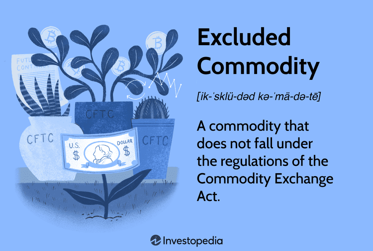

The commodity market represents a multifaceted environment where complex regulatory frameworks are pivotal in maintaining fairness and stability. This intricate landscape has witnessed significant transformations with the increasing integration of algorithmic trading, particularly in the commodities sector. This shift has sparked important discussions regarding the necessity and adequacy of current regulatory measures to accommodate these advancements.

Algorithmic trading, which involves using pre-programmed trading instructions to execute orders at speeds and frequencies beyond human capabilities, has become prevalent. Its adoption has been significant within the commodities sector due to potential benefits such as enhanced liquidity and increased price efficiency. This evolution prompts a need to examine how existing regulations, which traditionally aimed at preventing fraudulent practices and ensuring market integrity, can adapt to this technological advancement.



This article focuses on exempt commodities within this framework, exploring the regulatory landscape that governs algorithmic trading related to these commodities. Exempt commodities, distinct from agricultural and excluded commodities, include vital sectors such as energy and metals. They are primarily traded by eligible contract participants or commercial entities and are distinguished by exemptions from some regulatory constraints, although they remain subject to anti-fraud and anti-manipulation provisions.

We aim to provide a comprehensive understanding of how these evolving regulations impact traders and overall market dynamics. By focusing on the intersection of algorithmic trading and exempt commodities, this article seeks to shed light on the challenges and opportunities presented by this dynamic sector, underscoring the importance of regulatory measures that balance innovation with market stability.

## Table of Contents

## Understanding Exempt Commodities

Exempt commodities are a classification within the broader commodities market that encompasses exchange-traded commodities excluding agricultural and certain specially excluded commodities. This category includes energy commodities like crude oil and natural gas, as well as metals such as gold and silver. These commodities derive their exemption status primarily from specific legislative frameworks that outline the regulatory boundaries within which they operate.

Despite being labeled as "exempt," these commodities are not entirely free from regulatory oversight. They are specifically exempted from various regulatory provisions that apply to commodities more broadly, but they remain firmly under the scrutiny of regulations aimed at preventing fraud and market manipulation. This ensures that the market maintains a level of fairness and prevents practices that could distort market equilibrium or harm investors.

Eligibility to trade exempt commodities is generally limited to certain actors within the market. Only eligible contract participants (ECPs) or commercial entities are typically allowed to engage in trading these commodities. An ECP is defined by regulatory criteria that consider factors such as the entity's financial assets or investments, which determine their capacity to engage in trading activities that might present higher levels of risk. 

This focus on eligibility is integral to maintaining the integrity and stability of the commodity markets, as it limits participation in exempt commodity trading to those entities deemed capable of understanding and managing the risks involved. By doing so, the regulatory framework seeks to balance the necessity of open and competitive markets with the need to protect less sophisticated participants from potential market abuses or misjudgments in trading complex instruments.

## Regulatory Framework in Commodity Markets

The Commodity Exchange Act (CEA) is the foundational legislation governing commodity futures trading in the United States. Enacted in 1936, the CEA establishes the statutory framework within which the Commodity Futures Trading Commission (CFTC) operates. The CFTC, an independent federal agency created in 1974, is tasked with overseeing and regulating the U.S. derivatives markets, including commodity futures, to ensure transparency, integrity, and financial soundness.

Under the CEA, commodities are broadly classified to include agricultural products, energy resources, and metals, among others. The Act delineates specific classifications for different types of futures contracts, which are instrumental in facilitating trade and speculation in these markets. Importantly, the CEA furnishes the regulatory structure that helps in differentiating between various futures contracts, thereby enabling the development of appropriate oversight and control measures.

A core objective of the CEA is to prevent fraudulent activities and market manipulations that could undermine market integrity and investor confidence. The Act imposes stringent anti-fraud provisions and mandates disclosures to minimize risks associated with the trading of commodity futures. This includes the regulation of commodity futures contracts to avoid practices like "cornering" or "squeezing" the market, where a trader might manipulate the price by controlling the available supply of a commodity.

The CFTC, upholding the mandates of the CEA, enforces rules that require fair play and transparency. These include ensuring that entities engaging in trading activities maintain records and report their positions, which is critical for market surveillance and enforcement actions. Furthermore, the CFTC adopts and enforces rules concerning the registration of various parties involved in commodity trading, such as futures commission merchants (FCMs), commodity pool operators (CPOs), and associated persons (APs), thereby fortifying the market against potentially deceptive activities.

In addition to fraud prevention, the CEA empowers the CFTC to establish position limits on futures contracts, aiming to curtail excessive speculation that could disrupt market mechanisms. By setting caps on the number of futures contracts a trader can hold, position limits help manage systemic risks and promote orderly trading conditions.

Moreover, the evolving landscape of financial markets, particularly with advancements in technology and the emergence of [algorithmic trading](/wiki/algorithmic-trading), necessitates adaptations in how the CFTC enforces CEA stipulations. The Commission continuously evaluates its regulatory approaches to address novel trading strategies while balancing innovation with market stability.

## The Rise of Algorithmic Trading in Commodities

Algorithmic trading, often referred to as algo trading, leverages computer algorithms to automate trading decisions, providing significant advantages in terms of speed and precision. These algorithms can process vast amounts of market data in real-time and execute trades based on predefined criteria, such as timing, price, quantity, or any mathematical model. This ability to quickly analyze and respond to market conditions gives traders an edge in capturing fleeting opportunities and optimizing their trading strategies.

In the commodity market, algorithmic trading has gained prominence as traders seek to exploit the inherent [volatility](/wiki/volatility-trading-strategies) and price movements within this sector. Commodities such as oil, gold, and agricultural products present unique opportunities due to their sensitivity to geopolitical events, weather patterns, and macroeconomic trends. By utilizing algorithms, traders can navigate these complexities more effectively, making real-time adjustments to their positions to maximize returns or minimize risks.

The utilization of algorithmic trading in commodities is often focused on two primary objectives: taking advantage of price movements and hedging against risks. For instance, [momentum](/wiki/momentum)-based algorithms can identify and exploit short-term price trends, while mean-reversion strategies might be employed to identify overbought or oversold conditions. Additionally, algorithms can be used to construct sophisticated hedging strategies that protect portfolios from adverse market movements, thereby reducing exposure to unwanted risks.

The transformation brought about by algorithmic trading in the commodity space necessitates a reevaluation of existing regulatory measures. As algorithms can execute trades at a fraction of a second, they introduce new dynamics into the market, which can impact [liquidity](/wiki/liquidity-risk-premium), volatility, and overall market stability. Regulators face the challenge of ensuring that the benefits of algo trading are harnessed while mitigating potential downsides, such as market manipulation or flash crashes.

Given these considerations, regulators and market participants must work together to develop frameworks that maintain market integrity without stifling innovation. This involves creating robust systems to monitor and detect irregularities in trading patterns, ensuring that the deployment of algorithmic strategies contributes positively to market dynamics. As the landscape continues to evolve, ongoing assessment and adaptation of regulatory policies will be crucial to supporting the growth and sustainability of algorithmic trading in the commodities market.

## Financial Regulations and Exempt Commodity Algo Trading

As algorithmic trading gains traction in trading exempt commodities, regulatory bodies face the ongoing challenge of evaluating and adapting existing policies to address the unique characteristics and risks associated with this advanced trading methodology. Key regulatory considerations revolve around ensuring market integrity while supporting technological progress and innovation.

Exempt commodity trading frameworks are designed to promote fair trading practices, even as traders increasingly utilize sophisticated algorithms to gain competitive advantages. These frameworks focus on preventing fraud and price manipulation, while maintaining an environment conducive to technological evolution. One critical aspect of effective regulation involves monitoring the transparency and accountability of algorithmic trading strategies. Initiatives could include implementing robust reporting requirements and audits to ensure that algorithms comply with fair trading and anti-manipulation laws. This may also entail scrutinizing the source code of trading algorithms or requiring disclosure of certain parameters to regulatory bodies, allowing them to assess compliance with existing rules.

Another pivotal area in balancing regulation involves safeguarding market integrity and investor protection. Algorithmic trading, with its speed and efficiency, has the potential to disrupt traditional market operations. This has prompted discussions on the necessity of implementing circuit breakers or other automated safeguards to mitigate flash crashes and extreme volatility events. Such systems can temporarily halt trading to provide a cooling-off period during dramatic price swings, thus safeguarding traders and the market from unintended repercussions of algorithmic trading mishaps.

Regulators must also ensure that the proliferation of algorithmic trading does not create unfair advantages for participants with access to superior technology. This could involve establishing equal access measures to trading platforms and data, thus preventing market fragmentation and ensuring a level playing field for all market participants.

Ultimately, the regulatory landscape surrounding algorithmic trading in exempt commodities hinges on maintaining a delicate balance. Policymakers strive to craft regulations that do not hinder technological advancements but instead bolster market robustness and investor confidence, essential components for a thriving and dynamic commodity market. Continuous assessment and dynamic adaptation of these frameworks will be crucial as both technology and market structures continue to evolve.

## Implications of Algorithmic Trading in Exempt Commodities

Algorithmic trading in exempt commodities, such as energy products and precious metals, has significantly enhanced market liquidity and price efficiency. The use of algorithms enables traders to execute large volumes of trades rapidly and with precision, thereby narrowing bid-ask spreads and reducing transaction costs. This increased liquidity, in turn, can facilitate smoother price discovery processes, allowing for more accurate reflection of supply and demand dynamics.

Despite these benefits, several concerns arise regarding market volatility and systemic risks. The speed and [volume](/wiki/volume-trading-strategy) at which algorithmic trades are executed can exacerbate price swings, leading to heightened market volatility. This risk is particularly pronounced during periods of market stress, where automated response mechanisms might contribute to flash crashes or dramatic price shifts without a corresponding change in underlying market fundamentals.

Furthermore, systemic risks are a crucial consideration. The interconnectedness of algorithmic trading systems means that disruptions or malfunctions in one area could potentially propagate through the trading network, causing widespread market instability. Therefore, market participants need to be vigilant in assessing these risks and implementing robust risk management strategies.

Risk management in algorithmic trading often involves a combination of quantitative methods and algorithm testing to simulate market conditions. A typical strategy could involve using statistical models to predict potential market movements and adjusting algorithm parameters accordingly. For instance, a Python script might use a Monte Carlo simulation to evaluate the impact of different trading strategies on overall portfolio risk. An example of such a simulation is shown below:

```python
import numpy as np

def monte_carlo_simulation(trials, initial_price, volatility, time_horizon):
    results = []
    for _ in range(trials):
        prices = [initial_price]
        for _ in range(time_horizon):
            price_change = np.random.normal(0, volatility)
            prices.append(prices[-1] * (1 + price_change))
        results.append(prices)
    return np.array(results)

# Parameters
trials = 1000
initial_price = 100.0
volatility = 0.02
time_horizon = 252  # Trading days in a year

simulated_prices = monte_carlo_simulation(trials, initial_price, volatility, time_horizon)

# Analyze the results
average_price = np.mean(simulated_prices, axis=0)
```

This script simulates multiple potential price paths for an exempt commodity, considering a given level of volatility, to help traders assess risks and potential returns. By understanding these dynamics, market participants can make informed trading decisions and effectively manage their risk profiles, contributing to a more resilient and efficient commodity market.

## Conclusion

The intersection of exempt commodities and algorithmic trading presents unique challenges and opportunities for market participants and regulators alike. As algorithmic trading continues to proliferate within the commodities sector, it is imperative to maintain robust financial regulations that foster a secure trading environment while encouraging technological advancement. Exempt commodities, which include energy and metals, play a significant role in global markets, making effective regulation essential to uphold integrity and investor confidence.

Algorithmic trading offers benefits such as enhanced liquidity and improved price discovery, yet it also brings potential risks, including heightened market volatility and systemic threats. Balancing these aspects requires a nuanced approach to regulation, one that neither stifles innovation nor compromises market stability. Policymakers must rigorously evaluate existing frameworks and update them as necessary to address the evolving landscape of algorithmic trading.

Continuous assessment of the regulatory environment is crucial for a healthy commodity market. This involves not only adapting to new technological advancements but also anticipating future challenges. Collaborative efforts among regulators, market participants, and technological innovators will ensure that regulations remain effective and relevant.

Moreover, fostering a regulatory environment that supports competition and innovation can stimulate economic growth and lead to more efficient markets. This dynamic interplay between regulation and innovation will define the future of commodity markets, urging stakeholders to remain vigilant and proactive in their approach. As the sector continues to evolve, so too must the regulatory frameworks that govern it, ensuring that they align with the changing realities of the market and the needs of its participants.

## References & Further Reading

[1]: Chance, D. M., & Brooks, R. (2015). ["An Introduction to Derivatives and Risk Management."](https://books.google.com/books/about/Introduction_to_Derivatives_and_Risk_Man.html?id=b8PgBQAAQBAJ) Cengage Learning.

[2]: Hull, J. C. (2017). ["Options, Futures, and Other Derivatives."](https://www.semanticscholar.org/paper/Options%2C-Futures%2C-and-Other-Derivatives-Hull/89bdee500c8623864fc9eb7a471546aa713acc44) Pearson.

[3]: Perez, M. L., & Polychronopoulos, N. (2018). ["Handbook of Sentiment Analysis in Finance."](https://scholar.google.com/citations?user=1eQP6y4AAAAJ) Academic Press.

[4]: ["CFTC's Role in Monitoring Algorithmic Trading."](https://www.cftc.gov/LawRegulation/DoddFrankAct/Rulemakings/DF_32_CTSR/index.htm) Commodity Futures Trading Commission.

[5]: MacKenzie, D. (2011). ["The Credit Crisis as a Problem in the Sociology of Knowledge."](https://www.journals.uchicago.edu/doi/10.1086/659639) Economy and Society, 40(3), 403-437.

[6]: Menkveld, A. J. (2016). ["The Economics of High-Frequency Trading: Taking Stock."](https://www.jstor.org/stable/26774066) Review of Financial Studies, 30(1), 185-225.