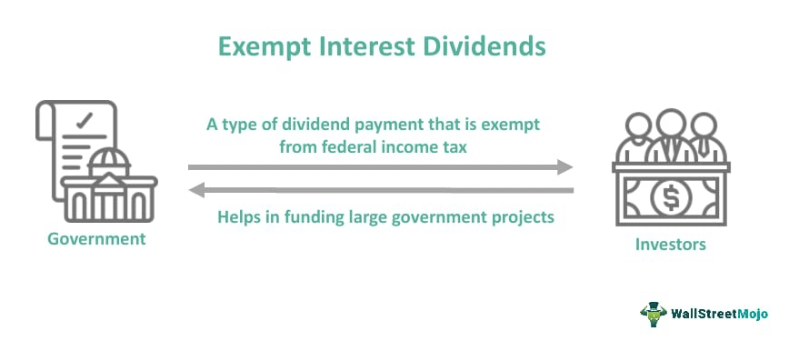

## Table of Contents

## What are exempt-interest dividends?

Exempt-interest dividends are payments that investors receive from certain types of investments, like mutual funds, that invest in bonds which are not taxed by the federal government. These bonds are often issued by state and local governments, and the income they generate is considered tax-exempt at the federal level. This means that when a mutual fund earns money from these bonds and passes it on to investors as dividends, those dividends are not subject to federal income tax.

These dividends can be a big help for people looking to reduce their tax bill. However, it's important to know that while they are exempt from federal taxes, they might still be taxed at the state level, depending on where the bonds were issued and where the investor lives. Always check the details of the specific investment and talk to a tax professional to understand how these dividends might affect your taxes.

## How do exempt-interest dividends differ from regular dividends?

Exempt-interest dividends and regular dividends are different mainly because of how they are taxed. Exempt-interest dividends come from investments like mutual funds that hold bonds from state and local governments. These bonds are not taxed by the federal government, so the dividends you get from them are also not taxed at the federal level. This can save you money on taxes.

On the other hand, regular dividends are usually taxed. They come from stocks or other investments that don't have the same tax benefits. When you get regular dividends, you have to pay federal income tax on them, and sometimes state taxes too. So, if you're trying to lower your tax bill, exempt-interest dividends can be a good choice, but you need to check if they might still be taxed by your state.

## What types of investments typically generate exempt-interest dividends?

Exempt-interest dividends usually come from mutual funds or other investment funds that hold bonds issued by state and local governments. These bonds are called municipal bonds, and they are not taxed by the federal government. When these funds earn money from the bonds, they pass it on to investors as dividends. Since the bonds themselves are tax-exempt, the dividends from them are also tax-exempt at the federal level.

This can be a good way for people to earn money without having to pay federal taxes on it. However, it's important to know that while these dividends are not taxed by the federal government, they might still be taxed by your state. It depends on where the bonds were issued and where you live. Always check the details of the investment and talk to a tax advisor to understand how these dividends might affect your taxes.

## Who qualifies to receive exempt-interest dividends?

Anyone who invests in mutual funds or other investment funds that hold municipal bonds can receive exempt-interest dividends. These funds earn money from the bonds and pass it on to their investors as dividends. Since municipal bonds are not taxed by the federal government, the dividends from these funds are also not taxed at the federal level.

This makes exempt-interest dividends a good choice for people who want to earn money without paying federal taxes on it. However, it's important to know that while these dividends are not taxed by the federal government, they might still be taxed by your state. It depends on where the bonds were issued and where you live. Always check the details of the investment and talk to a tax advisor to understand how these dividends might affect your taxes.

## How are exempt-interest dividends reported on tax returns?

Exempt-interest dividends are reported on your tax return, but they are not taxed by the federal government. You will find these dividends listed on the Form 1099-DIV that you get from the mutual fund or investment company. On this form, the exempt-interest dividends are shown in Box 11. When you fill out your tax return, you will report this amount on Line 2a of Form 1040, which is where you list your tax-exempt interest.

Even though these dividends are not taxed by the federal government, they might still be taxed by your state. It depends on where the bonds were issued and where you live. You might need to report these dividends on your state tax return. Always check the details of the investment and talk to a tax advisor to understand how these dividends might affect your state taxes.

## What are the tax implications of exempt-interest dividends at the federal level?

Exempt-interest dividends are not taxed by the federal government. This means you don't have to pay federal income tax on the money you get from these dividends. They come from mutual funds that invest in municipal bonds, which are bonds issued by state and local governments. Since these bonds are not taxed at the federal level, the dividends you get from them are also not taxed.

However, even though you don't pay federal taxes on these dividends, you still need to report them on your tax return. You'll find the amount of exempt-interest dividends on your Form 1099-DIV in Box 11. When you fill out your tax return, you report this amount on Line 2a of Form 1040, where you list your tax-exempt interest. This helps the IRS keep track of your income, even if it's not taxed.

## Can exempt-interest dividends be subject to state or local taxes?

Exempt-interest dividends might still be taxed by your state or local government, even though they are not taxed by the federal government. It depends on where the bonds that the dividends come from were issued and where you live. If the bonds were issued in a different state than where you live, your state might tax the dividends.

It's a good idea to check the details of your investment and talk to a tax advisor to understand how these dividends might affect your state taxes. Not all states tax exempt-interest dividends the same way, so it's important to know the rules for your specific situation.

## How do alternative minimum tax (AMT) rules affect exempt-interest dividends?

Exempt-interest dividends are usually not taxed by the federal government, but they can affect your alternative minimum tax (AMT). The AMT is a different way of calculating your taxes that makes sure people with a lot of deductions or certain types of income still pay some tax. If you get exempt-interest dividends from certain types of bonds, like private activity bonds, these dividends might be added to your income when figuring out your AMT. This could mean you end up paying some tax on these dividends, even though they are normally tax-free.

It's important to know that not all exempt-interest dividends affect the AMT the same way. Only dividends from certain types of bonds, like those used for private activities, are added back into your income for AMT purposes. So, if you're worried about the AMT, you should check what kinds of bonds your mutual fund or investment is holding. Talking to a tax advisor can help you understand how these dividends might change your taxes under the AMT rules.

## What documentation is required to claim exempt-interest dividends on tax filings?

To claim exempt-interest dividends on your tax filings, you need a Form 1099-DIV from the mutual fund or investment company that paid you the dividends. This form will show the amount of exempt-interest dividends in Box 11. You will use this number when you fill out your tax return. On your Form 1040, you report the exempt-interest dividends on Line 2a, which is where you list your tax-exempt interest. This helps the IRS keep track of your income, even if it's not taxed.

Even though exempt-interest dividends are not taxed by the federal government, they might still be taxed by your state or local government. You might need to report these dividends on your state tax return, depending on where the bonds were issued and where you live. Always check the details of your investment and talk to a tax advisor to understand how these dividends might affect your state taxes.

## How do changes in tax laws potentially impact the treatment of exempt-interest dividends?

Changes in tax laws can affect how exempt-interest dividends are treated. If the government decides to change the rules about what kinds of income are tax-exempt, it could mean that these dividends might not be tax-free anymore. For example, if a new law says that all income has to be taxed, then exempt-interest dividends would no longer be exempt from federal taxes. Also, if the rules about the alternative minimum tax (AMT) change, it could mean that more people have to include these dividends when figuring out their AMT, which could lead to them paying some tax on the dividends.

It's important for investors to keep an eye on tax law changes because they can impact their investment choices. If tax laws change in a way that makes exempt-interest dividends less beneficial, investors might decide to put their money into different types of investments. Talking to a tax advisor can help investors understand how any new tax laws might change the way their exempt-interest dividends are treated and help them plan their investments accordingly.

## What strategies can investors use to maximize the benefits of exempt-interest dividends?

Investors can maximize the benefits of exempt-interest dividends by choosing mutual funds or other investment funds that focus on municipal bonds from their own state. This is because dividends from in-state bonds are often exempt from state taxes as well as federal taxes. By investing in these funds, investors can keep more of their dividend income without having to pay any taxes on it. It's also a good idea to look for funds that have low fees, because high fees can eat into the benefits of the tax-exempt dividends.

Another strategy is to be aware of the alternative minimum tax (AMT). Some municipal bonds, like private activity bonds, can affect the AMT, which might mean investors have to pay some tax on their exempt-interest dividends. To avoid this, investors can choose funds that hold mostly bonds that don't affect the AMT. It's always a good idea to talk to a tax advisor to make sure the investments fit well with the investor's overall tax situation and to stay updated on any changes in tax laws that could impact the treatment of exempt-interest dividends.

## How do international investors handle exempt-interest dividends from U.S. investments?

International investors who get exempt-interest dividends from U.S. investments need to know that these dividends are not taxed by the U.S. federal government. But, they might still have to pay taxes in their own country. The rules for this can be different depending on where the investor lives and the tax treaties between their country and the U.S. So, it's important for international investors to check the tax laws in their own country to see if they have to report and pay taxes on these dividends.

To handle these dividends, international investors should keep good records of the dividends they receive. They will get a Form 1099-DIV from the U.S. investment company, which will show the amount of exempt-interest dividends in Box 11. Even though they don't have to pay U.S. federal taxes on these dividends, they might need to report this income on their tax return in their home country. Talking to a tax advisor who knows about international tax laws can help them understand how to handle these dividends correctly and make the most of them.

## References & Further Reading

[1]: "Municipal Bonds: A Comprehensive Guide to Municipal Bonds and Tax Exemption" by Kenneth D. Garbade

[2]: Lopez de Prado, M. (2018). ["Advances in Financial Machine Learning"](https://www.amazon.com/Advances-Financial-Machine-Learning-Marcos/dp/1119482089) Wiley.

[3]: Chan, E. (2009). ["Quantitative Trading: How to Build Your Own Algorithmic Trading Business"](https://github.com/ftvision/quant_trading_echan_book) Wiley.

[4]: Fabozzi, F. J., & Choudhry, M. (2004). "The Handbook of European Structured Financial Products." John Wiley & Sons.

[5]: "Understanding Municipal Securities: Structure and Regulatory Landscape" by the Municipal Securities Rulemaking Board (MSRB)