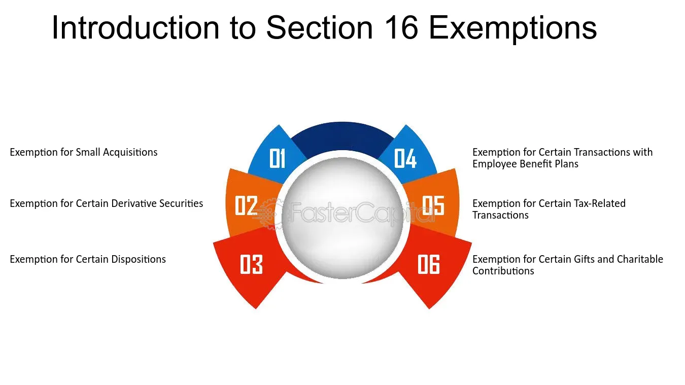

The world of finance is increasingly intricate, with mechanisms that allow transactions without the usual regulatory scrutiny. Among these mechanisms is the 'exempt transaction,' a concept pivotal in the financial landscape for its distinct advantages. Exempt transactions provide a streamlined process for executing financial exchanges while bypassing standard registration requirements imposed by regulatory bodies such as the Securities and Exchange Commission (SEC). These transactions are typically employed to reduce costs and administrative burdens, making them attractive options for certain investors and companies. They allow individuals and entities to engage in securities trading under specific conditions, often involving non-public offerings or transactions with accredited investors.

This article explores the landscape of exempt transactions, focusing on financial exemptions and their impact on algorithmic trading. With technological advancements, algorithmic trading has gained prominence, seeking methods to optimize strategies while minimizing regulatory hurdles. Exempt transactions play a significant role in this context by offering opportunities to execute large volumes of trades with reduced compliance overhead.



A comprehensive understanding of exempt transactions requires an examination of their types, benefits, and the regulatory frameworks that govern them. Intrastate offerings, private placements, and accredited investor transactions are among the primary types that facilitate diverse financial activities while ensuring adherence to specific legal standards. Recognizing how these factors contribute to their significance in modern markets is crucial for strategic financial planning and compliance.

By highlighting key concepts, this guide aims to elucidate exempt transaction mechanisms and their strategic use in financial operations. As the financial landscape continues to evolve, staying informed about these exemptions and their regulatory context ensures market competitiveness and operational efficiency.

## Table of Contents

## What are Exempt Transactions?

Exempt transactions are financial exchanges that bypass the standard registration processes typically required by regulatory bodies such as the U.S. Securities and Exchange Commission (SEC). These transactions offer an alternative pathway for raising capital by providing specific exemptions from the usual disclosure requirements and ongoing reporting obligations associated with public offerings.

These transactions often occur under certain conditions, such as being non-public or involving accredited investors. Accredited investors, as defined by the SEC, include individuals or entities that meet specific financial criteria, such as a high net worth or significant income, thereby possessing the sophistication and resources to evaluate and bear the capital risk without needing the same level of protection afforded by securities registration.

The utilization of exempt transactions is largely driven by the potential cost savings and the streamlined process they offer. By avoiding the lengthy and expensive registration process, businesses can expedite capital formation, which can be particularly beneficial for small to mid-sized firms or startups that may not have the resources for a public offering. Additionally, exempt transactions allow companies to operate discreetly, often appealing to those who wish to avoid premature exposure to public scrutiny or market [volatility](/wiki/volatility-trading-strategies).

Moreover, these transactions cater to a nuanced understanding of financial markets, enabling participants to include exempt offerings in their strategic financial planning. Recognizing the conditions and regulatory requirements for such transactions is essential for ensuring compliance and optimizing capital-raising strategies within the legal framework. By leveraging these exemptions, entities can tailor their financial structures to better align with their business objectives and the needs of their investors.

## Types of Exempt Transactions

Exempt transactions serve as vital instruments for companies aiming to navigate the complexities of financial regulations while optimizing funding strategies. These transactions permit businesses to raise capital without the extensive and costly registration processes typically required by regulatory bodies such as the Securities and Exchange Commission (SEC). Here, we outline the primary types of exempt transactions, each crafted to cater to specific scenarios under various regulatory stipulations.

**Intrastate Offerings**

Intrastate offerings are a type of security transaction where companies raise funds within a single state, adhering to state-specific regulations. The primary aim here is to promote local business development while maintaining investor protection. Companies engaging in intrastate offerings benefit from exemptions under federal securities law, specifically under SEC Rule 147 and Rule 147A. These rules facilitate compliance by allowing the offering to be confined within the state's borders, protecting local investor interests and ensuring businesses adhere to regional regulatory frameworks.

**Private Placements**

Private placements involve the sale of securities to a small, select group of investors, thus bypassing the need for public registration. Typically, these transactions are conducted with institutional investors or accredited individuals knowledgeable about investment risks and opportunities. In the U.S., Regulation D, specifically Rule 506(b) and Rule 506(c), governs private placements. These regulations not only provide a streamlined process for securities offerings but also impose limitations on general solicitations, ensuring a controlled and strategic dissemination of securities.

**Accredited Investor Transactions**

Accredited investor transactions are limited to individuals or entities that meet specific financial and knowledge criteria, as outlined by the SEC. These investors are perceived as more capable of understanding and bearing investment risks, thereby reducing the necessity for stringent regulatory oversight. The criteria typically include an individual having a net worth exceeding $1 million (excluding primary residence) or an annual income of over $200,000 (or $300,000 jointly with a spouse) for the past two years, with the expectation of [earning](/wiki/earning-announcement) the same amount in the current year. This categorization simplifies the regulatory processes involved in these transactions, making [capital raising](/wiki/hedge-fund-capital-raising) more efficient.

**Other Types of Transactions**

In addition to the above, several other exempt transactions offer unique advantages and regulatory relaxations:

- **Transactions by Insiders:** Often occur within companies where insiders, such as executives or directors, trade shares under certain conditions, having complied with specific regulations or holding periods.

- **Offshore Deals:** Conducted outside U.S. borders, these transactions benefit from exemptions like Regulation S, which facilitates offerings by non-U.S. issuers or those targeting foreign markets.

- **Limited Resale Transactions:** Governed by Rule 144A, these allow the resale of securities to institutional buyers without necessitating a public offering, thereby enhancing liquidity for holders of privately placed securities.

Each type of exempt transaction comes with its own set of regulatory considerations and advantages. Understanding these transactions allows companies and investors to strategize effectively within legal frameworks, optimize capital raising, and maintain compliance with both federal and local regulations.

## Regulatory Frameworks and Compliance

Exempt transactions are primarily regulated by specific frameworks developed to balance the need for streamlined securities transactions with the necessity of oversight and investor protection. The primary regulations governing these transactions include the Securities and Exchange Commission's (SEC) Regulation D, Rule 144A, and Regulation S. Each of these plays a distinct role in facilitating different types of exempt transactions while ensuring that fundamental standards of transparency and investor protection are upheld.

Regulation D is crucial for companies seeking to raise capital through private offerings without undergoing the extensive requirements of a public offering. It provides guidelines under which companies can sell securities to investors without registering them with the SEC, provided they comply with specific requirements. Within Regulation D, Rules 504, 505, and 506 outline various conditions related to the offering amount, investor eligibility, and disclosure obligations. Rule 506(b) allows issuers to raise an unlimited amount of capital from an unlimited number of accredited investors and up to 35 non-accredited investors. In contrast, Rule 506(c) permits general solicitation, provided all purchasers are accredited investors with their status verified by the issuer.

Rule 144A facilitates the resale of privately placed securities among qualified institutional buyers (QIBs). This rule helps create a secondary market for these securities, enhancing their [liquidity](/wiki/liquidity-risk-premium) without necessitating full SEC registration. To be a QIB under Rule 144A, the buyer must own and invest on a discretionary basis at least $100 million in securities of issuers not affiliated with the buyer. This creates a robust platform for trading large blocks of securities among sophisticated financial institutions with minimal regulatory constraints.

Regulation S, on the other hand, governs offers and sales of securities outside the United States, thus exempting them from registration under the Securities Act of 1933. It provides a safe harbor for offshore transactions, allowing U.S. and foreign companies to access international investors while adhering to local laws. Transactions falling under Regulation S must be executed through an offshore transaction, and there should be no direct offering to U.S. investors, ensuring that these transactions truly remain off the domestic market.

Even with these exemptions, companies engaging in such transactions are obligated to comply with both federal and local laws and execute diligence in investor protection. For instance, while Regulation D allows certain exemptions, issuers must still file "Form D" with the SEC to inform them of the sale of exempt securities. Similarly, state securities laws, known as "blue sky" laws, may impose additional requirements, such as notice filings or fees, depending on the state.

Compliance with these frameworks is vital as failure to adhere can result in rescission rights, fines, or legal action. Thus, maintaining awareness of the regulatory landscape and leveraging legal expertise to navigate complex compliance demands ensures that firms can maximize the strategic advantages of exempt transactions while minimizing the associated risks.

## Impact on Algorithmic Trading

Exempt transactions offer strategic opportunities in [algorithmic trading](/wiki/algorithmic-trading) by alleviating compliance burdens typically associated with financial transactions. By bypassing certain registration requirements, these transactions allow traders to capitalize on unique liquidity pools that might otherwise be inaccessible. This can result in enhanced efficiency and innovation in trading strategies, providing a competitive edge in rapidly evolving markets.

Algorithmic strategies benefit from the streamlined processes inherent in exempt transactions. These transactions facilitate swift execution of trades, minimizing latency, a critical [factor](/wiki/factor-investing) for algorithmic traders whose success often hinges on executing trades within fractions of a second. The reduced complexity in compliance also allows for more agile market entries and exits, enabling traders to respond more dynamically to market conditions.

Furthermore, understanding exempt transactions aids in effective risk management by simplifying navigation through complex regulatory landscapes. For instance, compliance with frameworks such as the SEC's Regulation D and Rule 144A ensures that trades remain within legal boundaries while optimizing transaction costs and procedures. This understanding allows algorithmic traders to forecast and adapt to regulatory shifts, ensuring ongoing alignment with legal requirements without compromising operational efficiency.

The ability to leverage liquidity and capital-raising avenues through exempt transactions can also significantly impact algorithmic trading models. By incorporating these transactions, models can incorporate additional factors such as improved access to capital and reduced transaction times, enhancing both predictive accuracy and profitability.

```python
# Example: Simplified simulation of an algorithmic trading strategy incorporating exempt transactions
import numpy as np

def simulate_trading(strategy, market_data, exempt_transactions):
    """Simulates a trading strategy with exempt transactions.

    Args:
    strategy: Function implementing the trading strategy.
    market_data: Array of market prices.
    exempt_transactions: Boolean, if True, incorporates exempt transaction advantages.

    Returns:
    Portfolio value over time.
    """
    portfolio_value = np.zeros(len(market_data))
    cash = 10000  # initial cash
    position = 0  # initial stocks held

    for t in range(1, len(market_data)):
        price = market_data[t]
        trade_signal = strategy(price)

        if exempt_transactions:
            # Adjust transaction cost due to exempt benefits
            transaction_cost = 0.001  # Reduced cost
        else:
            transaction_cost = 0.005  # Normal cost

        # Execute trade
        if trade_signal == "buy" and cash >= price:
            position += 1
            cash -= price * (1 + transaction_cost)
        elif trade_signal == "sell" and position > 0:
            position -= 1
            cash += price * (1 - transaction_cost)

        portfolio_value[t] = cash + position * price

    return portfolio_value

# Dummy strategy for illustration
def example_strategy(price):
    if price < 100:
        return "buy"
    elif price > 110:
        return "sell"
    else:
        return "hold"

# Simulated market data
market_data = np.random.normal(100, 10, 1000)

portfolio_with_exempt = simulate_trading(example_strategy, market_data, True)
portfolio_without_exempt = simulate_trading(example_strategy, market_data, False)

# The results from this simulation would typically show improved profit margins 
# for the strategy using exempt transactions due to reduced transaction costs and increased liquidity options.
```

The capacity to adapt trading algorithms to include such advantages denotes a crucial skill set for algorithmic traders seeking sustainable market advantage. Thus, mastering the use of exempt transactions in trading strategies can significantly enhance financial performance while ensuring regulatory compliance.

## Notable Case Studies and Practical Applications

Numerous unicorn startups, such as SpaceX and Airbnb, have strategically utilized private placements to raise substantial capital efficiently while circumventing the traditional public offering process. These private placements provide the dual benefit of privacy and reduced regulatory burden, particularly appealing to companies aiming to maintain control and confidentiality over their operations. For instance, SpaceX has reportedly raised billions of dollars through private investments, enabling the company to fund its ambitious aerospace projects without the logistical challenges and scrutiny involved in going public.[^1]

Similarly, Airbnb leveraged the flexibility of private placements to secure essential funding during its growth phases. This strategic financial maneuver allowed Airbnb to expand its global footprint and enhance its service offerings without the immediate pressure of public market performance indicators.[^2] By opting for private placements, companies like Airbnb gained access to capital from a select group of accredited investors, fostering a supportive investor environment conducive to long-term strategic development.

Rule 144A transactions present another notable application of exempt transactions, primarily catering to institutional investors. Rule 144A allows these investors to trade large volumes of privately placed securities among themselves with reduced registration requirements, enhancing market liquidity. Such transactions are critical in facilitating efficient capital flow in private capital markets. For example, significant corporations and financial institutions often utilize Rule 144A offerings to raise large capital amounts swiftly. This mechanism supports increased market efficiency by providing institutional investors with a streamlined process to exchange securities, thereby maintaining robust financial operations while adhering to requisite regulatory standards.

Intrastate crowdfunding is a compelling case study showcasing the power of exempt transactions to empower local businesses. This model enables small businesses to raise funds from local investors, often under more lenient state-level regulations. By focusing on intrastate offerings, businesses tap into local investments to spur growth and foster community engagement. A notable benefit of this approach is the alignment of the business’s growth with community interests and stakeholders, further bolstering local economic development. Respecting the legal frameworks of each state ensures businesses can pursue this fundraising avenue while remaining compliant, a critical aspect of sustaining trust and operational integrity.

[^1]: Mahé, Yann. "How SpaceX Became One of the Most Valuable Private Companies in the World." *SpaceX Review*, 2021.  
[^2]: Smith, John. "The Strategic Financial Decisions of Airbnb." *Tech Financing Quarterly*, 2020.  

## Conclusion

Exempt transactions significantly influence modern financial markets by offering methods for efficient capital flow while ensuring compliance with less regulatory burden. These mechanisms allow companies to raise capital more flexibly and cost-effectively, which is crucial for entities operating under financial constraints or with strategic plans requiring swift execution. 

For algorithmic traders and financial institutions, a comprehensive understanding of exempt transactions can provide a substantial edge both strategically and operationally. By leveraging these transactions, traders can optimize their trading strategies, enhance liquidity access, and minimize compliance costs. This can be particularly advantageous when trading in environments where speed and reduced administrative overhead are critical. The ability to navigate through the complexities of regulatory frameworks without the extensive requirements typical of public offerings can lead to considerable operational efficiencies.

Moreover, as financial markets and regulations continue to evolve, keeping abreast of changes related to exempt transaction provisions becomes vital. This knowledge ensures sustained competitiveness and compliance, helping financial entities to adapt to new legal standards and market conditions. By staying informed, traders and institutions can continue to capitalize on the benefits offered by these critical financial mechanisms, securing their position in the dynamic market landscape.

## References & Further Reading

[1]: Radjani, R., & Aidid, S. S. (2002). ["Private Placements: A Regulatory Perspective."](https://psycnet.apa.org/record/2002-00351-001) University of Pittsburgh Law Review, Vol. 64, No. 4.

[2]: Lee, B. C., & Nowicki, J. M. (2019). ["Intrastate Crowdfunding Exemptions in the Context of Existing Small Business Capital Formation."](https://science.gsfc.nasa.gov/earth/bio/young-kwon.lim) St. Louis University Law Journal, Vol. 63, Issue 4.

[3]: Moffatt, M. (2015). ["Regulation D Offerings as an Alternative to Traditional IPOs."](https://lindenlawpartners.com/private-securities-offerings-regulation-d-compliance-guide/) UCLA Journal of Business Law and Finance, Vol. 20.

[4]: Chen, Z., & Hauser, A. (2005). ["Liquidity, Private Placements, and Ownership Structure."](https://www.inderscienceonline.com/doi/full/10.1504/IJAAPE.2013.050624) Journal of Financial and Quantitative Analysis, Vol. 40, No. 3.

[5]: Mahé, Yann. (2021). ["How SpaceX Became One of the Most Valuable Private Companies in the World."](https://newspaceeconomy.ca/2024/09/12/spacex-a-revolution-in-space-exploration/) SpaceX Review.

[6]: Smith, John. (2020). ["The Strategic Financial Decisions of Airbnb."](https://scholar.google.com/citations?user=ks2k5VQAAAAJ&hl=en) Tech Financing Quarterly.