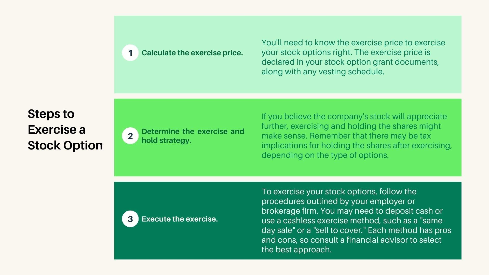

## Table of Contents

## What is a financial option?

A financial option is a contract that gives the buyer the right, but not the obligation, to buy or sell an asset at a specific price on or before a certain date. The asset could be stocks, commodities, or currencies. The specific price is called the strike price, and the date is known as the expiration date. Options are popular in financial markets because they allow investors to hedge against potential losses or speculate on price movements without having to buy the actual asset.

There are two main types of options: call options and put options. A call option gives the buyer the right to buy the asset at the strike price. This is useful if the buyer thinks the price of the asset will go up. On the other hand, a put option gives the buyer the right to sell the asset at the strike price. This is helpful if the buyer believes the price of the asset will go down. Both types of options can be used to manage risk or to try to make a profit from price changes.

## What are the basic types of financial options?

Financial options come in two basic types: call options and put options. A call option gives the buyer the right to buy an asset at a set price, called the strike price, before a certain date. People buy call options when they think the price of the asset will go up. For example, if you think a stock's price will rise, you can buy a call option to buy that stock at today's price and then sell it later at a higher price.

A put option, on the other hand, gives the buyer the right to sell an asset at the strike price before a certain date. People buy put options when they think the price of the asset will go down. For instance, if you own a stock and you're worried its price might drop, you can buy a put option to sell it at today's price, even if the market price falls later.

Both call and put options are used by investors to manage risk or to try to make money from changes in the price of assets. They are popular tools in financial markets because they offer flexibility and can be used in many different ways to fit different investment strategies.

## How does exercising a financial option work?

Exercising a financial option means using the right you bought to buy or sell an asset at the strike price. If you have a call option, exercising it means you buy the asset at the strike price. If you have a put option, exercising it means you sell the asset at the strike price. You would exercise your option if it's a good deal for you, like if the market price is better than the strike price.

For example, let's say you bought a call option for a stock with a strike price of $50. If the stock's market price goes up to $60, you might decide to exercise your option. You would buy the stock for $50 and then you could sell it right away for $60, making a profit. On the other hand, if you have a put option for the same stock with a strike price of $50 and the stock's price drops to $40, you might exercise your put option. You would sell the stock for $50 even though it's only worth $40 in the market, which saves you from a bigger loss.

## What is the difference between American and European options in terms of exercise?

American and European options differ in when they can be exercised. An American option can be exercised at any time up to the expiration date. This means if you own an American call option and the stock price goes up a lot before the expiration date, you can exercise your option early to buy the stock at the lower strike price and then sell it for a profit right away.

On the other hand, a European option can only be exercised on the expiration date, not before. So if you have a European call option and the stock price goes up a lot before the expiration date, you can't exercise your option early. You have to wait until the expiration date to decide whether to exercise it or not. This difference can affect how people use these options in their investment strategies.

## What are the factors to consider before exercising an option?

Before deciding to exercise an option, you should first look at the current market price of the asset compared to the strike price of your option. If you have a call option and the market price is higher than the strike price, exercising the option could be a good idea because you can buy the asset at the lower strike price and then sell it at the higher market price for a profit. On the other hand, if you have a put option and the market price is lower than the strike price, exercising the option might be smart because you can sell the asset at the higher strike price, avoiding a bigger loss.

Another important [factor](/wiki/factor-investing) is how much time is left until the option expires. If you have an American option, you can exercise it at any time before it expires. So, if you think the price difference between the market and strike prices is big enough, you might want to exercise early. But if you have a European option, you can only exercise it on the expiration date, so you'll need to wait until then to see if it's still a good idea to exercise. Also, think about any costs or fees involved in exercising the option, as these can affect whether it's worth doing.

Lastly, consider your overall investment strategy and goals. Exercising an option might fit well with your plans, or it might be better to sell the option itself if its value has gone up. Sometimes, the option's value can be more than the profit you'd make by exercising it, so selling the option could be a better choice. Always think about how exercising the option fits into your bigger financial picture.

## What is the intrinsic value of an option and how does it relate to exercising?

The intrinsic value of an option is the amount of money you would make if you exercised the option right now. For a call option, it's how much the current market price of the asset is above the strike price. If the market price is $60 and the strike price is $50, the intrinsic value is $10. For a put option, it's how much the strike price is above the current market price. If the strike price is $50 and the market price is $40, the intrinsic value is $10. If exercising the option wouldn't make you any money right now, the intrinsic value is $0.

The intrinsic value is important when deciding whether to exercise an option. If the intrinsic value is more than zero, it might be a good time to exercise, because you would make money right away. But you should also think about other things, like how much time is left until the option expires and any costs of exercising. Sometimes, even if the intrinsic value is positive, it might be better to wait or sell the option instead of exercising it, depending on your overall investment plan.

## What is the time value of an option and how does it affect the decision to exercise?

The time value of an option is the extra amount you pay for it beyond its intrinsic value. It's like a bet on what might happen to the price of the asset before the option expires. The time value depends on how much time is left until the option expires and how much the price of the asset might change. The more time left and the more the price could change, the higher the time value. 

When you're thinking about exercising an option, you need to consider the time value. If you exercise an option early, you lose the time value because you're no longer betting on future price changes. So, even if the option has some intrinsic value right now, it might be better to wait and see if the price changes more in your favor. But if there's not much time left and you think the price won't change much, exercising the option to get the intrinsic value might be the best choice.

## How do market conditions influence the decision to exercise an option?

Market conditions play a big role in deciding whether to exercise an option. If the market is going up and the price of the asset is higher than your strike price, you might want to exercise a call option to buy the asset at the lower strike price and then sell it at the higher market price. On the other hand, if the market is going down and the price of the asset is lower than your strike price, exercising a put option could be a good idea because you can sell the asset at the higher strike price, which might save you from losing more money.

But it's not just about the current market price. You also need to think about what might happen next. If the market is very unpredictable and could change a lot before your option expires, you might decide to wait and see if the price gets even better. This is especially true if your option still has a lot of time left. But if the market seems stable and you don't think the price will change much, exercising the option to get the current value might be the best move.

## What are the tax implications of exercising options?

When you exercise an option, you might have to pay taxes on any profit you make. If you exercise a call option and then sell the asset for more than you paid for it, the difference is usually considered a capital gain. How much tax you pay depends on how long you held the asset after exercising the option. If you held it for less than a year, it's a short-term capital gain, which is taxed at your regular income tax rate. If you held it for more than a year, it's a long-term capital gain, which usually has a lower tax rate.

Exercising a put option can also have tax implications. If you sell an asset for more than you paid for it by exercising a put option, that profit is also a capital gain. The same rules about short-term and long-term gains apply. But if you're using the put option to limit losses on an asset you already own, you might be able to claim a capital loss, which can help reduce your taxes. Always talk to a tax professional to understand how exercising options will affect your taxes, because the rules can be complicated and might change based on your situation.

## What strategies can be used to optimize the exercise of options?

One strategy to optimize the exercise of options is to wait until the last possible moment before the option expires. This gives you the most time for the price of the asset to move in your favor. If you have an American option, which you can exercise at any time, you might still want to wait if you think the price could go up more. But if the price is already good and you don't think it will get much better, exercising early could be smart. For European options, you have to wait until the expiration date anyway, so you can keep an eye on the price and decide then.

Another strategy is to consider selling the option instead of exercising it. Sometimes, the option itself becomes more valuable than the profit you would make by exercising it. This can happen if there's still a lot of time left until it expires or if the market is very unpredictable. By selling the option, you can get that higher value and avoid any costs or risks that come with exercising it. Always think about your overall investment goals and how exercising or selling the option fits into your plan.

## How do advanced option pricing models impact the decision to exercise?

Advanced option pricing models, like the Black-Scholes model, help you figure out what an option is worth. They look at things like the current price of the asset, the strike price, how much time is left until the option expires, how much the price might change, and the [interest rate](/wiki/interest-rate-trading-strategies). These models can tell you if the option is a good deal or not. If the model says the option is worth more than what you paid for it, you might want to sell it instead of exercising it. But if the model says the option is worth less than what you paid, exercising it to get the intrinsic value might be a better choice.

These models can also help you decide when to exercise an option. For example, if the model shows that the option's value is mostly from the time value, it might be better to wait before exercising. This is because the time value goes down as the option gets closer to expiring. If the model shows that the time value is small and the intrinsic value is high, exercising the option sooner could be smart. Always remember that these models are just tools to help you make decisions, and you should also think about your own investment goals and what's happening in the market.

## What are the risks associated with exercising options and how can they be mitigated?

Exercising options can be risky because you might lose money if the market price of the asset changes after you exercise. For example, if you exercise a call option and buy the asset, but then the price goes down, you could lose money when you sell it. Also, there are costs like fees and taxes that can eat into your profits. If you exercise a put option and sell an asset at the strike price, but then the price goes up, you might miss out on gains you could have made if you had kept the asset.

To lower these risks, you can wait until the last possible moment to exercise your option. This gives you more time for the price to move in your favor. Another way to reduce risk is to sell the option instead of exercising it, especially if the option's value has gone up a lot. This way, you can avoid the costs of exercising and still make a profit. It's also a good idea to use option pricing models to help you decide when to exercise, and always think about your overall investment plan and what's happening in the market.

## What are the key algorithmic strategies in options trading?

Algorithmic trading in options involves utilizing computer programs to execute trading strategies at high speeds. Among the most prevalent strategies used are [trend following](/wiki/trend-following), [arbitrage](/wiki/arbitrage) opportunities, and mean reversion.

### Trend Following

Trend following is based on the idea that prices tend to move in persistent directions over time. Algorithms designed for trend following typically involve identifying entry points when an asset's price moves along a particular trajectory. For options, this might involve using moving averages to identify trends and act upon them with calls or puts.

**Example Code for a Simple Moving Average Crossover:**

```python
def simple_moving_average(series, window):
    return series.rolling(window=window).mean()

# Assuming 'data' is a DataFrame with stock price data
data['SMA_50'] = simple_moving_average(data['Close'], 50)
data['SMA_200'] = simple_moving_average(data['Close'], 200)

# Generate signals
data['Signal'] = 0
data.loc[data['SMA_50'] > data['SMA_200'], 'Signal'] = 1
data.loc[data['SMA_50'] < data['SMA_200'], 'Signal'] = -1
```

### Arbitrage Opportunities

Arbitrage in options trading seeks to exploit inconsistencies in pricing between related securities. Algorithmic systems can quickly identify and act on these discrepancies before they rectify. This involves complex models to ensure true arbitrage, where no risk or capital is lost.

### Mean Reversion

The mean reversion strategy assumes that the price of an asset will revert to its historical average over time. In options trading, algorithms can be programmed to identify deviations from these averages and execute trades that expect the price to return to the mean. The strategy relies heavily on statistical analysis to identify potential opportunities.

**Example Formula for Mean Reversion:**

$$
\text{z-score} = \frac{X - \mu}{\sigma}
$$

Where $X$ is the current price, $\mu$ is the mean, and $\sigma$ is the standard deviation. A high absolute z-score might indicate a trading opportunity.

### Multi-Leg Strategies like Straddles

Straddles involve buying both a call and put option at the same strike price and expiration, betting on high [volatility](/wiki/volatility-trading-strategies). Systematic implementation uses algorithms to scan for situations where the market undervalues potential volatility.

**Pseudo-Algorithm for Straddle Strategy:**

1. Calculate the implied volatility of the underlying asset.
2. Define the threshold for volatility (e.g., historical averages).
3. If implied volatility is below threshold:
   - Execute a long straddle (buy call and put).
4. Monitor market for sudden changes in price.

### Programming Multi-Leg Strategy Example

```python
def execute_straddle(asset, strike_price, expiration):
    buy_option(asset, 'call', strike_price, expiration)
    buy_option(asset, 'put', strike_price, expiration)

if current_implied_volatility('XYZ') < volatility_threshold:
    execute_straddle('XYZ', 100, '2024-01-19')
```

Algorithmic options trading strategies enable traders to systematically manage trading conditions and complex multi-leg options strategies such as straddles with precision, increasing their potential for profitability while managing risk effectively. By leveraging quantitative models and programming capabilities, traders can optimize their trading strategies for better market performance.

## What is Risk Management in Algo Options Trading?

Risk management in algorithmic options trading is critical to ensuring stability and profitability. Effective strategies are developed to minimize potential losses while maximizing returns. These strategies can be divided into proactive and reactive approaches.

Proactive risk management involves measures that anticipate potential market movements and incorporate safeguards into trading algorithms before any trades are executed. One critical strategy is portfolio diversification. By spreading investments across various assets or options contracts, the risk associated with any single investment's performance is reduced. Diversification can be implemented algorithmically by coding constraints that limit the exposure to individual assets or sectors, thus ensuring a balanced portfolio.

Dynamic hedging is another proactive strategy that maintains a portfolio's risk profile despite changing market conditions. It involves the use of options to offset potential losses in a portfolio. Algorithms can be programmed to constantly recalibrate the hedge ratios based on the portfolio's current delta, which measures the sensitivity of the portfolio's value to changes in the underlying asset's price. An example of such dynamic hedging can be expressed mathematically as adjusting delta to calculate the required amount of an option or a series of options: 

$$
\Delta_p = \sum (n_i \times \Delta_i)
$$

where $\Delta_p$ is the portfolio delta, $n_i$ is the number of units of option $i$, and $\Delta_i$ is the delta of option $i$.

Reactive risk management comes into play when market conditions change unexpectedly. Stop-loss mechanisms are widely used, and they can be automated within algorithms to trigger the selling of an asset once it hits a predetermined price level, limiting potential losses. These mechanisms are coded to execute trades instantly, removing the delay and emotional bias that could aggravate losses.

Despite these strategies, several challenges persist in algorithmic options trading. Market impact, for example, refers to the effect of a trade on the market price of the asset, which can be significant if large volumes are traded algorithmically. Algorithms must be intelligently designed to mitigate market impact by potentially breaking trades into smaller parts or timing execution during periods of high [liquidity](/wiki/liquidity-risk-premium).

Technical errors and system failures pose another substantial risk. These can include software bugs, hardware failures, or unforeseen circumstances like drastic market events leading to flash crashes. Continuous monitoring, regular system audits, and redundant systems can help minimize these risks.

Finally, regulatory compliance is crucial. Algorithms must be designed to adhere to various market regulations to avoid legal issues. This includes ensuring that trading activities do not constitute market manipulation and that compliance with reporting requirements is maintained.

Overall, managing risk in algorithmic options trading involves complex strategies and precise execution. Traders must remain vigilant to adapt algorithms to new regulatory environments and evolving market conditions, while implementing rigorous testing to safeguard against unexpected system behaviors.

## References & Further Reading

#