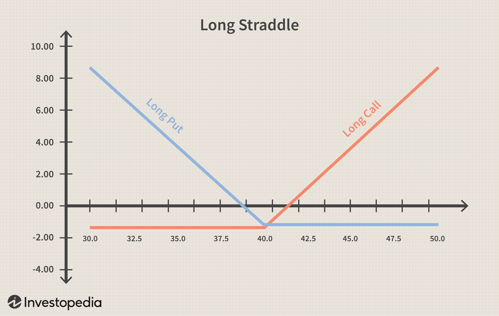

Options trading is a sophisticated financial instrument that empowers investors to buy or sell options on shares at a predetermined price, known as the strike price. This predefined price grants the holder the right, but not the obligation, to execute the option contract, either through a call option, which allows buying, or a put option, which allows selling, within a specified expiration period. Options trading provides strategic advantages by offering mechanisms for risk management, leveraging speculative opportunities, and enabling portfolio diversification through hedging.

In contrast, algorithmic trading, often abbreviated as algo trading, refers to the use of computer algorithms to automate trading strategies in financial markets. This approach is transforming options trading by enhancing speed and precision, as algorithms can execute trades at a pace and accuracy unattainable by human traders. Algorithms are designed to consider various factors such as price movements, trading volumes, and timing, along with incorporating complex strategies without human emotion's unpredictability.



The intersection of options trading and algorithmic trading creates a powerful synergy, significantly optimizing financial strategies. By combining the sophisticated strategic opportunities of options trading with the efficiency of algorithmic processes, traders can achieve heightened market engagement and refined risk management. This article explores this intersection, highlighting how these two innovative approaches can be integrated to advance investors' market advantages.

## Table of Contents

## Understanding Options Trading

Options trading involves the transaction of derivatives known as "options," which give the investor the right, but not the obligation, to buy or sell a specific amount of an underlying asset at a predetermined price, known as the strike price, within a set period. Two primary types of options exist: call options and put options. A call option grants the holder the right to purchase an asset, such as a stock, at the strike price before the expiration date. Conversely, a put option allows the holder to sell the asset at the strike price before expiration. These components—strike price and expiration date—are crucial in determining the value and strategic use of options.

The primary advantage of options trading lies in its ability to manage risk and provide speculative opportunities. Options can be utilized to hedge against potential losses in a portfolio. For example, buying a put option can protect an investor from a decline in the value of an owned stock, serving as an insurance policy. Conversely, options can be employed for speculative purposes. Traders can leverage options to bet on the direction of a stock's price movement with a limited and known potential loss, thus optimizing their risk-to-reward ratio.

Options provide significant strategic flexibility, allowing investors to tailor their approaches to market conditions. This flexibility is evident in strategies such as covered calls and protective puts. A covered call, where an investor sells call options against an owned stock, generates additional income while retaining ownership of the stock. Conversely, a protective put involves purchasing a put option to guard against potential losses in a stock position.

Moreover, options enable diversification within a portfolio. Investors can use them to gain exposure to different asset classes or sectors without the need to commit fully to owning the underlying assets. This capability allows for a nuanced approach to portfolio management, helping to balance risk and optimize returns.

The combination of risk management, speculative potential, and strategic flexibility makes options trading a powerful tool for investors. By incorporating options into their financial strategies, investors can not only protect their portfolios but also leverage market movements to enhance their returns.

 to Algorithmic Trading

Algorithmic trading, often referred to as algo trading, is a method of executing orders using automated pre-programmed trading instructions. These instructions or algorithms account for variables such as timing, price, [volume](/wiki/volume-trading-strategy), and potentially more complex calculations. The advent of [algorithmic trading](/wiki/algorithmic-trading) has revolutionized financial markets by enhancing the efficiency and speed of transactions.

The significance of algorithmic trading in today’s financial environments cannot be overstated. With the exponential growth of technology and the advent of electronic trading platforms, markets have become significantly faster. Algo trading offers a competitive advantage by executing trades at optimal prices with remarkable speed, far surpassing the capabilities of human traders. The elimination of human emotional biases, which can often hinder decision-making processes during volatile markets, further enhances its appeal. Algorithms operate based on logic and predefined conditions, ensuring consistent adherence to trading strategies.

These algorithms can be as simple or as complex as required. A basic example might involve instructions to purchase a set number of stocks when the stock hits a certain price. A more complex algorithm might integrate factors such as moving averages, rate of return, and statistical [arbitrage](/wiki/arbitrage). For instance, in the simplest terms, an algorithm could be programmed as follows:

```python
if price < moving_average:
    execute_buy_order(stock_ticker, quantity)
```

The versatility of algorithmic trading lies in its ability to be tailored to specific strategies. Algorithms can incorporate wide-ranging parameters like price movements, historical data patterns, and even real-time economic indicators. These algorithms enable the implementation of intricate strategies, such as portfolio rebalancing, [market making](/wiki/market-making), and [liquidity](/wiki/liquidity-risk-premium) detection.

Moreover, the programming of algorithms can integrate strategies for high-frequency trading ([HFT](/wiki/high-frequency-trading-strategies)), a subset of algo trading that emphasizes speed and the swift turnover of trades for marginal gains. In HFT and other complex strategies, algorithms process large volumes of data to detect and capitalize on short-lived market inefficiencies.

Through algorithmic trading, market participants can efficiently process vast datasets at speeds that are practically unattainable manually, thus optimizing profit opportunities. As markets evolve and become increasingly data-driven, the role of algorithmic trading algorithms will persist as an integral component of modern financial markets.

## Why Combine Options Trading with Algo Trading?

Combining options trading with algorithmic trading presents a powerful synergy that significantly enhances strategy execution. Algorithmic trading introduces a level of precision and speed that is unachievable by manual trading, especially when dealing with complex financial instruments like options.

Options trading is inherently complex due to the variety of strategies it encompasses, such as straddles, strangles, and spreads, each with multiple legs. Automation through algorithmic trading streamlines these complex multi-leg strategies efficiently. By automating the execution process, algorithms effectively manage the timing and sequence of the trades, minimizing the risk of human error and enhancing execution speed. This automation ensures that each leg of a complex options strategy is executed at the optimal moment, based on pre-defined parameters and real-time market data.

One of the primary advantages of integrating algorithmic trading with options is improved market efficiency. Algorithms can process vast amounts of data and execute trades faster than any human trader, thus capitalizing on brief market inefficiencies. For instance, a program can detect discrepancies in options pricing relative to the underlying asset's price and execute an arbitrage strategy, buying undervalued options and selling overvalued ones, thereby exploiting minute price variations for profit.

Another significant advantage is enhanced risk management. Algorithms enable the incorporation of sophisticated risk management techniques such as dynamic hedging and real-time monitoring of market conditions. For example, an algorithm can adjust a portfolio's delta exposure dynamically as market conditions change, maintaining a delta-neutral position if desired. This adjustment is crucial in options trading, where the value of options can change rapidly with underlying asset [volatility](/wiki/volatility-trading-strategies).

Python, a widely-used programming language in financial applications, can be used to demonstrate a basic example of algorithmic execution of an options strategy. For instance, using a simple pseudo-algorithm:

```python
def execute_strategy(option_data, market_data):
    for option in option_data:
        if market_data['trigger_condition']:
            if option['type'] == 'call' and option['price'] < market_data['target_price']:
                execute_trade('buy', option)
            elif option['type'] == 'put' and option['price'] > market_data['target_price']:
                execute_trade('sell', option)

def execute_trade(action, option):
    # Implement execution logic here
    print(f"Executing {action} for {option['symbol']}")

# Sample market condition
market_data = {'trigger_condition': True, 'target_price': 100}

# Sample options data
option_data = [
    {'symbol': 'AAPL Call', 'type': 'call', 'price': 95},
    {'symbol': 'AAPL Put', 'type': 'put', 'price': 110}
]

execute_strategy(option_data, market_data)
```

In this example, the algorithm reacts to specific market conditions by executing buy or sell orders based on predefined criteria, demonstrating the automated precision that algorithmic trading brings to options strategies.

The integration of algorithmic trading into options trading represents a fusion of strategic complexity and technical precision, optimizing both the potential returns and risk management. As technology evolves, these systems will only become more sophisticated, offering traders deeper insights and greater control over their financial strategies.

## Developing an Algorithmic Options Trading Strategy

Developing an algorithmic options trading strategy involves a systematic approach, starting with clearly defined investment objectives and assessing risk tolerance. Investment objectives might include goals such as income generation, capital appreciation, or risk mitigation, while risk tolerance determines the level of potential loss an investor is willing to bear.

Once objectives and risk tolerance are established, the next step is to incorporate technical and [fundamental analysis](/wiki/fundamental-analysis) into the algorithmic framework. Technical analysis uses historical market data and price charts to identify patterns and trends. Common technical indicators include moving averages, relative strength index (RSI), and Bollinger Bands. These indicators can be coded into algorithms to automate buy and sell signals. For example, a simple moving average crossover strategy in Python might look like this:

```python
import pandas as pd

def moving_average_crossover(data, short_window=40, long_window=100):
    signals = pd.DataFrame(index=data.index)
    signals['signal'] = 0.0

    # Calculate short and long simple moving averages
    signals['short_mavg'] = data['Close'].rolling(window=short_window, min_periods=1, center=False).mean()
    signals['long_mavg'] = data['Close'].rolling(window=long_window, min_periods=1, center=False).mean()

    # Generate signals
    signals['signal'][short_window:] = np.where(signals['short_mavg'][short_window:] > signals['long_mavg'][short_window:], 1.0, 0.0)    

    # Create a new column 'positions' to store trading positions
    signals['positions'] = signals['signal'].diff()

    return signals
```

Fundamental analysis, on the other hand, involves evaluating the intrinsic value of securities based on economic indicators, financial statements, and industry trends. Algorithms can be designed to include parameters such as earnings reports, interest rates, and macroeconomic data to adjust trading strategies accordingly.

Backtesting is a crucial component of developing an algorithmic options trading strategy. It involves testing the algorithm against historical data to evaluate performance and refine the strategy. Backtesting helps identify potential flaws in the logic or assumptions of the algorithm, allowing for iterations and improvements before deploying it in live trading. The historical data should represent a range of market conditions to ensure robustness. Examples of [backtesting](/wiki/backtesting) libraries used in Python include Backtrader and Zipline, which allow for comprehensive testing and evaluation of trading strategies.

By combining well-defined objectives with data-driven analysis and robust backtesting, traders can develop effective algorithmic options trading strategies that are aligned with their financial goals and risk tolerance.

## Key Algorithmic Strategies in Options Trading

Algorithmic trading in options involves utilizing computer programs to execute trading strategies at high speeds. Among the most prevalent strategies used are [trend following](/wiki/trend-following), arbitrage opportunities, and mean reversion.

### Trend Following

Trend following is based on the idea that prices tend to move in persistent directions over time. Algorithms designed for trend following typically involve identifying entry points when an asset's price moves along a particular trajectory. For options, this might involve using moving averages to identify trends and act upon them with calls or puts.

**Example Code for a Simple Moving Average Crossover:**

```python
def simple_moving_average(series, window):
    return series.rolling(window=window).mean()

# Assuming 'data' is a DataFrame with stock price data
data['SMA_50'] = simple_moving_average(data['Close'], 50)
data['SMA_200'] = simple_moving_average(data['Close'], 200)

# Generate signals
data['Signal'] = 0
data.loc[data['SMA_50'] > data['SMA_200'], 'Signal'] = 1
data.loc[data['SMA_50'] < data['SMA_200'], 'Signal'] = -1
```

### Arbitrage Opportunities

Arbitrage in options trading seeks to exploit inconsistencies in pricing between related securities. Algorithmic systems can quickly identify and act on these discrepancies before they rectify. This involves complex models to ensure true arbitrage, where no risk or capital is lost.

### Mean Reversion

The mean reversion strategy assumes that the price of an asset will revert to its historical average over time. In options trading, algorithms can be programmed to identify deviations from these averages and execute trades that expect the price to return to the mean. The strategy relies heavily on statistical analysis to identify potential opportunities.

**Example Formula for Mean Reversion:**

$$
\text{z-score} = \frac{X - \mu}{\sigma}
$$

Where $X$ is the current price, $\mu$ is the mean, and $\sigma$ is the standard deviation. A high absolute z-score might indicate a trading opportunity.

### Multi-Leg Strategies like Straddles

Straddles involve buying both a call and put option at the same strike price and expiration, betting on high volatility. Systematic implementation uses algorithms to scan for situations where the market undervalues potential volatility.

**Pseudo-Algorithm for Straddle Strategy:**

1. Calculate the implied volatility of the underlying asset.
2. Define the threshold for volatility (e.g., historical averages).
3. If implied volatility is below threshold:
   - Execute a long straddle (buy call and put).
4. Monitor market for sudden changes in price.

### Programming Multi-Leg Strategy Example

```python
def execute_straddle(asset, strike_price, expiration):
    buy_option(asset, 'call', strike_price, expiration)
    buy_option(asset, 'put', strike_price, expiration)

if current_implied_volatility('XYZ') < volatility_threshold:
    execute_straddle('XYZ', 100, '2024-01-19')
```

Algorithmic options trading strategies enable traders to systematically manage trading conditions and complex multi-leg options strategies such as straddles with precision, increasing their potential for profitability while managing risk effectively. By leveraging quantitative models and programming capabilities, traders can optimize their trading strategies for better market performance.

## Risk Management in Algo Options Trading

Risk management in algorithmic options trading is critical to ensuring stability and profitability. Effective strategies are developed to minimize potential losses while maximizing returns. These strategies can be divided into proactive and reactive approaches.

Proactive risk management involves measures that anticipate potential market movements and incorporate safeguards into trading algorithms before any trades are executed. One critical strategy is portfolio diversification. By spreading investments across various assets or options contracts, the risk associated with any single investment's performance is reduced. Diversification can be implemented algorithmically by coding constraints that limit the exposure to individual assets or sectors, thus ensuring a balanced portfolio.

Dynamic hedging is another proactive strategy that maintains a portfolio's risk profile despite changing market conditions. It involves the use of options to offset potential losses in a portfolio. Algorithms can be programmed to constantly recalibrate the hedge ratios based on the portfolio's current delta, which measures the sensitivity of the portfolio's value to changes in the underlying asset's price. An example of such dynamic hedging can be expressed mathematically as adjusting delta to calculate the required amount of an option or a series of options: 

$$
\Delta_p = \sum (n_i \times \Delta_i)
$$

where $\Delta_p$ is the portfolio delta, $n_i$ is the number of units of option $i$, and $\Delta_i$ is the delta of option $i$.

Reactive risk management comes into play when market conditions change unexpectedly. Stop-loss mechanisms are widely used, and they can be automated within algorithms to trigger the selling of an asset once it hits a predetermined price level, limiting potential losses. These mechanisms are coded to execute trades instantly, removing the delay and emotional bias that could aggravate losses.

Despite these strategies, several challenges persist in algorithmic options trading. Market impact, for example, refers to the effect of a trade on the market price of the asset, which can be significant if large volumes are traded algorithmically. Algorithms must be intelligently designed to mitigate market impact by potentially breaking trades into smaller parts or timing execution during periods of high liquidity.

Technical errors and system failures pose another substantial risk. These can include software bugs, hardware failures, or unforeseen circumstances like drastic market events leading to flash crashes. Continuous monitoring, regular system audits, and redundant systems can help minimize these risks.

Finally, regulatory compliance is crucial. Algorithms must be designed to adhere to various market regulations to avoid legal issues. This includes ensuring that trading activities do not constitute market manipulation and that compliance with reporting requirements is maintained.

Overall, managing risk in algorithmic options trading involves complex strategies and precise execution. Traders must remain vigilant to adapt algorithms to new regulatory environments and evolving market conditions, while implementing rigorous testing to safeguard against unexpected system behaviors.

## Benefits and Risks of Algo Trading in Options

Algorithmic trading in options provides several key benefits that attract traders and financial institutions. One of the primary advantages is efficiency. Algorithms can execute trades faster than any human, capitalizing on fleeting market opportunities. This speed allows traders to enter and [exit](/wiki/exit-strategy) positions at optimal points, thus potentially increasing profitability. Precision is another significant benefit, as algorithms can process vast amounts of data and identify precise trading opportunities using predetermined criteria, reducing human error and bias.

Enhanced risk management is another vital advantage of algorithmic options trading. Algorithms can implement complex risk management strategies, such as dynamic hedging and stop-loss orders, more effectively than manual methods. This enables traders to protect their portfolios against adverse market movements systematically and consistently.

However, algorithmic options trading is not without risks. One of the primary concerns is the potential for software errors or bugs, which can lead to significant financial losses. Algorithms that are not thoroughly tested or that contain coding errors might execute trades incorrectly or at the wrong times. Furthermore, regulatory challenges are increasingly relevant as financial authorities scrutinize automated trading practices. Compliance with these regulations requires constant updates and adaptations of trading systems to avoid legal repercussions.

Another significant risk is the substantial capital requirement for algorithmic trading. High-frequency trading, in particular, demands powerful computing resources and fast network connections, which can be costly. This barrier to entry means that only well-capitalized traders and institutions can fully exploit the benefits of algorithmic trading.

To mitigate these risks, it is essential to adopt best practices such as regular testing and strategy adaptation. Backtesting trading algorithms with historical data can identify weaknesses before live trading. Continuous monitoring and updating of algorithms ensure they remain effective in ever-evolving market conditions. Implementing rigorous risk management frameworks within the algorithm design, and maintaining compliance with the latest regulatory guidelines, further reduce potential pitfalls. By following these best practices, traders can harness the advantages of algorithmic options trading while minimizing associated risks.

## Conclusion

Combining options trading with algorithmic strategies presents significant potential for enhancing market advantage. By leveraging the speed, precision, and efficiency of algorithmic trading, investors can optimize their approach to options trading, a field known for its complexity and strategic demands. Algorithms excel in managing multifaceted options strategies, facilitating faster execution and better risk management than manual methods alone.

Continuous learning is essential as financial technology evolves rapidly. Staying informed about new tools, platforms, and techniques helps traders maintain a competitive edge. With modern advancements, traders must not only understand current market dynamics but also anticipate future developments, allowing them to adapt their strategies proactively.

Looking ahead, the integration of AI and [machine learning](/wiki/machine-learning) in trading is expected to reshape financial markets. These technologies offer the potential to analyze vast data sets, identify patterns, and make predictive decisions with higher accuracy. By combining AI-driven insights with the structural benefits of options trading, traders can craft strategies that are both innovative and resilient.

Algorithmic options trading is not just about immediate gains; it also involves understanding long-term market shifts and adapting to them. As AI continues to develop, the potential to refine trading strategies further and achieve sustained success increases, making the fusion of options trading with algorithmic strategies a compelling proposition for future growth in financial markets.

## References & Further Reading

### References & Further Reading

1. **Seminal Works on Options and Algorithmic Trading:**
   - **Options, Futures, and Other Derivatives by John C. Hull:** This book is a comprehensive guide to understanding the complex world of derivatives, providing essential knowledge on options pricing, risk management, and market dynamics.
   - **Algorithmic Trading: Winning Strategies and Their Rationale by Ernie Chan:** This resource offers insights into algorithmic trading systems, exploring various strategies, statistics, and implementation techniques.

2. **Further Reading:**
   - **Dynamic Hedging: Managing Vanilla and Exotic Options by Nassim Nicholas Taleb:** This book emphasizes the importance of dynamic hedging in options trading, analyzing the practicalities of managing risk.
   - **A Beginner’s Guide to Options by Edwin J. Elton and Martin J. Gruber:** This introductory text offers a thorough explanation of the foundational concepts of options trading, making it ideal for novice investors.

3. **Tutorials and Online Courses:**
   - **Coursera - Financial Markets by Yale University:** This course provides a broad overview of financial markets, focusing on the roles and risks of derivatives such as options.
   - **Udemy - Algorithmic Trading & Quantitative Analysis Using Python:** A practical course that dives into implementing algorithmic trading strategies using Python, ideal for individuals looking to leverage programming in finance.

4. **Platforms for Practical Learning:**
   - **QuantConnect:** An open-source algorithmic trading platform offering community-driven data and built-in support for running trading algorithms in multiple financial instruments including options.
   - **Interactive Brokers:** This trading platform allows users to test and deploy algorithmic trading strategies in a real-time market environment, equipped with comprehensive tools and resources for options trading.

These references collectively equip readers with a robust understanding of options and algorithmic trading, promoting informed decision-making in financial markets.

