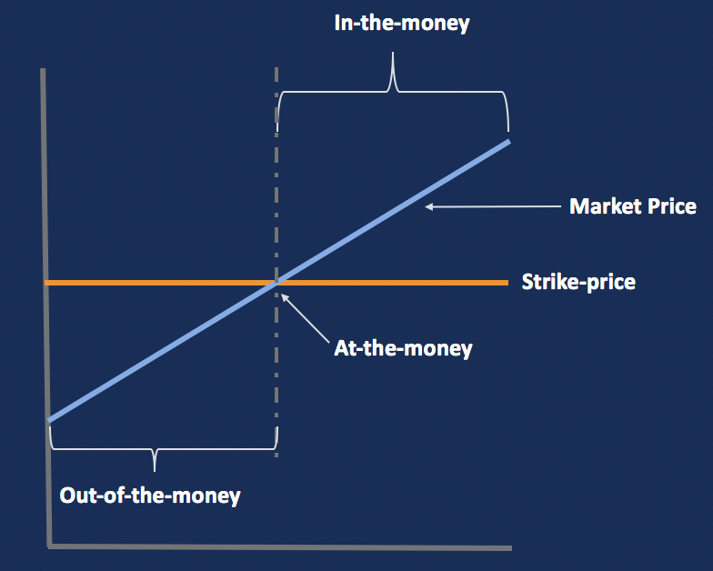

## Table of Contents

## What is an exercise price in options trading?

The exercise price, also known as the strike price, is a key term in options trading. It's the fixed price at which the owner of an option can buy or sell the underlying asset, like a stock. If you have a call option, the exercise price is what you pay to buy the stock. If you have a put option, it's the price at which you can sell the stock.

Understanding the exercise price helps traders decide if they should use their option. If the current market price of the stock is higher than the exercise price of a call option, it might be a good time to buy the stock at the lower exercise price. On the other hand, if the market price is lower than the exercise price of a put option, selling at the higher exercise price could be beneficial. The difference between the market price and the exercise price is what makes options valuable.

## How does the exercise price affect the value of a call option?

The exercise price, or strike price, plays a big role in deciding how much a call option is worth. A call option gives you the right to buy a stock at the exercise price. If the exercise price is lower than the current market price of the stock, the call option becomes more valuable. This is because you can buy the stock at a cheaper price than what it's selling for in the market. The bigger the difference between the exercise price and the market price, the more valuable the call option is.

On the other hand, if the exercise price is higher than the current market price, the call option loses value. In this case, it wouldn't make sense to use the option to buy the stock because you could get it cheaper on the open market. So, the value of a call option goes up when the market price of the stock rises above the exercise price, and it goes down when the market price falls below the exercise price.

## How does the exercise price impact the value of a put option?

The exercise price is important for a put option too. A put option lets you sell a stock at the exercise price. If the exercise price is higher than the current market price of the stock, the put option becomes more valuable. This is because you can sell the stock at a higher price than what it's worth in the market. The bigger the difference between the exercise price and the market price, the more valuable the put option is.

On the other hand, if the exercise price is lower than the current market price, the put option loses value. In this case, it wouldn't make sense to use the option to sell the stock because you could get more money by selling it on the open market. So, the value of a put option goes up when the market price of the stock falls below the exercise price, and it goes down when the market price rises above the exercise price.

## What does it mean for an option to be 'in the money'?

When an option is 'in the money', it means that the option has some value right now. For a call option, this happens when the current market price of the stock is higher than the exercise price. So, if you have a call option to buy a stock at $50 and the stock is now selling for $60, your option is in the money. You could buy the stock for $50 and then sell it for $60, making a profit.

For a put option, being 'in the money' means the current market price of the stock is lower than the exercise price. If you have a put option to sell a stock at $50 and the stock is now selling for $40, your option is in the money. You could buy the stock for $40 and then use your option to sell it for $50, making a profit. So, being 'in the money' is a good thing because it means your option has value you can use right away.

## What does it mean for an option to be 'out of the money'?

When an option is 'out of the money', it means the option doesn't have any value right now. For a call option, this happens when the current market price of the stock is lower than the exercise price. So, if you have a call option to buy a stock at $50 and the stock is now selling for $40, your option is out of the money. You wouldn't want to buy the stock for $50 when you can get it for $40 on the market.

For a put option, being 'out of the money' means the current market price of the stock is higher than the exercise price. If you have a put option to sell a stock at $50 and the stock is now selling for $60, your option is out of the money. You wouldn't want to sell the stock for $50 when you can get $60 for it on the market. So, being 'out of the money' means your option isn't worth using right now, but it could still become valuable if the stock price changes in the future.

## How can you determine if a call option is in or out of the money?

To find out if a call option is in the money, you need to compare the exercise price of the option with the current market price of the stock. If the market price is higher than the exercise price, the call option is in the money. For example, if your call option lets you buy a stock at $50 and the stock is now selling for $60, your option is in the money. This means you could buy the stock at $50 and sell it at $60, making a profit.

If the market price of the stock is lower than the exercise price, the call option is out of the money. For instance, if your call option lets you buy a stock at $50 but the stock is only selling for $40, your option is out of the money. In this case, it wouldn't make sense to use your option because you could buy the stock cheaper on the market. So, the key is to see if the market price is above or below the exercise price to know if your call option is in or out of the money.

## How can you determine if a put option is in or out of the money?

To figure out if a put option is in the money, you need to compare the exercise price of the option with the current market price of the stock. If the market price is lower than the exercise price, the put option is in the money. For example, if your put option lets you sell a stock at $50 and the stock is now selling for $40, your option is in the money. This means you could buy the stock at $40 and then sell it at $50, making a profit.

If the market price of the stock is higher than the exercise price, the put option is out of the money. For instance, if your put option lets you sell a stock at $50 but the stock is selling for $60, your option is out of the money. In this case, it wouldn't make sense to use your option because you could sell the stock for more on the market. So, the key is to see if the market price is below or above the exercise price to know if your put option is in or out of the money.

## What are the financial implications of exercising an in-the-money option?

When you exercise an in-the-money option, it means you are using your right to buy or sell the stock at the exercise price. For a call option, this means you buy the stock at a price lower than what it's currently worth in the market. This can be good because you can then sell the stock at the higher market price and make a profit. But, you need to think about the costs too. You'll have to pay for the stock at the exercise price, and there might be other fees like trading costs or taxes.

For a put option, exercising an in-the-money option means you sell the stock at a price higher than what it's currently worth in the market. This can also be good because you can buy the stock at the lower market price and then sell it at the higher exercise price to make a profit. Again, you need to consider the costs. You might have to buy the stock to sell it, and there could be other fees involved. So, while exercising an in-the-money option can lead to profits, you need to weigh the costs and potential benefits before deciding to do it.

## What strategies might an investor use involving the exercise price of options?

Investors might use different strategies based on the exercise price of options to make money or protect their investments. One common strategy is called "buying calls." If an investor thinks a stock's price will go up, they might buy a call option with an exercise price lower than the expected future price of the stock. If the stock price does go up, they can buy the stock at the lower exercise price and then sell it at the higher market price, making a profit. Another strategy is "buying puts." If an investor thinks a stock's price will go down, they might buy a put option with an exercise price higher than the expected future price. If the stock price drops, they can buy the stock at the lower market price and sell it at the higher exercise price, also making a profit.

Another strategy is called "covered calls." Here, an investor who owns a stock might sell call options on that stock with an exercise price higher than the current market price. They get money from selling the option, and if the stock price doesn't go above the exercise price, they keep the money and the stock. If the stock price does go above the exercise price, the option might get exercised, and they have to sell the stock at the exercise price, but they still make a profit from the difference between the exercise price and their original cost of the stock, plus the money from selling the option. "Protective puts" is another strategy where an investor buys a put option with an exercise price close to the current market price of a stock they own. This acts like insurance, protecting them from big losses if the stock price falls a lot.

## How does the choice of exercise price influence the risk and reward profile of an options strategy?

The exercise price of an option plays a big role in deciding how much risk and reward an investor might face. When you pick an exercise price that's far away from the current market price, the option is cheaper to buy. But, it also means there's a bigger chance the stock price won't reach that exercise price before the option expires. So, the risk is higher because you might lose all your money if the stock doesn't move enough. On the other hand, if the stock does move a lot and reaches or goes beyond the exercise price, the reward can be huge because you bought the option for less.

On the flip side, choosing an exercise price that's close to the current market price means the option will cost more. This reduces the risk because the stock has less distance to travel to make the option valuable. But, the reward might be smaller because you paid more for the option. So, the choice of exercise price is all about balancing how much you're willing to risk with how much reward you're hoping to get. It's like deciding whether to bet a little on a long shot or a lot on a safer bet.

## What are the tax implications of exercising options at different exercise prices?

When you exercise an option, the tax you have to pay can change based on the exercise price. If you exercise a call option that's in the money, the difference between the exercise price and the market price of the stock counts as income. This is called a capital gain. If you hold the stock for less than a year after exercising the option, it's a short-term capital gain, and you'll pay regular income tax on it. If you hold it for more than a year, it becomes a long-term capital gain, which usually has a lower tax rate.

For put options, if you exercise an in-the-money option, you might have a capital gain or loss depending on how much you paid for the option and the difference between the exercise price and the market price. If you sell the stock at the exercise price and make a profit, that's a capital gain. Like with call options, whether it's short-term or long-term depends on how long you hold the stock after exercising the option. If you end up losing money, you can use that loss to reduce your taxes. So, the exercise price can really affect how much tax you'll have to pay when you exercise options.

## How do market conditions and volatility affect the optimal choice of exercise price for options?

Market conditions and how much a stock's price moves around, which we call [volatility](/wiki/volatility-trading-strategies), can really change what exercise price is best for options. When the market is doing well and stocks are going up, you might want to pick a higher exercise price for a call option. This is because you think the stock will keep going up and reach that price. But if the market is shaky and stocks are going down, a lower exercise price might be better for a put option. That way, if the stock keeps dropping, you can still sell it at a good price.

Volatility also plays a big part. If a stock's price is jumping around a lot, it might be smart to pick an exercise price that's not too far from where the stock is now. That's because the stock has a better chance of hitting that price before the option runs out. But if the stock isn't moving much, you might go for an exercise price that's further away. It's cheaper, but it's riskier because the stock has to move more to make your option worth something. So, understanding the market and how much a stock moves can help you pick the best exercise price for your options.

## References & Further Reading

[1]: Hull, J. C. (2018). ["Options, Futures, and Other Derivatives."](https://www.semanticscholar.org/paper/Options%2C-Futures%2C-and-Other-Derivatives-Hull/89bdee500c8623864fc9eb7a471546aa713acc44) Pearson Education.

[2]: de Prado, M. L. (2018). ["Advances in Financial Machine Learning."](https://www.amazon.com/Advances-Financial-Machine-Learning-Marcos/dp/1119482089) Wiley.

[3]: Chan, E. P. (2008). ["Quantitative Trading: How to Build Your Own Algorithmic Trading Business."](https://github.com/ftvision/quant_trading_echan_book) Wiley.

[4]: Jansen, S. (2020). ["Machine Learning for Algorithmic Trading."](https://github.com/stefan-jansen/machine-learning-for-trading) Packt Publishing.

[5]: Aronson, D. R. (2007). ["Evidence-Based Technical Analysis: Applying the Scientific Method and Statistical Inference to Trading Signals."](https://onlinelibrary.wiley.com/doi/book/10.1002/9781118268315) Wiley.