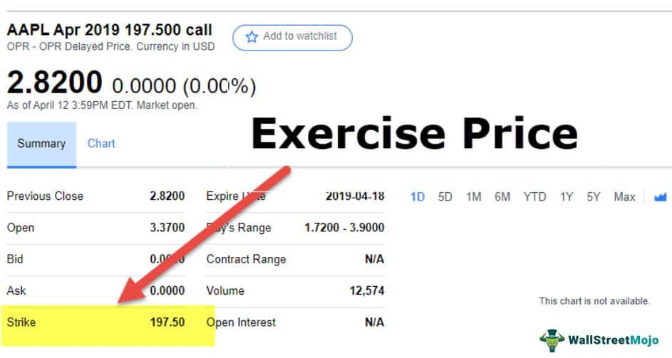

Options trading has become an increasingly attractive strategy for investors aiming to enhance the performance of their portfolios. By allowing the purchase or sale of assets at predetermined prices, options provide flexibility and the potential for significant returns. The strategic nature of options trading necessitates a thorough understanding of essential concepts such as the exercise price and the conditions under which an option is considered 'in the money'. These factors are pivotal in determining the profitability of trades.

Moreover, as technology continues to evolve, algorithmic trading has emerged as a powerful tool in optimizing options strategies. Algorithmic trading uses computer programs to analyze large datasets and execute trades based on predefined criteria. This method can identify optimal entry and exit points in the market with precision, enhancing the efficiency and management of trading strategies.



This article explores these vital components of options trading, offering insights into effective trading strategies and risk management. Understanding these foundations can empower traders to navigate the complex landscape of options markets and harness the insights provided by advanced trading technologies.

## Table of Contents

## Understanding the Exercise Price

The exercise price, often referred to as the strike price, is a fundamental concept in options trading. It denotes the predetermined price at which the holder of an option can buy (in the case of a call option) or sell (in the case of a put option) the underlying asset. This price is established when the option is created and remains constant throughout the option's term.

A critical aspect of the exercise price is its role in determining the potential profitability of an option. For a call option, the exercise price is considered advantageous if it is below the market price of the underlying asset at the time of exercise, as this allows the holder to acquire the asset at a price lower than the prevailing market value. Conversely, for a put option, the exercise price is favorable if it is above the current market price because it enables the holder to sell the asset at a higher price than the market offers.

Both types of options—calls and puts—are defined by their exercise prices, which are agreed upon when the option contract is initiated. The exercise price directly influences the option's intrinsic value. For call options, intrinsic value is calculated as the greater of zero or the difference between the market price and the exercise price ($\text{max}(0, \text{Market Price} - \text{Exercise Price})$). For put options, it is the greater of zero or the difference between the exercise price and the market price ($\text{max}(0, \text{Exercise Price} - \text{Market Price})$). These calculations highlight how exercise prices impact the option's potential value to the holder.

In summary, the exercise price is integral to the mechanics of options trading, serving as a fixed benchmark that influences the feasibility and financial outcome of an options contract. Understanding this concept is crucial for traders aiming to assess and optimize their trading strategies effectively.

## In the Money vs. Out of the Money

Options can be categorized as 'in the money' (ITM) or 'out of the money' (OTM) based on the exercise price in relation to the market price of the underlying asset. This classification is crucial for evaluating the potential profitability and strategic value of an options contract.

For call options, being 'in the money' (ITM) occurs when the exercise price is below the current market price of the underlying asset. This means that the holder of the option can purchase the asset at a price lower than the going market rate, potentially realizing a profit if they choose to exercise the option. For instance, if a call option has an exercise price of $50 and the market price of the asset is $60, the option is considered ITM by $10 per share.

Conversely, put options are 'in the money' when their exercise price is above the market price of the underlying asset. This scenario allows the option holder to sell the asset at a price higher than the market rate, again potentially yielding a profit. For example, if a put option has an exercise price of $70 and the market price is $65, the option is ITM by $5 per share.

Being 'out of the money' (OTM) indicates that executing the option would not yield an immediate economic advantage. For call options, this occurs when the exercise price is above the market price, meaning investors could buy the asset cheaper on the market. In the case of put options, 'out of the money' means the exercise price is below the market price, representing an unattractive sale opportunity given the current market conditions.

Traders often prefer options that are 'in the money' because they hold intrinsic value and are more likely to result in a profitable trade. The status of an option as ITM or OTM significantly influences strategic decisions, affecting whether options are exercised or traded in secondary markets. Understanding these dynamics helps traders devise strategies to maximize potential returns and manage risks effectively.

## Algorithmic Trading in Options

Algorithmic trading is a method where sophisticated computer programs execute trades according to pre-set rules, enabling traders to operate at speeds and scales that humans alone cannot achieve. In the context of options trading, [algorithmic trading](/wiki/algorithmic-trading) can significantly enhance an investor's ability to identify profitable opportunities and manage risk efficiently.

Algorithms used in options trading are designed to process extensive market data in real-time, identifying optimal entry and [exit](/wiki/exit-strategy) points. Due to the complexity and [volume](/wiki/volume-trading-strategy) of the data involved, algorithms can analyze multiple variables, such as [volatility](/wiki/volatility-trading-strategies) indices, historical price patterns, and implied volatility, to make informed suggestions. This real-time analysis allows traders to react swiftly to market changes, which is especially crucial in the fast-paced environment of options markets.

Risk management is another critical area where algorithms are beneficial. By incorporating algorithms that monitor and respond to market conditions, traders can manage their risk exposure more effectively. For example, an algorithm might be programmed to trigger a stop-loss order once an option's price hits a certain threshold, thereby mitigating potential losses.

The efficiency in executing trades is also a notable advantage of using algorithms in options trading. These systems reduce the latency between the time a decision is made and the actual execution of a trade. This speed can be the difference between profiting and missing an opportunity, especially in high-frequency trading scenarios where milliseconds matter.

Moreover, algorithms can optimize strategy implementation by automating routine processes, minimizing human error, and reducing operational costs. By systematically back-testing different strategies on historical data, algorithms can identify which tactics have been more successful historically and adapt these strategies to current market conditions.

In summary, algorithmic trading in options harnesses the power of computational algorithms to process massive datasets, manage risk, and execute trades with precision and speed, providing traders with a sophisticated tool to navigate complex market conditions efficiently.

## Benefits and Risks of Exercising Options

Exercising options provides traders the opportunity to acquire or sell the underlying asset at an exercise price that may be significantly more advantageous than the current market rate. This aspect is particularly beneficial if the option is 'in the money' (ITM), potentially offering direct access to profit by either taking possession of the asset or executing a financial maneuver that capitalizes on the asset's market position.

However, traders must carefully consider potential risks associated with exercising options. A primary risk is market price fluctuation. Market conditions can change rapidly, potentially rendering the exercise price less favorable compared to the market price at the time of option exercise. This could lead to scenarios where exercising the option results in a financial disadvantage rather than a benefit.

Tax implications also present a significant risk. Depending on jurisdiction and the trader's financial circumstances, exercising options could lead to immediate tax liabilities. For instance, the Internal Revenue Service in the United States treats the exercise of non-qualified stock options as taxable events, requiring tax payment on the difference between the market price and the exercise price.

Deciding whether to exercise an option should also account for factors like dividends and time decay. Options may include dividend implications, affecting their intrinsic value. Traders should assess whether impending dividends justify exercising the option, potentially using it to secure dividend-paying stocks. Additionally, time decay, which erodes the value of an option as it approaches expiration, must be weighed. The decay might diminish potential benefits, especially for options that are not significantly ITM.

Lastly, broader market conditions can greatly influence the decision to exercise an option. A bullish market might support waiting or selling the option rather than exercising, whereas a bearish outlook might make immediate exercise more appealing. By meticulously evaluating these factors, traders can make informed decisions to either exercise, hold, or trade their options, aligning with their broader financial strategies and goals.

## Strategic Use of Algorithms

Developing a strategic approach using algorithms can significantly enhance options trading by providing precise, data-driven insights. Options analytics tools and algorithms can analyze vast datasets rapidly, offering traders a clearer picture of pricing dynamics, volatility, and market trends. This analytical prowess enables traders to make well-informed decisions with a higher degree of confidence.

Utilizing algorithmic strategies simplifies the complexities traditionally associated with options trading. For instance, algorithms can automatically flag potential opportunities based on predetermined criteria, such as specific price points or volatility levels. This automation reduces the emotional component of trading, allowing for more consistent execution of strategies.

Python is a popular language for developing these trading algorithms due to its extensive libraries like NumPy for numerical computations, pandas for data manipulation, and libraries such as scikit-learn for implementing [machine learning](/wiki/machine-learning) models. These tools can analyze historical market data to uncover patterns or forecast future price movements.

Here's a simple Python example illustrating how an algorithm might draw insights from historical pricing data:

```python
import pandas as pd
import numpy as np
from sklearn.linear_model import LinearRegression

# Load historical price data
data = pd.read_csv('historical_prices.csv')

# Feature Engineering: Calculate moving averages
data['MA_10'] = data['Close'].rolling(window=10).mean()
data['MA_50'] = data['Close'].rolling(window=50).mean()

# Define features and target
X = data[['MA_10', 'MA_50']].dropna()
y = data['Close'].shift(-1).dropna()[:len(X)]

# Train a linear regression model
model = LinearRegression().fit(X, y)

# Predict the next day's closing price
next_day_features = np.array([X.iloc[-1]]).reshape(1, -1)
predicted_price = model.predict(next_day_features)

print(f"Predicted next day closing price: {predicted_price[0]}")
```

This simple model uses two moving averages as predictors to estimate future prices, demonstrating the type of insights algorithms can provide.

Strategically using algorithms in options trading also allows for advanced practices such as algorithmic risk management. By constantly monitoring risk parameters and market conditions, algorithms can dynamically adjust trading activities to mitigate potential losses. This adaptability is crucial given the volatile nature of options markets.

Moreover, algorithmic trading facilitates [backtesting](/wiki/backtesting) strategies on historical data, enabling traders to refine their approaches before committing capital. This process helps ensure that the strategies are not only theoretically sound but also practically viable under real market conditions.

In conclusion, integrating algorithms into options trading strategies can automate the analysis of complex datasets, manage risk more effectively, and provide valuable insights into market dynamics, ultimately offering a competitive edge to traders seeking to maximize their returns.

## Conclusion

Mastery of options trading necessitates a thorough grasp of fundamental concepts such as exercise price, 'in the money' status, and the application of algorithmic strategies. These elements form the backbone of informed decision-making processes and are integral to constructing robust trading methods.

The exercise price, or strike price, is pivotal because it determines the point of profitability for an option. A comprehensive understanding of how options become 'in the money'—where the exercise price favorably compares to the underlying asset's market price—equips traders with the knowledge to assess the potential value of their trades.

Moreover, the incorporation of algorithmic trading strategies has revolutionized options trading, offering traders enhanced precision and efficiency. Algorithms can swiftly analyze extensive datasets to pinpoint optimal trading opportunities, ensuring timely and data-driven decisions. For instance, implementing Python scripts to automate trading operations can significantly streamline multiple facets of trading, from order execution to risk management. This can look something like this in Python:

```python
import numpy as np
import pandas as pd
from sklearn.ensemble import RandomForestClassifier

# Sample data representing historical market trends
data = pd.DataFrame({
    'feature1': np.random.randn(100),
    'feature2': np.random.randn(100),
    'target': np.random.choice([0, 1], size=100)  # Binary target for in-the-money status
})

# Split the data
train = data.sample(frac=0.8, random_state=1)
test = data.drop(train.index)

# Train a simple model
model = RandomForestClassifier()
model.fit(train[['feature1', 'feature2']], train['target'])

# Predict on the test data
predictions = model.predict(test[['feature1', 'feature2']])

print(f"Predictions: {predictions}")
```

Harnessing such tools and strategies allows traders to not only automate but also enhance their strategies, ensuring they remain competitive in dynamic markets. By aligning the technical understanding of these core concepts with intelligent algorithmic implementations, traders can effectively optimize their trading approaches and potentially maximize returns. This strategic alignment represents a powerful approach to navigating the complexities of options trading with confidence and efficiency.

## References & Further Reading

[1]: Hull, J. C. (2018). ["Options, Futures, and Other Derivatives."](https://www.semanticscholar.org/paper/Options%2C-Futures%2C-and-Other-Derivatives-Hull/89bdee500c8623864fc9eb7a471546aa713acc44) Pearson Education.

[2]: de Prado, M. L. (2018). ["Advances in Financial Machine Learning."](https://www.amazon.com/Advances-Financial-Machine-Learning-Marcos/dp/1119482089) Wiley.

[3]: Chan, E. P. (2008). ["Quantitative Trading: How to Build Your Own Algorithmic Trading Business."](https://github.com/ftvision/quant_trading_echan_book) Wiley.

[4]: Jansen, S. (2020). ["Machine Learning for Algorithmic Trading."](https://github.com/stefan-jansen/machine-learning-for-trading) Packt Publishing.

[5]: Aronson, D. R. (2007). ["Evidence-Based Technical Analysis: Applying the Scientific Method and Statistical Inference to Trading Signals."](https://onlinelibrary.wiley.com/doi/book/10.1002/9781118268315) Wiley.