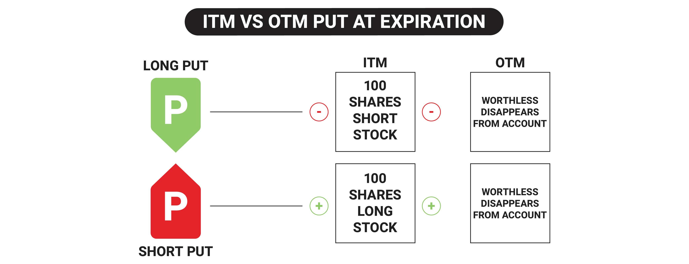

## Table of Contents

## What does it mean to exercise an option?

Exercising an option means using the right you have to buy or sell an asset at a specific price before the option expires. When you exercise a call option, you buy the asset at the agreed price, which is called the strike price. If you exercise a put option, you sell the asset at the strike price. This action can be profitable if the market price of the asset is different from the strike price in a way that benefits you.

For example, if you have a call option to buy a stock at $50 and the stock is now worth $60, exercising the option lets you buy the stock at $50 and then sell it at $60, making a profit. On the other hand, if you have a put option to sell a stock at $50 and the stock is now worth $40, you can exercise the option to sell the stock at $50, which is better than selling it at the lower market price. Exercising an option is a choice you make, and you should do it if it makes financial sense for you.

## What is the expiration date of an option?

The expiration date of an option is the last day you can use the option. It's like a deadline. If you don't use the option by this date, it becomes worthless and you can't use it anymore.

This date is important because it affects the value of the option. As the expiration date gets closer, the option can become more valuable if it's likely to be profitable, or less valuable if it's not. Knowing the expiration date helps you decide when to buy, sell, or use the option.

## Why is the expiration date important for option holders?

The expiration date is really important for people who own options because it tells them the last day they can use their option. If they don't use it by that date, the option goes away and they can't use it anymore. This date is like a deadline that they need to remember.

Knowing the expiration date helps option holders plan what to do. If they think the option will be worth more money before it expires, they might decide to wait and use it later. But if they think the option won't be worth much, they might want to use it or sell it before it's too late. So, the expiration date helps them make smart choices about their options.

## What are the different types of options that can be exercised?

There are two main types of options that can be exercised: call options and put options. A call option gives you the right to buy an asset at a set price before the option expires. For example, if you have a call option to buy a stock at $50 and the stock's price goes up to $60, you can use your option to buy the stock at $50 and then sell it at $60, making a profit.

A put option, on the other hand, gives you the right to sell an asset at a set price before the option expires. If you have a put option to sell a stock at $50 and the stock's price drops to $40, you can use your option to sell the stock at $50, which is better than selling it at the lower market price. Both types of options are useful tools for making money or protecting against losses, depending on how the market moves.

## What happens if an option is not exercised by the expiration date?

If you don't use your option by the expiration date, it goes away and you can't use it anymore. It's like having a ticket that you don't use before the event starts; once the event is over, the ticket is no longer good. In the world of options, if you don't exercise your right to buy or sell the asset by the expiration date, the option becomes worthless.

This can be a big deal because you might lose the money you paid for the option. If you bought the option hoping the price of the asset would move in a way that would make the option valuable, but it didn't happen before the expiration date, you're out of luck. That's why it's important to keep an eye on the expiration date and decide whether to use the option or let it go before it's too late.

## What are the financial implications of exercising an option on its expiration date?

Exercising an option on its expiration date can have important financial effects. If you have a call option and the price of the asset is higher than the strike price, exercising the option means you can buy the asset at the lower strike price and then sell it at the higher market price, making a profit. But if the market price is lower than the strike price, it doesn't make sense to exercise the option because you would lose money. You'd be better off letting the option expire worthless and not exercising it.

For a put option, if the market price is lower than the strike price, exercising the option lets you sell the asset at the higher strike price, which can be a good deal. But if the market price is higher than the strike price, it's not worth exercising the option because you'd be selling the asset for less than what you could get on the market. In both cases, deciding whether to exercise an option on its expiration date depends on comparing the strike price with the current market price to see if it will make you money or cost you money.

## How does the decision to exercise an option on the expiration date affect the underlying asset?

When you decide to exercise an option on its expiration date, it can change things for the asset that the option is about. If you exercise a call option, you're buying the asset at the strike price. This means the person who sold you the option has to give you the asset, which can affect how many of those assets are out there and what people think about the asset's value. If a lot of people are exercising call options, it might make the asset's price go up because there's more demand for it.

On the other hand, if you exercise a put option, you're selling the asset at the strike price. The person who sold you the option has to buy the asset from you, which can also affect the asset's supply and demand. If many people are exercising put options, it might make the asset's price go down because there's more of the asset available on the market. So, exercising options on the expiration date can move the market for the asset in different ways, depending on whether it's a call or a put option.

## What are the strategic considerations for exercising an option on its expiration date?

When deciding whether to exercise an option on its expiration date, you need to think about how the current market price of the asset compares to the strike price. If you have a call option and the market price is higher than the strike price, exercising the option can be a good move because you can buy the asset cheap and sell it for more money. But if the market price is lower than the strike price, it's better to let the option expire because exercising it would mean buying the asset at a higher price than you could sell it for. The same goes for put options: if the market price is lower than the strike price, exercising the option lets you sell the asset for more than it's worth on the market, which is good. But if the market price is higher than the strike price, you'd be selling the asset for less than it's worth, so it's better to let the option go.

Another thing to consider is what you want to do with the asset after exercising the option. If you exercise a call option and plan to keep the asset for a long time, you might be okay with the market price being close to the strike price because you believe the asset's value will go up in the future. But if you're just looking to make a quick profit, you need the market price to be much higher than the strike price. Also, think about the costs of exercising the option, like any fees you might have to pay. These costs can eat into your profits, so you need to make sure exercising the option will still leave you with more money than if you let it expire.

## How does the 'moneyness' of an option influence the decision to exercise on the expiration date?

The 'moneyness' of an option tells you if exercising it will make you money right away. If you have a call option and the market price of the asset is higher than the strike price, the option is 'in the money.' This means you can buy the asset at the lower strike price and sell it at the higher market price, making a profit. If the market price is lower than the strike price, the call option is 'out of the money,' and exercising it would cost you money because you'd be buying the asset for more than you could sell it for. For a put option, it's the opposite: if the market price is lower than the strike price, the option is 'in the money' because you can sell the asset at the higher strike price. If the market price is higher than the strike price, the put option is 'out of the money,' and exercising it would mean selling the asset for less than it's worth.

So, the moneyness of an option is a big deal when deciding whether to exercise it on the expiration date. If your option is in the money, it makes sense to exercise it because you'll make money right away. But if it's out of the money, it's usually better to let the option expire because exercising it would lose you money. Sometimes, if an option is 'at the money'—meaning the market price is the same as the strike price—you might not exercise it because you wouldn't gain or lose money right away. But you might still decide to exercise if you think the asset's value will change in the future in a way that benefits you.

## What are the tax implications of exercising options on the expiration date?

When you exercise an option on its expiration date, you might have to pay taxes on any money you make. If you exercise a call option and then sell the asset for more than the strike price, the profit you make is called a capital gain. Depending on how long you hold the asset after exercising the option, this gain could be taxed as a short-term or long-term capital gain. Short-term gains, which come from selling an asset you've held for a year or less, are taxed at your regular income tax rate. Long-term gains, from assets held for more than a year, are usually taxed at a lower rate. So, if you're thinking about exercising a call option, consider how long you'll hold the asset before selling it because it can affect how much tax you'll pay.

If you exercise a put option and sell the asset at the strike price, which is higher than the market price, you might also have a taxable event. The difference between the strike price and the market price could be considered income, and you might have to pay taxes on it. The exact tax treatment can depend on whether the option is part of your job or if you bought it on your own. If it's related to your job, like employee stock options, there might be different rules and you could have to pay ordinary income tax on the difference. Always check with a tax professional to understand how exercising options will affect your taxes because the rules can be tricky and depend on your specific situation.

## How do market conditions on the expiration date impact the decision to exercise an option?

Market conditions on the expiration date are really important when you're deciding whether to exercise an option. If you have a call option and the price of the asset is higher than the strike price, it's a good time to exercise because you can buy the asset at the lower strike price and sell it at the higher market price, making a profit. But if the market price is lower than the strike price, it's better to let the option expire because exercising it would mean buying the asset at a higher price than you could sell it for. So, you need to check the market price on the expiration date to see if exercising the option will make you money.

The same goes for put options. If the market price is lower than the strike price, exercising the put option lets you sell the asset at the higher strike price, which can be profitable. But if the market price is higher than the strike price, it's not worth exercising because you'd be selling the asset for less than it's worth. Market conditions can change a lot, so you have to be ready to make a quick decision on the expiration date. If the market is moving fast, you might need to act right away to take advantage of the best prices.

## What advanced strategies involve exercising options precisely on the expiration date?

One advanced strategy for exercising options on the expiration date is called "pin risk." This happens when the market price of the asset is very close to the strike price of the option right before it expires. If you're the one who sold the option, you might not know if the person who bought it will exercise it or not. This can be risky because if they do exercise it, you have to buy or sell the asset at the strike price, which might not be good for you if the market moves suddenly. To handle this, you might decide to close your position before the expiration date to avoid the uncertainty.

Another strategy is called "gamma scalping." This is used by traders who want to make money from small changes in the price of the asset as the expiration date gets closer. If you have a call option and the price of the asset goes up, you can exercise the option to buy the asset at the strike price and then sell it at the higher market price. If the price goes down, you might not exercise the option and instead buy more options to try to make money from the next price move. This strategy needs a lot of attention and quick decisions because the value of the option can change a lot in a short time.

These strategies show how important it is to watch the market closely on the expiration date. Knowing when to exercise an option can help you make the most money or avoid losing money. It's all about timing and understanding how the market might move right before the option expires.

## What is the understanding of options and their expiry?

Options are financial instruments categorized as derivatives because their value is derived from an underlying asset, such as stocks, indices, or commodities. An options contract provides the holder the right, but not the obligation, to buy or sell the underlying asset at an agreed-upon price, known as the strike price, before the contract reaches its expiration date. This flexibility allows investors to hedge positions, speculate on asset price movements, or enhance portfolio returns.

The expiration date is a crucial aspect of options trading. It defines the time frame in which an option can be exercised before it becomes void. The value of an option, largely represented by its premium, is sensitive to this expiration timeline due to time decay, or theta, a measure of the rate at which the option loses value as expiration approaches. As the expiration date draws near, the time value component of the option's premium diminishes, particularly if the underlying asset's price is not moving significantly towards being in the money (ITM).

Options are typically classified into two primary types: American and European, each with distinct exercise rules. American options offer greater flexibility, allowing the holder to exercise the option at any point during the contract's life up to and including the expiration date. This characteristic is particularly advantageous when the option is deep in the money or when the underlying asset is about to pay dividends, enabling the option holder to optimize for these occurrences.

In contrast, European options restrict the exercise to the expiration date only. This restriction often results in European options being less expensive than their American equivalents, as they offer limited exercise flexibility. European options are widely used in index options markets, where immediate exercise is generally less critical. 

The distinction between these options types impacts investment strategies and pricing models. Various options pricing models, such as the Black-Scholes model for European options, incorporate these exercise rules to determine fair value. This model, specifically designed for European-style options, calculates option prices based on factors such as [volatility](/wiki/volatility-trading-strategies), the risk-free [interest rate](/wiki/interest-rate-trading-strategies), and time to expiration, represented by the formula:

$$
C = S_0N(d_1) - Xe^{-rt}N(d_2)
$$

where:
- $C$ is the call option price,
- $S_0$ is the current stock price,
- $X$ is the strike price,
- $r$ is the risk-free interest rate,
- $t$ is the time to expiration,
- $N$ is the cumulative distribution function of the standard normal distribution, and
- $d_1$ and $d_2$ are calculated as:

$$
d_1 = \frac{\ln(S_0/X) + (r + \sigma^2/2)t}{\sigma\sqrt{t}}
$$

$$
d_2 = d_1 - \sigma\sqrt{t}
$$

Understanding options and their expiration is essential for market participants to execute informed trading decisions and develop strategies that align with their financial objectives. The intricacies of exercise rights between American and European options further delineate the strategic possibilities available to traders in managing their risk and capitalizing on market opportunities.

## How and why should one exercise options?

Exercising an option involves executing the contractual right to buy or sell the underlying asset specified in an options contract. Options are generally categorized into two types: American and European. This categorization significantly influences how and when an option can be exercised.

American options provide the holder with the flexibility to exercise the option at any time before or on the expiration date. This feature allows investors to capitalize on favorable market conditions at their discretion. For example, if an underlying stock's price rises above the strike price of a call option significantly before expiration, the holder might choose to exercise the option early to capture profits.

Conversely, European options have a more rigid framework, restricting exercise to the expiration date only. This means that irrespective of any interim market movements, the holder must wait until the specified expiration date to exercise the option. This constraint makes the timing of the exercise less flexible and strategies more reliant on the expected asset price at expiration.

Several factors may influence an investor's decision to exercise an option early. One primary consideration is the option's intrinsic value. For call options, this is calculated as the difference between the current price of the underlying asset and the strike price, expressed as:

$$
\text{Intrinsic Value of Call Option} = \max(0, S - K)
$$

where $S$ is the current market price of the underlying asset, and $K$ is the strike price. For put options, it is:

$$
\text{Intrinsic Value of Put Option} = \max(0, K - S)
$$

An investor may also consider early exercise when applicable to capture dividends. When a stock is about to pay a substantial dividend, it may be beneficial to exercise an in-the-money call option before the ex-dividend date to qualify for the dividend payment.

Market conditions also play a crucial role. Deteriorating market conditions might prompt early exercise of a put option, while bullish trends might encourage the conversion of call options. Volatility, interest rates, and time decay (theta) are other elements that traders assess when deciding the optimal time to exercise an option.

Early exercise may also occur strategically. If an option is deep in-the-money, the potential incremental gain from holding it until expiration might be outweighed by associated risks, in which case early exercise would be advantageous to lock in guaranteed returns. Understanding these dynamics assists traders in maximizing returns while mitigating risks in options trading.

## What is Algorithmic Trading in Options Markets?

Algorithmic trading in options markets has revolutionized how transactions are executed, employing automated systems to perform trades based on predefined criteria. These systems leverage algorithms to analyze vast data sets and identify trading opportunities, making them crucial tools for traders looking to optimize their strategies.

A primary advantage of algorithmic trading is its ability to enhance decision-making processes, especially around options expiration. This is achieved by considering various factors like volatility, time decay, and market liquidity, which are central to options pricing and strategy. Algorithms help in modeling these elements to forecast price movements and implement trades at optimal times.

Volatility, a measure of price variability for an underlying asset, directly impacts an option's premium. Algorithms designed to track volatility can use mathematical models to predict future fluctuations, enabling traders to position themselves advantageously. For example, the Black-Scholes model, which uses the formula:

$$
C = S_0 N(d_1) - X e^{-rT} N(d_2)
$$

where $C$ is the call option price, $S_0$ is the current stock price, $X$ is the strike price, $r$ is the risk-free interest rate, $T$ is the time to expiration, and $N(d_1)$, $N(d_2)$ are cumulative distribution functions of standard normal variables, illustrates how volatility and other parameters affect option pricing.

Time decay, or theta, represents the rate at which an option's value decreases as it approaches expiration. Algorithms can incorporate theta to adjust trading strategies, ensuring that time decay is used to the trader's advantage or mitigated as a risk [factor](/wiki/factor-investing).

Market liquidity refers to the ability to buy or sell an asset without causing a significant price movement. Algorithms can gauge liquidity by analyzing bid-ask spreads and [volume](/wiki/volume-trading-strategy) data, ensuring that trades are executed at favorable prices.

Advanced algorithms use [machine learning](/wiki/machine-learning) techniques to improve their efficiency and accuracy. They can optimize trading strategies by performing thousands of calculations per second, assessing market conditions, and adjusting positions dynamically. Python, a popular programming language in quantitative finance, offers libraries like NumPy and Pandas for data handling, and scikit-learn for implementing machine learning models.

A basic algorithm for options trading might resemble:

```python
import numpy as np
from sklearn.linear_model import LogisticRegression

# Sample data: features - volatility, time decay; labels - buy, hold, sell
X = np.array([[0.2, 0.05], [0.25, 0.03], [0.3, 0.08]])
y = np.array(['buy', 'hold', 'sell'])

# Model fitting
model = LogisticRegression()
model.fit(X, y)

# New data point
new_data = np.array([[0.22, 0.04]])

# Trade decision
decision = model.predict(new_data)
print(f"Trade Decision: {decision[0]}")
```

In this simple model, a logistic regression algorithm analyzes historical data with features like volatility and time decay to make trade decisions.

In conclusion, algorithmic trading in options markets provides traders with sophisticated tools to navigate complex strategies. By integrating large-scale data analysis and machine learning, these algorithms enhance the ability to make informed, timely decisions, granting traders a competitive edge in managing their portfolios.

## References & Further Reading

[1]: Black, F., & Scholes, M. (1973). ["The Pricing of Options and Corporate Liabilities."](https://www.cs.princeton.edu/courses/archive/fall09/cos323/papers/black_scholes73.pdf) Journal of Political Economy, 81(3), 637-654.

[2]: Hull, J. C. (2014). ["Options, Futures, and Other Derivatives"](https://www.amazon.com/Options-Futures-Other-Derivatives-9th/dp/0133456315) (9th ed.). Pearson Education.

[3]: Kissell, R. (2013). ["The Science of Algorithmic Trading and Portfolio Management"](https://www.sciencedirect.com/book/9780124016897/the-science-of-algorithmic-trading-and-portfolio-management) (1st ed.). Academic Press.

[4]: Lopez de Prado, M. (2018). ["Advances in Financial Machine Learning"](https://www.amazon.com/Advances-Financial-Machine-Learning-Marcos/dp/1119482089) (1st ed.). Wiley.

[5]: Chan, E. (2009). ["Quantitative Trading: How to Build Your Own Algorithmic Trading Business"](https://github.com/ftvision/quant_trading_echan_book) (1st ed.). Wiley Trading.

[6]: Hull, J. C., & White, A. (1987). ["The Use of the Control Variate Technique in Option Pricing."](https://www.jstor.org/stable/2331065) The Review of Financial Studies, 1(2), 141-152.