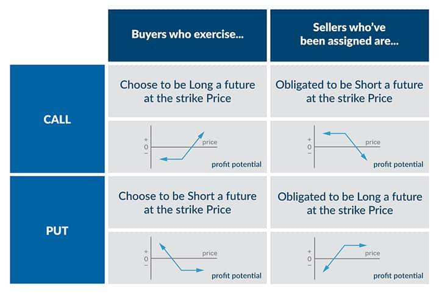

## Table of Contents

## What is a put option?

A put option is a type of financial contract that gives the buyer the right, but not the obligation, to sell a specific asset at a set price within a certain time period. The asset could be stocks, bonds, commodities, or currencies. The set price is called the strike price, and the time period is known as the expiration date. If the market price of the asset falls below the strike price before the expiration date, the buyer can use the put option to sell the asset at the higher strike price, making a profit.

Put options are often used by investors as a way to protect against potential losses in their investment portfolios. For example, if an investor owns a stock and is worried that its price might drop, they can buy a put option on that stock. If the stock price does fall, the put option allows them to sell the stock at the strike price, limiting their losses. On the other hand, if the stock price stays the same or goes up, the investor can simply let the put option expire worthless, and their only cost would be the price they paid for the option, known as the premium.

## How does exercising a put option work?

Exercising a put option means you are using your right to sell the asset at the agreed strike price. When you decide to exercise the option, you tell your broker that you want to sell the asset. This usually happens when the market price of the asset is lower than the strike price. By exercising the put option, you can sell the asset for more than its current market value, which means you make a profit.

For example, imagine you bought a put option for a stock with a strike price of $50. If the stock's market price drops to $40, you can exercise your put option. You will sell the stock for $50 even though it's only worth $40 on the market. Your profit would be the difference between the strike price and the market price, minus the cost of the put option itself, which is called the premium. If you paid a $5 premium for the put option, your net profit would be $50 - $40 - $5 = $5.

## What are the basic requirements to exercise a put option?

To exercise a put option, you need to own the option and the option must still be valid. This means the expiration date of the option hasn't passed yet. You also need to have the asset that the option is for, or be able to get it quickly. This is because exercising the option means you are selling the asset.

When you decide to exercise the put option, you tell your broker. They will handle the process of selling the asset at the strike price. You can only do this if the market price of the asset is lower than the strike price. If it's not, you wouldn't make any money by exercising the option.

## What are the financial implications of exercising a put option?

When you exercise a put option, you sell the asset at the strike price. If the market price is lower than the strike price, you make money. The profit is the difference between the strike price and the market price, minus the cost you paid for the put option, which is called the premium. For example, if you bought a put option with a strike price of $50, and the market price is $40, you can sell the asset for $50. If you paid $5 for the put option, your profit would be $50 - $40 - $5 = $5.

However, exercising a put option also has costs. You need to have the asset to sell it, or you need to buy it quickly. There might be fees for exercising the option and selling the asset. If the market price is higher than the strike price, you would lose money by exercising the option. You would be selling the asset for less than it's worth. In this case, it's better to just let the option expire and only lose the premium you paid for it.

## When is the best time to exercise a put option?

The best time to exercise a put option is when the market price of the asset is lower than the strike price. This way, you can sell the asset for more than it's worth right now. For example, if your put option has a strike price of $50 and the market price is $40, you can make money by exercising the option. You sell the asset for $50 even though it's only worth $40, so you make a profit.

However, you should also think about the cost of the put option, called the premium. If you paid a lot for the option, it might not be worth exercising it if the profit you make is less than the premium. Also, consider any fees you might have to pay for exercising the option and selling the asset. Sometimes, it's better to sell the put option itself on the market if its value has gone up, instead of exercising it.

## What are the differences between American and European put options in terms of exercising?

American and European put options differ mainly in when you can exercise them. An American put option lets you exercise the option any time before it expires. This means if the market price drops below the strike price at any point, you can use the option to sell the asset at the higher strike price.

On the other hand, a European put option can only be exercised on the expiration date. You have to wait until the end of the option's term to decide if you want to sell the asset at the strike price. This can be less flexible, but it also means you have to be more certain about the market price on that specific date.

## How does the strike price affect the decision to exercise a put option?

The strike price is really important when you're thinking about using a put option. It's the price you can sell the asset for if you decide to use the option. If the market price of the asset is lower than the strike price, you can make money by selling it at the higher strike price. For example, if your put option has a strike price of $50 and the market price is $40, you can sell the asset for $50 and make a profit.

But if the market price is higher than the strike price, it doesn't make sense to exercise the put option. You would be selling the asset for less than it's worth, which means you'd lose money. So, the strike price helps you decide if it's a good time to use the put option or if you should just let it expire and only lose the cost of the option, which is called the premium.

## What are the tax implications of exercising a put option?

When you exercise a put option, it can affect your taxes. If you make money from exercising the put option, that profit is usually considered a capital gain. In the United States, how much tax you pay on that gain depends on how long you held the asset before selling it. If you held it for less than a year, it's a short-term capital gain, and you'll pay your regular income tax rate on it. If you held it for more than a year, it's a long-term capital gain, and you'll pay a lower tax rate, usually between 0% and 20%.

If you lose money when you exercise a put option, you can use that loss to reduce your taxes. This is called a capital loss. You can use capital losses to offset any capital gains you have in the same year. If your losses are more than your gains, you can use up to $3,000 of that loss to reduce your other income. If you still have more losses after that, you can [carry](/wiki/carry-trading) them over to future years to use against future gains or income.

## How can exercising a put option be used as part of a broader investment strategy?

Exercising a put option can be a useful part of a bigger plan for your investments. One way people use put options is to protect their investments from losing too much value. Imagine you own a stock and you're worried its price might go down. You can buy a put option for that stock. If the stock price does drop, you can use the put option to sell the stock at a higher price than it's worth right now. This helps you lose less money than you would if you just sold the stock at its lower market price. It's like having insurance for your investments.

Another way to use put options in your investment strategy is to make money when you think a stock's price will go down. If you believe a stock is going to drop in value, you can buy a put option for that stock. If the price does go down below the strike price, you can exercise the option and sell the stock at the higher strike price, making a profit. This is a way to bet against a stock, which can be useful if you think the market is going to go down. By using put options smartly, you can protect your investments and also find new ways to make money.

## What are the risks associated with exercising a put option?

Exercising a put option can be risky. One big risk is that you might lose money if the market price of the asset is higher than the strike price when you exercise the option. If this happens, you'll be selling the asset for less than it's worth, which means you'll lose money. Another risk is that you have to pay for the put option itself, which is called the premium. If the market price doesn't drop below the strike price before the option expires, you'll lose the money you paid for the option.

There are also other costs and risks to think about. You might have to pay fees to exercise the option and sell the asset. These fees can eat into any profit you make. Also, if you don't already own the asset, you'll need to buy it quickly to exercise the option, which can add to your costs. Finally, taxes can be a risk too. If you make money from exercising the put option, you'll have to pay taxes on that profit, which can reduce how much money you actually keep.

## How do market conditions influence the decision to exercise a put option?

Market conditions are really important when you're thinking about using a put option. If the market is going down and the price of the asset you have a put option for is lower than the strike price, it's a good time to use the option. You can sell the asset for more than it's worth right now, which means you make money. But if the market is going up and the asset's price is higher than the strike price, it doesn't make sense to use the option. You would lose money because you're selling the asset for less than it's worth.

Also, you need to think about how fast the market is changing. If you think the price of the asset might keep going down, you might want to wait a bit before using the option. This way, you could make more money. But if you think the price might go back up soon, it's better to use the option quickly. You also need to keep an eye on any big news or events that could change the market. Things like company earnings reports or changes in the economy can make the price of the asset go up or down a lot, which can affect your decision to use the put option.

## What advanced strategies involve exercising put options, such as in combination with other options or financial instruments?

One advanced strategy involving put options is called a protective put. This is when you own a stock and buy a put option for that stock to protect against a drop in its price. If the stock's price goes down, you can use the put option to sell the stock at the higher strike price, which limits your losses. This is like having insurance for your stock. It can be a good way to keep your investment safe if you think the market might go down but you still want to keep your stock.

Another strategy is called a put spread. This is when you buy a put option with a higher strike price and sell another put option with a lower strike price. If the stock's price goes down but stays between the two strike prices, you can make money from the difference. This can be a way to bet on a smaller drop in the stock's price while spending less money than you would if you just bought a single put option. It's a bit more complicated, but it can help you manage your risk and costs.

A third strategy is using put options as part of a straddle. In a straddle, you buy both a call option and a put option for the same stock at the same strike price and expiration date. This strategy is useful if you think the stock's price will move a lot but you're not sure which way. If the stock's price goes down a lot, you can use the put option to make money. If it goes up a lot, you can use the call option. This can be a good way to make money from big moves in the market, no matter which direction they go.

## What are Put Options and How Do They Work?

A put option is a financial derivative that grants the holder the right, but not the obligation, to sell a specified quantity of an underlying asset at a predetermined price, known as the strike price, within a set period. This instrument is pivotal for investors seeking to hedge against potential declines in asset prices or to speculate on downward movements. The buyer of a put option pays a premium to acquire this right, while the seller, known as the writer, assumes the obligation to purchase the asset if the option is exercised.

Put options function through an agreement between the buyer and the writer. The buyer has the right to sell, while the writer is obligated to buy the asset should the option be exercised before expiration. The payoff for the holder of a put option can be described mathematically as:

$$
\text{Payoff} = \max(0, X - S) - P
$$

where:
- $X$ is the strike price,
- $S$ is the asset price at expiration,
- $P$ is the premium paid for the option.

In contrast, call options provide the holder with the right to buy the underlying asset at a specified strike price. While put options are employed to hedge against or profit from declines in asset prices, call options are utilized to speculate on or protect against rising prices.

Consider a practical example: an investor purchases a put option for a stock with a strike price of $50, expiring in one month, paying a premium of $2 per share. If the stock's price falls to $40 before expiration, the investor can exercise the option to sell the stock at $50, securing a profit of $8 per share ($10 gain from the price difference minus the $2 premium). Conversely, if the stock remains above $50, the investor may choose not to exercise the option, limiting the loss to the paid premium. Through such transactions, put options offer a strategic approach to managing risk and maximizing potential returns in financial markets.

## What are the Mechanics of Selling Put Options?

Selling put options is a strategy in options trading where the seller (or writer) agrees to purchase the underlying asset at the strike price if the option is exercised by the buyer before expiration. This strategy serves primarily as an income-generating activity, usually adopted when the seller has a neutral to bullish outlook on the underlying asset.

### Process and Strategy of Selling Put Options

The selling of put options begins with the writer agreeing to the potential obligation to buy the underlying asset at the strike price. For taking this risk, the writer receives a premium from the option buyer upfront. The key components in this process are:

- **Strike Price**: The price at which the option writer must buy the asset if the option is exercised.
- **Expiration Date**: The last date on which the option can be exercised.
- **Premium Received**: The initial income obtained for selling the put option, which serves as the maximum profit potential for the seller if the option expires worthless.

The primary objective for the put seller is for the option to expire worthless, whereby the seller keeps the entire premium as profit. This typically occurs if the market price of the underlying asset is above the strike price at expiration.

### Risks and Rewards of Selling Put Options

**Rewards**:
1. **Premium Income**: The most direct reward is earning the option premium, providing immediate income.
2. **Potential to Purchase at a Discount**: If exercised, the seller buys the asset at the strike price. If they had intended to purchase the asset anyways, this could be at a discount compared to current market values minus the premium received.

**Risks**:
1. **Obligation to Purchase**: The primary risk is the requirement to buy the asset at the strike price, even if the market price falls significantly below it.
2. **Unlimited Loss Potential**: In theory, the potential loss is substantial if the asset price plummets to zero, though it is capped by the strike price less the premium received.

### Scenarios and Market Conditions Conducive to Selling Puts

Selling put options is best suited for scenarios where the seller expects the underlying asset to maintain its value or increase. Conditions favorable for selling puts include:

- **Bullish Market Outlook**: Expectation of rising or stable prices increases the likelihood of the put option expiring worthless.
- **Low Volatility**: In less volatile conditions, significant price drops are less likely, hence reducing the risk associated with selling puts.
- **High Market Premium**: During times of high option premiums, sellers receive better compensation for the risk they undertake.

### Real-world Examples with Potential Profit and Loss Outcomes

Consider a scenario where an investor sells a 100-strike put option on a stock and receives a $5 premium per share. They have effectively committed to buying the stock at $100 if the option is exercised.

- **Profit Outcome**: If the stock price stays above $100 until expiration, the put expires worthless, and the investor retains the entire premium, reflecting the maximum profit: 
$$
  \text{Profit} = \text{Premium Received} = \$5 \times \text{number of contracts} \times 100

$$

- **Break-even Point**: The break-even point, where the seller neither gains nor loses money, occurs when the stock price equals the strike price minus the premium:
$$
  \text{Break-even Price} = \$100 - \$5 = \$95

$$

- **Loss Outcome**: If the stock price falls to $90, the seller incurs a loss because they must buy the stock at $100, yet they receive only the current market value of $90:
$$
  \text{Net Loss} = (\text{Strike Price} - \text{Market Price} + \text{Premium}) \times \text{number of contracts} \times 100 = (\$100 - \$90 + \$5) \times 100 = -\$500

$$

Comprehending these processes, risks, and optimal conditions aids traders in implementing strategies that maximize returns while managing potential downsides when selling put options.

## References & Further Reading

[1]: Hull, J. C. (2018). ["Options, Futures, and Other Derivatives"](https://www.semanticscholar.org/paper/Options%2C-Futures%2C-and-Other-Derivatives-Hull/89bdee500c8623864fc9eb7a471546aa713acc44). Pearson.

[2]: McMillan, L. G. (2012). ["Options as a Strategic Investment"](https://archive.org/details/optionsasstrateg0000mcmi). Penguin.

[3]: Chan, E. P. (2013). ["Algorithmic Trading: Winning Strategies and Their Rationale"](https://github.com/ftvision/quant_trading_echan_book). Wiley.

[4]: Narang, R. K. (2013). ["Inside the Black Box: A Simple Guide to Quantitative and High-Frequency Trading"](https://onlinelibrary.wiley.com/doi/book/10.1002/9781118662717). Wiley.

[5]: Lopez de Prado, M. (2018). ["Advances in Financial Machine Learning"](https://books.google.com/books/about/Advances_in_Financial_Machine_Learning.html?id=oU9KDwAAQBAJ). Wiley.

[6]: Wilmott, P. (2006). ["Paul Wilmott Introduces Quantitative Finance"](https://www.amazon.com/Paul-Wilmott-Introduces-Quantitative-Finance/dp/0470319585). Wiley.

[7]: Haug, E. G. (2007). ["The Complete Guide to Option Pricing Formulas"](https://books.google.com/books/about/The_Complete_Guide_to_Option_Pricing_For.html?id=cSRMtQAACAAJ). McGraw-Hill.

[8]: Black, F., & Scholes, M. (1973). ["The Pricing of Options and Corporate Liabilities"](https://www.cs.princeton.edu/courses/archive/fall09/cos323/papers/black_scholes73.pdf). Journal of Political Economy, 81(3), 637-654.