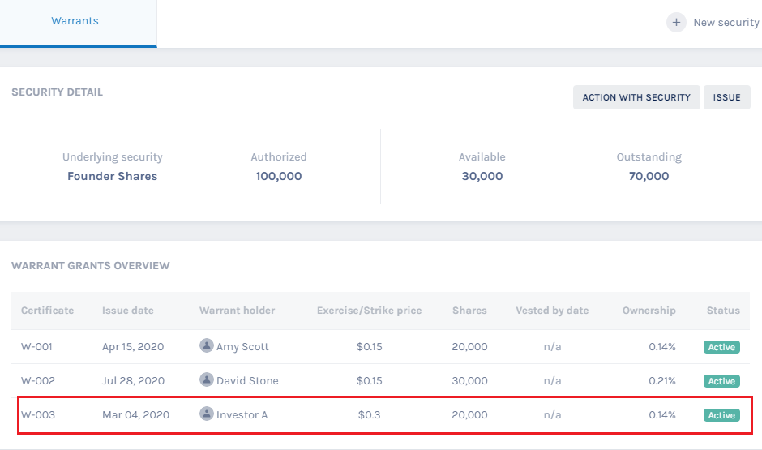

## Table of Contents

## What are stock warrants and how do they differ from stock options?

Stock warrants are a type of financial instrument that gives the holder the right to buy a company's stock at a specific price before a certain date. They are often issued by the company itself and can be attached to bonds or preferred stock as an extra incentive for investors. When you exercise a warrant, you are essentially buying the stock at the predetermined price, which can be beneficial if the market price of the stock is higher than the warrant's exercise price.

Stock options, on the other hand, are similar but are typically issued by individuals or institutions rather than the company. Options give the holder the right, but not the obligation, to buy or sell a stock at a set price within a specific time frame. The key difference is that options can be used to either buy (call option) or sell (put option) the stock, whereas warrants are usually only for buying the stock. Additionally, options are more commonly traded on public exchanges, making them more liquid than warrants, which are often less traded and can be harder to sell before they expire.

## How does one acquire stock warrants?

People can get stock warrants in a few ways. One common way is when a company issues new bonds or preferred stocks and includes warrants as a bonus. This makes the bonds or stocks more attractive to buyers. Investors who buy these securities get the warrants as part of the deal. Another way to get warrants is by buying them directly from other investors on the market, though this is less common because fewer people trade warrants compared to stocks or options.

Sometimes, a company might give out warrants to its existing shareholders as a way to raise more money or to reward them. This is called a rights offering. Shareholders can then decide to exercise these warrants to buy more stock at a set price, or they can sell the warrants to someone else. Overall, getting stock warrants usually involves either buying new securities from the company or trading with other investors, but the opportunities to do so are not as frequent as with regular stocks or options.

## What are the basic terms and conditions typically associated with stock warrants?

Stock warrants come with certain terms and conditions that you need to know. One key term is the exercise price, which is the price you pay to buy the stock if you decide to use the warrant. This price is set when the warrant is issued and usually stays the same until the warrant expires. Another important term is the expiration date, which is the last day you can use the warrant to buy the stock. If you don't use the warrant by this date, it becomes worthless.

There are also other conditions to consider. Some warrants might have a cashless exercise feature, which lets you use the warrant without paying the full exercise price in cash. Instead, you get fewer shares based on the difference between the stock's current market price and the exercise price. Additionally, some companies might have rules about when you can exercise the warrant, like waiting periods before you can use it. Understanding these terms and conditions helps you decide if using the warrant is a good idea for you.

## What is the process of exercising stock warrants?

When you decide to exercise your stock warrants, you are choosing to buy the company's stock at the set exercise price. First, you need to check if you can exercise the warrant right away or if there's a waiting period. If you can, you'll need to contact the company or the broker handling the warrants. You'll tell them you want to exercise your warrants and how many you want to use. They will then tell you how much money you need to pay, which is the exercise price times the number of warrants you're exercising.

Once you've paid the money, the company will give you the shares of stock. The number of shares you get depends on the terms of the warrant. Sometimes, you might be able to use a cashless exercise if that's an option. This means you don't pay the full exercise price in cash. Instead, you get fewer shares based on the difference between the stock's current market price and the exercise price. After you get your shares, you can keep them or sell them, just like any other stock you own.

## What are the costs involved in exercising stock warrants?

When you exercise stock warrants, the main cost you'll face is the exercise price. This is the price you agreed to pay for each share of stock when you got the warrant. If you have 100 warrants and the exercise price is $10 per share, you'll need to pay $1,000 to exercise all of them. This money goes to the company, and in return, you get the shares of stock.

There might be other costs too, depending on how you exercise the warrants. If you use a broker, they might charge you a fee for handling the transaction. Also, if you choose a cashless exercise, you won't pay the full exercise price in cash, but you'll get fewer shares. This can be a way to save money upfront, but it means you end up with less stock. Always check the specific terms of your warrants and any fees from your broker to understand all the costs involved.

## How does the timing of exercising stock warrants affect their value?

The timing of when you exercise your stock warrants can make a big difference in how much they are worth to you. If you exercise your warrants when the stock's market price is higher than the exercise price, you can buy the stock at a lower price and then sell it at the higher market price. This means you make a profit. But if you wait too long and the stock's price goes down below the exercise price, exercising the warrant won't be worth it because you would be buying the stock at a higher price than it's worth in the market.

Also, you need to keep an eye on the expiration date of the warrants. If you wait until the last minute to exercise them and the stock price is not high enough, you might miss out on making any money at all. The warrants will expire and become worthless. So, it's important to think about both the current stock price and how much time you have left before the warrants expire when deciding when to exercise them.

## What are the tax implications of exercising stock warrants?

When you exercise stock warrants, you need to think about taxes. If you buy the stock at the exercise price and then sell it later, you might have to pay capital gains tax. The tax depends on how long you held the stock after exercising the warrant. If you sell the stock within a year, it's a short-term capital gain, and you'll pay tax at your regular income tax rate. But if you hold the stock for more than a year before selling, it's a long-term capital gain, and the tax rate is usually lower.

There's another thing to consider: the difference between the exercise price and the market price of the stock when you exercise the warrant. This difference might be seen as income by the tax authorities, and you might have to pay income tax on it right away. It's a good idea to talk to a tax advisor to understand all the tax rules and how they apply to your situation, because tax laws can change and be different in different places.

## Can stock warrants be sold or transferred before exercising, and what are the implications?

Yes, you can sell or transfer stock warrants before you exercise them. This means you can trade them to someone else if they are willing to buy them from you. Sometimes, people do this if they think the stock's price will go up and they want to make money from the increase in the warrant's value without actually buying the stock.

When you sell or transfer a warrant, you need to think about a few things. First, the value of the warrant can go up or down based on the stock's price, so you might make money or lose money depending on when you sell it. Also, if you sell the warrant, you won't be able to buy the stock at the exercise price anymore, so you give up the chance to buy the stock at that price. It's important to understand these points before deciding to sell or transfer your warrants.

## How do market conditions influence the decision to exercise stock warrants?

Market conditions play a big role in deciding when to exercise stock warrants. If the stock's price in the market is higher than the exercise price of your warrant, it might be a good time to exercise it. This way, you can buy the stock at a lower price and then sell it at the higher market price, making a profit. But if the stock's price is lower than the exercise price, it doesn't make sense to exercise the warrant because you would be buying the stock for more than it's worth in the market.

You also need to think about what's happening in the market overall. If the market is doing well and the stock's price is going up, you might want to exercise your warrant sooner to take advantage of the rising prices. But if the market is going down or seems risky, you might decide to wait and see if the stock's price goes up later. It's all about timing and trying to make the best decision based on what's happening around you.

## What strategies can be used to maximize the benefits of exercising stock warrants?

One strategy to maximize the benefits of exercising stock warrants is to keep an eye on the stock's market price. If the stock's price is higher than the exercise price, you can buy the stock at a lower price and then sell it at the higher market price to make a profit. It's also important to think about the overall market conditions. If the market is doing well and the stock's price is going up, you might want to exercise your warrant sooner to take advantage of the rising prices. But if the market seems risky or is going down, it might be better to wait and see if the stock's price goes up later.

Another strategy is to consider using a cashless exercise if it's an option. This means you don't have to pay the full exercise price in cash. Instead, you get fewer shares based on the difference between the stock's current market price and the exercise price. This can be a good way to save money upfront, but remember you'll end up with less stock. Also, don't forget about the expiration date of the warrants. If you wait too long and the stock's price isn't high enough, the warrants will expire and become worthless. So, timing is key, and you should always be aware of how much time you have left before deciding to exercise your warrants.

## How do dilution effects impact the value of stock warrants upon exercising?

When you exercise stock warrants, you're buying new shares of the company's stock. This can lead to something called dilution. Dilution happens because the total number of shares goes up, which means each share is worth a smaller piece of the company. If a lot of people exercise their warrants at the same time, it can lower the value of the stock because there are more shares out there. This might make the stock's price go down, which can affect how much money you make from exercising your warrants.

But it's not always bad. If the company is doing well and growing, the increase in the number of shares might not hurt the stock's price too much. Sometimes, the market might even see the exercise of warrants as a good sign because it shows people believe in the company's future. So, while dilution can lower the value of each share, the overall impact on the value of your warrants depends on how the company is doing and what the market thinks about it.

## What are the advanced considerations for exercising stock warrants in mergers and acquisitions?

When a company is involved in a merger or acquisition, exercising stock warrants can get more complicated. If the company you have warrants for is being bought out, the terms of your warrants might change. The new company might offer to exchange your warrants for new ones, or they might let you exercise them before the deal goes through. It's important to read the details of the merger or acquisition to understand how it affects your warrants. If the stock price is expected to go up because of the deal, it might be a good time to exercise your warrants to get the stock at the lower exercise price before the price jumps.

Another thing to think about is how the merger or acquisition might change the value of the company. If the deal makes the company more valuable, your warrants could be worth more. But if the deal doesn't go well, or if it takes a long time, the value of your warrants might go down. You need to think about the timing of the merger or acquisition and how it fits with the expiration date of your warrants. If the deal is taking too long and your warrants are about to expire, you might have to decide whether to exercise them early or risk losing them. Talking to a financial advisor can help you make the best decision based on all these factors.

## How do you exercise stock warrants?

Exercising a stock warrant is a critical process that allows an investor to purchase the underlying shares at the predetermined strike price specified within the warrant agreement. When the current market price of the stock surpasses the strike price, exercising the warrant can result in a profit. This is because the investor acquires the shares at a lower price and can potentially sell them at the prevailing higher market price.

To exercise a warrant, one typically involves a broker who facilitates the process. The broker handles the necessary paperwork and liaises with the issuing company to ensure a smooth transaction. This process often includes submitting an exercise notice and paying the total cost of the shares, which is the strike price multiplied by the number of shares covered by the warrant.

It is essential for investors to comprehend the ratio and conversion terms associated with the warrant to optimize the exercise process. Warrants may have specified conditions such as a conversion ratio, which determines the number of shares one can purchase with a single warrant. For instance, if a warrant has a conversion ratio of 1:4, it means that one warrant entitles the holder to buy four shares of the underlying stock.

Moreover, the timing of when to exercise warrants is a strategic decision that can impact potential profits. Investors must assess factors such as market trends, the remaining time to expiration, and expected future stock performance. Calculating the intrinsic value of the warrant, which is the difference between the current stock price and the strike price, can aid in determining the feasibility of exercising at a given time:

$$
\text{Intrinsic Value} = \text{Current Stock Price} - \text{Strike Price}
$$

If the intrinsic value is positive, the warrant is "in the money," and exercising may be advantageous. Conversely, if the current stock price is below the strike price, the warrant is "out of the money," and it might be judicious to wait.

By understanding the mathematical and strategic aspects of exercising warrants, investors can make informed decisions to maximize their returns and manage associated risks effectively.

## References & Further Reading

[1]: ["The Art of Company Valuation and Financial Statement Analysis: A Value Investor's Guide with Real-life Case Studies"](https://onlinelibrary.wiley.com/doi/book/10.1002/9781119208020) by Nicolas Schmidlin

[2]: ["Options, Futures, and Other Derivatives"](https://www.amazon.com/Options-Futures-Other-Derivatives-10th/dp/013447208X) by John C. Hull

[3]: ["The Handbook of Fixed Income Securities"](https://www.amazon.com/Handbook-Fixed-Income-Securities-Ninth/dp/1260473899) edited by Frank J. Fabozzi

[4]: ["Warrant Valuation in Hong Kong's Equity Markets"](https://www.warrants.com.hk/en/education/warrant-tutorial) by Chang, Shun Wing, University of Hong Kong

[5]: Wong, P.L., Chan, K.C., & Fok, R.C.W. (1992). ["Warrant Pricing: A Review of Empirical Research."](https://pubmed.ncbi.nlm.nih.gov/17501956/) The Journal of Finance.

[6]: Thorp, E.O. (2001). ["The Mathematics of Gambling and Investment."](https://stanfordesp.org/download/65775547-2727-47e9-b302-b98b160f26a1/M3665_MathGambing_talk.pdf) Available at: Star City Games

[7]: De Beer, J. (1990). ["Stock Options and Warrants: A Primer."](https://www.sofi.com/learn/content/warrants-vs-options/) Law and Contemporary Problems, Duke University School of Law.

[8]: ["Algorithmic Trading: Winning Strategies and Their Rationale"](https://www.wiley.com/en-us/Algorithmic+Trading%3A+Winning+Strategies+and+Their+Rationale-p-9781118460146) by Ernie Chan