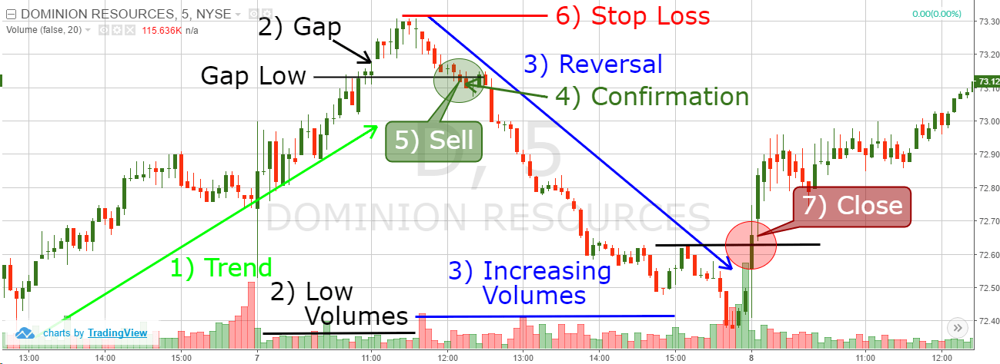

## Table of Contents

## What is an exhaustion gap in technical analysis?

An exhaustion gap in technical analysis is a type of gap that happens at the end of a strong price trend. It shows that the market might be running out of steam. Imagine a stock price going up really fast for a while. Then, suddenly, it jumps up even more, but this jump might be the last big move before the price starts to fall. This big jump is the exhaustion gap. It means that everyone who wanted to buy the stock has already bought it, and there's not much interest left to keep pushing the price higher.

You can spot an exhaustion gap by looking at the trading volume too. Usually, the volume is very high when the gap happens. After the gap, the price might try to go a bit higher, but it won't last long. Soon, the price starts to drop, and it might even fill the gap by coming back down to the price level before the gap happened. Traders watch for exhaustion gaps because they can signal a good time to sell if you think the price will go down after the gap.

## How does an exhaustion gap differ from other types of gaps?

An exhaustion gap is different from other types of gaps because it shows up at the end of a big price move, either up or down. It's like the last burst of energy before the price gets tired and starts to go the other way. Other gaps, like breakaway gaps, happen at the start of a new trend, showing that the price is breaking away from its old range and starting something new. Then there are runaway gaps, which happen in the middle of a trend, showing that the trend is strong and likely to keep going.

Exhaustion gaps also stand out because of what happens after they appear. After an exhaustion gap, the price usually can't keep going in the same direction for long. It might try to go a bit further, but then it starts to come back and often fills the gap, meaning it goes back to the price level before the gap happened. With breakaway and runaway gaps, the price usually keeps going in the same direction for a while longer. So, while other gaps might mean the trend is just getting started or is still going strong, an exhaustion gap warns that the trend might be about to end.

## What causes an exhaustion gap to occur in the market?

An exhaustion gap happens when a lot of people want to buy or sell a stock at the same time, usually after the price has been going up or down a lot. Imagine a stock's price has been going up for a while. People see this and think, "I better buy now before it goes up even more!" So, they all rush to buy at the same time, making the price jump up suddenly. This big jump is the exhaustion gap. It shows that everyone who wanted to buy has bought, and there's not much interest left to keep pushing the price higher.

After the exhaustion gap, the price might try to go a bit higher, but it won't last long. Soon, people start to think the price has gone up too much and start selling. This makes the price start to go down, and it might even go back to the price it was at before the gap happened. This is different from other gaps, like when a new trend starts or when a trend is still going strong. An exhaustion gap is like a warning sign that the big move might be over, and the price could start going the other way soon.

## Can you explain the significance of an exhaustion gap in trading?

An exhaustion gap is a big deal for traders because it can tell them that a price trend might be about to end. Imagine you're watching a stock's price go up and up for a while. Then, suddenly, it jumps up even more. This big jump is the exhaustion gap. It means that everyone who wanted to buy the stock has already bought it, and there's not much interest left to keep pushing the price higher. Traders see this and think, "Oh, the price might start going down soon." So, it's a signal for them to maybe sell their stocks before the price drops.

After an exhaustion gap, the price might try to go a bit higher, but it won't last long. Soon, people start selling, and the price starts to go down. It might even go back to the price it was at before the gap happened. This is why traders pay attention to exhaustion gaps. They use them to make decisions about when to sell their stocks to avoid losing money when the price goes down. By watching for these gaps and understanding what they mean, traders can be better prepared for what might happen next in the market.

## How can traders identify an exhaustion gap on a price chart?

Traders can spot an exhaustion gap on a price chart by looking for a big jump in the price at the end of a strong trend. Imagine a stock's price has been going up for a while, and then suddenly it jumps up even more. This jump is the exhaustion gap. It happens when everyone who wanted to buy the stock has already bought it, and there's not much interest left to keep pushing the price higher. You'll see this gap as a big space between the closing price of one day and the opening price of the next day.

To make sure it's really an exhaustion gap, traders also look at the trading [volume](/wiki/volume-trading-strategy). When the gap happens, the volume is usually very high. This shows that a lot of people were buying or selling at the same time. After the gap, the price might try to go a bit higher, but it won't last long. Soon, the price starts to drop and might even go back to the price level before the gap happened. By watching for these signs, traders can use exhaustion gaps to decide when it might be a good time to sell their stocks before the price goes down.

## What are the typical characteristics of an exhaustion gap?

An exhaustion gap is a big jump in a stock's price that happens at the end of a strong trend. Imagine a stock's price has been going up for a while, and then suddenly it jumps up even more. This jump is the exhaustion gap. It shows that everyone who wanted to buy the stock has already bought it, and there's not much interest left to keep pushing the price higher. You can see this gap on a price chart as a big space between the closing price of one day and the opening price of the next day.

To make sure it's really an exhaustion gap, traders also look at the trading volume. When the gap happens, the volume is usually very high. This means a lot of people were buying or selling at the same time. After the gap, the price might try to go a bit higher, but it won't last long. Soon, the price starts to drop and might even go back to the price level before the gap happened. By watching for these signs, traders can use exhaustion gaps to decide when it might be a good time to sell their stocks before the price goes down.

## What is the best way to confirm an exhaustion gap?

To confirm an exhaustion gap, you need to look at a few things. First, check if the gap happens at the end of a big price move. If a stock's price has been going up or down a lot and then suddenly jumps even more, that's a sign of an exhaustion gap. This jump should be big enough to stand out on the price chart as a clear space between the closing price of one day and the opening price of the next day.

Next, look at the trading volume when the gap happens. If the volume is very high, it means a lot of people were buying or selling at the same time, which supports the idea that it's an exhaustion gap. After the gap, watch what the price does. If it tries to go a bit higher but then starts to drop and might even go back to the price level before the gap, that's another sign that you've spotted an exhaustion gap. By checking these things, you can be more sure that the gap you see is really an exhaustion gap.

## How should traders react to an exhaustion gap in their trading strategy?

When traders see an exhaustion gap, they should think about selling their stocks. An exhaustion gap happens at the end of a big price move, like when a stock's price has been going up a lot and then suddenly jumps even more. This jump means that everyone who wanted to buy has already bought, and there's not much interest left to keep pushing the price higher. So, it's a warning sign that the price might start going down soon. By selling after seeing an exhaustion gap, traders can avoid losing money when the price drops.

After spotting an exhaustion gap, traders should also watch the price closely. Sometimes, the price might try to go a bit higher after the gap, but it won't last long. If the price starts to drop and goes back to the level it was at before the gap, that's a good sign that the exhaustion gap was real. Traders can use this information to decide when to sell their stocks. By paying attention to these signs, traders can make better choices and protect their investments.

## What are the potential risks of trading based on an exhaustion gap?

Trading based on an exhaustion gap can be risky because sometimes the gap might not mean what you think it does. Just because you see a big jump in the price at the end of a trend doesn't always mean the price will go down right away. Sometimes, the price might keep going up for a bit longer, and if you sell too soon, you could miss out on more gains. Also, if you're not sure about the gap and you sell your stocks, you might end up selling at a lower price than if you had waited a bit longer.

Another risk is that the market can be unpredictable. Even if you see all the signs of an exhaustion gap, like high trading volume and the price starting to drop, things can still change. The price might go back up instead of down, and if you've sold your stocks, you won't be able to take advantage of that. So, it's important to be careful and not rely only on one sign like an exhaustion gap. Always look at other things too, like what's happening in the market overall, to make the best decisions.

## Can you provide historical examples of exhaustion gaps in well-known stocks?

In 2000, the stock of Qualcomm (QCOM) showed a clear exhaustion gap. Qualcomm's price had been going up a lot during the tech boom. Then, on December 15, 2000, the stock jumped from about $90 to over $100 in one day. This big jump was the exhaustion gap. After that, the price tried to go a bit higher but then started to drop. By the end of January 2001, the stock had fallen back to around $70, showing that the exhaustion gap was a sign that the big upward move was over.

Another example happened with Tesla (TSLA) in 2020. Tesla's stock price had been going up a lot during the year. On August 31, 2020, the stock price jumped from about $498 to over $500 in one day, creating an exhaustion gap. The trading volume was very high that day, which is a sign of an exhaustion gap. After the gap, the price went up a bit more but then started to fall. By mid-September, the stock had dropped back to around $330, showing that the exhaustion gap was a warning that the big upward move was about to end.

## How does volume play a role in validating an exhaustion gap?

Volume is really important when you're trying to figure out if a gap in a stock's price is an exhaustion gap. An exhaustion gap happens when the price jumps a lot at the end of a big move up or down. When this jump happens, you should see a lot of people buying or selling the stock at the same time. That's what high volume means. If the volume is high when the gap happens, it's a good sign that it's really an exhaustion gap. It shows that everyone who wanted to buy or sell has already done it, and there's not much interest left to keep the price moving in the same direction.

After the gap, you can use volume to check if the exhaustion gap is real. If the price tries to go a bit higher but the volume starts to drop, it's another sign that the big move might be over. When the price starts to go down after the gap, you'll often see the volume go up again. This means people are selling the stock, and it's filling the gap by going back to the price it was at before the gap happened. By looking at the volume, you can be more sure that the gap you see is an exhaustion gap and not just a random jump in the price.

## What advanced techniques can traders use to predict and capitalize on exhaustion gaps?

Traders can use a few advanced techniques to predict and make money from exhaustion gaps. One way is to use technical indicators like the Relative Strength Index (RSI) or the Moving Average Convergence Divergence (MACD). These tools can help traders see when a stock's price is getting too high or too low, which might mean an exhaustion gap is coming. If the RSI is over 70, it means the stock might be overbought and ready for a big jump up followed by a drop. Traders can also look at the stock's price history to see if it has made big jumps before at the end of a trend. By studying these patterns, traders can guess when an exhaustion gap might happen next.

Another technique is to use options trading to take advantage of exhaustion gaps. If a trader thinks an exhaustion gap is coming, they can buy put options on the stock. A put option gives the trader the right to sell the stock at a certain price, which can be useful if the price drops after the gap. Traders can also use stop-loss orders to protect their money. A stop-loss order automatically sells the stock if the price goes down to a certain level, which can help traders avoid big losses if the price drops after an exhaustion gap. By combining these techniques, traders can be better prepared to predict and make money from exhaustion gaps.

## What are the key factors in understanding stock market trends?

Stock market trends represent the overarching trajectory of price movements within financial markets. These trends are categorized mainly into bullish, bearish, and sideways trends. The identification and understanding of these trends form the bedrock of technical analysis, a core component of market strategies for traders and investors.

Bullish trends are characterized by rising prices, generally indicating a favorable economic environment or positive investor sentiment. Conversely, bearish trends are marked by declining prices, often suggesting economic downturns or negative market sentiment. Sideways trends, in which prices move within a narrow range, reflect market uncertainty or indecision.

Recognizing these trends is paramount for technical analysis, which relies on historical price data to forecast future movements. This method involves using various tools and indicators, such as moving averages, trendlines, and oscillators, to discern patterns and trends. For example, a simple moving average (SMA) can help smooth out price data to identify the direction of trends:

$$
\text{SMA}_n = \frac{1}{n} \sum_{i=0}^{n-1} P_i
$$

where $P_i$ is the price at time $i$ and $n$ is the number of periods in the average.

Algorithmic trading leverages advanced computing algorithms to analyze large datasets and predict market trends with greater speed and accuracy than manual methods. These algorithms are programmed to execute trades based on pre-defined criteria, which can include trend signals generated from technical analysis. The automation involved in [algorithmic trading](/wiki/algorithmic-trading) allows for quick adaptation to changing market conditions, increasing the potential for capitalizing on emerging trends.

Technology plays a pivotal role in the identification and capitalization of stock market trends, affording traders an enhanced analytical capability through sophisticated software and platforms designed for data analysis. Tools such as [machine learning](/wiki/machine-learning) models and [artificial intelligence](/wiki/ai-artificial-intelligence) can process vast amounts of market data to identify patterns and predict future movements, giving traders an advantage in decision-making processes.

The interrelation between technical analysis and trend identification is crucial for trading success. Accurately identifying trends enables traders to align their strategies with the market's current direction, minimizing risks and maximizing potential returns. Moreover, integrating algorithmic trading with traditional technical analysis methods provides a comprehensive approach to trading that balances human judgment with technological precision.

In conclusion, understanding stock market trends is essential for effective trading and investment strategies. By utilizing technology-driven tools and combining them with traditional methods of technical analysis, traders can better navigate the complexities of market movements and optimize their trading outcomes. As financial markets become increasingly data-driven, the ability to interpret and respond to trends swiftly remains a key advantage for traders.

## References & Further Reading

[1]: Bergstra, J., Bardenet, R., Bengio, Y., & Kégl, B. (2011). ["Algorithms for Hyper-Parameter Optimization."](https://papers.nips.cc/paper/4443-algorithms-for-hyper-parameter-optimization) Advances in Neural Information Processing Systems 24.

[2]: ["Advances in Financial Machine Learning"](https://www.amazon.com/Advances-Financial-Machine-Learning-Marcos/dp/1119482089) by Marcos Lopez de Prado

[3]: ["Evidence-Based Technical Analysis: Applying the Scientific Method and Statistical Inference to Trading Signals"](https://www.amazon.com/Evidence-Based-Technical-Analysis-Scientific-Statistical/dp/0470008741) by David Aronson

[4]: ["Machine Learning for Algorithmic Trading"](https://github.com/stefan-jansen/machine-learning-for-trading) by Stefan Jansen

[5]: ["Quantitative Trading: How to Build Your Own Algorithmic Trading Business"](https://www.amazon.com/Quantitative-Trading-Build-Algorithmic-Business/dp/1119800064) by Ernest P. Chan