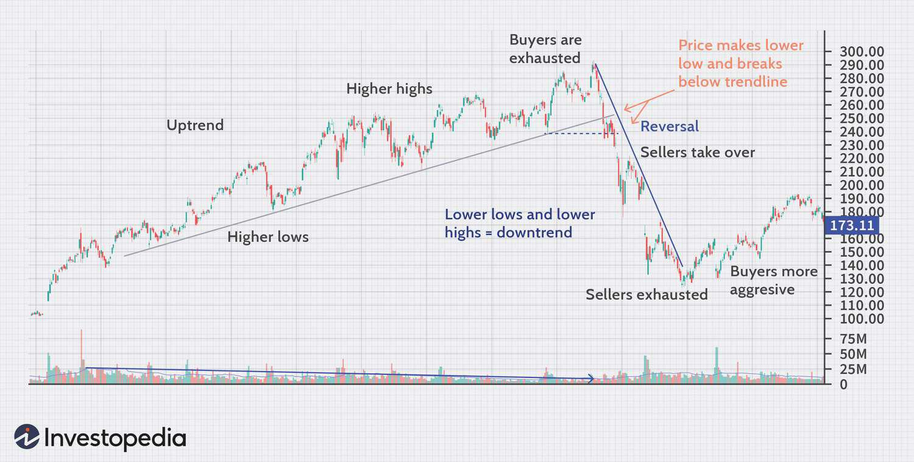

Understanding market indicators in stock trading is crucial for traders at every level of experience. This article discusses the concept of exhaustion in the stock market, the use of trading indicators, and the role of algorithmic trading in evaluating these indicators. Exhaustion, a state where market momentum runs out due to overbought or oversold conditions, often precedes trend reversals. Identifying these moments allows traders to make strategic decisions, optimizing buy and sell activities. Informed traders who comprehend and utilize these components are better equipped to refine their strategies and improve trading outcomes, whether they are new to the market or have significant experience.

## Table of Contents



## Understanding Exhaustion in Stock Trading

Exhaustion in stock trading is characterized by a situation where a dominant trend begins to wane as most traders have already established their positions in one direction. This situation results in a shortage of market participants willing to continue pushing the price in the same direction, potentially leading to a market shift or trend reversal. The concept is fundamentally tied to overbought and oversold market conditions, which can be recognized through various market signals and indicators.

When a market is overbought, it indicates that the buying pressure has been significantly higher than the selling pressure, often pushing the price to extreme highs. Conversely, an oversold market suggests the opposite scenario, where selling pressure has driven the price excessively low. Both conditions can hint at exhaustion as they reflect a saturation point in the market, where the existing trend is unsustainable without new participants entering to support it.

Recognizing exhaustion is vital for traders as it can serve as a precursor to significant market shifts. Identifying these shifts promptly allows traders to make strategic decisions regarding entries and exits, optimizing their trading effectiveness. These strategic decisions are often based on technical analysis and market indicators specifically designed to detect exhaustion. By understanding the saturation of buying or selling activity, traders can avoid the pitfalls of following a trend too late and instead position themselves advantageously for any potential reversals.

The ability to anticipate exhaustion is not only crucial for maximizing profits but also plays a significant role in risk management. By recognizing the signs of a market reaching an exhaustion point, traders are better equipped to manage their portfolios and protect against adverse market movements. This aspect of trading underscores the importance of continuous market analysis and the use of comprehensive tools to interpret and respond to market dynamics effectively.

## Key Traders' Indicators for Identifying Exhaustion

In stock trading, identifying potential exhaustion points is crucial for anticipating market reversals and adjusting trading strategies. Several technical indicators, including the Relative Strength Index (RSI), Moving Averages (MA), and the Volume-Weighted Average Price (VWAP), serve as vital tools for traders to recognize such signals.

The Relative Strength Index (RSI) is a [momentum](/wiki/momentum) oscillator that measures the speed and change of price movements. It operates on a scale from 0 to 100, with levels above 70 typically considered overbought and levels below 30 considered oversold. These thresholds are indicative of potential exhaustion points where a reversal could occur. The formula for the RSI is:

$$
RSI = 100 - \frac{100}{1 + RS}
$$

where $RS$ (Relative Strength) is the average of "up" closes divided by the average of "down" closes over a specified period. An understanding of RSI should enable traders to gauge the probability of a trend reversal effectively.

Moving Averages are critical in smoothing out price data to identify trends over a period. The Simple Moving Average (SMA) and the Exponential Moving Average (EMA) are widely used. The SMA is calculated by taking the arithmetic mean of a given set of prices over a specific number of days, while the EMA gives more weight to recent prices, making it more sensitive to new information. When prices move significantly away from the moving average, it can signal exhaustion. The general formula for SMA is:

$$
SMA = \frac{P_1 + P_2 + ... + P_n}{n}
$$

where $P_i$ is the price at a given day and $n$ is the number of days in consideration.

The Volume-Weighted Average Price (VWAP) provides an average price a security has traded at throughout the day, based on [volume](/wiki/volume-trading-strategy) and price. It represents a significant point of interest for exhaustion analysis as it highlights the collective trading activity’s value consensus. The VWAP is calculated as follows:

$$
VWAP = \frac{\sum (Price_i \times Volume_i)}{\sum Volume_i}
$$

where $Price_i$ is the typical price and $Volume_i$ is the volume for that interval. VWAP indicates possible exhaustion if the current price deviates significantly due to low trading volumes.

Each of these indicators offers a unique perspective by measuring different facets of market activity, from momentum and price trends to volume behavior. Mastery of these tools empowers traders to discern subtle cues of market saturation and make informed decisions, enhancing the effectiveness of trading strategies. By thoroughly understanding these indicators, traders can significantly improve their ability to predict market movements and align their trading actions accordingly.

## Algorithmic Trading: Enhancing Exhaustion Indicators

Algorithmic trading leverages advanced mathematical models to exploit patterns in stock market data, such as exhaustion indicators, which signal potential reversals. By automating the trading process, these systems can respond rapidly to market conditions, reducing the influence of human emotions that often lead to poor decision-making. The models operate by analyzing vast amounts of historical and real-time data to identify moments when the market is overbought or oversold. This identification primarily hinges on indicators such as the Relative Strength Index (RSI) or Moving Averages, where a breach of predefined thresholds may suggest that the trend is losing momentum and a reversal could be imminent.

Algorithmic systems are designed to execute trades with greater speed and accuracy compared to manual trading. By consistently applying pre-established rules, these systems can mitigate emotional biases. For instance, a trading algorithm might continuously monitor the RSI of stocks and trigger buy or sell signals when the index crosses specific levels, automating entry and [exit](/wiki/exit-strategy) points without the need for human intervention.

A standard [algorithmic trading](/wiki/algorithmic-trading) strategy might be implemented as follows in Python using a package like `pandas` to handle time-series data:

```python
import pandas as pd

def calculate_rsi(data, window=14):
    delta = data['Close'].diff()
    gain = (delta.where(delta > 0, 0)).rolling(window=window).mean()
    loss = (-delta.where(delta < 0, 0)).rolling(window=window).mean()
    rs = gain / loss
    rsi = 100 - (100 / (1 + rs))
    return rsi

def algorithmic_strategy(data):
    data['RSI'] = calculate_rsi(data)
    data['Signal'] = 0
    data.loc[data['RSI'] < 30, 'Signal'] = 1
    data.loc[data['RSI'] > 70, 'Signal'] = -1
    return data

# Example Usage
market_data = pd.read_csv('stock_data.csv')
signals = algorithmic_strategy(market_data)
```

In this script, the function `calculate_rsi` computes the Relative Strength Index over a specified window, aiding the strategy to detect exhaustion. A signal is generated where RSI values below 30 suggest oversold conditions and potential buy signals, whereas values above 70 indicate overbought conditions and possible sell signals.

The efficiency of algorithmic trading is further enhanced by high-frequency trading systems, which are capable of executing thousands of orders per second. This capability allows them to capitalize on minute price discrepancies before they are nullified by the natural adjustment processes of the market. The precision of these systems is critical for optimizing trading performance, especially when handling exhaustion signals that demand swift action to maximize potential returns.

In essence, algorithmic trading provides a disciplined and efficient way to respond to exhaustion indicators, offering a strategic edge by minimizing emotional interference and optimizing decision-making speed and accuracy. As market dynamics continually evolve, these systems can be adjusted and refined to maintain their effectiveness in identifying profitable trading opportunities.

## Volume Exhaustion in Algorithmic Trading

Volume exhaustion is a significant concept in algorithmic trading, focusing on the identification of volume peaks that may indicate potential reversals in market trends. Trading algorithms are designed to exploit these volume patterns by analyzing data to recognize when market exhaustion occurs. This insight allows traders to anticipate changes in price direction effectively.

Volume peaks represent moments when trading activity reaches a critical mass, suggesting that the current trend could be losing momentum. Algorithms analyze these peaks by evaluating trading volume against price movements, helping determine whether an uptrend or downtrend is likely to reverse. For instance, a sudden surge in volume without a corresponding increase in price might suggest that buyers or sellers are running out of steam, signaling a possible trend change.

Tools like the "Volume Exhaustion [AlgoAlpha]" are specifically developed to provide traders with the ability to pinpoint these pivotal moments. By highlighting critical points of market volume peaks, these scripts offer a systematic approach to evaluating when a market is likely overextended. The utilization of such tools is crucial as they enable traders to discern subtle market signals that may be missed through manual analysis.

Python, a preferred language for algorithmic trading, can be employed to develop custom scripts that detect volume exhaustion. Here is a basic example of how a trading algorithm might be constructed:

```python
import pandas as pd

def detect_volume_exhaustion(data):
    # Calculate average volume over a short and long period
    short_window = data['Volume'].rolling(window=5).mean()
    long_window = data['Volume'].rolling(window=20).mean()

    # Identify volume spikes
    data['Volume Spike'] = short_window > 1.5 * long_window

    return data

# Sample data structure
data = pd.DataFrame({
    'Price': [100, 102, 104, 103, 105],
    'Volume': [150, 180, 270, 190, 300]
})

volume_exhaustion_signals = detect_volume_exhaustion(data)
print(volume_exhaustion_signals)
```

In this example, a simple moving average comparison identifies volume spikes, which may indicate potential exhaustion points. Such a program provides a framework for developing more sophisticated indicators that might include additional market metrics for enhanced precision.

Utilizing tools and scripts designed for identifying volume exhaustion allows traders to make data-driven decisions. By leveraging these insights, traders can refine their strategies to achieve greater accuracy and efficiency in their trading activities. This methodological approach to volume analysis not only helps in minimizing the impact of emotional decision-making but also enhances the overall precision of trading operations in increasingly competitive financial markets.

## Practical Applications of Exhaustion Indicators

Case studies provide valuable insights into the practical application of exhaustion indicators in trading strategies. Analyzing historical market data reveals patterns that traders can exploit to make informed decisions. For example, the analysis of the dot-com bubble in the late 1990s and early 2000s showcases how exhaustion indicators can signal market reversals.

During the dot-com bubble, the Relative Strength Index (RSI) often indicated overbought conditions before significant market corrections. Traders who recognized these signals could strategically exit positions before the market downturn, preserving capital and potentially profiting from the subsequent reversal. Similarly, the Moving Average Convergence Divergence (MACD) indicator demonstrated bearish crossovers, signaling potential drops in stock prices. Recognizing such indicators in historical contexts underscores their practical application in trading strategies.

Volume analysis can also reveal exhaustion points. For example, examining historical trading volumes during market peaks often shows abnormally high volume, followed by a significant drop. This "volume exhaustion" indicates a lack of willing buyers or sellers, signaling a potential reversal. Traders who identify these peaks can adjust their positions accordingly.

Python provides tools for analyzing these exhaustion indicators in real-time. Using libraries like pandas and numpy, traders can process and visualize large datasets to identify exhaustion points. Here’s a simple example of how one might use Python to calculate RSI:

```python
import pandas as pd

# Calculate Relative Strength Index (RSI)
def calculate_rsi(data, period=14):
    delta = data.diff(1)
    gain = (delta.where(delta > 0, 0)).rolling(window=period).mean()
    loss = (-delta.where(delta < 0, 0)).rolling(window=period).mean()
    rs = gain / loss
    rsi = 100 - (100 / (1 + rs))
    return rsi

# Example usage
data = pd.Series([your_stock_data_here])
data['RSI'] = calculate_rsi(data['Close'])
```

Analyzing past applications of exhaustion indicators highlights their importance in refining trading techniques. Traders who study historical market conditions and adapt their strategies accordingly can better navigate current market dynamics. This continuous learning process is crucial for improving accuracy and optimizing trading decisions. Historical market events serve as empirical evidence that exhaustion indicators are not merely theoretical but actionable tools for successful trading strategies.

## Challenges and Considerations

Incorporating exhaustion indicators into your trading strategy can provide numerous advantages, but they come with specific challenges and considerations that must be acknowledged. One primary challenge is market [volatility](/wiki/volatility-trading-strategies), which can significantly impact the effectiveness of these indicators. When market conditions change rapidly, exhaustion signals might not accurately reflect potential reversals, leading to potential misinterpretations. This volatility can stem from geopolitical events, changes in economic policies, or sudden shifts in investor sentiment, making it essential for traders to remain adaptable.

To use exhaustion indicators effectively, continuous learning and adaptation are crucial. Traders must stay informed about the latest market trends and technological advancements to refine their strategies. Understanding the inherent limitations of these indicators is essential, as they are most effective when combined with other analytical tools. By diversifying the strategies used, traders can mitigate the risks associated with relying solely on exhaustion indicators.

For instance, a trader might couple the Relative Strength Index (RSI) with moving averages to identify more reliable entry and exit points. The RSI indicates whether an asset is overbought or oversold, while moving averages can help smooth out price data to identify the direction of a trend. By combining these tools, traders can enhance their decision-making process.

Traders should also be mindful of unforeseen economic events. Events such as natural disasters, significant policy changes, or unexpected company announcements can trigger abrupt market movements that exhaustion indicators may not account for. As such, maintaining a degree of caution and flexibility in trading strategies is essential.

Overall, while exhaustion indicators can enhance trading strategies, they must be employed with an understanding of their limitations and in conjunction with other strategies. This approach helps ensure more reliable trading outcomes amidst the complexities of market dynamics.

## Conclusion

Exhaustion indicators, when combined with algorithmic trading, offer a robust framework for contemporary traders aiming to enhance their decision-making processes. The predictive power of exhaustion indicators, such as the Relative Strength Index (RSI) and Moving Averages, lies in their ability to identify moments when a trend may be reaching its conclusion. By implementing algorithmic trading systems, traders can automate responses to these signals, facilitating prompt and emotion-free execution of trades.

For traders seeking to improve accuracy in market predictions, integrating these tools can lead to significant advantages. Algorithmic models can analyze large datasets to identify exhaustion patterns, effectively optimizing the timing of market entries and exits. To maximize the potential of these strategies, it is essential for traders to stay abreast of market trends and adapt their approaches in response to evolving economic conditions.

Continuous refinement of trading strategies is key to harnessing the full potential of exhaustion indicators and algorithmic systems. Regularly updating algorithms to capture new market patterns and combining multiple indicators can improve precision and reduce the risks associated with market unpredictability. Through ongoing learning and strategic adaptation, traders can leverage these insights to achieve more informed and successful trading outcomes.

## References & Further Reading

[1]: Wilder, J. W. (1978). ["New Concepts in Technical Trading Systems."](https://archive.org/details/newconceptsintec00wild) Trend Research.

[2]: Murphy, J. J. (1999). ["Technical Analysis of the Financial Markets: A Comprehensive Guide to Trading Methods and Applications."](https://archive.org/details/technicalanalysi0000murp) New York Institute of Finance.

[3]: Chan, E. (2009). ["Quantitative Trading: How to Build Your Own Algorithmic Trading Business."](https://github.com/ftvision/quant_trading_echan_book) Wiley.

[4]: Elder, A. (2002). ["Come Into My Trading Room: A Complete Guide to Trading."](https://www.amazon.com/Come-Into-My-Trading-Room/dp/0471225347) Wiley.

[5]: Chande, T. S. & Kroll, S. (1994). ["The New Technical Trader: Boost Your Profit by Plugging into the Latest Indicators."](https://www.amazon.com/New-Technical-Trader-Plugging-Indicators/dp/0471597805) Wiley.

[6]: Prado, M. L. (2018). ["Advances in Financial Machine Learning."](https://www.amazon.com/Advances-Financial-Machine-Learning-Marcos/dp/1119482089) Wiley.