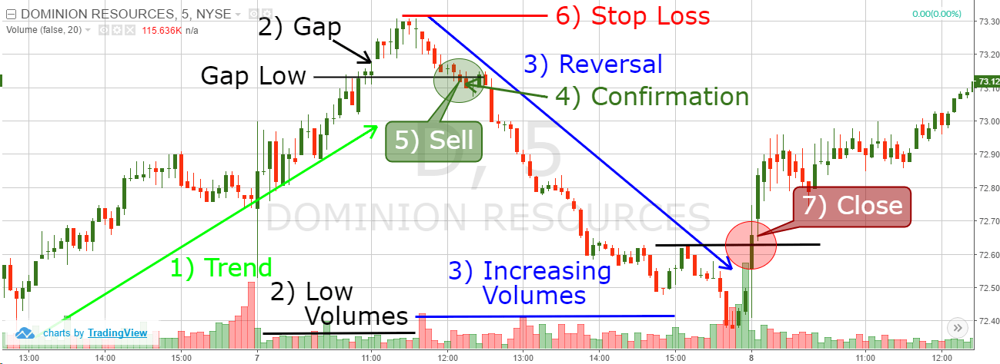

## Table of Contents

## What is exhaustion in stock trading?

Exhaustion in stock trading happens when a stock's price has moved a lot in one direction and then suddenly changes direction. It's like when you run until you can't run anymore and then you stop. In trading, this can happen after a stock goes up a lot and then people start selling it, or after it goes down a lot and then people start buying it again.

Traders watch for exhaustion because it can signal that a big change is coming. They look at things like how much the stock is being traded and special patterns on charts. If they see signs of exhaustion, they might decide to buy or sell the stock to make money from the change in direction. It's important for traders to understand exhaustion so they can make smart choices about when to trade.

## What are the common signs of exhaustion in the stock market?

Exhaustion in the stock market can be spotted by looking at how much a stock is being traded. When a stock's price has been going up or down a lot, and then suddenly there's a huge amount of trading, it might mean the stock is getting tired. This big jump in trading can show that a lot of people are jumping in to buy or sell, thinking the price will change direction soon.

Another sign of exhaustion is when you see special patterns on the stock's chart. For example, if the price makes a long move and then forms a pattern like a 'doji' or a 'hammer', it could mean the stock is exhausted. These patterns show that the stock's price tried to keep moving but couldn't, which might mean it's ready to go the other way.

Lastly, traders also watch for changes in the stock's momentum. If a stock has been moving quickly in one direction and then starts to slow down, it could be a sign of exhaustion. When the stock's price starts to struggle to keep going up or down, it might be a signal that the trend is about to reverse, and traders get ready for a new direction.

## How can a beginner identify exhaustion in stock charts?

For a beginner, identifying exhaustion on stock charts can seem tricky at first, but it becomes easier with practice. You want to look at the volume of the stock, which shows how many shares are being traded. When a stock has been moving up or down for a while and then suddenly a lot more shares start trading, it might be a sign of exhaustion. This big jump in volume can mean that a lot of people are buying or selling because they think the price is about to change direction.

Another thing to watch for is certain patterns on the chart. After a long move in one direction, if you see a pattern like a 'doji' or a 'hammer', it could mean the stock is exhausted. A doji looks like a plus sign and shows that the price tried to move but ended up back where it started. A hammer has a small body with a long lower wick and means the price tried to go down but came back up. These patterns can tell you that the stock might be ready to reverse its direction.

Lastly, pay attention to how fast the stock is moving. If it has been going up or down quickly and then starts to slow down, this could be another sign of exhaustion. When the stock's price struggles to keep moving in the same direction, it might be getting tired and ready for a change. By watching these signs, beginners can start to spot when a stock might be exhausted and ready to move the other way.

## What role do volume indicators play in detecting exhaustion?

Volume indicators are really important when you're trying to spot exhaustion in the stock market. They show you how many shares of a stock are being bought and sold. When a stock has been going up or down for a while and then suddenly a lot more shares start trading, this big jump in volume can be a sign that the stock is getting tired. It means a lot of people are jumping in to buy or sell because they think the price is about to change direction.

By watching volume indicators, you can see if the stock is losing steam. If the price has been moving a lot and then the volume gets really high, it might mean the stock is exhausted. This helps traders know when it might be a good time to buy or sell, because the stock could be ready to start moving the other way.

## Can you explain the difference between exhaustion gaps and breakaway gaps?

Exhaustion gaps and breakaway gaps are both types of gaps you might see on a stock chart, but they mean different things. An exhaustion gap happens when a stock's price has been moving a lot in one direction, like going up or down quickly. Then, suddenly, there's a big jump in the price, but this jump shows that the stock might be getting tired. It's like the stock has run out of energy to keep going the same way, so it's a sign that the price might start to move the other way soon.

On the other hand, a breakaway gap happens when a stock's price breaks out of a range it's been stuck in. Imagine the stock has been moving between two prices for a while, and then it suddenly jumps past one of those prices. This jump means the stock is breaking away from its old range and starting a new trend. It's a sign that the stock might keep moving in the new direction for a while, unlike an exhaustion gap which suggests a change is coming soon.

## What are some key candlestick patterns that signal exhaustion?

Candlestick patterns can help you spot when a stock might be getting tired, or exhausted. One pattern to look for is the doji. A doji looks like a plus sign and happens when the stock's price tries to move up or down but ends up right back where it started. Seeing a doji after the stock has been moving a lot in one direction can mean it's exhausted and might start moving the other way soon.

Another pattern is the hammer. A hammer has a small body with a long lower wick. It shows up when the stock tries to go down but then comes back up. If you see a hammer after the stock has been falling a lot, it could mean the stock is getting tired of going down and might start going up instead.

The shooting star is another pattern to watch for. It has a small body with a long upper wick and appears when the stock tries to go up but then falls back down. If you see a shooting star after the stock has been rising a lot, it might mean the stock is getting tired of going up and could start going down soon.

## How do moving averages help in confirming exhaustion signals?

Moving averages can help confirm if a stock is really getting tired, or exhausted. A moving average is a line on a chart that shows the average price of a stock over a certain time. When you see a stock's price moving a lot and then suddenly changing direction, you can look at the moving average to see if this change is real. If the price crosses over the moving average after showing signs of exhaustion, it can be a good sign that the stock is starting to move in a new direction. This helps traders feel more sure about their decisions.

For example, if a stock has been going up a lot and then you see a doji or a shooting star, you might think it's getting tired. But to be sure, you can look at the moving average. If the price of the stock then falls below the moving average, it confirms that the stock is probably exhausted and might keep going down. This way, moving averages give traders another tool to check if the signs of exhaustion they see are strong enough to act on.

## What are the psychological factors contributing to market exhaustion?

Market exhaustion often happens because of how people feel and think about the market. When a stock's price has been going up a lot, people start to feel really excited and hopeful. They keep buying because they think the price will keep going up. But then, some people start to worry that the price might be too high. They get scared and start selling. When a lot of people feel this way at the same time, it can cause a big jump in trading and the stock can get exhausted. This is when the price might start to go down because so many people are selling.

On the other hand, if a stock's price has been going down a lot, people can feel really worried and scared. They keep selling because they think the price will keep going down. But then, some people start to think the price might be too low. They get hopeful and start buying. When a lot of people feel this way at the same time, it can also cause a big jump in trading and the stock can get exhausted. This is when the price might start to go up because so many people are buying. So, the way people feel and think can really affect when a stock gets tired and changes direction.

## How can traders use the Relative Strength Index (RSI) to spot exhaustion?

The Relative Strength Index, or RSI, is a tool that traders use to see if a stock is getting tired, or exhausted. It's a number between 0 and 100 that shows how fast the stock's price has been going up or down. When the RSI goes above 70, it means the stock might be overbought, which means it's been going up a lot and could be getting tired. On the other hand, when the RSI goes below 30, it means the stock might be oversold, which means it's been going down a lot and could be getting tired too. So, traders watch the RSI to see if it's getting close to these levels because it can tell them if the stock might be ready to change direction.

Traders also look for something called a divergence when using the RSI to spot exhaustion. A divergence happens when the stock's price and the RSI are not moving in the same way. For example, if the stock's price keeps going up but the RSI starts to go down, this is called a bearish divergence. It can mean that even though the price is still going up, the stock is getting tired and might start going down soon. On the flip side, if the stock's price keeps going down but the RSI starts to go up, this is called a bullish divergence. It can mean that even though the price is still going down, the stock is getting tired and might start going up soon. By watching for these divergences, traders can get a better idea of when a stock might be exhausted and ready to change direction.

## What advanced technical indicators should experts use to predict exhaustion?

Experts can use advanced technical indicators like the Bollinger Bands to predict exhaustion in the stock market. Bollinger Bands are lines on a chart that show how much a stock's price has been moving around. When the price gets close to the top band after going up a lot, it might mean the stock is getting tired and could start going down. When the price gets close to the bottom band after going down a lot, it might mean the stock is getting tired and could start going up. By watching where the price is compared to these bands, experts can see if the stock is getting exhausted.

Another useful indicator is the Stochastic Oscillator. This tool helps experts see if a stock is overbought or oversold, which can signal exhaustion. The Stochastic Oscillator gives a number between 0 and 100. When it goes above 80, it means the stock might be overbought and getting tired of going up. When it goes below 20, it means the stock might be oversold and getting tired of going down. Experts look for times when the Stochastic Oscillator starts to move in the opposite direction of the stock's price, which can be a sign that the stock is exhausted and ready to change direction.

## Can you provide real-world examples of exhaustion in major stock indices?

In October 2007, the S&P 500 showed signs of exhaustion after a long upward trend. The index had been climbing steadily for months, but then it started to show some key signals. The volume of trading spiked, and the RSI went over 70, which meant the index was overbought. Also, a doji pattern appeared on the chart, showing that the price tried to move up but ended up back where it started. These signs told traders that the S&P 500 might be getting tired of going up, and soon after, the index started to fall, marking the beginning of the 2008 financial crisis.

Another example happened with the NASDAQ in early 2020. The index had been going up a lot, but then the market started to see signs of exhaustion. The volume of trading got very high, and the RSI was over 70, showing that the index was overbought. A shooting star pattern appeared on the chart, which meant the price tried to go up but then fell back down. These signs told traders that the NASDAQ might be getting tired of going up. Not long after, the index started to drop sharply due to the start of the global health crisis, confirming the exhaustion signals traders had seen.

## How should traders adjust their strategies when they detect exhaustion in the market?

When traders see signs of exhaustion in the market, they should be ready to change their trading plans. If a stock has been going up a lot and then shows signs of getting tired, like a big jump in trading or special chart patterns, traders might want to sell their shares. This is because the price could start going down soon. On the other hand, if a stock has been going down a lot and then shows signs of exhaustion, traders might want to buy the stock. This is because the price could start going up soon. By watching for these signs, traders can make smart choices about when to buy or sell.

It's also important for traders to use tools like moving averages and the RSI to confirm that the stock is really getting tired. If the price crosses over the moving average or the RSI goes over 70 or under 30, it can help traders feel more sure about their decisions. By being ready to change their plans and using these tools, traders can take advantage of the market's exhaustion and make money from the change in direction.

## What are the key traders' indicators for identifying exhaustion?

In stock trading, identifying potential exhaustion points is crucial for anticipating market reversals and adjusting trading strategies. Several technical indicators, including the Relative Strength Index (RSI), Moving Averages (MA), and the Volume-Weighted Average Price (VWAP), serve as vital tools for traders to recognize such signals.

The Relative Strength Index (RSI) is a [momentum](/wiki/momentum) oscillator that measures the speed and change of price movements. It operates on a scale from 0 to 100, with levels above 70 typically considered overbought and levels below 30 considered oversold. These thresholds are indicative of potential exhaustion points where a reversal could occur. The formula for the RSI is:

$$
RSI = 100 - \frac{100}{1 + RS}
$$

where $RS$ (Relative Strength) is the average of "up" closes divided by the average of "down" closes over a specified period. An understanding of RSI should enable traders to gauge the probability of a trend reversal effectively.

Moving Averages are critical in smoothing out price data to identify trends over a period. The Simple Moving Average (SMA) and the Exponential Moving Average (EMA) are widely used. The SMA is calculated by taking the arithmetic mean of a given set of prices over a specific number of days, while the EMA gives more weight to recent prices, making it more sensitive to new information. When prices move significantly away from the moving average, it can signal exhaustion. The general formula for SMA is:

$$
SMA = \frac{P_1 + P_2 + ... + P_n}{n}
$$

where $P_i$ is the price at a given day and $n$ is the number of days in consideration.

The Volume-Weighted Average Price (VWAP) provides an average price a security has traded at throughout the day, based on [volume](/wiki/volume-trading-strategy) and price. It represents a significant point of interest for exhaustion analysis as it highlights the collective trading activity’s value consensus. The VWAP is calculated as follows:

$$
VWAP = \frac{\sum (Price_i \times Volume_i)}{\sum Volume_i}
$$

where $Price_i$ is the typical price and $Volume_i$ is the volume for that interval. VWAP indicates possible exhaustion if the current price deviates significantly due to low trading volumes.

Each of these indicators offers a unique perspective by measuring different facets of market activity, from momentum and price trends to volume behavior. Mastery of these tools empowers traders to discern subtle cues of market saturation and make informed decisions, enhancing the effectiveness of trading strategies. By thoroughly understanding these indicators, traders can significantly improve their ability to predict market movements and align their trading actions accordingly.

## References & Further Reading

[1]: Wilder, J. W. (1978). ["New Concepts in Technical Trading Systems."](https://archive.org/details/newconceptsintec00wild) Trend Research.

[2]: Murphy, J. J. (1999). ["Technical Analysis of the Financial Markets: A Comprehensive Guide to Trading Methods and Applications."](https://archive.org/details/technicalanalysi0000murp) New York Institute of Finance.

[3]: Chan, E. (2009). ["Quantitative Trading: How to Build Your Own Algorithmic Trading Business."](https://github.com/ftvision/quant_trading_echan_book) Wiley.

[4]: Elder, A. (2002). ["Come Into My Trading Room: A Complete Guide to Trading."](https://www.amazon.com/Come-Into-My-Trading-Room/dp/0471225347) Wiley.

[5]: Chande, T. S. & Kroll, S. (1994). ["The New Technical Trader: Boost Your Profit by Plugging into the Latest Indicators."](https://www.amazon.com/New-Technical-Trader-Plugging-Indicators/dp/0471597805) Wiley.

[6]: Prado, M. L. (2018). ["Advances in Financial Machine Learning."](https://www.amazon.com/Advances-Financial-Machine-Learning-Marcos/dp/1119482089) Wiley.