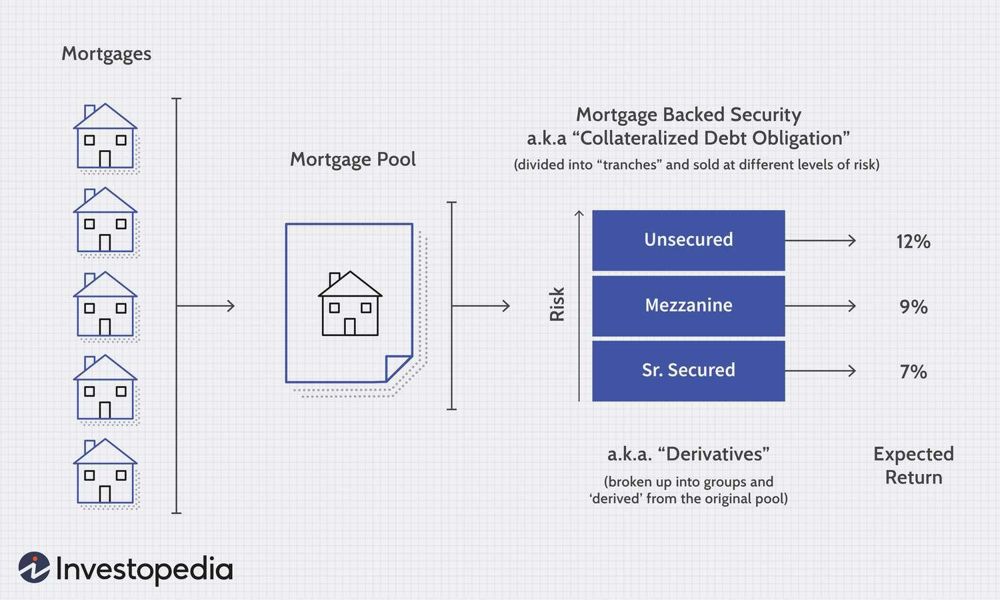

## Table of Contents

## What are Mortgage-Backed Securities (MBS)?

Mortgage-Backed Securities (MBS) are a type of investment where a collection of home loans are bundled together and sold to investors. When people take out mortgages to buy homes, banks can sell these mortgages to other companies. These companies then group the mortgages into a big pool and create securities from them. Investors buy these securities and receive payments based on the interest and principal that homeowners pay on their mortgages.

The idea behind MBS is to give banks more money to lend out for new mortgages, which helps more people buy homes. However, MBS can be risky because if many homeowners can't pay their mortgages, the value of the securities can drop. This happened during the 2008 financial crisis, when a lot of people defaulted on their home loans, causing the value of MBS to fall sharply and leading to big problems in the financial markets.

## How do Mortgage-Backed Securities work?

Mortgage-Backed Securities (MBS) work by taking a bunch of home loans and putting them together into a big group. Imagine if you had a bunch of small pieces of paper, each one representing a home loan. You gather all these pieces of paper and put them into a big pile. Then, you turn this pile into something called a security, which is like a big financial package that investors can buy. When people pay their mortgages every month, the money they pay goes into this big pile and then gets sent out to the investors who bought the security.

The money that investors get from MBS comes from the monthly payments homeowners make on their mortgages. This includes both the interest on the loan and the part of the loan that homeowners are paying back. So, if a lot of homeowners are paying their mortgages on time, the investors get regular payments. But, if many homeowners can't pay their mortgages, the investors might not get as much money as they expected. This makes MBS a bit risky because the payments depend on how well homeowners can keep up with their loans.

## What is the history of Mortgage-Backed Securities?

The history of Mortgage-Backed Securities (MBS) started in the 1970s in the United States. Before MBS, banks would keep the home loans they gave out on their own [books](/wiki/algo-trading-books). But in the 1970s, the U.S. government created a company called Ginnie Mae to help make it easier for people to buy homes. Ginnie Mae started bundling home loans together and selling them as securities to investors. This was the first time MBS were used, and it helped banks have more money to lend out for new home loans.

Over time, other companies like Fannie Mae and Freddie Mac also started creating MBS. By the 1980s and 1990s, MBS became very popular because they helped a lot of people buy homes and gave investors a new way to make money. But in the 2000s, things got risky. Banks started giving out home loans to people who couldn't really afford them, and these loans were bundled into MBS. When many of these homeowners couldn't pay their loans, it caused a big problem. In 2008, the value of MBS dropped a lot, leading to the financial crisis. Since then, rules have been put in place to make MBS safer, but they are still an important part of the housing market.

## Who are the key players involved in the creation and sale of MBS?

The key players in the creation and sale of Mortgage-Backed Securities (MBS) include banks, government-sponsored enterprises (GSEs), and investors. Banks start the process by giving out home loans to people who want to buy houses. They then sell these loans to other companies, which helps the banks have more money to lend out for new home loans. The companies that buy the loans are often government-sponsored enterprises like Ginnie Mae, Fannie Mae, and Freddie Mac. These GSEs bundle the loans together into big groups and turn them into securities.

Once the loans are bundled into securities, the GSEs sell these MBS to investors. Investors can be big institutions like pension funds or insurance companies, or even individual people looking to invest their money. The investors buy the MBS and receive payments based on the interest and principal that homeowners pay on their mortgages. This way, the money keeps flowing from homeowners to investors through the MBS.

## What are the different types of Mortgage-Backed Securities?

There are two main types of Mortgage-Backed Securities: pass-through securities and collateralized mortgage obligations (CMOs). Pass-through securities are the simpler type. When people pay their mortgages, the money goes straight through to the investors who bought the securities. This means if you own a pass-through MBS, you get a share of the payments homeowners make every month. It's like passing the money directly from the homeowners to the investors.

Collateralized mortgage obligations (CMOs) are more complicated. They take the pool of mortgages and split it into different parts, called tranches. Each tranche has its own level of risk and return. Some tranches get paid back first and are less risky, while others get paid back later and are riskier but might offer higher returns. This way, investors can choose the level of risk and reward they want when they buy a CMO. Both types of MBS help banks lend more money for home loans, but they work in different ways and have different risks for investors.

## How are Mortgage-Backed Securities rated and what does it mean for investors?

Mortgage-Backed Securities (MBS) are rated by credit rating agencies like Moody's, Standard & Poor's, and Fitch. These agencies look at the quality of the home loans inside the MBS and how likely homeowners are to pay back their loans. They give the MBS a rating, like AAA, AA, A, or lower, to show how safe the investment is. A high rating, like AAA, means the MBS is seen as very safe and the risk of homeowners not paying their loans is low. A lower rating means the MBS is riskier, and there's a higher chance that homeowners might not pay back their loans.

For investors, the rating of an MBS is important because it helps them understand the risk they're taking. If an investor buys an MBS with a high rating, they can feel more confident that they'll get regular payments from the homeowners' mortgage payments. But if they buy an MBS with a lower rating, they might get higher returns, but there's also a bigger chance they might not get all their money back if a lot of homeowners can't pay their loans. So, the rating helps investors decide which MBS to buy based on how much risk they're willing to take.

## What role do government-sponsored enterprises like Fannie Mae and Freddie Mac play in the MBS market?

Government-sponsored enterprises like Fannie Mae and Freddie Mac play a big role in the MBS market. They buy home loans from banks and then bundle these loans together to create mortgage-backed securities. This helps banks have more money to lend out to new homebuyers. Fannie Mae and Freddie Mac are seen as safer because they have some support from the government, which makes investors feel more comfortable buying the MBS they create.

By buying home loans and turning them into MBS, Fannie Mae and Freddie Mac help keep the housing market running smoothly. They make it easier for people to get home loans because banks know they can sell the loans to these enterprises. This is important for the economy because it helps more people buy homes. But, it also means that if something goes wrong with the housing market, it can affect Fannie Mae and Freddie Mac, and the whole MBS market.

## What are the risks associated with investing in Mortgage-Backed Securities?

Investing in Mortgage-Backed Securities (MBS) can be risky because the payments you get depend on homeowners paying their mortgages. If a lot of homeowners can't pay their loans, the value of the MBS can drop a lot. This happened during the 2008 financial crisis when many people defaulted on their home loans, causing big problems for investors who had bought MBS. Another risk is that interest rates can change. If rates go up, the value of MBS can go down because new loans will have higher interest rates, making the older MBS less attractive to investors.

Also, MBS can be hard to understand because they are complicated financial products. Some MBS, like collateralized mortgage obligations (CMOs), are split into different parts with different levels of risk. If you don't understand which part you're investing in, you might end up with more risk than you expected. Finally, even though government-sponsored enterprises like Fannie Mae and Freddie Mac make MBS seem safer, there's still a risk that these companies could have problems, which could affect the value of the MBS they create.

## How do Mortgage-Backed Securities affect the broader economy?

Mortgage-Backed Securities (MBS) play a big role in the economy by helping more people buy homes. When banks sell their home loans to companies like Fannie Mae and Freddie Mac, they get more money to lend out. This means more people can get home loans, which is good for the housing market and helps the economy grow. If people are buying homes, they're also spending money on things like furniture and home repairs, which creates jobs and boosts the economy even more.

But MBS can also cause problems if things go wrong. If a lot of homeowners can't pay their mortgages, the value of MBS can drop sharply. This happened in 2008, leading to a big financial crisis that affected the whole economy. When MBS lose value, banks can lose money, and they might stop lending as much. This can slow down the housing market and the economy. So, while MBS help the economy by making it easier for people to buy homes, they can also be risky and lead to big problems if not managed carefully.

## What was the impact of the 2008 financial crisis on the MBS market?

The 2008 financial crisis had a huge impact on the Mortgage-Backed Securities (MBS) market. Before the crisis, banks were giving out a lot of home loans to people who couldn't really afford them. These risky loans were bundled into MBS and sold to investors. When many homeowners couldn't pay their mortgages, the value of these MBS dropped a lot. This caused big problems for banks and investors who had bought the MBS, leading to a financial crisis that affected the whole economy.

After the crisis, the government stepped in to help fix the problems. They made new rules to make MBS safer and to stop banks from giving out too many risky loans. Companies like Fannie Mae and Freddie Mac, which had been big players in the MBS market, got help from the government to stay afloat. The crisis showed how important MBS are to the economy, but also how risky they can be if not managed carefully. Since then, the MBS market has been working to rebuild trust and make sure things like the 2008 crisis don't happen again.

## How have regulations and practices regarding Mortgage-Backed Securities evolved since the 2008 crisis?

Since the 2008 financial crisis, the rules and practices around Mortgage-Backed Securities (MBS) have changed a lot to make them safer. The government made new laws like the Dodd-Frank Act to stop banks from giving out too many risky loans. These laws also made banks keep some of the loans they give out instead of selling all of them, which makes banks more careful about who they lend to. The government also set up new groups like the Consumer Financial Protection Bureau to watch over the housing market and make sure people aren't being treated unfairly.

Also, the way MBS are rated has changed. Now, rating agencies have to be more careful and honest about how they rate MBS. They have to look more closely at the loans inside the MBS to make sure they're not too risky. Fannie Mae and Freddie Mac, which are big in the MBS market, got help from the government to keep going, but they also have to follow stricter rules now. All these changes help make the MBS market safer and help stop big problems like the 2008 crisis from happening again.

## What are the current trends and future outlook for the Mortgage-Backed Securities market?

The Mortgage-Backed Securities (MBS) market has been growing steadily since the 2008 financial crisis. One big trend is that investors are becoming more interested in MBS again because they see them as a good way to make money. The government and banks have made MBS safer by putting in new rules, which makes investors feel more confident. Also, with interest rates being low for a long time, MBS have been a good choice for investors looking for steady payments. Another trend is that technology is being used more in the MBS market, making it easier to buy and sell these securities.

Looking into the future, the MBS market is expected to keep growing, but it will also face some challenges. If interest rates go up, the value of MBS could go down because new loans will have higher interest rates, making older MBS less attractive. Also, if the economy has problems, more homeowners might not be able to pay their mortgages, which could hurt the MBS market. But overall, with the new rules and more careful lending, the MBS market should stay strong and help more people buy homes.

## References & Further Reading

[1]: Fabozzi, F. J., Bhattacharya, A. K., & Berliner, W. S. (2010). ["Mortgage-Backed Securities: Products, Structuring, and Analytical Techniques"](https://archive.org/details/mortgagebackedse0000fabo). Wiley.

[2]: Gorton, G. B. (2010). ["Slapped by the Invisible Hand: The Panic of 2007."](https://www.atlantafed.org/-/media/Documents/news/conferences/2009/financial-markets-conference/gorton.pdf) Oxford University Press.

[3]: Hull, J. C., & White, A. (2013). ["Collateral and credit issues in derivatives pricing"](https://papers.ssrn.com/sol3/papers.cfm?abstract_id=2212953). Journal of Risk.

[4]: Khandani, A. E., & Lo, A. W. (2011). ["What Happened To The Quants In August 2007?"](https://web.mit.edu/Alo/www/Papers/august07.pdf) Journal of Investment Management, 5(4), 5-54.

[5]: Tuckman, B., & Serrat, A. (2011). ["Fixed Income Securities: Tools for Today's Markets"](https://www.amazon.com/Fixed-Income-Securities-Todays-Markets/dp/0470891696). Wiley.

[6]: MacKenzie, D. (2015). ["Mechanizing the Merc: The Chicago Mercantile Exchange and the Rise of High-Frequency Trading"](https://pubmed.ncbi.nlm.nih.gov/26387525/). Technology and Culture, 56(3), 646-677.

[7]: Vayanos, D., & Woolley, P. (2013). ["An Institutional Theory of Momentum and Reversal."](https://www.jstor.org/stable/23470044) The Review of Financial Studies, 26(5), 1087-1145.