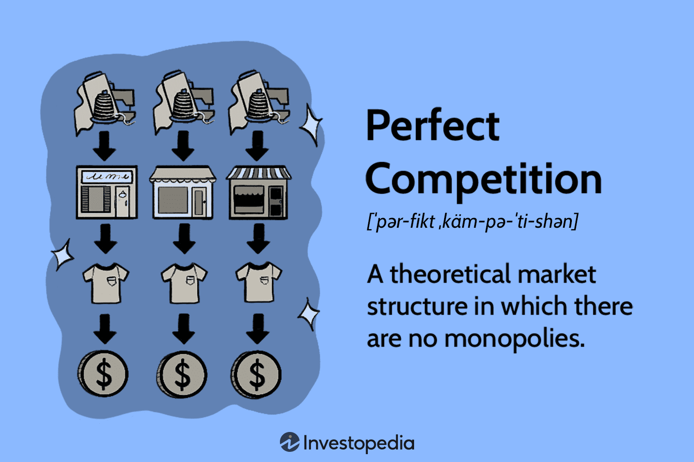

In economic theory, market structures are essential for defining the operation of businesses, setting prices, and allocating resources efficiently. Among these, perfect competition is a fundamental model that depicts a market scenario where countless small firms sell identical products without any barriers to entry or exit. This theoretical model, though rarely found in real-world markets, has been instrumental in explaining how market efficiencies could potentially be achieved.

Conversely, algorithmic trading represents the forefront of modern market operations, employing advanced algorithms and high-speed computing power to execute trades in fractions of a second. This method has revolutionized financial markets by enhancing the speed, accuracy, and volume of trading. Algorithmic trading reflects a significant shift in how market transactions occur, offering both potential benefits and challenges in terms of market efficiency and stability.

The combination of these two concepts—perfect competition and algorithmic trading—provides meaningful insights into the current and future state of market efficiency, regulatory challenges, and trading practices. By understanding these dynamics, stakeholders can better navigate the complexities of modern financial markets, ensuring that they operate in a manner that promotes economic welfare and innovation.

## Table of Contents

## Understanding Perfect Competition

Perfect competition is a market structure characterized by several distinct features. It represents an idealized version of economic efficiency where numerous buyers and sellers engage in trade, dealing with homogeneous products, meaning that goods offered by different sellers in a market are identical. This leads to perfect information availability, where all participants in the market have full knowledge of pricing and product details, allowing them to make informed decisions.

Under perfect competition, firms are described as "price takers." This implies that each firm is too small relative to the overall market to influence the market price of the product it sells. Consequently, the price of goods is determined by the forces of supply and demand in the market. Since firms cannot set higher prices to gain more profit without losing customers to competitors, they must accept the prevailing market price. This situation leads to the optimal allocation of resources within the economy.

In this ideal environment, economic profits are minimized in the long run. When economic profits exist, new firms are incentivized to enter the market, increasing supply until profits reach a normal level, where revenues cover all implicit and explicit costs. This continuous entry ensures that resources are utilized efficiently, as prices reflect the marginal cost of production, leading to what economists term allocative and productive efficiency.

However, perfect competition is rarely observed in practice due to several constraints. Real-world markets often face factors such as product differentiation, limited information, and firms possessing some degree of market power. These divergences highlight the theoretical nature of perfect competition, yet the model serves as a critical benchmark for assessing the efficiency of actual markets. Comparing real-world market structures against the perfect competition model helps economists and policymakers identify areas where market inefficiencies might exist and determine potential corrective measures.

## Barriers to Perfect Competition in Real Markets

Perfect competition, while an invaluable economic model, is difficult to fully manifest in real-world markets due to several intrinsic barriers. One fundamental barrier is product differentiation. In theory, perfect competition assumes homogeneous products, meaning that consumers view all offerings as identical. However, in practice, firms often introduce slight variations to distinguish their products, thus gaining some market power and deviating from the ideal model.

Another significant barrier is the presence of market power, where certain firms influence prices rather than act as passive price takers. This power often stems from brand recognition, product differentiation, or technological superiority. Consequently, firms can exert control over market conditions, leading to imperfections.

Barriers to entry and [exit](/wiki/exit-strategy) further complicate the realization of perfect competition. High startup costs, such as capital investment and technology acquisition, can deter new entrants, preserving the dominance of established firms. Similarly, regulatory constraints, including licensing requirements and compliance with standards, create hurdles for potential competitors. In the case of exit, firms may face losses on sunk costs or contractual obligations that hinder their ability to leave the market.

The lack of perfect information among consumers is another obstacle. Perfect competition presupposes that consumers have complete, accurate knowledge about products and prices. However, information asymmetry often exists, where sellers possess more knowledge than buyers, affecting decision-making and market outcomes.

Despite these challenges, some real-world markets, notably commodities and agricultural sectors, exhibit characteristics akin to perfect competition. In these markets, large numbers of small-scale producers offer similar goods, leading to competitive pricing. Nonetheless, deviations occur due to factors like government interventions, subsidies, and varying quality standards.

In summary, while perfect competition serves as a benchmark for market efficiency, various factors such as product differentiation, market power, entry and exit barriers, and imperfect information, inhibit its full realization in real-world scenarios. These elements illustrate the complexity of translating theoretical constructs into practical applications.

## The Role of Algorithmic Trading

Algorithmic trading utilizes advanced computer algorithms to automate trading decisions and execution in financial markets. By swiftly analyzing vast datasets, these algorithms can make trading decisions based on pre-defined criteria, enabling trades to occur at speeds and efficiencies that surpass human capability. This technological advancement has significantly influenced financial markets by enhancing [liquidity](/wiki/liquidity-risk-premium)—the ease with which assets can be bought and sold without affecting their price—thus allowing for more accurate and stable pricing.

In markets approaching conditions of perfect competition, where numerous buyers and sellers engage in transactions of homogeneous products, [algorithmic trading](/wiki/algorithmic-trading) can facilitate efficiency. By enabling rapid transactions with minimal human intervention, these algorithms reduce transaction costs and heighten market transparency. Lower transaction costs arise from reduced bid-ask spreads, which is the difference between the price buyers are willing to pay and the price sellers are willing to accept. Enhanced transparency occurs as the algorithmic processes make market information more readily available and clearer for participants.

Despite these benefits, algorithmic trading introduces challenges that necessitate careful oversight. One significant issue is increased market [volatility](/wiki/volatility-trading-strategies). High-frequency trading, a subset of algorithmic trading, can introduce short-term volatility due to the rapid execution of a large number of trades. This could lead to price swings unreflective of underlying asset values, contributing to instability. Additionally, the complexity of algorithms and their autonomous operation pose systemic risks. Malfunctions or abusive practices within these systems could lead to market disruptions, exemplified by events such as the 2010 Flash Crash, when the U.S. stock market briefly plummeted.

To mitigate such risks, robust regulatory frameworks are necessary. These should encompass stringent testing and monitoring of trading algorithms, ensuring they adhere to market integrity standards and prevent manipulative practices. By balancing technological advancements with sound regulation, the benefits of algorithmic trading—such as increased liquidity and efficiency—can be harnessed while minimizing potential downsides.

## Comparing Market Structures: Perfect Competition vs. Monopolistic Markets

Monopolistic markets and perfectly competitive markets represent two opposing ends of the market structure spectrum. In monopolistic markets, a single seller or a few sellers dominate the entire market, wielding significant control over prices and output levels. This centralized control often results in higher prices and reduced choices for consumers. The lack of competition in these markets can lead to inefficiencies, as firms are less incentivized to reduce costs or innovate, knowing they have considerable market power.

Contrastingly, perfect competition embodies a market scenario where numerous small firms operate, selling homogeneous products with no single entity able to influence the market price. Here, firms act as price takers, and the market determines the price based on aggregate supply and demand. This structure theoretically leads to optimal resource allocation, maximum consumer choice, and minimal potential for supernormal profits.

Regulatory intervention becomes crucial in monopolistic markets to mitigate the risk of these inefficiencies and protect consumer welfare. Antitrust laws are often employed to restrict unfair trade practices, curb monopolistic power, and stimulate competitive practices. For instance, these regulations can prevent price-fixing agreements and break up companies that become too dominant in a given market sector, fostering a more competitive environment.

Algorithmic trading introduces another layer of complexity within market structures. In monopolistic markets, algorithmic trading can exacerbate existing inefficiencies by taking advantage of the limited competition to execute large trades that can influence market prices. However, regulatory oversight can mitigate potential abuses and harness the benefits of algorithmic trading, such as improved liquidity and faster transaction times, even in monopolistic settings.

Hence, while perfect competition remains an idealistic benchmark for market efficiency, real-world markets often gravitate towards imperfect competition. Policymakers strive to steer these markets closer to the ideals of perfect competition through effective regulation, encouraging fair practices, and embracing technological advancements like algorithmic trading. These efforts aim to balance market structures, enhance efficiency, and ensure consumer welfare is prioritized.

## Implications of Government Regulation

Government regulation is essential for ensuring fair and equitable competition within various market structures. One of the primary tools employed by governments to this end is antitrust laws. These laws are designed to prevent monopolistic behaviors and practices that can lead to market inefficiencies and unfair consumer conditions. By curbing anti-competitive conduct, such laws facilitate a market environment where innovation can thrive and consumer welfare is prioritized.

For instance, the enforcement of merger regulations prevents the formation of monopolies or oligopolies that could control markets and dictate prices, reducing competition. This is crucial in maintaining a healthy market dynamic where numerous firms can compete on a level playing field. Moreover, laws against price-fixing, exclusive dealing, and predatory pricing aim to ensure that markets operate efficiently and consumers benefit from competitive pricing and diverse product offerings.

The rapid pace of technological advancements continuously reshapes market landscapes, introducing novel challenges and opportunities. Technologies such as algorithmic trading have altered the way financial markets operate, emphasizing the need for adaptive regulatory frameworks that can address complexities brought about by these innovations. This includes enhancing transparency in automated transactions and managing systemic risks to prevent market disruptions.

Regulators must adopt a flexible approach to accommodate technological changes without stifling innovation. This involves continuous monitoring of market practices and the development of policies that balance the need for security and innovation. For example, regulatory bodies might require financial institutions to implement robust risk management systems to counteract potential threats posed by high-frequency trading algorithms.

In conclusion, government regulation serves a vital function in shaping market structures by promoting competition and innovation while safeguarding against monopolistic practices. Continued adaptation and evolution of regulatory frameworks are necessary to respond to technological advancements, ensuring that markets remain fair, competitive, and beneficial to consumers.

## Conclusion

Understanding the dynamics of perfect competition and algorithmic trading is essential for navigating today's financial markets. Perfect competition, as a theoretical model, provides an ideal benchmark for market efficiency where resources are optimally allocated. However, real markets deviate from this ideal due to various imperfections, such as barriers to entry, product differentiation, and information asymmetry. These market imperfections are often shaped and amplified by regulatory policies and technological advancements.

Algorithmic trading, which utilizes advanced computational algorithms to execute trades with speed and precision, represents the frontier of technological innovation in financial markets. It enhances market liquidity and accuracy of price formation, contributing to market efficiency. However, its widespread adoption can also introduce challenges such as increased volatility and systemic risks. Therefore, as technological advancements continue to reshape the trading landscape, it becomes vital for policymakers to ensure that regulations are adapted to mitigate potential downsides while fostering innovation.

Market participants and policymakers must be proactive in understanding and addressing the implications of these structures. By implementing adaptive strategies and regulatory measures, they can promote both market efficiency and consumer welfare. Ultimately, balancing the theoretical ideal of perfect competition with the realities of algorithmic trading entails a nuanced understanding of market mechanics and regulatory environments. This balance is crucial for fostering a robust and fair financial system.

## FAQs

### FAQs

**What are the differences between monopolistic markets and perfect competition?**

Monopolistic markets and perfect competition represent two ends of the market structure spectrum. In perfect competition, there are numerous small firms producing identical products. These firms have no control over the market price, acting as price takers, which leads to optimal resource allocation and consumer welfare. On the other hand, monopolistic markets are characterized by single or few sellers who exert significant control over price and quantity of goods. These markets often result in higher prices, reduced output, and less consumer choice. The existence of significant barriers to entry in monopolistic markets restricts competition, necessitating interventions such as antitrust laws to promote fairness and prevent anti-competitive practices.

**How does algorithmic trading influence market efficiency?**

Algorithmic trading employs computer algorithms to automate the trading process, substantially impacting market efficiency. It enhances liquidity and price discovery by enabling high-frequency trades that adjust quickly to market conditions. Algorithms evaluate vast amounts of data in real-time, facilitating transactions that reduce bid-ask spreads and transaction costs, thus increasing overall market efficiency. However, algorithmic trading can also increase volatility and contribute to systemic risks, such as flash crashes, necessitating robust regulatory oversight to mitigate these challenges and ensure stable financial markets.

**Why is perfect competition considered largely theoretical?**

Perfect competition is considered largely theoretical because its stringent conditions are rarely met in real-world markets. These conditions include a large number of buyers and sellers, homogeneous products, perfect information, and no barriers to entry or exit. In practice, most markets exhibit some degree of product differentiation, information asymmetry, and barriers that inhibit the entry and exit of firms. Consequently, perfect competition serves as an ideal benchmark for evaluating economic efficiency, but real markets typically operate under imperfect conditions necessitating regulatory and strategic adjustments.

**What role does government regulation play in shaping market structures?**

Government regulation is crucial in shaping market structures to ensure fair and competitive environments. It aims to prevent monopolistic practices, promote innovation, and protect consumer welfare through regulations and antitrust laws. Regulations address issues like price fixing, market entry barriers, and unfair trade practices, essential for maintaining efficient and fair markets. As technology and market dynamics evolve, regulations must adapt to address contemporary challenges such as algorithmic trading, ensuring that markets remain resilient, transparent, and beneficial to all participants.

## References & Further Reading

[1]: Bergstra, J., Bardenet, R., Bengio, Y., & Kégl, B. (2011). ["Algorithms for Hyper-Parameter Optimization."](https://dl.acm.org/doi/10.5555/2986459.2986743) Advances in Neural Information Processing Systems 24.

[2]: ["Advances in Financial Machine Learning"](https://www.amazon.com/Advances-Financial-Machine-Learning-Marcos/dp/1119482089) by Marcos Lopez de Prado

[3]: ["Evidence-Based Technical Analysis: Applying the Scientific Method and Statistical Inference to Trading Signals"](https://www.amazon.com/Evidence-Based-Technical-Analysis-Scientific-Statistical/dp/0470008741) by David Aronson

[4]: ["Machine Learning for Algorithmic Trading"](https://github.com/stefan-jansen/machine-learning-for-trading) by Stefan Jansen

[5]: ["Quantitative Trading: How to Build Your Own Algorithmic Trading Business"](https://www.amazon.com/Quantitative-Trading-Build-Algorithmic-Business/dp/1119800064) by Ernest P. Chan