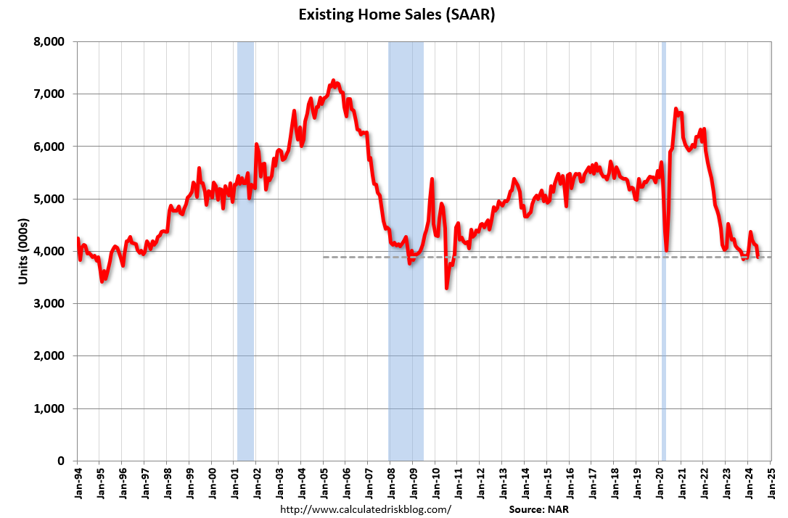

## Table of Contents

## What are existing home sales?

Existing home sales refer to the number of previously owned homes that are sold during a specific period, usually a month or a year. These sales are an important indicator of the health of the real estate market and the overall economy. When more existing homes are sold, it often means that people feel confident about their financial situation and are willing to make big purchases like a home.

Tracking existing home sales helps economists and policymakers understand trends in the housing market. For example, if sales are going up, it might mean that the economy is doing well. If sales are going down, it could be a sign that people are worried about their jobs or the economy. This information can help guide decisions about interest rates and other economic policies.

## How are existing home sales different from new home sales?

Existing home sales are about homes that someone has already lived in and are now being sold again. These homes can be old or just a few years old, but they are not brand new. When people buy an existing home, they are buying from someone who is moving out. This type of sale is very common because there are a lot more existing homes than new ones being built at any given time.

New home sales, on the other hand, are about homes that have never been lived in before. These are brand new houses built by builders or developers. When someone buys a new home, they are usually buying directly from the builder. New home sales are important because they show how much new construction is happening, which can tell us about the economy and people's confidence in buying new properties.

Both existing and new home sales give us information about the housing market, but they tell us different things. Existing home sales show how active the resale market is, while new home sales show how much new building is going on. Together, they help us understand the overall health of the housing market and the economy.

## Why are existing home sales important to the economy?

Existing home sales are important to the economy because they show how people feel about their money and the future. When lots of existing homes are sold, it means people are confident and happy to spend big money on a house. This can make the whole economy grow because buying a home leads to other spending, like furniture and home improvements. If fewer homes are sold, it might mean people are worried about their jobs or the economy, which can slow things down.

Also, existing home sales help keep the housing market moving. When people sell their old homes, it makes room for others to buy and sell too. This keeps the market active and helps builders know how many new homes to build. A healthy housing market can create jobs in construction, real estate, and other related industries, which is good for the economy. So, watching existing home sales gives us clues about how the economy is doing and what might happen next.

## How are existing home sales measured and reported?

Existing home sales are measured and reported by looking at the number of homes that have been sold in a certain time, usually a month. The National Association of Realtors (NAR) is the group that collects this information. They ask real estate [agents](/wiki/agents) and brokers across the country how many homes they have sold. They add up all these numbers to get the total for existing home sales. This helps everyone know how many homes people are buying and selling.

The NAR releases a report every month that tells us how many existing homes were sold. The report comes out a few weeks after the month ends, so people can see the latest numbers. The report also tells us other things, like the average price of homes sold and how long homes stay on the market before they sell. This information is important because it helps people understand what is happening in the housing market and the economy.

## What factors influence existing home sales?

Existing home sales can go up or down because of many things. One big thing is how much money people have and how they feel about the economy. If people have good jobs and feel sure about their money, they are more likely to buy a home. Interest rates also matter a lot. When interest rates are low, it's cheaper to borrow money for a home, so more people buy. But if rates go up, it can make buying a home more expensive, and fewer people might want to buy.

Another thing that can change existing home sales is the price of homes. If homes are too expensive, fewer people can afford to buy them. The number of homes for sale also makes a difference. If there are lots of homes to choose from, it's easier for people to find one they like. But if there are not many homes for sale, it can be hard for people to buy, even if they want to. Things like the weather or big events, like a new factory opening, can also affect how many homes are sold in certain areas.

## How do interest rates affect existing home sales?

Interest rates have a big impact on existing home sales. When interest rates are low, it costs less to borrow money to buy a home. This means people can get a cheaper mortgage, so more people want to buy homes. It's like getting a discount on the cost of buying a house. When more people are buying, existing home sales go up, and the whole housing market gets busier.

On the other hand, when interest rates go up, borrowing money becomes more expensive. This makes the monthly payments on a mortgage higher, and fewer people can afford to buy a home. When fewer people are buying, existing home sales go down. So, interest rates are like a big switch that can turn the housing market on or off, depending on whether they are low or high.

## What role does housing inventory play in existing home sales?

Housing inventory is the number of homes that are for sale at any given time. It plays a big role in existing home sales because it shows how many choices buyers have. If there are a lot of homes for sale, it's easier for people to find one they like and can afford. This can make existing home sales go up because more people are able to buy. But if there aren't many homes for sale, it can be hard for buyers to find what they want, and this can make existing home sales go down.

The balance between the number of homes for sale and the number of people who want to buy them is important. When there are more buyers than homes, it's called a seller's market. In a seller's market, homes can sell quickly, and prices might go up. But when there are more homes than buyers, it's called a buyer's market. In a buyer's market, homes might stay on the market longer, and sellers might have to lower their prices to sell. So, housing inventory can change how fast homes sell and how much they cost, which affects existing home sales.

## How do seasonal trends impact existing home sales?

Seasonal trends can change how many existing homes are sold throughout the year. In the spring and summer, more people want to buy homes. This is because the weather is nice, and families like to move when school is out. Also, people often feel more hopeful about the future in the warmer months, so they are more likely to buy a home. Because of this, existing home sales usually go up in spring and summer.

In the fall and winter, existing home sales can go down. The weather gets colder, and people might not want to move during the holidays. Also, some people wait until the new year to buy a home because they want to start fresh. So, fewer homes are sold in the colder months. Understanding these seasonal changes helps people know when it might be a good time to buy or sell a home.

## What are the regional differences in existing home sales across the U.S.?

Existing home sales can be different in different parts of the United States. In some places, like big cities on the coasts, like New York or California, homes can be very expensive. This means fewer people can afford to buy them, so existing home sales might not be as high as in other places. But, there are also a lot of people who want to live in these areas, so if someone does decide to sell their home, it might sell quickly. On the other hand, in the middle of the country, like in states like Ohio or Missouri, homes are often cheaper. More people can afford to buy homes there, so existing home sales might be higher.

In the South, like in states like Florida or Texas, the weather is nice and warm, which can make more people want to move there. This can lead to more existing home sales. Also, these states are growing fast, so there are always new people coming in who need homes. In the Northeast, like in states like Massachusetts or Pennsylvania, the weather can be cold, and there are older homes that might need more work. This can make existing home sales slower in the winter, but they can pick up in the warmer months. So, where you are in the U.S. can really change how many existing homes are sold.

## How do existing home sales data influence real estate market predictions?

Existing home sales data helps people guess what will happen next in the real estate market. When lots of homes are sold, it can mean that more people will want to buy homes in the future. This can make people think that home prices will go up because there are more buyers than homes. Also, if existing home sales are high, builders might start building more new homes to meet the demand. This helps everyone plan for what might happen next in the housing market.

On the other hand, if fewer homes are sold, it can mean that people are not as sure about buying homes. This might make people think that home prices will stay the same or even go down because there are more homes than buyers. When existing home sales go down, builders might build fewer new homes because they think there won't be as many buyers. So, looking at existing home sales data helps people make smart guesses about the future of the real estate market.

## What are the current trends in existing home sales?

In 2023, existing home sales have been going down a bit. This is because interest rates have gone up, making it more expensive for people to borrow money to buy a home. Also, there are not as many homes for sale as people would like, which makes it harder for buyers to find what they want. Even though fewer homes are being sold, the prices of homes are still pretty high because there are still more buyers than homes.

But, there are some good signs too. In some parts of the country, like the South and the West, existing home sales have been doing better than in other places. This is because more people are moving to these areas for jobs and the nice weather. Also, people are starting to feel a bit more hopeful about the economy, which might mean more homes will be sold in the future. So, while existing home sales are down right now, things could start to get better soon.

## How can advanced analytics and big data improve forecasting of existing home sales?

Advanced analytics and big data can help us guess better about how many existing homes will be sold in the future. By looking at lots of information, like how much people earn, what interest rates are, and how many homes are for sale, we can find patterns that tell us what might happen next. For example, if we see that every time interest rates go down, existing home sales go up, we can use this pattern to predict what will happen if rates change again. Big data also lets us look at information from different places all at once, so we can see how things are different in different parts of the country.

Using these tools also helps us understand things that might not be so obvious. For example, we can look at how the weather or big events, like a new factory opening, can change how many homes are sold. By using computers to look at all this information quickly, we can make better guesses about what will happen with existing home sales. This can help builders know how many new homes to build and help people decide if it's a good time to buy or sell a home.

## References & Further Reading

National Association of Realtors - Existing-Home Sales Data: The National Association of Realtors (NAR) provides comprehensive data on existing-home sales, which are a vital indicator of the housing market’s health. This data helps in understanding trends in prices, sales volumes, and inventory levels, offering insights into market demand and consumer behavior.

U.S. Census Bureau - New Home Sales vs. Existing Homes Sales: The U.S. Census Bureau provides critical statistical comparisons between new home sales and existing home sales. This data sheds light on economic growth through the construction and sale of newly-built residences versus transactions involving already established homes, providing a broader understanding of market dynamics and economic conditions.

S&P Dow Jones Indices - Case-Shiller Home Price Indices: The S&P Dow Jones Indices produce the Case-Shiller Home Price Indices, widely considered the leading measure of U.S. residential real estate prices. By examining repeat sales of single-family homes, these indices track changes in property values, providing a reliable gauge of housing market conditions.

Federal Housing Finance Agency - FHFA House Price Index: The Federal Housing Finance Agency (FHFA) compiles the House Price Index (HPI), which measures changes in single-family home prices across the nation. This index offers a valuable tool for observing long-term trends and making informed investment decisions in the housing sector.

Various sources explore the impact and methodologies of [algorithmic trading](/wiki/algorithmic-trading) in real estate: The integration of algorithmic trading into real estate has been analyzed by several scholars and industry reports. These sources provide insights into the algorithms used to assess market conditions, predict price movements, and execute transactions. Such methodologies offer potential for improved efficiency and profitability, while also raising concerns about market fairness and accessibility. Notable sources include industry white papers and studies published in academic journals that examine the technological and economic implications of algorithmic trading in the housing market.

