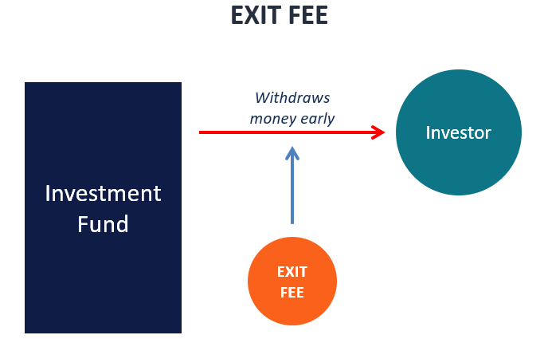

## Table of Contents

## What is an exit fee?

An exit fee is a charge that you have to pay when you want to leave or end a contract or service early. It's common in things like phone plans, gym memberships, and investment funds. The fee is there to make up for the money the company loses when you leave before the agreed time.

These fees can be a flat amount or a percentage of what you owe. They are meant to discourage people from breaking their contracts early. It's important to read the terms and conditions carefully before signing up for anything, so you know about any exit fees and can plan accordingly.

## Why do companies charge exit fees?

Companies charge exit fees to make up for the money they lose when someone leaves a contract early. When you sign up for a service, like a phone plan or a gym membership, the company expects you to stay for the whole time you agreed to. If you leave early, they lose the money they were counting on from you. The exit fee helps them get some of that money back.

Exit fees also help companies keep their customers. If people know they have to pay a fee to leave early, they might be less likely to break their contract. This can help the company keep a steady number of customers and make more money in the long run. It's important for people to know about these fees before they sign up, so they can make good choices about whether to join or not.

## How are exit fees typically calculated?

Exit fees are usually figured out in one of two ways: either as a flat fee or as a percentage of what you owe. A flat fee is a set amount of money that you have to pay if you want to leave early. For example, a gym might charge you $100 to cancel your membership before the year is up. On the other hand, a percentage-based fee means you pay a part of the total amount you agreed to. If you have a phone plan and you owe $600 for the rest of your contract, the company might charge you 20% of that, which would be $120, to let you out early.

These fees can change depending on the company and the type of service. Sometimes, the longer you stay in the contract, the less you have to pay to leave. For example, if you're halfway through a two-year phone contract, the [exit](/wiki/exit-strategy) fee might be lower than if you wanted to leave after just a few months. It's important to read the contract carefully to understand how the exit fee is calculated and how it might change over time. This way, you can make smart choices about whether to stay or leave the service.

## In which industries are exit fees most common?

Exit fees are most common in the telecom industry, where people sign up for phone or internet plans. When you get a new phone or switch to a new service, you usually have to agree to stay with the company for a certain amount of time. If you want to leave early, you might have to pay an exit fee. This helps the company make up for the cost of giving you the phone or setting up the service.

Another industry where exit fees are common is fitness, like gyms and health clubs. When you join a gym, you often sign a contract that says you'll stay for a year or more. If you decide to stop going before that time is up, the gym might charge you an exit fee. This fee helps the gym cover the costs of having you as a member, even if you don't use the services.

Exit fees can also be found in the financial industry, especially with investment funds. If you invest your money in a fund and then want to take it out before a certain time, you might have to pay an exit fee. This fee helps the fund manager cover the costs of managing your money and can discourage people from moving their money around too quickly.

## What are the legal requirements for disclosing exit fees?

Companies have to tell you about exit fees before you sign up for their services. This is usually done in the contract or agreement you sign. The law says that these fees have to be clear and easy to understand, so you know what you're agreeing to. If a company doesn't tell you about an exit fee, or if they hide it in small print, they might be breaking the law.

Different countries have different rules about how exit fees should be shown. In many places, companies have to put the fee information in a way that's easy to see, like in a special section of the contract. They also have to explain how the fee is calculated and what happens if you want to leave early. If you think a company hasn't told you about an exit fee properly, you can complain to a consumer protection agency or get legal advice.

## How can consumers find out about exit fees before signing a contract?

Before signing a contract, consumers should always read the whole thing carefully. Look for any sections that talk about fees or charges for leaving early. These are often called "exit fees" or "early termination fees." Companies usually put this information in a special part of the contract, so it's easier to find. If you're not sure, ask the company to explain the fees to you before you sign.

You can also ask the company directly about exit fees. They should be able to tell you if there are any fees for leaving early and how much they are. If the company is not clear or tries to hide this information, that's a warning sign. It's a good idea to do some research online too. Look for reviews or articles about the company to see if other people have had problems with exit fees. This can help you make a smart choice before you sign up.

## What are the potential impacts of exit fees on consumer behavior?

Exit fees can make people think twice before they decide to leave a contract early. When people know they have to pay money to get out of a deal, they might choose to stay with the service even if they're not happy with it. This can keep people from switching to a different company that might offer a better deal or service. For example, if someone wants to switch phone plans but sees a big exit fee, they might decide it's not worth the cost and stick with their current plan.

On the other hand, knowing about exit fees can also make people more careful when they sign up for services. If people know they might have to pay to leave early, they might read the contract more closely and think more about whether they really want to commit to the service. This can lead to more informed choices and help people avoid getting stuck in contracts they don't want. In the end, exit fees can affect how people act by making them weigh the costs and benefits of staying or leaving a service.

## Can exit fees be negotiated or waived?

Yes, sometimes exit fees can be negotiated or waived. If you talk to the company and explain why you need to leave the contract early, they might be willing to lower the fee or get rid of it completely. This can happen if you have a good reason, like moving to a new city or having a medical issue. It's always worth asking, because the worst they can say is no.

Companies might also waive the exit fee if you agree to sign up for another service with them. For example, if you want to cancel your gym membership but they offer you a different plan with a lower fee, they might let you switch without paying the exit fee. It's important to be polite and clear when you talk to the company, and to understand that they don't have to agree to your request. But if you ask nicely, you might be surprised at what you can get.

## What are the differences between exit fees and other types of fees?

Exit fees are different from other types of fees because they are charged when you want to leave a contract or service early. They are meant to make up for the money the company loses when you don't stay for the whole time you agreed to. Other types of fees, like service fees or maintenance fees, are charged for using a service or for keeping it running. For example, a bank might charge a service fee every month for having an account, and a gym might charge a maintenance fee to keep the equipment working.

Another type of fee is a late fee, which you have to pay if you don't make a payment on time. This is different from an exit fee because it's not about leaving a contract early, but about not following the rules of the contract. Late fees are meant to encourage people to pay on time, while exit fees are meant to discourage people from breaking their contracts early. Understanding these differences can help you know what to expect when you sign up for a service and how to avoid extra costs.

## How do exit fees affect competition within industries?

Exit fees can make it harder for new companies to get customers. When people are stuck with a company because of high exit fees, they might not want to switch to a new company, even if the new company has better services or lower prices. This means new companies have a hard time getting people to try their services, because people don't want to pay the fee to leave their old company. Over time, this can make it harder for new companies to start up and grow, which can lead to less competition in the industry.

On the other hand, exit fees can also push companies to offer better services. If people know they have to pay a lot to leave, they might be more likely to stay with a company that gives them good service. This can make companies work harder to keep their customers happy, so they don't lose them to other companies. In this way, exit fees can encourage competition by making companies try harder to keep their customers.

## What are some strategies for minimizing the impact of exit fees?

One way to minimize the impact of exit fees is to read the contract carefully before you sign up for a service. Look for any information about exit fees and how they are calculated. If the fee seems too high, you might want to choose a different company or plan that has a lower fee or no fee at all. It's also a good idea to ask the company about the fee before you sign up. They might be able to explain it better or even offer a plan with a lower fee.

Another strategy is to plan ahead. If you know you might need to leave the contract early, try to find out if there are any ways to reduce the fee. Sometimes, companies will let you out of the contract without a fee if you have a good reason, like moving or a medical issue. You can also try to negotiate with the company to see if they will lower the fee or waive it completely. Being polite and explaining your situation clearly can help you get a better deal.

## How have exit fee policies evolved in response to regulatory changes?

Over time, exit fee policies have changed because of new rules from governments and consumer protection groups. These groups want to make sure companies are fair to their customers. So, they have made laws that say companies have to tell people about exit fees clearly before they sign up for a service. This means companies can't hide the fees in small print or not tell people about them at all. If companies don't follow these rules, they can get in trouble and have to pay fines.

Because of these new rules, many companies have changed how they handle exit fees. They now put the information about exit fees in a special part of the contract, so it's easy to see. Some companies have also started to offer plans with lower exit fees or no exit fees at all, to attract more customers. These changes help people make better choices about which services to use and make it easier for them to switch if they need to.

## References & Further Reading

[1]: Bergstra, J., Bardenet, R., Bengio, Y., & Kégl, B. (2011). ["Algorithms for Hyper-Parameter Optimization."](https://dl.acm.org/doi/10.5555/2986459.2986743) Advances in Neural Information Processing Systems 24.

[2]: ["Advances in Financial Machine Learning"](https://www.amazon.com/Advances-Financial-Machine-Learning-Marcos/dp/1119482089) by Marcos Lopez de Prado

[3]: ["Evidence-Based Technical Analysis: Applying the Scientific Method and Statistical Inference to Trading Signals"](https://www.amazon.com/Evidence-Based-Technical-Analysis-Scientific-Statistical/dp/0470008741) by David Aronson

[4]: ["Machine Learning for Algorithmic Trading"](https://github.com/stefan-jansen/machine-learning-for-trading) by Stefan Jansen

[5]: ["Quantitative Trading: How to Build Your Own Algorithmic Trading Business"](https://github.com/LucindaYa/quant-resources/blob/master/Quantitative%20Trading%20How%20to%20Build%20Your%20Own%20Algorithmic%20Trading%20Business.pdf) by Ernest P. Chan