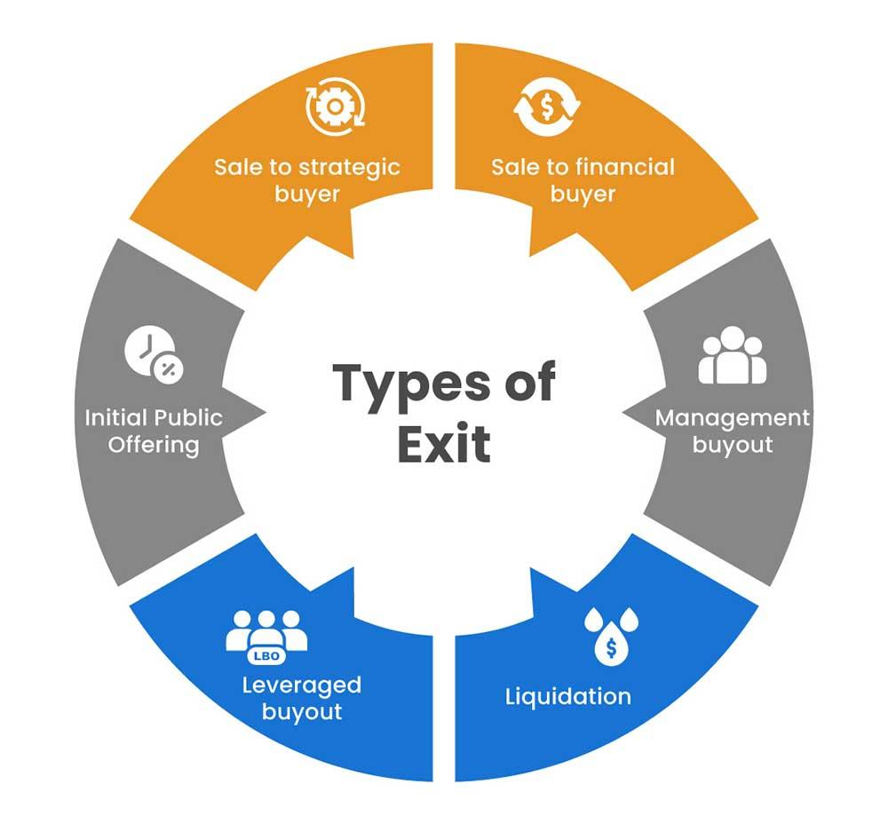

## Table of Contents

## What is an exit point in trading?

An exit point in trading is the price at which a trader decides to sell a stock or other financial asset. It's like setting a goal for when to get out of a trade, either to lock in profits or to cut losses. Traders use exit points to manage their investments better and avoid emotional decisions.

Choosing an exit point involves looking at the market, the asset's price movements, and the trader's own goals. For example, if a trader buys a stock at $50 and wants to make a $10 profit, they might set an exit point at $60. If the stock reaches $60, they sell and take their profit. If the stock starts dropping, they might also set an exit point to sell at $45 to limit their loss.

## Why is an exit point important in trading strategies?

An exit point is important in trading strategies because it helps traders make clear decisions about when to sell their investments. Without a set exit point, traders might hold onto a stock too long, hoping for more profit, or they might panic and sell too early. By deciding on an exit point ahead of time, traders can stick to their plan and avoid making choices based on emotions or sudden market changes.

Having a clear [exit](/wiki/exit-strategy) point also helps traders manage their risks better. It's like having a safety net. If the market turns against them, they know exactly when to get out to minimize their losses. This can protect their money and keep their trading strategy on track. Overall, exit points are a key part of a smart trading plan that can lead to more consistent results.

## What are the different types of exit points?

There are different types of exit points traders use, and each one has its own purpose. One type is a profit target exit point. This is when a trader decides to sell a stock when it reaches a certain price to make a profit. For example, if you buy a stock at $100 and want to make a $20 profit, you might set a profit target exit point at $120. When the stock hits $120, you sell it and take your profit.

Another type is a stop-loss exit point. This is used to limit losses. If a stock starts to drop, a trader can set a stop-loss exit point at a lower price. For instance, if you buy a stock at $100, you might set a stop-loss at $90. If the stock falls to $90, it automatically sells, so you don't lose more money. This helps protect your investment from big drops in the market.

There's also a trailing stop exit point, which is a bit more flexible. A trailing stop moves with the price of the stock. If the stock goes up, the trailing stop moves up too, but if the stock goes down, the trailing stop stays where it is. This way, you can lock in more profit as the stock rises, but still have a safety net if the stock starts to fall. For example, if you set a trailing stop at 10% below the stock's highest price, and the stock goes from $100 to $120, your trailing stop moves from $90 to $108. If the stock then drops to $108, it triggers the sale.

## How do you determine an exit point for a long position?

When you're figuring out an exit point for a long position, where you've bought a stock hoping it will go up, you need to think about your profit goals and how much risk you're okay with. A good way to do this is by setting a profit target. For example, if you buy a stock at $50 and want to make a $10 profit, you might set your exit point at $60. This way, when the stock hits $60, you sell it and take your profit. It's important to choose this number before you start trading so you don't get too greedy and miss out on making money.

Another important thing to consider is setting a stop-loss to protect yourself from losing too much money. If the stock starts to go down instead of up, you can set a stop-loss exit point at a lower price, like $45 if you bought at $50. This means if the stock falls to $45, it will automatically sell, so you don't lose more than you planned. Some traders also use a trailing stop, which moves up as the stock price goes up but stays where it is if the price goes down. This can help you lock in more profit while still having a safety net if the stock starts to drop.

## How do you determine an exit point for a short position?

When you're in a short position, you're betting that a stock's price will go down. To decide when to get out, you need to set an exit point just like with a long position, but you do it a bit differently. For a short position, you want to set a profit target at a lower price than where you started. For example, if you short a stock at $50 and want to make a $10 profit, you might set your exit point at $40. This means when the stock falls to $40, you buy it back and make your profit. It's important to pick this number before you start so you don't get too greedy and miss out on making money.

You also need to think about how much you're willing to lose if things don't go your way. That's where a stop-loss comes in. If the stock starts to go up instead of down, you can set a stop-loss at a higher price, like $55 if you shorted at $50. This means if the stock goes up to $55, it will automatically trigger a buy to close your short position, so you don't lose more than you planned. Some traders also use a trailing stop for short positions, which moves down as the stock price goes down but stays where it is if the price goes up. This can help you lock in more profit while still having a safety net if the stock starts to rise.

## What is a stop-loss order and how does it relate to exit points?

A stop-loss order is like a safety net for your investments. It's an order you place with your broker to sell a stock if it drops to a certain price. This way, you don't lose more money than you're okay with losing. For example, if you buy a stock at $100 and you set a stop-loss at $90, if the stock falls to $90, it will automatically sell, so you only lose $10 per share instead of more.

Stop-loss orders are closely related to exit points because they are one type of exit point. An exit point is just the price at which you decide to sell a stock, whether it's to make a profit or to cut losses. A stop-loss order is a specific kind of exit point that helps you manage risk by setting a limit on how much you're willing to lose. By using a stop-loss order, you can stick to your trading plan and avoid making emotional decisions when the market gets scary.

## Can you explain the concept of a take-profit order as an exit point?

A take-profit order is like setting a goal for when you want to sell a stock to make money. It's another type of exit point, but instead of protecting you from losing money like a stop-loss order, it helps you lock in your profits. For example, if you buy a stock at $50 and you want to make a $10 profit, you can set a take-profit order at $60. When the stock reaches $60, it will automatically sell, so you get your profit without having to watch the market all the time.

Using a take-profit order is a smart way to make sure you don't get too greedy and miss out on making money. It's easy to want to hold onto a stock hoping it will go even higher, but if you set a take-profit order, you can stick to your plan. This helps you make decisions based on what you decided ahead of time, not on your feelings or sudden changes in the market.

## How do trailing stops function as exit points?

Trailing stops are a special kind of exit point that move with the price of the stock. They help you lock in more profit as the stock goes up, but also protect you if the stock starts to go down. For example, if you buy a stock at $100 and set a trailing stop at 10%, it starts at $90. If the stock goes up to $120, the trailing stop moves up to $108, which is 10% below the new high. This way, you can keep making more money as the stock rises.

If the stock starts to fall, the trailing stop stays where it is. So, if the stock drops from $120 back to $108, the trailing stop would trigger a sale at $108. This means you still make a profit of $8 per share, even though the stock didn't keep going up. Trailing stops are great because they let you take advantage of rising prices but also give you a safety net if things start to go the other way.

## What are some common mistakes traders make with exit points?

One common mistake traders make with exit points is not setting them at all. Without an exit point, traders might hold onto a stock for too long, hoping it will go even higher, or they might panic and sell too early. This can lead to missed profits or bigger losses than they planned. It's important to decide on an exit point before you start trading so you can stick to your plan and not let emotions take over.

Another mistake is setting exit points too close to the current price. If a trader sets a stop-loss too close, it might get triggered by small, normal market movements, and they could end up selling too soon. On the flip side, if a trader sets a profit target too close, they might miss out on bigger gains. It's a balance to find the right exit points that match your goals and the market's behavior.

## How can technical analysis help in setting exit points?

Technical analysis can really help traders figure out good exit points by looking at charts and patterns. It's like using a map to find the best way to go. Traders use things like support and resistance levels, which are prices where the stock often stops going down or up. If a stock keeps bouncing off a certain price, that could be a good place to set an exit point. For example, if a stock always goes down to $50 and then goes back up, you might set your stop-loss just below $50 to cut your losses if it breaks that level.

Another way technical analysis helps is by using indicators like moving averages and the Relative Strength Index (RSI). These tools can show if a stock is overbought or oversold, which means it might be time to sell. If a stock's price is way above its moving average, it might be a good time to take some profit. Or, if the RSI shows the stock is overbought, you might set a take-profit order to sell before the price drops. By using these tools, traders can make smarter decisions about when to get out of a trade.

## What role does fundamental analysis play in deciding exit points?

Fundamental analysis looks at the real value of a company, like its earnings, growth, and overall health. This can help traders decide when to sell a stock by giving them a sense of if the stock is overvalued or undervalued. If a trader thinks a stock's price is much higher than what the company is really worth, they might set an exit point to sell and take their profit before the price drops back to a more reasonable level. On the other hand, if the stock's price is lower than the company's true value, a trader might hold onto it longer, waiting for the price to go up.

For example, if a company's earnings report shows it's not doing as well as expected, a trader might use that information to set a stop-loss exit point to cut their losses if the stock's price falls. By keeping an eye on the company's fundamentals, traders can make better decisions about when to get out of a trade. This way, they can avoid holding onto a stock that's going down because the company isn't doing well, and they can sell at the right time to either lock in profits or limit their losses.

## How do experienced traders adjust their exit points based on market volatility?

Experienced traders know that the stock market can be a wild ride, with prices going up and down a lot. They adjust their exit points based on how much the market is moving around, which is called [volatility](/wiki/volatility-trading-strategies). If the market is really volatile, meaning prices are changing a lot, traders might set their stop-loss orders a bit further away from the current price. This way, they avoid getting kicked out of a trade too soon because of normal ups and downs. They might also set their profit targets a bit higher, giving the stock more room to move around while still aiming to make money.

On the other hand, if the market is calm and not moving much, traders might set their exit points closer to the current price. This can help them lock in profits quicker and cut losses faster if the stock starts to move against them. By paying attention to how much the market is moving, experienced traders can make their exit points work better for them, helping them make more money and lose less.

## References & Further Reading

[1]: ["Advances in Financial Machine Learning"](https://www.amazon.com/Advances-Financial-Machine-Learning-Marcos/dp/1119482089) by Marcos Lopez de Prado.

[2]: ["Evidence-Based Technical Analysis: Applying the Scientific Method and Statistical Inference to Trading Signals"](https://www.amazon.com/Evidence-Based-Technical-Analysis-Scientific-Statistical/dp/0470008741) by David Aronson.

[3]: ["Machine Learning for Algorithmic Trading"](https://github.com/stefan-jansen/machine-learning-for-trading) by Stefan Jansen.

[4]: ["Quantitative Trading: How to Build Your Own Algorithmic Trading Business"](https://www.amazon.com/Quantitative-Trading-Build-Algorithmic-Business/dp/1119800064) by Ernest P. Chan.

[5]: ["Python for Finance: Analyze Big Financial Data"](https://books.google.com/books/about/Python_for_Finance.html?id=E93SBQAAQBAJ) by Yves Hilpisch.