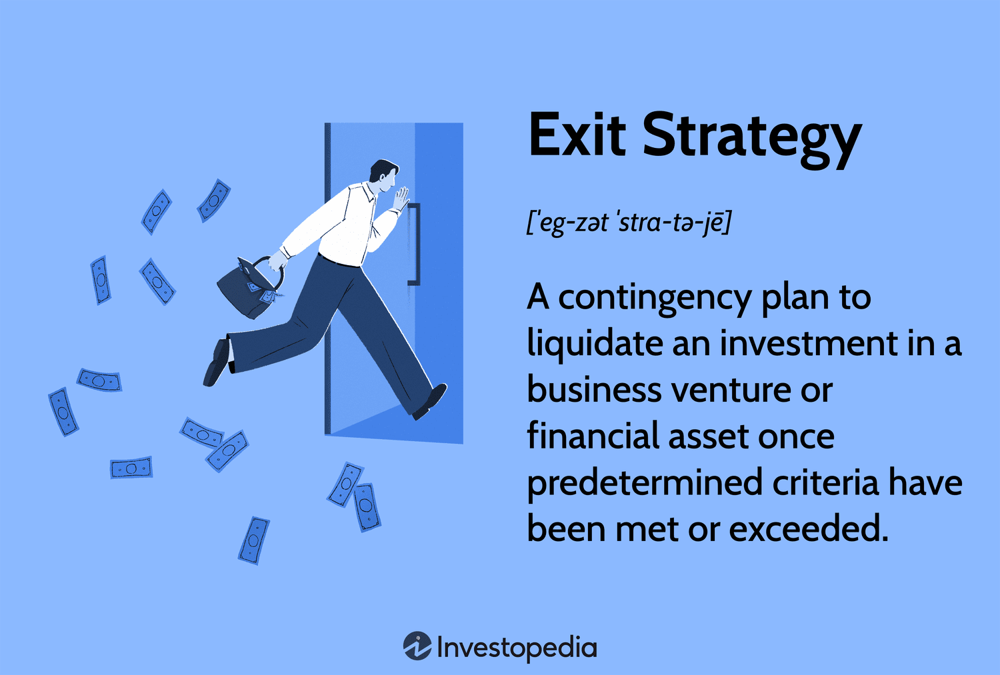

## Table of Contents

## What is an exit strategy in business and investment?

An exit strategy in business and investment is a plan for how you will leave or get out of a business or investment. It is like having a plan B or a way to end things when you need to. For business owners, an exit strategy could mean selling the business, passing it on to family, or closing it down. For investors, it could mean selling their shares or investments to get their money back, hopefully with a profit.

Having an exit strategy is important because it helps you prepare for the future and be ready for unexpected changes. It can make the process of leaving a business or investment smoother and less stressful. By thinking about your exit strategy early, you can make better decisions along the way and set yourself up for success, whether you are running a business or investing your money.

## Why is it important to have an exit strategy?

Having an exit strategy is important because it helps you plan for the future. It's like having a roadmap that shows you how to leave a business or investment when the time comes. This can make things easier and less stressful when you need to move on. Whether you're running a business or investing money, knowing how you'll exit can help you make better choices along the way.

An exit strategy also prepares you for unexpected changes. Life can be unpredictable, and having a plan in place means you're ready for whatever might happen. It can help you protect your money and make sure you can leave a business or investment on your terms. By thinking about your exit strategy early, you set yourself up for success and peace of mind.

## What are the different types of exit strategies?

There are several types of exit strategies that people can use when they want to leave a business or investment. One common type is selling the business or investment to someone else. This can be to another company, an investor, or even to the public through an initial public offering (IPO). Another type is passing the business on to family members or employees, which can keep the business going while allowing the owner to step away. A third type is liquidation, where the business is closed down and its assets are sold off to pay debts and distribute any remaining money.

Some exit strategies are more specific to investments. For example, investors might use a stop-loss order, which automatically sells an investment if its value drops to a certain level, helping to limit losses. Another strategy is to set a target price at which to sell an investment to lock in profits. In real estate, an exit strategy might involve selling the property, refinancing it to pull out cash, or renting it out to generate income. Each of these strategies has its own benefits and risks, and the best choice depends on the specific situation and goals of the person or business involved.

## How do you choose the right exit strategy for your business?

Choosing the right exit strategy for your business depends on what you want to happen in the future and what your business is like right now. Think about why you want to leave the business. Are you looking to retire, or do you want to start something new? Your goals will help you decide which exit strategy is best. For example, if you want to keep the business going after you leave, passing it on to family or employees might be a good choice. But if you want to get as much money as possible from the business, selling it to another company or going public with an IPO could be better.

You also need to think about what's happening with your business now. Is it making a lot of money and growing fast? If so, selling it might get you a good price. But if the business is struggling, you might need to liquidate it and sell off the assets. It's also important to look at the market and see what other people are doing. Talking to advisors like accountants or business brokers can help you understand your options better. By thinking about your goals and the current state of your business, you can pick an exit strategy that works best for you.

## What are the key considerations when planning an exit strategy?

When planning an exit strategy, it's important to think about why you want to leave your business. Are you retiring, or do you want to start a new project? Knowing your goals will help you choose the best way to exit. For example, if you want the business to keep going after you leave, passing it to family or employees might be a good choice. But if you want to make as much money as you can, selling the business to another company or going public might be better.

You also need to look at how your business is doing right now. Is it making a lot of money and growing fast? If so, selling it could get you a good price. But if the business is struggling, you might need to close it down and sell off the assets. It's also helpful to check what's happening in the market and see what other people are doing. Talking to experts like accountants or business brokers can give you good advice. By thinking about your goals and the current state of your business, you can plan an exit strategy that works best for you.

## How can an exit strategy impact the valuation of a business?

An exit strategy can really change how much a business is worth. If you plan to sell your business, having a good exit strategy can make it more attractive to buyers. Buyers like to see that the business is doing well and has a clear plan for the future. This can make them willing to pay more for it. On the other hand, if the business is not doing well and the exit strategy is to close it down and sell off the assets, the value might be lower because buyers see more risk and less potential for growth.

Also, the type of exit strategy you choose can affect the valuation. If you're thinking about passing the business to family or employees, the value might be based more on what the business earns each year rather than what someone might pay to buy it. But if you're planning to sell to another company or go public, the value could be higher because these buyers might see more ways to make money from the business. So, choosing the right exit strategy is important because it can make a big difference in how much your business is worth.

## What are the common mistakes to avoid when implementing an exit strategy?

One common mistake people make when implementing an exit strategy is not planning early enough. It's important to start thinking about your exit strategy as soon as you start your business or make an investment. Waiting until the last minute can lead to rushed decisions and missed opportunities. By planning early, you can make better choices and set yourself up for a smoother exit. Another mistake is not being flexible with your exit strategy. Things can change over time, so it's important to be ready to adjust your plan if needed. Sticking to a plan that no longer works can lead to problems and lower the value of your business or investment.

Another mistake to avoid is not understanding the true value of your business or investment. If you don't know what your business is worth, you might sell it for less than it's really worth or make other bad decisions. It's a good idea to get advice from experts like accountants or business brokers to help you figure out the value. Also, not communicating your exit strategy to key people like employees or investors can cause confusion and problems. Keeping everyone in the loop can make the transition easier and help keep the business running smoothly during the exit process.

## How do exit strategies vary between startups and established businesses?

Exit strategies for startups and established businesses can be quite different because they are at different stages of their life. Startups are usually newer and might not have a lot of money coming in yet. They often look for an exit strategy that can help them grow quickly. One common way is to get bought by a bigger company. This can give the startup's founders and investors a good return on their money. Another way is to go public with an IPO, but this is harder for startups because they need to show they can make money and grow. Startups might also think about merging with another company to become stronger together.

On the other hand, established businesses have been around for a while and usually have a steady flow of money. Their exit strategies might focus more on keeping the business going after the owner leaves. One way is to pass the business to family members or key employees who know how it works. Another way is to sell the business to another company or investor, but the price might be higher because the business is more stable and has a proven track record. Sometimes, if the business is not doing well, the owner might choose to close it down and sell off the assets. The main difference is that established businesses have more options and can plan their exit more carefully because they have more information about their business and the market.

## What role do investors play in the development and execution of an exit strategy?

Investors play a big role in both making and carrying out an exit strategy. When they put money into a business, they usually have an idea of how they want to get their money back. They might want the business to be sold to another company, go public with an IPO, or be passed on to someone else. Investors work with the business owners to make sure the exit strategy matches everyone's goals. They can give advice on when to exit and how to make the business more attractive to buyers. Their experience and knowledge can help the business grow and be ready for the exit.

During the exit process, investors keep a close eye on things to make sure everything goes smoothly. They help with the talks and deals to sell the business or go public. They also make sure that the business is doing well and hitting the targets needed for a good exit. If the business is not doing well, investors might help find other ways to exit, like selling off parts of the business or finding new buyers. Their support and guidance are key to making the exit strategy work well and getting the best results for everyone involved.

## How can market conditions influence the timing and type of an exit strategy?

Market conditions can really change when and how you decide to leave your business or investment. If the market is doing well, with lots of people buying and selling, it might be a good time to sell your business or investment. You could get a higher price because more people are interested. But if the market is not doing well, with fewer buyers and lower prices, it might be better to wait. Waiting could mean you get a better price later when the market gets better. So, watching the market can help you pick the right time to exit.

The type of exit strategy you choose can also depend on what's happening in the market. If the market is growing and there are a lot of companies looking to buy others, selling your business might be a good choice. You might even get a better deal if there's a lot of competition. But if the market is struggling, you might need to think about other ways to exit, like passing the business to family or closing it down and selling the assets. By keeping an eye on the market, you can choose an exit strategy that works best for your situation.

## What are the tax implications of different exit strategies?

When you decide to leave your business or investment, the way you do it can affect how much tax you have to pay. If you sell your business, you might have to pay capital gains tax on the money you make from the sale. This tax is on the profit you get, which is the selling price minus what you originally paid for the business. Sometimes, if you pass the business to family members, there might be less tax to pay, especially if you do it in a way that the tax rules allow. But if you close the business and sell off the assets, you could have to pay different taxes on the money you get from selling things like equipment or property.

The type of exit strategy you choose can also change the tax you owe. For example, if you decide to go public with an IPO, there might be taxes on the money you make from selling shares to the public. If you're an investor and you sell your shares, you'll also have to think about capital gains tax. In some cases, like if you're giving the business to employees, there might be special tax rules that can help you pay less. It's really important to talk to a tax expert before you decide on an exit strategy. They can help you understand all the tax rules and find the best way to leave your business or investment with the least amount of tax to pay.

## How can you prepare your business for a successful exit?

Preparing your business for a successful exit means getting it ready to be sold or handed over to someone else. Start by making sure your business is doing well. This means having good profits and a strong customer base. Keep your financial records neat and clear so anyone looking to buy your business can see how it's doing. It's also important to have a good team in place. If your employees are happy and skilled, it makes your business more attractive. Think about what makes your business special and make sure those things are clear to anyone who might want to take over.

Next, you need to plan your exit strategy carefully. Talk to experts like accountants or business brokers who can help you understand what your business is worth and how to make it even better. They can also help you find the right buyers or investors. Make sure you're ready for different ways to exit, like selling to another company, going public, or passing it to family. Keep an eye on the market to know when the best time to exit might be. By preparing well and planning ahead, you can make sure your business is ready for a successful exit.

## What are the exit strategies for investors?

Investors employ various exit strategies to manage portfolio risk and optimize returns. Among the popular approaches are the 1% rule, percentage-based exits, and time-based exits. These strategies are designed to provide a structured framework for decision-making by setting predefined conditions under which assets should be sold.

The 1% rule focuses on risk management by limiting any single investment's potential loss to 1% of the investor's total portfolio value. This is achieved by adjusting the position size of each trade based on [volatility](/wiki/volatility-trading-strategies) and current portfolio size. The formula can be expressed as:

$$
\text{Position Size} = \frac{\text{Portfolio Value} \times 0.01}{\text{Entry Price} - \text{Stop-Loss Price}}
$$

By adhering to this rule, investors can minimize the impact of individual losses on their overall portfolio.

Percentage-based exits define targets or stop-loss levels as a percentage of the entry price. For example, an investor may set a target profit of 10% above the entry price or a stop-loss of 5% below it. This method clearly outlines potential exits and ensures consistency across different investments. 

Time-based exits, another commonly used strategy, involve closing a position after a pre-specified duration, regardless of whether the price target or stop-loss has been reached. This approach helps in maintaining [liquidity](/wiki/liquidity-risk-premium) and reducing the emotional impact of market volatility by adhering to a temporal schedule. The Python snippet below illustrates a basic implementation of a time-based exit:

```python
from datetime import datetime, timedelta

# Example variables
entry_date = datetime.now()
holding_period = timedelta(days=30)  # 30-day time-based exit

# Function to check if it's time to exit the position
def check_time_based_exit(current_date):
    return current_date >= entry_date + holding_period

# Check for exit every day (hypothetical example)
current_date = datetime.now()
if check_time_based_exit(current_date):
    print("Time-based exit reached. Close the position.")
```

Effective exit strategies such as these are vital for maintaining investment discipline and emotional control. By having a plan, investors can avoid impulsive decisions that may arise from market fluctuations, thereby increasing the probability of achieving long-term financial goals. Furthermore, disciplined application and ongoing review of these strategies allow for adaptability to changing market conditions, enhancing the robustness of any investment strategy.

## References & Further Reading

[1]: Sahlman, William A., et al. *How Venture Capital Works*. Harvard Business Review, 1990.

[2]: Graham, Benjamin. *The Intelligent Investor*. Harper & Brothers, 1949.

[3]: Chan, Ernest P. *Algorithmic Trading: Winning Strategies and Their Rationale*. Wiley Trading, 2009.

[4]: ["Evidence-Based Technical Analysis: Applying the Scientific Method and Statistical Inference to Trading Signals"](https://www.amazon.com/Evidence-Based-Technical-Analysis-Scientific-Statistical/dp/0470008741) by David Aronson

[5]: ["Quantitative Trading: How to Build Your Own Algorithmic Trading Business"](https://www.amazon.com/Quantitative-Trading-Build-Algorithmic-Business/dp/1119800064) by Ernest P. Chan