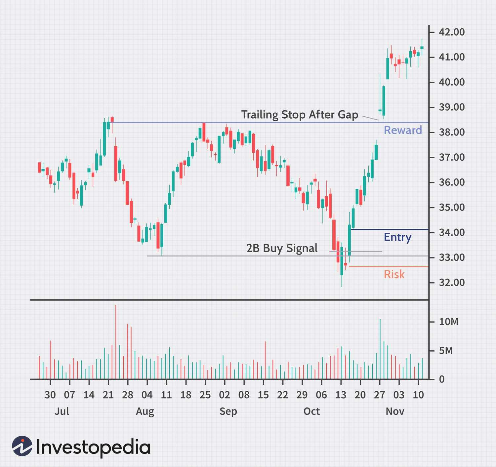

## Table of Contents

## What is an exit strategy in stock trading?

An exit strategy in stock trading is a plan that a trader makes to sell their stocks. It's like deciding when to get out of a game. The plan helps traders know when to sell their stocks to make a profit or to stop losing money. It's important because it helps traders not to make quick decisions based on feelings.

There are different types of exit strategies. One common type is setting a price target. This means the trader decides to sell the stock when it reaches a certain price. Another type is using a stop-loss order. This is when the trader sets a price at which the stock will be sold automatically if it drops to that price. This helps to limit how much money the trader can lose. Both methods help traders manage their investments better.

## Why is having an exit strategy important for stock investors?

Having an exit strategy is important for stock investors because it helps them make smart decisions about when to sell their stocks. Without a plan, investors might sell their stocks too early or too late, which can lead to missing out on profits or losing more money than they should. An exit strategy takes the emotion out of the decision-making process. Instead of panicking and selling when the stock market goes down, investors can stick to their plan and sell at the right time.

An [exit](/wiki/exit-strategy) strategy also helps investors manage risk. By setting clear rules for when to sell, like using a stop-loss order, investors can limit their losses. This is important because the stock market can be unpredictable, and prices can drop suddenly. Having a plan in place means investors can protect their money and avoid big losses. Overall, an exit strategy gives investors more control over their investments and helps them achieve their financial goals.

## What are the common types of exit strategies for stocks?

There are several common types of exit strategies that stock investors use. One popular strategy is setting a price target. This means an investor decides on a specific price at which they will sell their stock. If the stock reaches this price, the investor sells it to lock in their profit. It's like deciding to sell your toy when someone offers you the price you want. Another common strategy is using a stop-loss order. This is when an investor sets a price at which their stock will be sold automatically if it falls to that level. It helps to stop the investor from losing too much money if the stock price drops suddenly.

Another type of exit strategy is the trailing stop. This is similar to a stop-loss order, but the stop price moves up as the stock price increases. This way, investors can protect their profits while still giving the stock room to grow. For example, if a stock goes up, the trailing stop will move up too, but if the stock starts to fall, the trailing stop will stay at its highest point and sell the stock if it drops to that level. Lastly, some investors use a time-based exit strategy. This means they decide to sell their stock after a certain period, like six months or a year, regardless of the stock's performance. This can help investors stick to their long-term plans and not get swayed by short-term market changes.

## How can a beginner determine when to exit a stock position?

For a beginner, deciding when to exit a stock position can be tough, but having a plan can make it easier. One way to decide is by setting a price target. This means you pick a price that you think the stock will reach, and when it does, you sell it. It's like deciding to sell your toy when someone offers you the price you want. Another way is using a stop-loss order. This is when you set a price at which the stock will be sold automatically if it falls to that level. It helps to stop you from losing too much money if the stock price drops suddenly.

Another option for beginners is using a trailing stop. This is like a stop-loss order, but the stop price moves up as the stock price increases. This way, you can protect your profits while still giving the stock room to grow. For example, if the stock goes up, the trailing stop will move up too, but if the stock starts to fall, the trailing stop will stay at its highest point and sell the stock if it drops to that level. Finally, you might decide to sell your stock after a certain amount of time, like six months or a year, no matter how the stock is doing. This can help you stick to your long-term plans and not get swayed by short-term market changes.

## What role does stop-loss orders play in an exit strategy?

Stop-loss orders are a big part of an exit strategy because they help you sell your stock before you lose too much money. It's like setting a safety net for your investment. When you buy a stock, you can set a stop-loss order at a certain price. If the stock falls to that price, it will automatically sell, so you don't lose more than you planned. This is really helpful if the stock market suddenly drops and you're not watching your stocks all the time.

Using a stop-loss order takes the emotion out of deciding when to sell. Instead of panicking and selling at a bad time, the stop-loss order does it for you. It helps you stick to your plan and manage your risk better. By setting a stop-loss, you can feel more confident in your investments because you know you have a way to limit your losses if things go wrong.

## How do trailing stop orders enhance an exit strategy?

Trailing stop orders help make your exit strategy better by letting you protect your profits while still giving your stock a chance to grow. When you set a trailing stop, it moves up as the stock price goes up. This means if your stock keeps going up, the stop price will follow it, but if the stock starts to go down, the stop price stays where it was at its highest point. So, if the stock falls back to the stop price, it will sell automatically. This way, you can keep more of your gains without having to watch the stock all the time.

Using a trailing stop order can be really helpful because it takes the guesswork out of deciding when to sell. You don't have to keep changing your stop-loss order as the stock price changes. The trailing stop does it for you, making sure you can still make money if the stock keeps going up, but also protecting you if it starts to drop. It's like having a smart helper that watches your stock and sells it at the best time to keep your profits safe.

## What are the psychological factors to consider when executing an exit strategy?

When you're thinking about selling your stocks, your feelings can really affect what you do. It's easy to feel scared when the stock market goes down and want to sell everything quickly. But if you have a plan for when to sell, like a stop-loss order or a price target, it can help you not make choices based on how you feel at the moment. Sticking to your plan can help you stay calm and make better decisions, even when the market is going crazy.

Another thing to think about is how happy or sad you might feel after you sell your stocks. If you sell and then the stock price goes up, you might feel like you missed out and wish you had waited longer. On the other hand, if you sell and the price keeps going down, you might feel good that you got out in time. Knowing how you might feel after you sell can help you decide when to sell and stick to your plan, so you don't end up regretting your choices later.

## How can technical analysis be used to inform exit decisions?

Technical analysis can help you decide when to sell your stocks by looking at charts and patterns. It's like using a map to find the best time to leave a place. By studying the stock's price movements and other indicators, you can spot signs that tell you if the stock might go up or down. For example, if you see a pattern that usually means the stock price will drop, you might decide it's time to sell and avoid losing money. Technical analysis gives you clues about what might happen next, so you can make a smart exit plan.

Using technical analysis also helps you set specific points for selling your stocks. You can use tools like moving averages or support and resistance levels to decide when to get out. If the stock price goes below a certain moving average, it might be a sign to sell. Or if the price breaks through a support level, it could mean the stock will keep falling, so it's a good time to exit. By paying attention to these technical signals, you can make your exit strategy more precise and less based on guesswork or feelings.

## What are the tax implications of different exit strategies?

When you sell your stocks, you have to think about taxes. If you sell a stock and make money, that's called a capital gain. If you sell it for less than you paid, that's a capital loss. How long you hold onto the stock before selling it can change how much tax you pay. If you hold a stock for more than a year before selling, it's called a long-term capital gain, and you usually pay less tax on it. If you sell it in less than a year, it's a short-term capital gain, and you pay more tax on it, like your regular income tax.

Different exit strategies can affect your taxes in different ways. If you use a stop-loss order and sell your stock quickly, you might end up with a short-term capital gain or loss. This means you could pay more in taxes if you made a profit. On the other hand, if you set a price target and wait for the stock to reach that price, you might hold onto it for over a year, which could lead to a long-term capital gain and lower taxes. Knowing how your exit strategy might affect your taxes can help you plan better and keep more of your money.

## How should an investor adjust their exit strategy based on market volatility?

When the stock market is going up and down a lot, which is called market [volatility](/wiki/volatility-trading-strategies), you need to change your plan for selling your stocks. If the market is really jumpy, you might want to set your stop-loss orders a bit further away from the current stock price. This way, small drops in the stock price won't make you sell too soon. But if the market is calm, you can set your stop-loss closer to the current price, so you can sell quickly if the stock starts to fall.

Another thing to think about is how long you want to hold onto your stocks. When the market is very volatile, it might be a good idea to sell your stocks faster to avoid big losses. You can use a trailing stop order to help with this. It will move up with the stock price but sell if the price drops a lot. This can help you keep some of your profits even when the market is unpredictable.

## What advanced techniques can be used to optimize exit points in trading?

One advanced technique to find the best time to sell your stocks is using something called [algorithmic trading](/wiki/algorithmic-trading). This means you use a computer program to watch the stock market and make decisions for you. The program can look at lots of data really fast and find the perfect time to sell based on patterns and rules you set. This can help you sell at just the right moment, even when the market is moving quickly. It's like having a smart helper that can make decisions faster and better than you can by yourself.

Another technique is using options strategies. Options let you buy or sell a stock at a certain price in the future. You can use options to set up what's called a "covered call" or a "protective put." A covered call means you sell someone the right to buy your stock at a higher price, and if the stock goes up to that price, you sell it and make some extra money. A protective put means you buy the right to sell your stock at a certain price, so if the stock drops, you can still sell it for that price and not lose as much money. These strategies can help you make the most out of selling your stocks and protect you from big losses.

Lastly, you can use something called [backtesting](/wiki/backtesting). This is where you take your exit strategy and see how it would have worked in the past. By looking at old stock data, you can see if your plan would have made you money or saved you from losses. This helps you tweak your strategy to make it better. Backtesting is like practicing your game plan with old games to see what works best, so you can be ready for the real thing.

## How do professional traders develop and refine their exit strategies over time?

Professional traders work on their exit strategies all the time to make them better. They start by looking at what they did in the past and seeing what worked and what didn't. They might use a computer to go over old stock data and see if their plan would have made them money or saved them from losses. This is called backtesting. By doing this, they can change their plan to make it better for the future. They also keep learning new things and trying out different ways to sell their stocks, like using computer programs to help them or using options to protect their money.

Another thing professional traders do is watch the stock market closely and change their plans when things get crazy. If the market is moving a lot, they might set their stop-loss orders further away so they don't sell too soon. They also talk to other traders and read [books](/wiki/algo-trading-books) to learn new ideas. Over time, they mix all these things together to make a plan that fits them best. By always trying to get better and learning from their mistakes, they can make smart choices about when to sell their stocks and keep more of their money.

## References & Further Reading

- ["The Art and Science of Technical Analysis"](https://www.amazon.com/Art-Science-Technical-Analysis-Strategies-ebook/dp/B0088ETCOA) by Adam Grimes – Offers insights into market structure, price action, and trading strategies, including exit tactics.
- ["Trade Your Way to Financial Freedom"](https://www.amazon.com/Trade-Your-Way-Financial-Freedom/dp/007147871X) by Van K. Tharp – Focuses on developing personalized strategies, including detailed discussions on exit strategies.
- ["Technical Analysis of the Financial Markets"](https://www.amazon.com/Technical-Analysis-Financial-Markets-Comprehensive/dp/0735200661) by John J. Murphy – A comprehensive guide that includes how technical analysis can aid in determining effective exit points.
- ["The New Trading for a Living"](https://www.amazon.com/Study-Guide-Trading-Living-Wiley/dp/1118467450) by Dr. Alexander Elder: Provides insights on psychology, trading tactics, risk management, including exit strategies.
- ["A Beginner's Guide to Short-Term Trading"](https://www.amazon.com/Beginners-Guide-Short-Term-Trading/dp/1598695800) by Toni Turner: Focuses on technical analysis and strategies, including detailed discussions on exit points.
- ["High Probability Trading Strategies"](https://www.amazon.com/High-Probability-Trading-Strategies-Included/dp/B002WLSFIO) by Robert C. Miner: Offers an in-depth look into entry and exit strategies based on technical analysis.