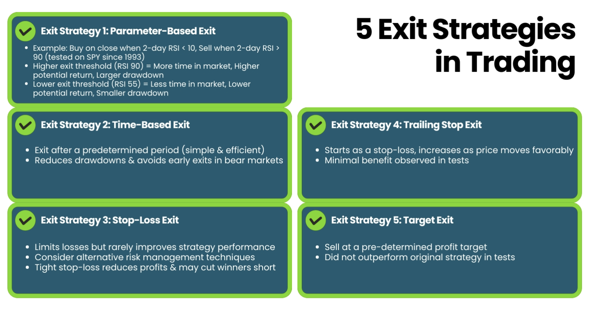

An exit strategy in stock trading is a predetermined plan for selling a security or liquidating an investment. It dictates when and under what conditions a trader will exit a position, ideally to maximize profit or minimize loss. Exit strategies are vital in trading as they remove emotional decision-making and increase discipline. By having a clear exit strategy, a trader can avoid common pitfalls like holding onto a losing position for too long or selling a profitable one too early. It involves setting specific criteria for closing out trades, which can be based on a variety of factors including profit targets, stop-loss orders, time-based exits, or changes in market conditions. The importance of an exit strategy cannot be overstated. It not only helps in protecting gains but also in reducing the risk of significant losses. An effective exit strategy requires careful planning and consideration of one's financial goals, risk tolerance, and market analysis. It's a fundamental component of a successful trading plan and is as important as the strategy used to enter a trade.

## Table of Contents

## Designing an Effective Exit Strategy

Personalizing your exit strategy in stock trading is a critical step towards ensuring it aligns with your individual trading goals and risk tolerance. Here's how these factors influence the design of your exit strategy:

- **Trading Goals**: Your trading goals determine what you want to achieve with each trade. Are you looking for short-term gains or long-term growth? For instance, a short-term trader might focus on quick profits and set tight exit points, while a long-term investor might set broader profit targets to capture larger market movements.
- **Risk Tolerance**: Risk tolerance varies widely among traders. A conservative trader will likely prefer a strategy that prioritizes capital preservation, utilizing tight stop-loss orders and quicker exits to minimize losses. On the other hand, a trader with a higher risk appetite might be willing to set wider stop-losses or wait longer for profit targets, accepting the potential of bigger drawdowns for greater returns.
- **Trading Style**: Whether you're a day trader, swing trader, or position trader, your trading style will greatly influence your exit strategy. Day traders might rely on time-based exits to close positions before the market closes, while swing traders may use a combination of technical indicators and market analysis to determine their exit points.
- **Market Knowledge and Experience**: Experienced traders might employ more complex strategies, such as using variable parameter-based exits, or combining multiple strategies for optimized exits. In contrast, beginners might start with simpler, more straightforward exit methods like basic stop-loss and target-based exits.
- **Capital Size**: The size of your trading capital also plays a role. Smaller accounts might need to manage risk more conservatively to avoid significant losses, while larger accounts might have more flexibility in experimenting with different exit strategies.
- **Market Conditions**: Different market conditions may require different exit approaches. In a highly volatile market, for instance, tighter stop-losses might be necessary to protect against sudden price swings.
- **Emotional Control**: Understanding your emotional response to trading is crucial. If you're prone to emotional decision-making, setting automated exit orders can help enforce discipline and prevent rash decisions based on fear or greed.
- **Lifestyle and Time Commitment**: Your availability to monitor trades can also affect your exit strategy. If you can’t constantly watch the market, automated exits or strategies that don’t require frequent monitoring might be more suitable.

Personalizing your exit strategy involves a careful consideration of your trading objectives, risk tolerance, trading style, experience, capital size, reaction to market conditions and emotions, and the time you can dedicate to trading.

The essential components of a good exit strategy in stock trading encompass several key elements:

- **Profit Targets**: Establishing profit targets is fundamental. It involves setting specific price levels at which you'll take profits, ensuring that profitable trades are closed at optimal points.
- **Stop Loss Orders**: Integral for risk management, stop loss orders automatically close a trade at a predetermined price level to prevent excessive losses. This tool is vital for safeguarding against market volatility and unexpected downturns.
- **Risk-to-Reward Ratio**: A crucial aspect of any exit strategy is the risk-to-reward ratio. This involves assessing the potential upside of a trade against its possible downside, aiming to only take trades where the potential reward justifies the risk.
- **Technical Indicators and Market Analysis**: Utilizing technical indicators and thorough market analysis can help in making informed decisions about when to exit a trade. Indicators such as moving averages, RSI, or Bollinger Bands can signal optimal exit points.
- **Trailing Stops**: Trailing stop orders are dynamic, adjusting with the market movements to lock in profits while allowing the trade to remain open as long as the price moves favorably.
- **Time-Based Criteria**: Sometimes, exit strategies are based on time factors, like exiting all positions before major financial announcements or closing trades at the end of the trading day to avoid overnight market risk.
- **Volume and Liquidity Considerations**: Understanding the market's volume and liquidity is also important, especially for large positions that could influence the market price when exiting.
- **Psychological Preparation and Discipline**: Sticking to the pre-set exit strategy requires discipline. It's important to avoid emotional decisions driven by fear or greed and adhere to the plan.
- **Flexibility and Adaptability**: While consistency is key, a trader should also be flexible and ready to adapt their exit strategy in response to changing market conditions or new information.
- **Regular Review and Adjustment**: Continuously reviewing and adjusting the exit strategy based on past performance and market changes ensures it remains effective and aligned with current market dynamics.

Incorporating these components helps in creating a balanced and effective exit strategy that aligns with individual trading styles, risk tolerance, and market conditions.

## Common Exit Strategies for Stocks

### Stop Loss Strategies

Stop loss strategies are a crucial element of risk management in stock trading. These strategies involve setting a predetermined level at which a trade will be closed to limit potential losses. Here’s an overview of how and when to use stop loss orders:

- **Defining a Stop Loss Order**: A stop loss order is an instruction to sell a stock when it reaches a specific price. This price is typically set below the purchase price for long positions and above the purchase price for short positions. The primary purpose is to limit potential losses on a position.
- **Setting the Stop Loss Level**: The key to a successful stop loss strategy is setting the stop loss level. This can be based on a percentage of your trading capital, a fixed dollar amount, or technical analysis indicators. For example, a trader might set a stop loss at 5% below the purchase price, aiming to limit the loss on the trade to 5% of their capital.
- **Using Trailing Stops**: Trailing stop orders are a dynamic form of stop loss that moves with the market price. As the stock price moves in a favorable direction, the trailing stop moves with it, but if the stock price moves against the position, the stop loss stays in place, protecting profits or limiting losses.
- **Market Conditions and Stop Losses**: Understanding current market conditions is vital for setting appropriate stop loss levels. In highly volatile markets, wider stop losses might be necessary to accommodate larger price swings.
- **Risk Management Integration**: Stop loss orders should be integrated into your overall risk management strategy, taking into account the size of your position, the volatility of the stock, and your overall portfolio risk.

### Scaling Exit Strategies

Scaling exit strategies involve gradually exiting a stock position in multiple increments, rather than selling the entire position at once. This method can help traders manage risk and potentially increase profits. Here’s how the process typically works:

- **Determining the Scaling Criteria**: Before implementing a scaling exit strategy, traders should decide on the criteria that will trigger each scale-out. This could be based on specific price targets, time intervals, or technical indicators.
- **Setting Multiple Exit Points**: Instead of having a single target price or stop loss, scaling involves setting multiple exit points at different levels. For example, if a trader buys a stock at $50, they might plan to sell 25% of the position at $55, another 25% at $60, and so on.
- **Managing Profits and Risks**: The advantage of scaling out is that it allows traders to lock in profits incrementally while still leaving room for additional gains. If the stock continues to rise, the trader benefits from the remaining position. Conversely, if the stock price starts to fall, the trader has already secured some profit.
- **Utilizing Trailing Stops**: Incorporating trailing stops in a scaling strategy can further protect profits. As the stock price moves higher, the trader can adjust the stop loss levels for the remaining shares upwards, thus safeguarding the unrealized profits.
- **Flexibility in Strategy**: Scaling out can be adapted to various trading styles and timeframes. Day traders might scale out in very short intervals, while long-term investors might do so over days or weeks.

### Time-Based Exits

Time-based exits are a strategic approach to closing stock positions based on a predetermined time frame, rather than price movements or other market indicators. This method offers several advantages for traders:

- **Risk Management**: Time-based exits can help manage risk by limiting the exposure to market fluctuations. If a stock hasn’t reached the desired profit level within a set time frame, exiting the position prevents potential losses from prolonged market downturns.
- **Simplifying Decision-Making**: By having a clear, time-based plan, traders can simplify their decision-making process. This is particularly useful for traders who may struggle with over-analysis or indecision.
- **Enhancing Portfolio Turnover**: For active traders, time-based exits can increase portfolio turnover, allowing capital to be reallocated more frequently to potentially more profitable opportunities.
- **Avoiding Overexposure**: Setting a specific time to exit a trade helps prevent overexposure to a single position, which can be risky, especially in volatile markets.
- **Seasonality and Timing Considerations**: This strategy can align with seasonal market trends or specific event-based timelines, like earnings reports or economic announcements.

### Target-Based Exits

Target-based exits are a critical component of a stock trader's exit strategy, revolving around the concept of setting predetermined price levels at which to close a position to secure profits. Here's how to effectively set and use profit targets:

- **Setting Profit Targets**: The first step is to determine the price level at which you aim to exit a trade profitably. This can be based on technical analysis, historical price levels, or a desired percentage return on the investment.
- **Analysis for Target Setting**: Utilize tools like resistance levels, Fibonacci retracement levels, or moving averages to identify potential target prices. Historical price data can also offer insights into where to set these targets.
- **Risk-Reward Ratio**: Ensure your profit target aligns with a favorable risk-reward ratio. A common approach is to aim for a profit that is at least twice the amount you are willing to risk (a 2:1 risk-reward ratio).
- **Adjusting for Volatility**: In more volatile markets, consider wider profit targets to accommodate larger price swings. Conversely, in less volatile markets, tighter targets may be more appropriate.
- **Scaling Out**: Instead of exiting the entire position at one target, you can scale out by selling portions of your holding at different price levels. This method can help in capturing profits while still leaving room for potential further upside.
- **Using Limit Orders**: To automate the execution of a target-based exit, use limit orders. Set the limit order at your profit target price, and the trade will be executed when the stock reaches that level.

### Trailing Stop Exits

Trailing stop exits are a dynamic and flexible type of exit strategy that adjusts automatically to the market movements, providing a balance between securing profits and allowing room for growth. Here’s how they work and their benefits:

- **Mechanism of Trailing Stops**: A trailing stop order sets a stop-loss level at a certain percentage or dollar amount below the market price for a long position (or above for a short position). As the market price moves favorably, the stop level adjusts accordingly, maintaining the set distance from the market price.
- **Automated Adjustment**: The key feature of a trailing stop is its ability to move automatically with the market price. For example, in a long position, if the stock price rises, the trailing stop rises with it, but if the stock price falls, the stop loss stays fixed.
- **Locking in Profits**: This strategy allows traders to secure profits while the stock price is on the rise. If the stock reverses trend, the trailing stop helps in exiting the trade, protecting the gains.
- **Risk Management**: Trailing stops are an excellent tool for managing risk. They limit potential losses without the need for constant market monitoring, as they automatically close the trade if the price reaches the trailing stop level.
- **Flexibility**: Traders can set the trailing stop distance according to their risk tolerance and trading strategy. This distance can be a fixed amount or a percentage of the stock price.
- **Suitability for Various Market Conditions**: Trailing stops can be effective in both trending and volatile markets. In a trending market, they help in capturing most of the trend, and in a volatile market, they protect against sudden downturns.

## Using Orders in an Exit Strategy

### Types of Orders

In stock trading, the types of orders you choose are crucial components of an effective exit strategy. Each order type serves a different purpose and offers various benefits and risks. Here's an overview of the most common types of orders used in exit strategies:

**Market Orders**

These orders are executed immediately at the current market price. Traders use market orders when they want to exit a position quickly. The primary advantage is the speed of execution, ensuring that the order will be filled, but the downside is that the execution price may be different from the last traded price, especially in volatile markets.

**Limit Orders**

A limit order specifies the exact price at which you want to close a position. It guarantees the price, but not the execution. Limit orders are useful when traders have a specific exit target in mind. However, in rapidly moving markets, there's a risk the order might not be executed if the stock price doesn't reach the specified limit price.

**Stop Orders (Stop Loss)**

This order type is set to execute when the stock hits a specified price, known as the stop price. When the stop price is reached, the stop order becomes a market order. Stop orders are essential for risk management, as they can limit potential losses. However, the execution price is not guaranteed to be the stop price, especially in volatile markets.

**Trailing Stop Orders**

Similar to stop orders, trailing stops automatically adjust as the stock price moves favorably. The trailing stop price is a specified distance from the current market price. The primary benefit is that it helps in protecting profits while giving the stock room to grow. The risk is similar to stop orders, where the final execution price may not match the expected price.

**Stop-Limit Orders**

This order type combines the features of stop orders and limit orders. It triggers a limit order to sell once the stock reaches a certain stop price. While it offers more control over the price at which you exit, there is a risk that the order may not get filled if the stock price doesn’t meet the limit conditions.

**Good-Till-Canceled (GTC) Orders**

This order type remains active until it is executed or manually canceled. It can be applied to both limit and stop orders. GTC orders are beneficial for traders who do not want to re-enter their exit orders daily but require continuous monitoring to ensure they still align with the trading strategy.

**Day Orders**

These orders are only valid for the trading day on which they're placed. If not executed, they expire at the end of the trading day. Day orders are useful for traders who prefer to make decisions based on the day's market conditions without leaving open orders overnight.

**Conditional Orders**

These orders are executed when specific conditions, set by the trader, are met. They can be complex and are typically used by more experienced traders. Conditional orders offer a high degree of flexibility and control over trading strategies.

Understanding these different order types and how they can be applied to your exit strategy is crucial. They offer varying levels of control over the exit price and timing, which can significantly impact the profitability and risk of your trading strategy.

### Automated vs. Manual Orders

In stock trading, whether to use automated or manual orders for exit strategies is a significant decision. Both methods have their advantages and disadvantages, and the choice often depends on individual trading styles, preferences, and goals. Here's a breakdown of the pros and cons of each approach:

**Automated Orders**

**Manual Orders**

**Pros:**

1. **Consistency and Discipline**: Automated orders help maintain discipline in trading by executing pre-planned strategies without emotional interference. They're especially useful in volatile markets where quick reactions are crucial.
2. **Time Efficiency**: Once set, automated orders execute trades without the need for constant monitoring. This is particularly beneficial for traders who cannot watch the market throughout the trading session.
3. **Speed**: Automated orders can be executed more quickly than manual orders. In fast-moving markets, this speed can be the difference between a successful exit and a missed opportunity.
4. **Strategy Implementation**: Automated orders allow traders to implement complex strategies that would be difficult to execute manually.

**Pros:**

1. **Control and Flexibility**: Manual order execution gives traders more control and the ability to respond to market changes or news events in real-time.
2. **Discretion**: Traders can use their judgment and experience to decide the best time to execute an order, which can be particularly useful in illiquid or less efficient markets.
3. **Learning and Experience**: Manually managing trades can provide valuable learning experiences and a deeper understanding of market dynamics.

**Cons:**

1. **Lack of Flexibility**: Automated orders follow set rules and cannot adjust to sudden market changes or unexpected events unless pre-programmed to do so.
2. **Technical Failures**: Dependence on technology means that system malfunctions or connectivity issues can disrupt trading strategies.
3. **Over-Optimization**: There's a risk of over-optimizing an automated strategy to past market conditions, which may not be effective in future markets.

**Cons:**

1. **Emotional Biases**: Manual trading is susceptible to emotional and psychological biases, which can lead to inconsistent execution of a trading plan.
2. **Time-Consuming**: Constant market monitoring and manual order execution can be time-consuming and impractical for some traders, especially those with other commitments.
3. **Speed**: Manual execution is often slower than automated processes, which can result in missed opportunities in fast-moving markets.
4. **Human Error**: The risk of making mistakes increases with manual order execution, especially in stressful or fast-paced market conditions.

In conclusion, the choice between automated and manual orders in exit strategies depends on individual trading style, risk tolerance, and the specific requirements of the trading plan. A balanced approach, utilizing both methods where appropriate, can often be the most effective strategy.

## Advanced Exit Strategies

### Volatility-Based Approaches

Incorporating volatility-based approaches into stock exit strategies can significantly enhance trading decisions, especially in markets characterized by unpredictable price movements. One of the most effective tools in this regard is the Average True Range (ATR) indicator. Let's deep dive into how ATR can be used to inform exit strategies:

**Understanding ATR**

The Average True Range (ATR) is a technical analysis tool that measures market volatility by decomposing the entire range of an asset price for that period. Here's how it works:

ATR calculates the average of true ranges over a specified number of periods. The true range extends beyond just the day's high minus the day's low to include the previous day's closing price if it was outside of the current day's range.

A high ATR value indicates high volatility, while a low ATR signals less market volatility. Traders can use this information to adjust their exit strategies according to the prevailing market conditions.

**Utilizing ATR in Exit Strategies**

ATR can help in setting more accurate stop-loss orders. For instance, a trader might set a stop loss at a point that is a multiple of the current ATR below the entry price for a long position. This method helps to keep the stop loss in line with the market’s volatility.

Similarly, ATR can inform the setting of realistic profit targets. In a high volatility market, wider profit targets might be more appropriate, whereas in a low volatility scenario, tighter targets could be more effective.

Trailing stop orders can be dynamically adjusted using ATR values. By setting the trailing stop at a factor of the current ATR, the stop level adjusts to the market’s volatility, potentially protecting profits while allowing room for the trade to move.

The effectiveness of ATR varies across different time frames. Short-term traders might use a shorter period for ATR calculation, while long-term traders may prefer a longer period to smooth out short-term fluctuations.

ATR is most effective when combined with other indicators and strategies. For example, it can be used alongside trend indicators to identify potential exit points during volatile trend reversals.

### Variable Parameter-Based Exits

In the realm of stock trading, variable parameter-based exits stand out as a dynamic and flexible approach, leveraging multiple market parameters to pinpoint the optimal timing for exiting trades. This method involves analyzing a variety of market factors, beyond just price, to make informed decisions. Let’s break down how traders can effectively use variable parameter-based exits:

**Understanding Variable Parameters**

Variable parameters in stock trading are diverse factors that can influence the decision to exit a position. These parameters include:

1. **Price Volatility**: Observing changes in price volatility can signal an opportune time to exit. Increased volatility might suggest market instability, prompting an exit.
2. **Volume Analysis**: Trading volume can indicate the strength or weakness of a trend. A decrease in volume following a price increase might suggest waning interest, signaling a potential exit.
3. **Economic Indicators**: Macroeconomic data like interest rates, employment figures, or inflation rates can impact market sentiment and influence exit decisions.
4. **Company Fundamentals**: For individual stocks, changes in company fundamentals like earnings reports, leadership changes, or industry shifts can be crucial parameters.
5. **Technical Indicators**: Utilizing a range of technical indicators, such as moving averages, RSI, or MACD, helps in identifying potential exit points based on market trends and momentum.

**Implementing Variable Parameter-Based Exits**

The most effective use of variable parameters involves combining several factors to corroborate exit signals. For example, a trader might consider exiting a position when both the RSI indicates overbought conditions, and there’s a noticeable decrease in trading volume.

Establish specific thresholds for each parameter to trigger an exit. For instance, setting a volume threshold below which a position will be exited can automate the process and remove emotional bias.

Variable parameter-based exits are especially beneficial in adapting to changing market conditions. As market dynamics shift, so can the parameters and thresholds used for exits.

Before implementing this strategy in live trading, backtesting with historical data is crucial. This helps in fine-tuning parameters and thresholds to the trader's specific trading style and goals.

These strategies require regular monitoring and adjustments as market conditions evolve and new information becomes available.

## Combining Multiple Strategies

Merging diverse exit strategies in stock trading can significantly boost the effectiveness of your trading plan. This synergistic approach tailors a more robust, adaptable strategy, aligning with varied market conditions and personal trading objectives. Let's deep dive into how traders can skillfully blend multiple exit strategies:

- **Balancing Risk and Reward**: Combining strategies like stop-loss with trailing stops can balance risk management with profit maximization. For instance, a trader might set a stop-loss to safeguard against substantial losses and a trailing stop to capture profits if the stock price continues to rise.
- **Diversifying Time Horizons**: Integrating time-based exits with target-based strategies allows traders to benefit from both short-term fluctuations and long-term trends. A trader could employ a time-based exit for part of their position to capitalize on short-term gains, while leaving the remainder for potential long-term appreciation.
- **Adapting to Volatility**: Pairing volatility-based approaches with variable parameter-based exits helps navigate different market volatility levels. In high volatility scenarios, using wider stop-loss margins or ATR-based exits can prevent premature exits due to market noise.
- **Using Complementary Indicators**: Leveraging various technical indicators together, like combining moving averages with RSI or MACD, provides a more comprehensive view for exit decisions. Each indicator’s signal can validate the other, enhancing the decision-making process.

## Conclusion

In this comprehensive guide, we've explored the crucial role of exit strategies in the realm of stock trading. An effective exit strategy, tailored to an individual's trading goals and risk tolerance, is a cornerstone of successful trading. We've delved into various exit strategies, such as stop loss orders, scaling exits, time-based, target-based, and trailing stop exits, each offering unique advantages to safeguard investments and maximize profits.

The use of different types of orders, including market, limit, and stop orders, and the choice between automated and manual orders, were also highlighted, emphasizing the pros and cons of each in the context of an exit strategy. The significance of market timing and holding periods was examined, underscoring their impact on the effectiveness of exit strategies.

Advanced strategies, including volatility-based approaches and variable parameter-based exits, were discussed, providing insight into how they can enhance traditional exit methods. The importance of synergizing multiple strategies was also emphasized, with real-life case studies illustrating their effectiveness.

In developing an exit strategy plan, a step-by-step approach was presented, stressing the importance of testing and adjusting strategies based on performance. Practical tips and best practices were shared to help traders implement and adhere to their exit strategies effectively.

Finally, we addressed common FAQs, providing clear, concise answers to help traders navigate the complexities of exit strategies. The ultimate takeaway is clear: a well-defined and consistently applied exit strategy is vital for navigating the stock market successfully and achieving trading objectives.

Remember, the art of strategic exits lies in the balance between disciplined risk management and the flexibility to adapt to changing market conditions. By mastering this balance, traders can navigate the stock market with greater confidence and success.

## Frequently Asked Questions

**What is an exit strategy in stock trading?**

An exit strategy in stock trading is a plan or set of criteria that dictates when to sell a security to either lock in profits or cut losses. It's a critical part of a trader's overall risk management.

**How important is it to have an exit strategy?**

Having an exit strategy is essential for successful trading. It helps traders manage risk, protect profits, minimize losses, and make objective decisions in the heat of the market.

**When should I set my exit strategy?**

Ideally, an exit strategy should be planned before entering a trade. This pre-planning helps avoid emotional and impulsive decisions based on market fluctuations.

**What are some common types of exit strategies?**

Common exit strategies include stop loss orders, scaling out of positions, time-based exits, target-based exits, and trailing stop exits.

**How do I choose the right exit strategy for me?**

Choosing the right exit strategy depends on your trading style, risk tolerance, investment goals, and the specific characteristics of the stock you are trading.

**Can I change my exit strategy mid-trade?**

While it's advisable to stick to your initial plan, you may adjust your exit strategy mid-trade if there are significant changes in the market or in your investment objectives.

**What's a stop loss order, and how do I use it?**

A stop loss order is an order placed with a broker to sell a security when it reaches a specific price. It's used to limit a trader's loss on a position.

**What are trailing stops, and how do they work?**

Trailing stops are a type of stop loss order that moves with the market price. They allow profits to run while protecting against significant losses.

**How can I determine the best time to exit a trade?**

The best time to exit a trade can be determined by your exit strategy criteria, which might include reaching a profit target, hitting a stop loss level, or specific market indicators or events.

**Should I use automated or manual orders for my exit strategy?**

The choice between automated and manual orders depends on your trading style and comfort with technology. Automated orders can help enforce discipline, while manual orders offer more control.

**What role does market timing play in exit strategies?**

Market timing can be critical in exit strategies, particularly for short-term traders. It involves analyzing market trends and economic indicators to make informed exit decisions.

**Can exit strategies be applied to all types of trading?**

Yes, exit strategies are applicable across various trading types, including day trading, swing trading, and long-term investing. However, the specifics of the strategy may vary based on the trading type.

**How often should I review my exit strategy?**

Regular review of your exit strategy is important, especially in response to changes in market conditions or personal financial goals.

**Are exit strategies only for limiting losses?**

No, exit strategies are not only for limiting losses but also for protecting profits. A good exit strategy helps in realizing gains at the optimal time.

**How do I balance risk and reward in my exit strategy?**

Balancing risk and reward involves setting stop losses at a level that minimizes potential losses while also allowing enough room for the stock to fluctuate without prematurely exiting the trade.

## References & Further Reading

- ["The Art and Science of Technical Analysis"](https://www.amazon.com/Art-Science-Technical-Analysis-Strategies-ebook/dp/B0088ETCOA) by Adam Grimes – Offers insights into market structure, price action, and trading strategies, including exit tactics.
- ["Trade Your Way to Financial Freedom"](https://www.amazon.com/Trade-Your-Way-Financial-Freedom/dp/007147871X) by Van K. Tharp – Focuses on developing personalized strategies, including detailed discussions on exit strategies.
- ["Technical Analysis of the Financial Markets"](https://www.amazon.com/Technical-Analysis-Financial-Markets-Comprehensive/dp/0735200661) by John J. Murphy – A comprehensive guide that includes how technical analysis can aid in determining effective exit points.
- ["The New Trading for a Living"](https://www.amazon.com/Study-Guide-Trading-Living-Wiley/dp/1118467450) by Dr. Alexander Elder: Provides insights on psychology, trading tactics, risk management, including exit strategies.
- ["A Beginner's Guide to Short-Term Trading"](https://www.amazon.com/Beginners-Guide-Short-Term-Trading/dp/1598695800) by Toni Turner: Focuses on technical analysis and strategies, including detailed discussions on exit points.
- ["High Probability Trading Strategies"](https://www.amazon.com/High-Probability-Trading-Strategies-Included/dp/B002WLSFIO) by Robert C. Miner: Offers an in-depth look into entry and exit strategies based on technical analysis.