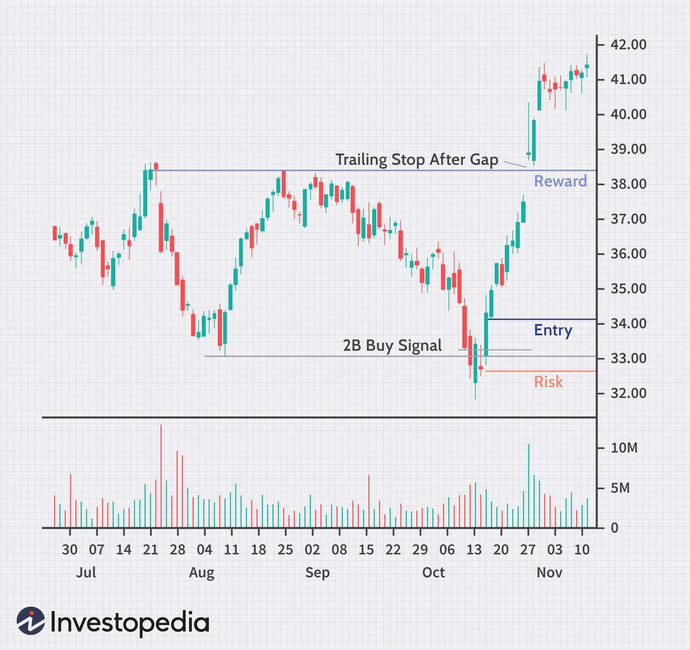

## Table of Contents

## What is an exit trading strategy?

An exit trading strategy is a plan that traders use to decide when to sell their investments. This strategy helps traders know when to get out of a trade to either lock in profits or cut losses. It's important because it can help traders avoid big losses and make the most out of their gains.

There are different types of exit strategies. Some traders use a stop-loss order, which automatically sells the investment if its price drops to a certain level. Others might use a take-profit order, which sells the investment when it reaches a target price. The key is to choose a strategy that fits your trading goals and risk tolerance.

## Why are exit strategies important in trading?

Exit strategies are important in trading because they help you decide when to sell your investments. This is crucial for making sure you don't lose too much money. If you don't have a plan for when to get out, you might hold onto a losing investment for too long, hoping it will turn around. But if it keeps dropping, you could lose a lot. An exit strategy helps you set a point where you'll sell, even if the price is lower than you hoped, so you can limit your losses.

On the flip side, exit strategies also help you lock in your profits. If you have a plan for when to sell when your investment is doing well, you can make sure you don't miss out on the gains you've made. Without an exit strategy, you might get greedy and wait too long, only to see the price drop again. By setting a clear goal for when to sell, you can take your profits and feel good about your trading decisions.

## What are the basic types of exit strategies for beginners?

For beginners, one of the simplest exit strategies is the stop-loss order. This means setting a price at which you will automatically sell your investment if it starts to lose too much value. For example, if you buy a stock at $50, you might set a stop-loss at $45. If the stock price drops to $45, it will sell automatically, helping you limit your losses. This is a good way to protect your money from big drops in the market.

Another basic exit strategy is the take-profit order. This is when you set a price at which you will sell your investment to lock in your profits. For instance, if you buy a stock at $50 and it goes up to $60, you might set a take-profit order at $60 to make sure you sell and keep your gains. Using a take-profit order helps you not miss out on the money you've made if the price suddenly goes down again.

Both stop-loss and take-profit orders can be set up easily with most trading platforms. They help beginners make clear decisions about when to sell, without having to watch the market all the time. By using these strategies, you can trade more confidently and manage your risks better.

## How can a stop-loss order be used as an exit strategy?

A stop-loss order is a tool that helps you sell your investment if its price starts to drop too much. When you set a stop-loss, you pick a price that you're okay with losing. For example, if you buy a stock at $50, you might set a stop-loss at $45. This means if the stock price goes down to $45, it will automatically sell. This helps you limit how much money you can lose on a trade, which is really important for managing your risks.

Using a stop-loss order as an exit strategy can give you peace of mind. You don't have to watch the market all the time because the stop-loss will do the work for you. It's like having a safety net that catches you if the price falls too far. By setting a stop-loss, you make sure you won't lose more money than you're comfortable with, and this can help you trade more confidently.

## What is a take-profit order and how does it function as an exit strategy?

A take-profit order is a way to sell your investment when it reaches a price you're happy with. For example, if you buy a stock at $50 and it goes up to $60, you can set a take-profit order at $60. This means that when the stock hits $60, it will automatically sell. This helps you lock in your profits without having to watch the market all the time.

Using a take-profit order as an exit strategy helps you make sure you don't miss out on the money you've made. If you didn't have a take-profit order, you might wait too long hoping for an even higher price, and then the stock could drop again. By setting a take-profit order, you can feel good knowing you've made a smart decision to take your profits at a price you're happy with.

## How can trailing stops improve the effectiveness of exit strategies?

Trailing stops can make your exit strategies work better by letting you lock in profits while still giving your investment room to grow. A trailing stop moves up with the price of your investment. For example, if you buy a stock at $50 and set a trailing stop of $5, the stop will move up as the stock price goes up. If the stock goes to $60, your trailing stop will be at $55. This means you can keep making money as the price goes up, but if it starts to drop, you'll sell before losing too much.

Using trailing stops can help you not miss out on big gains. They let you stay in a trade longer if the price keeps going up, but they also protect you if the price suddenly drops. This way, you don't have to watch the market all the time. You can set your trailing stop and feel confident that it will help you sell at the right time, whether the market is going up or down.

## What are some common mistakes to avoid when implementing exit strategies?

One common mistake when using exit strategies is setting your stop-loss or take-profit orders too tight. If you set them too close to the current price, your investment might get sold too soon because of small ups and downs in the market. This can make you miss out on bigger gains if the price keeps going up after your order sells. It's important to think about how much the price might move and set your orders at a level that gives your investment room to grow.

Another mistake is not sticking to your plan. Sometimes, people see the price moving and decide to change their stop-loss or take-profit orders. This can lead to big losses if the market goes against them. It's better to set your exit strategy and follow it, even if it's hard to watch the price move. Sticking to your plan helps you manage your risks and make better trading decisions in the long run.

## How do advanced traders use technical indicators to refine their exit strategies?

Advanced traders often use technical indicators to make their exit strategies even better. They look at things like moving averages, the Relative Strength Index (RSI), and the Moving Average Convergence Divergence (MACD) to help them decide when to sell. For example, if a stock's price falls below its moving average, it might be a sign that it's time to sell. Or, if the RSI shows that a stock is overbought, a trader might set a take-profit order to lock in their gains before the price drops.

These traders also combine different indicators to get a clearer picture of when to exit a trade. They might use the MACD to spot changes in momentum and the RSI to check if a stock is overbought or oversold. By looking at these signals together, they can set their stop-loss and take-profit orders more accurately. This helps them sell at the best possible time, whether they're trying to avoid big losses or make sure they keep their profits.

## Can you explain the concept of a 'mental stop' and its application in trading?

A 'mental stop' is when a trader decides in their mind when they will sell an investment, instead of setting an automatic order. It's like making a promise to yourself that if the price of your stock hits a certain low point, you'll sell it. This can be useful if you want to keep a closer eye on the market and make decisions based on what you see happening in real-time.

Using a mental stop means you have to be more involved and watch the market closely. It can be good because it lets you react to new information or changes in the market that an automatic order might miss. But it can also be risky because you might not sell when you should if you're not paying attention or if you get too attached to the investment. So, it's important to be disciplined and stick to your plan when using a mental stop.

## How do market conditions influence the choice of exit strategies?

Market conditions play a big role in deciding which exit strategy to use. When the market is going up a lot, you might want to use a take-profit order to lock in your gains. If the market is really moving fast, you could set your take-profit a bit higher to catch more of the rise. But if the market is going down or is really shaky, you might want to use a stop-loss order to protect your money. In a falling market, setting a tighter stop-loss can help you sell before the price drops too far.

Sometimes, the type of market you're in can change how you use your exit strategies. In a market that moves sideways, with prices not going up or down a lot, you might use a trailing stop. This lets you keep your investment if the price stays the same or goes up a little, but it will sell if the price starts to drop. Knowing the market conditions helps you pick the right exit strategy to either make the most money or lose the least.

## What role does risk management play in designing effective exit strategies?

Risk management is super important when you're figuring out your exit strategies in trading. It's all about making sure you don't lose too much money. When you set up your exit strategy, you need to think about how much risk you're okay with. That means deciding where to put your stop-loss order so you can sell your investment if it starts to lose too much value. By doing this, you can keep your losses small and protect your money.

Also, risk management helps you make the most of your profits. You can use a take-profit order to sell your investment when it reaches a price you're happy with. This way, you lock in your gains and don't miss out on the money you've made. By thinking about risk when you plan your exit strategies, you can trade more safely and feel more confident about your decisions.

## How can traders backtest and optimize their exit strategies for better performance?

Traders can backtest their exit strategies by looking at how well they would have worked in the past. They can use special software or trading platforms that let them run their strategies on old market data. This way, they can see if their stop-loss and take-profit orders would have made them money or saved them from big losses. By doing this, traders can find out what works and what doesn't, and then make their strategies better.

After [backtesting](/wiki/backtesting), traders can optimize their exit strategies by making small changes and testing them again. They might try different levels for their stop-loss and take-profit orders to see which ones give the best results. It's important to keep testing and adjusting until they find the best way to exit their trades. This helps them make more money and lose less, making their trading more successful in the long run.

## What is the Importance of Exit Strategies?

Exit strategies are vital components in the context of trading, enabling risk management and profit maximization. The parameters set by exit strategies dictate when a position should be closed, which can alter the final outcome of a trade significantly. By effectively specifying these parameters, traders can safeguard against substantial losses and guarantee that profits are realized at optimal points in time.

For instance, in a basic stop-loss strategy, a trader might decide to close a position if a certain loss threshold, say 5% below the purchase price, is breached. Mathematically, this can be expressed as:

$$
\text{Exit Price} = \text{Entry Price} \times (1 - \text{Stop-Loss Percentage})
$$

Where a trade is exited once the market reaches this exit price.

In [algorithmic trading](/wiki/algorithmic-trading), exit strategies are typically predefined within algorithms, allowing them to eliminate emotional biases from the decision-making process. This automation results in a more disciplined and consistent trading approach. Algorithms can incorporate dynamic exit strategies, such as trailing stops, where the stop price is adjusted based on market movements to lock in profits while offering a cushion against sudden reversals:

```python
def trailing_stop(current_price, initial_stop_price, trailing_percentage):
    new_stop_price = max(initial_stop_price, current_price * (1 - trailing_percentage))
    return new_stop_price
```

This example of a trailing stop function demonstrates how the stop price is adjusted with market price increases, maintaining a set distance determined by the trailing percentage.

By using well-defined [exit](/wiki/exit-strategy) strategies, traders can enhance the precision of their trading operations, minimize the impact of market [volatility](/wiki/volatility-trading-strategies), and ultimately, achieve improved trading outcomes.

## What are some case studies and examples?

Case studies in trading provide valuable insights into the practical application of exit strategies. Various exit strategies can be employed to maximize effectiveness, and their evaluation often relies on backtesting to determine metrics such as profit [factor](/wiki/factor-investing) and maximum drawdown.

One common exit strategy involves using moving average crossovers. This strategy typically uses two moving averages: one short-term and one long-term. An entry signal is generated when the short-term moving average crosses above the long-term moving average, indicating a potential uptrend. Conversely, an exit signal is generated when the short-term moving average crosses below the long-term moving average, signaling a potential downtrend. The effectiveness of this strategy can be assessed through backtesting. Metrics such as profit factor, the ratio of gross profit to gross loss, and maximum drawdown, the peak loss from the highest to the lowest point in the account balance, are crucial for evaluation. A higher profit factor and a lower maximum drawdown indicate a more robust trading strategy.

Another commonly used exit strategy utilizes the Relative Strength Index (RSI). RSI is a [momentum](/wiki/momentum) oscillator that measures the speed and change of price movements. It ranges from 0 to 100 and is often used to identify overbought or oversold conditions. A trader might exit a position when the RSI reaches specific levels, such as above 70, indicating an overbought condition, or below 30, signifying an oversold condition. The RSI-based strategy can also be backtested to evaluate its effectiveness using the same metrics as the moving average crossover strategy.

An example of Python code implementing a backtest for these exit strategies is shown below:

```python
import pandas as pd
import numpy as np

def moving_average_strategy(data, short_window, long_window):
    signals = pd.DataFrame(index=data.index)
    signals['signal'] = 0.0

    signals['short_mavg'] = data['Close'].rolling(window=short_window, min_periods=1, center=False).mean()
    signals['long_mavg'] = data['Close'].rolling(window=long_window, min_periods=1, center=False).mean()

    # Create signals
    signals['signal'][short_window:] = np.where(signals['short_mavg'][short_window:] > signals['long_mavg'][short_window:], 1.0, 0.0)   
    signals['positions'] = signals['signal'].diff()
    return signals

def rsi_strategy(data, window=14):
    delta = data['Close'].diff(1)
    delta = delta[1:]
    up, down = delta.clip(lower=0), -delta.clip(upper=0)

    avg_gain = up.rolling(window=window, min_periods=1).mean()
    avg_loss = down.rolling(window=window, min_periods=1).mean()

    rs = avg_gain / avg_loss
    rsi = 100 - (100 / (1 + rs))

    signals = pd.DataFrame(index=data.index)
    signals['rsi'] = rsi

    # Create signals
    signals['signal'] = np.where(signals['rsi'] < 30, 1.0, 0.0)
    signals['signal'] = np.where(signals['rsi'] > 70, -1.0, signals['signal'])
    signals['positions'] = signals['signal'].diff()

    return signals

# Usage
# data = pd.DataFrame of price data with 'Close' prices
# signals_ma = moving_average_strategy(data, 40, 100)
# signals_rsi = rsi_strategy(data)
```

In these strategies, the results of backtests can also be aggregated into performance metrics. The profit factor $PF$ is defined as:

$$
PF = \frac{\text{Gross Profit}}{\text{Gross Loss}}
$$

Evaluating these metrics allows traders to determine the sustainability and potential profitability of their exit strategies. Proper analysis of these outcomes provides a foundational understanding of the effectiveness of adopting specific exit methodologies.

## References & Further Reading

[1]: Bergstra, J., Bardenet, R., Bengio, Y., & Kégl, B. (2011). ["Algorithms for Hyper-Parameter Optimization."](https://dl.acm.org/doi/10.5555/2986459.2986743) Advances in Neural Information Processing Systems 24.

[2]: ["Advances in Financial Machine Learning"](https://www.amazon.com/Advances-Financial-Machine-Learning-Marcos/dp/1119482089) by Marcos Lopez de Prado

[3]: ["Evidence-Based Technical Analysis: Applying the Scientific Method and Statistical Inference to Trading Signals"](https://www.amazon.com/Evidence-Based-Technical-Analysis-Scientific-Statistical/dp/0470008741) by David Aronson

[4]: ["Machine Learning for Algorithmic Trading"](https://github.com/stefan-jansen/machine-learning-for-trading) by Stefan Jansen

[5]: ["Quantitative Trading: How to Build Your Own Algorithmic Trading Business"](https://www.amazon.com/Quantitative-Trading-Build-Algorithmic-Business/dp/1119800064) by Ernest P. Chan