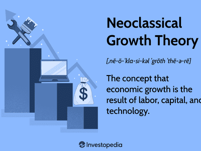

In the complex world of economic growth theories, endogenous and exogenous models stand as core pillars explaining the dynamics of development. Endogenous growth theory emphasizes the role of internal factors, such as innovation and human capital, as primary drivers of economic expansion. By fostering an environment that nurtures innovation, education, and knowledge accumulation, economies can achieve sustainable growth. Exogenous growth models, on the other hand, attribute economic growth to external influences like technological advancement and capital inflows. These models, particularly typified by the Solow-Swan model, highlight the importance of factors outside the inherent economic system, including international trade and technological diffusion, in driving long-term economic prospects.

Algorithmic trading is a cutting-edge advancement in financial markets that draws influence from these economic theories. This style of trading leverages automated systems and algorithms to execute decisions based on market conditions and economic indicators. Both endogenous and exogenous factors shape the development and implementation of these algorithms. For instance, the innovations and advancements within firms—an endogenous aspect—influence the creation and optimization of trading strategies. Meanwhile, technological developments and policy changes—exogenous elements—affect the broader environment in which these algorithms operate.



This article explores how endogenous growth theory, exogenous growth models, and algorithmic trading intersect. By examining these intersections, the article aims to shed light on how economic conditions influence trading strategies and, conversely, how algorithmic trading can reflect and even predict economic trends. Understanding these connections is crucial for both economists developing theories of growth and investors crafting informed investment strategies. These insights can help navigate the complexities of modern financial markets and anticipate future economic shifts.

## Table of Contents

## Endogenous Growth Economic Theory

Endogenous growth theory posits that internal factors within an economy, notably innovation and human capital, are central to driving economic growth. Unlike exogenous models, which attribute growth to external factors, endogenous theory emphasizes the significance of factors that originate within the economy itself.

The theory underscores the critical role of policies, educational systems, and innovation ecosystems in advancing sustainable economic development. Governments and institutions are encouraged to invest in education and research and development (R&D) to nurture human capital and stimulate technological innovation. This approach suggests that by improving the quality of education and supporting innovative research, an economy can achieve long-term growth and productivity gains.

A key component of endogenous growth is the concept of knowledge spillovers. This occurs when knowledge created by an individual or company spreads to others, effectively boosting the overall productivity of an economy without additional input costs. For instance, when a company develops a new technology, others can learn from it, leading to widespread benefits across industries. This process fosters a cumulative effect on growth, as each innovation facilitates further advancements.

Investment in human capital is another vital element of endogenous growth. By enhancing the skills and abilities of the workforce, economies can improve labor productivity and adaptability to technological changes. This investment not only strengthens the labor market but also encourages innovation and entrepreneurial activities.

Real-world examples of the endogenous growth theory can be observed in the innovation ecosystems of regions like Silicon Valley and South Korea. Silicon Valley, a hub of advanced technological development, thrives due to its culture of innovation, abundant venture capital, and a network of talented professionals. The region benefits from strong university-industry collaborations and a regulatory environment conducive to entrepreneurship and startup growth.

South Korea provides another illustration, where substantial investments in education and R&D have positioned the nation as a leader in technology and innovation. The government's commitment to science and technology policies has been instrumental in fostering an environment where new ideas and innovations can flourish.

In summary, endogenous growth theory highlights the self-sustaining mechanisms of economic development driven by internal innovation and human capital enhancement. This perspective provides valuable insights into how economies can harness their internal resources to achieve sustained growth.

## Exogenous Growth Economic Theory

Exogenous growth theory explains economic expansion as primarily driven by external factors such as technological advancements and capital inflows. Central to this theory is the Solow-Swan model, which highlights the impact of these factors on long-term economic growth. Proposed by Robert Solow and Trevor Swan in the mid-20th century, the model introduces the concept that long-term economic growth is determined by technological progress, which is considered exogenous to the economic system, hence the term "exogenous growth."

The Solow-Swan model posits that output (Y) in an economy is produced using capital (K) and labor (L), represented by the production function $Y = F(K, L, \text{A})$, where A denotes the level of technology. Sustained economic growth, according to the model, cannot be achieved solely through increases in labor or capital but requires advances in technology. Technological progress leads to higher productivity, enabling more output without needing additional inputs.

Policy frameworks play a pivotal role in promoting technological diffusion and supporting the mechanisms of exogenous growth. By establishing environments that encourage research, innovation, and investment, governments can effectively facilitate the adoption of new technologies across sectors. Moreover, international trade is a critical component in spreading technology and capital across borders, contributing to economic growth. Countries engaging in global trade can leverage comparative advantages, access foreign technology, and attract capital inflows, accelerating development.

Historical examples illustrate the profound impact of exogenous factors on economic trajectories. The Industrial Revolution serves as a prominent demonstration of how technological innovations revolutionized production processes, leading to massive economic expansion in Western Europe and the United States during the 18th and 19th centuries. Similarly, the economic rise of the East Asian Tigers—South Korea, Taiwan, Hong Kong, and Singapore—during the latter half of the 20th century is attributed to strategies emphasizing export-oriented industrialization, foreign investment, and technology acquisition.

In summary, exogenous growth theory, as embodied by the Solow-Swan model, underscores the importance of technological progress and external inflows in achieving sustained economic growth. The integration of policy measures and international economic interactions are crucial in harnessing these exogenous drivers, contributing to a nation's long-term development and prosperity.

## Intersection of Growth Theories with Algorithmic Trading

Algorithmic trading is a sophisticated approach that uses automated systems to execute fiscal decisions in financial markets, relying heavily on the analysis of vast amounts of data and complex algorithms. At its core, [algorithmic trading](/wiki/algorithmic-trading) is influenced by both endogenous and exogenous factors, which shape the design and functionality of these trading systems.

Endogenous growth factors, such as innovation and human capital within trading firms, significantly impact the customization and adaptation of trading algorithms. For instance, institutions with a strong focus on research and development may produce proprietary algorithms capable of offering a competitive edge in the markets. These innovations are often driven by the feedback loop of knowledge and expertise within an organization, which boosts productivity and efficiency in algorithmic systems.

Exogenous growth factors, such as technological advancements and economic indicators, play a crucial role in shaping algorithmic trading strategies. Technological development, an aspect highlighted by exogenous growth theory, directly influences the capabilities and reach of algorithmic systems. Enhanced computational power, faster connectivity, and improved data analytics tools enable the refinement of trading algorithms, allowing them to process information and execute trades at unprecedented speeds. Moreover, external economic indicators—including interest rates, GDP growth, and trade balances—inform algorithmic models by providing necessary parameters for constructing predictive financial environments.

In practice, the integration of both growth theories allows for the creation of more robust and adaptive trading algorithms. For example, algorithms can be designed to adjust automatically to macroeconomic changes, thus aligning with exogenous influences, while simultaneously incorporating innovations developed internally. This dual influence allows trading systems to be both reactive to external conditions and proactive in leveraging internal advancements.

Python is a popular language for developing such algorithms due to its extensive libraries and ease of use. Libraries such as NumPy and pandas facilitate data handling, while [machine learning](/wiki/machine-learning) libraries like scikit-learn and TensorFlow provide frameworks for developing predictive models. A simple Python snippet showcasing an algorithmic trading strategy might utilize moving averages—a common technique in which averages of a stock's price over different time frames are compared to generate trading signals.

```python
import pandas as pd
import numpy as np

# Load market data
data = pd.read_csv('market_data.csv')
data['MA_30'] = data['Close'].rolling(window=30).mean()
data['MA_90'] = data['Close'].rolling(window=90).mean()

# Generate trading signals
data['Signal'] = np.where(data['MA_30'] > data['MA_90'], 1, -1)

# Execute trades based on signals
positions = data['Signal'].shift()
data['Returns'] = data['Close'].pct_change() * positions
portfolio_returns = data['Returns'].sum()
```

In conclusion, the intersection of endogenous and exogenous growth theories with algorithmic trading opens new avenues for enhancing algorithmic strategies. By embracing both internal innovations and external technological advancements, algorithmic trading systems can improve their predictive accuracy and responsiveness to economic changes, thereby offering considerable value to investors and financial analysts.

## Practical Applications and Implications

Understanding the interplay between endogenous and exogenous growth factors can significantly aid investors and economists in decision-making processes, particularly as these concepts apply to algorithmic trading. By incorporating growth models into algorithmic trading strategies, traders can potentially enhance the accuracy of market predictions and optimize investment outcomes.

Endogenous growth theories emphasize the importance of internal factors, such as innovation and human capital, suggesting that by investing in these areas, more precise and adaptive trading algorithms can be developed. This internal development can lead to an improved understanding of market trends and subsequently better prediction models. For instance, continuous investment in technology and employee training can enhance an investment firm's ability to fine-tune algorithmic strategies, ensuring that they remain competitive in rapidly evolving markets.

Exogenous growth models highlight the impact of external factors such as technological advancements and international trade on economic growth. In algorithmic trading, these models can be reflected in the way trading algorithms are updated and refined based on new technological inputs and market conditions. For example, the influx of capital and technological innovations can provide new data streams and computational methods that refine trading algorithms, enabling them to react more swiftly and accurately to global market shifts.

Policy frameworks that promote research and development (R&D) and encourage innovation are crucial. Such frameworks are conducive to creating an environment that fosters economic growth. This growth can indirectly influence market dynamics by increasing market [liquidity](/wiki/liquidity-risk-premium) and introducing new financial products, which are essential for effective algorithmic trading. National policies that support technological advancement can lead to the development of more sophisticated market models, which in turn provide more granular insights into market behavior that can be harnessed by algorithmic trading systems.

Looking forward, the integration of advanced [artificial intelligence](/wiki/ai-artificial-intelligence) (AI) and machine learning techniques into trading algorithms promises to elevate their effectiveness. By leveraging AI, trading models can process and analyze vast amounts of data more efficiently, uncovering patterns that traditional statistical methods might miss. Machine learning enables these algorithms to learn from historical market data, adapt to new market conditions, and potentially predict future trends with higher accuracy.

Incorporating economic growth theories within these advanced algorithms could lead to unprecedented levels of accuracy in market predictions. As the world of finance continues to embrace technological advancements, a nuanced understanding of how endogenous and exogenous factors drive economic growth will be fundamental. This understanding not only shapes investment strategies but also informs national and international policy decisions, ultimately impacting the global financial landscape.

## Conclusion

The intersection of endogenous growth, exogenous growth, and algorithmic trading presents promising opportunities for enhancing economic and investment strategies. Endogenous growth theory, emphasizing the importance of internal factors like innovation and human capital, aligns naturally with the ongoing development of algorithmic trading systems. By harnessing the potential of internal innovation, trading firms can continuously improve their algorithms, making them more adaptive and precise. This internal evolution can lead to more efficient market analyses and superior prediction of trends.

Exogenous growth factors, such as technological advancement and capital inflows, are equally crucial. They drive the expansion of markets and provide the necessary external stimuli for developing trading algorithms. As technology advances, integrating it with algorithmic trading ensures that trading systems remain on the cutting edge, incorporating the latest in computational and data processing technologies. This external impetus complements the internal innovations, providing a robust framework for ever-improving trading strategies.

The synergy of these growth theories not only enhances the capability and reliability of algorithmic trading systems, but also opens up new perspectives on macroeconomic conditions. For investors and economists, the combination of these theories provides comprehensive insights into market dynamics, guiding strategic decision-making. The application of these models in trading systems can refine market movement predictions and inform investment choices, thus contributing to more stable and prosperous economic landscapes.

Continued research and development in economic theory and algorithmic trading are set to play pivotal roles in shaping future financial markets and economies around the globe. Innovations in artificial intelligence and machine learning hold the potential to further refine and transform trading algorithms. For stakeholders aiming for sustained success, staying informed about these developments is imperative. Adapting to changes in the economic environment will be essential in leveraging growth theories effectively within increasingly automated and sophisticated trading systems. As the landscape evolves, those prepared to embrace and integrate these insights will lead in navigating the intricate world of finance.

## References & Further Reading

[1]: Romer, P. M. (1990). ["Endogenous Technological Change."](https://web.stanford.edu/~klenow/Romer_1990.pdf) Journal of Political Economy, 98(5), Part 2.

[2]: Solow, R. M. (1956). ["A Contribution to the Theory of Economic Growth."](https://pages.nyu.edu/debraj/Courses/Readings/Solow.pdf) The Quarterly Journal of Economics, 70(1), 65-94.

[3]: Swan, T. W. (1956). ["Economic Growth and Capital Accumulation."](https://onlinelibrary.wiley.com/doi/abs/10.1111/j.1475-4932.1956.tb00434.x) Economic Record, 32(2), 334-361.

[4]: Barro, R. J., & Sala-i-Martin, X. I. (2004). ["Economic Growth, Second Edition."](http://piketty.pse.ens.fr/files/BarroSalaIMartin2004Chap1-2.pdf) MIT Press.

[5]: Lintner, J. (1965). ["The Valuation of Risk Assets and the Selection of Risky Investments in Stock Portfolios and Capital Budgets."](https://www.jstor.org/stable/1924119?pq-origsite=summon) The Review of Economics and Statistics, 47(1), 13-37.

[6]: Schumpeter, J. A. (1911). ["The Theory of Economic Development."](https://www.taylorfrancis.com/books/mono/10.4324/9781003146766/theory-economic-development-joseph-schumpeter-richard-swedberg) Harvard University Press.

[7]: Lopez de Prado, M. (2018). ["Advances in Financial Machine Learning."](https://www.amazon.com/Advances-Financial-Machine-Learning-Marcos/dp/1119482089) Wiley.

[8]: Chan, E. (2009). ["Quantitative Trading: How to Build Your Own Algorithmic Trading Business."](https://github.com/ftvision/quant_trading_echan_book) Wiley Trading.