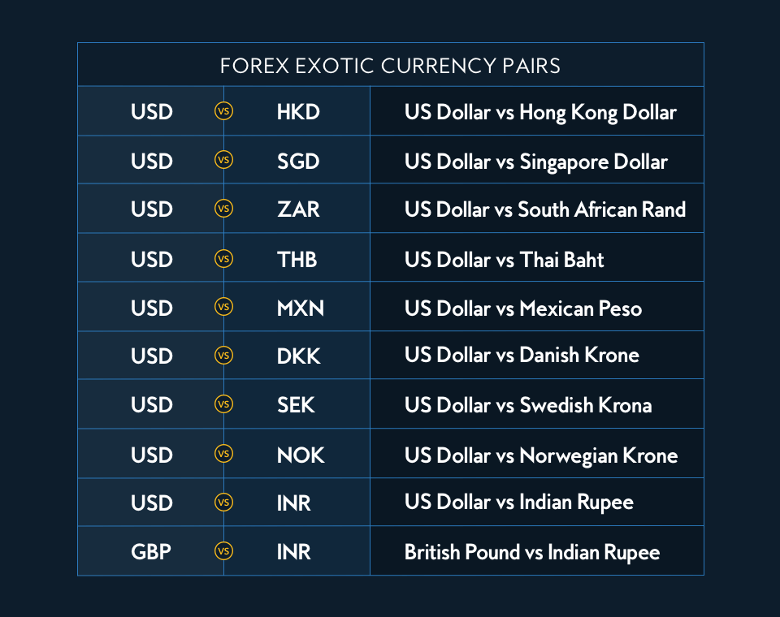

## Table of Contents

## What is an exotic currency?

An exotic currency is a type of currency that comes from a country with a small economy or one that is less developed. These currencies are not traded as often as major currencies like the US dollar or the Euro. Because they are traded less, it can be harder to buy and sell them, and the prices can change a lot.

Examples of exotic currencies include the Indonesian rupiah, the Thai baht, and the Mexican peso. When people or businesses want to use these currencies, they might find it more difficult and expensive because there are fewer places to trade them. This can make them riskier to use in international trade or investment.

## How does an exotic currency differ from major and minor currencies?

Exotic currencies come from countries with smaller or less developed economies. They are not traded as much as major or minor currencies. This means it can be harder to buy and sell them, and their prices can change a lot. Examples of exotic currencies include the Indonesian rupiah and the Mexican peso. Because they are not traded often, using them can be riskier and more expensive.

Major currencies, on the other hand, are from big economies like the US, Europe, and Japan. These include the US dollar, the Euro, and the Japanese yen. They are traded a lot, so it's easy to buy and sell them, and their prices don't change as much. Minor currencies are from smaller but still developed economies, like the Swedish krona or the Singapore dollar. They are traded more than exotic currencies but less than major ones, so they fall in between in terms of ease of trading and price stability.

## Can you give examples of exotic currencies?

Exotic currencies come from countries with smaller or less developed economies. Some examples are the Indonesian rupiah, the Thai baht, and the Mexican peso. These currencies are not traded as much as bigger currencies like the US dollar or the Euro.

Because they are not traded often, it can be hard to buy and sell exotic currencies. This can make their prices go up and down a lot. Using them in international trade or investment can be riskier and more expensive than using major or minor currencies.

## What are the common characteristics of exotic currencies?

Exotic currencies come from countries with smaller or less developed economies. They are not traded as much as bigger currencies like the US dollar or the Euro. This means it can be harder to buy and sell them. When people or businesses want to use these currencies, they might find it more difficult and expensive because there are fewer places to trade them.

Because exotic currencies are not traded often, their prices can change a lot. This makes them riskier to use in international trade or investment. Examples of exotic currencies include the Indonesian rupiah, the Thai baht, and the Mexican peso. Using these currencies can be more challenging and costly compared to using major or minor currencies.

## Why might someone trade in exotic currencies?

People might trade in exotic currencies for different reasons. One reason could be to make money. Because exotic currencies are not traded as much, their prices can change a lot. If someone thinks the price of an exotic currency will go up, they might buy it to sell later at a higher price. This can be risky, but it can also lead to big profits if they guess right.

Another reason is to do business in countries that use exotic currencies. For example, if a company wants to buy things from Indonesia, they might need Indonesian rupiah. Trading in exotic currencies can help them get the money they need to do business. Even though it's harder and can be more expensive, it might be the only way to make the deal work.

## What are the risks associated with trading exotic currencies?

Trading exotic currencies can be risky because they come from countries with smaller economies. These currencies are not traded as much as bigger ones like the US dollar or the Euro. This means it can be harder to buy and sell them, and their prices can change a lot. If someone buys an exotic currency and its price goes down, they could lose money. The prices can be unpredictable, making it hard to know if you will make money or lose it.

Another risk is that it can be expensive to trade exotic currencies. Because there are fewer places to trade them, the costs to buy and sell can be higher. This can eat into any profits someone might make. Also, if a country's economy is not doing well, the value of its currency can drop a lot. This makes trading exotic currencies even riskier. People need to be careful and think about these risks before deciding to trade in exotic currencies.

## How do exotic currencies impact global trade?

Exotic currencies can make global trade more complicated. When businesses from big countries want to buy things from countries with exotic currencies, it can be hard to get the right money. It might cost more and take longer to change their money into the exotic currency they need. This can make the whole process of buying and selling things slower and more expensive.

Also, because exotic currencies can change in value a lot, it can be risky for businesses. If a company buys something and pays with an exotic currency, the price of that currency might go down before they get their goods. This means they might end up paying more than they planned. Because of these risks, some businesses might choose not to trade with countries that use exotic currencies, which can limit global trade.

## What role do exotic currencies play in the foreign exchange market?

Exotic currencies play a smaller role in the foreign exchange market compared to major and minor currencies. They come from countries with smaller or less developed economies, like Indonesia or Thailand. Because these currencies are not traded as much, it can be harder to buy and sell them. This means there are fewer places to trade exotic currencies, which can make the process more expensive and take longer.

The prices of exotic currencies can change a lot because they are not traded as often. This makes them riskier for people and businesses to use. Even though they are a small part of the foreign exchange market, exotic currencies are important for trade with countries that use them. Companies that want to buy things from these countries need to use exotic currencies, even if it's more challenging and costly.

## How are exotic currencies regulated?

Exotic currencies are regulated by the central banks of the countries where they come from. These central banks set rules and watch over how the currency is used. They might control how much of the currency is in the market to keep its value stable. Sometimes, they make rules about how much of the currency people or businesses can take out of the country. This is to protect their economy and make sure the currency stays strong.

Other countries and international groups also keep an eye on exotic currencies. They might set rules about how these currencies can be traded in their markets. For example, some countries might have special rules for trading exotic currencies to stop big changes in their value. International groups like the International Monetary Fund (IMF) might give advice or help countries manage their currencies better. This helps make global trade smoother and safer for everyone involved.

## What strategies are effective for trading exotic currencies?

Trading exotic currencies can be risky, but there are some strategies that can help. One good strategy is to do a lot of research. Before trading, it's important to learn about the country's economy, its political situation, and any big events that might change the currency's value. Keeping an eye on news and economic reports can help you make better guesses about what might happen next. Another strategy is to use stop-loss orders. These are orders that automatically sell the currency if its price drops to a certain level. This can help limit how much money you might lose if the currency's value goes down a lot.

Another effective strategy is to diversify. Instead of putting all your money into one exotic currency, you can spread it out over a few different ones. This way, if one currency loses value, you might still make money from the others. It's also smart to trade in smaller amounts. Because exotic currencies can change in value a lot, starting with smaller trades can help you learn and get better without losing too much money. Finally, staying patient and not making quick decisions based on small changes in the currency's value can help you trade more successfully over time.

## How do geopolitical events affect the value of exotic currencies?

Geopolitical events can have a big impact on the value of exotic currencies. These events, like political changes, conflicts, or new laws, can make people unsure about a country's future. When people are unsure, they might not want to keep their money in that country's currency. This can make the value of the exotic currency go down. For example, if there is a war or a big political change in a country with an exotic currency, people might sell that currency quickly, causing its value to drop a lot.

Even small geopolitical events can affect exotic currencies because they are not traded as much as bigger currencies. When there are fewer people trading, even a small change can make a big difference in the currency's value. For instance, if a country with an exotic currency changes its trade rules, it might make it harder for other countries to do business there. This can cause the value of the currency to go down because fewer people want to use it. So, it's important for people trading exotic currencies to keep an eye on geopolitical events and be ready for big changes in the currency's value.

## What future trends might influence the use and value of exotic currencies?

In the future, technology might change how people use exotic currencies. More people using smartphones and the internet could make it easier to trade these currencies. New apps and online platforms might help people buy and sell exotic currencies without going to a bank. This could make trading cheaper and faster. Also, if more countries start using digital money, like cryptocurrencies, it might affect how exotic currencies are used. People might choose to use digital money instead of exotic currencies if it's easier and safer.

Another trend that could influence exotic currencies is how the world's economy grows. If countries with exotic currencies get richer and their economies grow, their currencies might become more popular. More people and businesses might want to use them for trade. But if these countries have problems, like wars or bad economic policies, their currencies might lose value. Global events, like climate change or big health crises, could also make things harder for countries with exotic currencies. People need to watch these trends to understand how they might affect the value and use of exotic currencies in the future.

## References & Further Reading

[1]: ["The Foreign Exchange Market"](https://www.investopedia.com/terms/forex/f/foreign-exchange-markets.asp) - Bank for International Settlements

[2]: Dempster, M. A. H., & Leemans, V. (2006). ["An Automated FX Trading System Using Adaptive Reinforcement Learning."](https://www.sciencedirect.com/science/article/pii/S0957417405003015) Computational Economics, 28(1).

[3]: Narang, R. K. (2013). ["Inside the Black Box: A Simple Guide to Quantitative and High Frequency Trading"](https://onlinelibrary.wiley.com/doi/book/10.1002/9781118662717) by Rishi K. Narang

[4]: Chincarini, L. B., & Kim, D. (2006). ["Quantitative Equity Portfolio Management: An Active Approach to Portfolio Construction and Management"](https://archive.org/details/quantitativeequi0000chin)

[5]: Aldridge, I. (2013). ["High-Frequency Trading: A Practical Guide to Algorithmic Strategies and Trading Systems"](https://www.ahmetbeyefendi.com/wp-content/uploads/2020/07/High-Frequency-Trading-Irene-Aldridge.pdf)

[6]: ["Exchange Rate Volatility and World Trade"](https://www.elibrary.imf.org/view/book/9781557750655/9781557750655.xml) (2002) - World Trade Organization

[7]: ["Algorithmic Trading: Winning Strategies and Their Rationale"](https://github.com/prabakar2610/TradingBooks/blob/master/Algorithmic%20Trading%20-%20Winning%20Strategies%20and%20Their%20Rationale%202013.pdf) by Ernest P. Chan