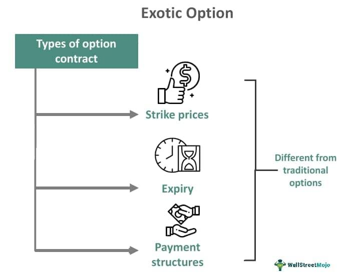

## Table of Contents

## What are exotic options?

Exotic options are special types of financial contracts that are more complex than regular options. Regular options, like calls and puts, are called "vanilla" options. Exotic options have unique features that make them different. These features can include how the option is paid out, when it can be used, or how its value is calculated. Because they are more complicated, exotic options are usually traded in private deals between big financial institutions, not on public markets.

One common type of exotic option is a "barrier option." This option only becomes active or stops working if the price of the underlying asset reaches a certain level. For example, if you have a barrier option on a stock, it might only start working if the stock price goes above $100. Another type is a "binary option," which pays out a fixed amount if a certain condition is met, like if the stock price is above a certain level at expiration. Exotic options can be useful for investors who want to manage specific risks or take advantage of particular market conditions, but they can also be riskier and harder to understand than vanilla options.

## How do exotic options differ from traditional options?

Exotic options are different from traditional options, also known as vanilla options, in several ways. The main difference is that exotic options have more complex features. For example, while a traditional option might simply give you the right to buy or sell an asset at a set price, an exotic option might only work if the asset's price hits a specific level, or it might pay out in a unique way. These special features can make exotic options more tailored to specific needs, but they also make them harder to understand and price.

Another big difference is where and how these options are traded. Traditional options are usually traded on big public exchanges, like the stock market, where anyone can buy and sell them easily. Exotic options, on the other hand, are often traded in private deals between big financial institutions. This means they are less common and can be harder to find. Because of their complexity and the way they are traded, exotic options can be riskier and are typically used by more experienced investors who understand the specific risks and rewards involved.

## What are some common types of exotic options?

Exotic options come in many different forms, each with its own special rules. One common type is the barrier option. A barrier option only works if the price of the thing it's based on, like a stock, reaches a certain level. For example, you might buy a barrier option that only starts working if the stock price goes above $50. Another type is the binary option, which pays out a fixed amount of money if a certain condition is met. If the stock price is above a certain level at the end of the option's life, you get a set amount of money, but if it's not, you get nothing.

Another popular exotic option is the Asian option, which uses the average price of the underlying asset over a period of time instead of the price at a single point. This can make the option less risky because it smooths out price changes. Then there's the lookback option, which lets you buy or sell the asset at the best price it reached during the life of the option, not just at the end. These options can be very useful for certain investment strategies, but they're more complicated and usually used by big investors who understand the risks and rewards well.

## Can you explain the payoff structure of a barrier option?

A barrier option is a type of exotic option that only works if the price of the thing it's based on, like a stock, hits a certain level. This level is called the barrier. There are two main kinds of barrier options: "knock-in" and "knock-out." A knock-in option only starts working if the price of the stock reaches the barrier. For example, if you buy a knock-in option with a barrier of $100, it only becomes active if the stock price goes up to $100 or more. On the other hand, a knock-out option stops working if the stock price hits the barrier. So, if you have a knock-out option with a barrier of $100, it stops being useful if the stock price ever reaches $100.

The payoff of a barrier option depends on whether it's a knock-in or knock-out option and if the barrier is hit. If it's a knock-in option and the barrier is reached, the option works like a regular option. You can buy or sell the stock at the set price if it's worth it for you. But if the barrier isn't hit, the option is worthless. For a knock-out option, if the barrier is hit, the option stops working and you get nothing. But if the barrier isn't reached, the option works like a regular option until it expires. This makes barrier options tricky because their value can change a lot depending on whether the barrier is hit or not.

## What is the role of exotic options in financial markets?

Exotic options play a special role in financial markets because they help big investors manage risks in ways that regular options can't. These options are more complicated and can be made to fit very specific needs. For example, a big company might use an exotic option to protect against a sudden drop in the price of a product they need. Because exotic options are often custom-made, they can be very useful for solving unique problems that regular options can't handle.

Even though exotic options are helpful, they also have some downsides. They are usually traded in private deals, not on big public exchanges, which can make them harder to buy and sell. Also, because they are so complex, they can be riskier. Only investors who really understand them should use them. Despite these challenges, exotic options are an important tool for big investors and financial institutions who need to manage very specific risks in the market.

## How are exotic options priced compared to traditional options?

Pricing exotic options is more complicated than pricing traditional options. Traditional options, like calls and puts, have simple formulas like the Black-Scholes model that help figure out their value. These formulas look at things like the price of the stock, how much the stock's price might change, and how long until the option expires. But exotic options have special rules that make them harder to price. They might only work if the stock hits a certain price, or they might pay out in a different way. Because of these special rules, simple formulas don't work as well, so people use more complex math or computer models to figure out the price.

Because exotic options are more complex and harder to price, they are usually traded in private deals between big financial institutions, not on big public markets. This means that the price can be influenced by what the buyer and seller agree on, rather than just following a set formula. The risk of getting the price wrong can be higher with exotic options, so only experienced investors who understand the math and the risks usually trade them. Even though they are harder to price, exotic options can be very useful for managing specific risks that traditional options can't handle.

## What are the risks associated with trading exotic options?

Trading exotic options can be riskier than trading regular options because they are more complex. Exotic options have special rules that can make their value change a lot. For example, a barrier option might only work if a stock hits a certain price. If the stock doesn't hit that price, the option could be worth nothing. This means that the value of an exotic option can be harder to predict, and if you get it wrong, you could lose a lot of money.

Another risk is that exotic options are often traded in private deals, not on big public markets. This can make it harder to buy and sell them. If you need to get out of a trade quickly, you might not be able to find someone to buy your exotic option. Also, because these options are so complicated, only big investors with a lot of experience usually trade them. If you don't understand how they work, you could make a big mistake. Even though exotic options can help manage specific risks, the chance of losing money is higher because of their complexity and the way they are traded.

## Can you discuss the liquidity issues with exotic options?

Exotic options can be hard to trade because they are not as popular as regular options. They are often traded in private deals between big financial companies, not on big public markets like the stock exchange. This means there are fewer people who want to buy or sell them, so it can be tough to find someone to trade with. If you need to sell your exotic option quickly, you might not be able to find a buyer right away. This is what we call a [liquidity](/wiki/liquidity-risk-premium) issue – it's harder to turn your exotic option into cash when you need to.

Because exotic options are so complicated, only big investors who really understand them usually trade them. These investors might have different ideas about what the exotic option is worth, which can make it even harder to agree on a price. If you can't find someone who wants to buy your exotic option at the price you think it's worth, you might have to wait a long time or sell it for less than you hoped. This can be a big problem if you need the money fast or if the value of the option changes a lot while you're waiting.

## What are the regulatory considerations for exotic options?

Exotic options are special types of financial contracts that are more complicated than regular options. Because they are complex and often traded in private deals, regulators pay close attention to them. The main worry is that these options can be risky and hard to understand, so regulators want to make sure that only people who know what they're doing can trade them. They also want to make sure that the companies selling exotic options are honest about the risks and don't trick people into buying them.

Regulators have rules to protect investors and keep the financial markets fair. For exotic options, these rules can include making sure that the people selling them have enough information and knowledge to explain the options clearly. Regulators might also check that the companies have enough money to cover any losses if something goes wrong. Because exotic options are often traded in private deals, regulators might need to keep an eye on these deals to make sure they are fair and follow the rules.

## How do exotic options impact portfolio diversification?

Exotic options can help with portfolio diversification because they let investors manage risks in ways that regular options can't. These special options can be made to fit very specific needs, like protecting against big price changes in a certain stock or commodity. By adding exotic options to a portfolio, investors can spread out their risks better. For example, if an investor has a lot of money in one stock, they might use an exotic option to protect against a sudden drop in that stock's price, making their overall portfolio safer.

However, using exotic options for diversification can also be tricky. They are more complicated and harder to understand than regular options, which means there's a bigger chance of making a mistake. If an investor doesn't fully understand how an exotic option works, they might end up losing money instead of protecting their portfolio. Also, because exotic options are often traded in private deals, they can be harder to buy and sell quickly. This can make it difficult to adjust a portfolio if the market changes suddenly. So, while exotic options can be a powerful tool for diversification, they need to be used carefully by people who really know what they're doing.

## What advanced strategies can be implemented using exotic options?

Exotic options can be used for advanced strategies that help big investors manage risks in special ways. One strategy is called "hedging." This means using exotic options to protect against big price changes in a stock or commodity. For example, a company might use a barrier option to make sure they don't lose too much money if the price of something they need goes down a lot. By using exotic options, investors can make their portfolios safer and more stable.

Another advanced strategy is called "yield enhancement." This means using exotic options to try to make more money from investments. For example, an investor might sell a binary option, which pays out a fixed amount if a certain condition is met. If the condition isn't met, the investor keeps the money they got from selling the option. This can be a way to earn extra money, but it's risky because the investor could lose money if the condition is met. Exotic options can be very useful for these advanced strategies, but they need to be used carefully because they are complex and can be hard to understand.

## Can you provide case studies where exotic options were used effectively in financial strategies?

A big oil company once used exotic options to protect against falling oil prices. They bought a barrier option that would only start working if the price of oil dropped below a certain level, like $50 a barrel. This helped the company save money because if oil prices did fall, the barrier option would kick in and help cover their losses. By using this exotic option, the company was able to keep their business stable even when oil prices changed a lot. This shows how exotic options can be a smart way to manage risks in a specific industry.

In another case, a big investment fund used exotic options to make more money from their investments. They sold binary options to other investors, which paid out a fixed amount if a certain stock reached a certain price by a certain date. If the stock didn't reach that price, the fund kept the money they got from selling the options. This strategy helped the fund earn extra money, but it was risky because if the stock did reach the target price, they would have to pay out the fixed amount. This example shows how exotic options can be used to try to increase returns, but it's important to understand the risks involved.

## What are the pros and cons of options trading?

Options trading offers numerous advantages that can greatly benefit investors. One of the primary benefits is leverage, which allows traders to control a larger position with a relatively smaller amount of capital. This is particularly advantageous for investors who wish to gain exposure to an asset without committing the full purchase price upfront. Options also provide flexibility, enabling traders to construct a variety of strategies that are tailored to their specific market outlooks and risk tolerance. Furthermore, options can be employed as effective hedging tools. By purchasing put options, for example, investors can protect themselves against potential declines in the value of assets they own, thereby limiting losses in unfavorable market conditions.

Despite these advantages, options trading is not without its challenges. The complexity of options, especially exotic types, can pose significant risks to inexperienced traders. Exotic options, due to their complex payoff structures and terms, require a deep understanding of options pricing and market behavior. While they offer the potential for lower premiums and tailored solutions, they also introduce increased pricing complexity and a higher risk of expiring worthless if market conditions do not align with the trader's expectations.

Given these intricacies, successful options trading hinges on several key factors. A comprehensive understanding of market dynamics is essential, as traders must anticipate how various factors—such as [volatility](/wiki/volatility-trading-strategies), interest rates, and market trends—affect option pricing and payoff outcomes. Additionally, strategic planning is crucial. Traders need to devise well-thought-out strategies that capitalize on anticipated market movements while aligning with their risk management frameworks. This often involves advanced techniques, including the Black-Scholes model for pricing, which incorporates variables such as the underlying asset's price, strike price, time to expiration, risk-free rate, and volatility:

$$
C = S_0N(d_1) - X e^{-rt}N(d_2)
$$

where:
$$
d_1 = \frac{\ln(\frac{S_0}{X}) + (r + \frac{\sigma^2}{2})t}{\sigma\sqrt{t}}
$$
$$
d_2 = d_1 - \sigma\sqrt{t}
$$

Implementing these principles requires meticulous attention to detail and risk management. The latter includes setting predetermined stop-loss levels to mitigate potential losses and diversifying option positions to spread risks effectively. Thus, while the potential rewards of options trading are considerable, only those equipped with the necessary knowledge and skills are likely to achieve consistent success in this sophisticated market environment.

## References & Further Reading

[1]: ["Options, Futures, and Other Derivatives"](https://www.amazon.com/Options-Futures-Other-Derivatives-10th/dp/013447208X) by John C. Hull

[2]: Black, F., & Scholes, M. (1973). ["The Pricing of Options and Corporate Liabilities."](https://www.cs.princeton.edu/courses/archive/fall09/cos323/papers/black_scholes73.pdf) Journal of Political Economy, 81(3), 637-654.

[3]: Haug, E. G., & Taleb, N. N. (2011). ["Option Pricing Models and Volatility Using Excel-VBA."](https://economics-files.pomona.edu/GarySmith/Econ156/Haug_Taleb_2011.pdf) Wiley.

[4]: Wilmott, P. (2006). ["Paul Wilmott Introduces Quantitative Finance."](https://www.amazon.com/Paul-Wilmott-Quantitative-Finance-Set/dp/0470018704) Wiley.

[5]: ["Algorithmic Trading & DMA: An Introduction to Direct Access Trading Strategies"](https://www.amazon.com/Algorithmic-Trading-DMA-introduction-strategies/dp/0956399207) by Barry Johnson