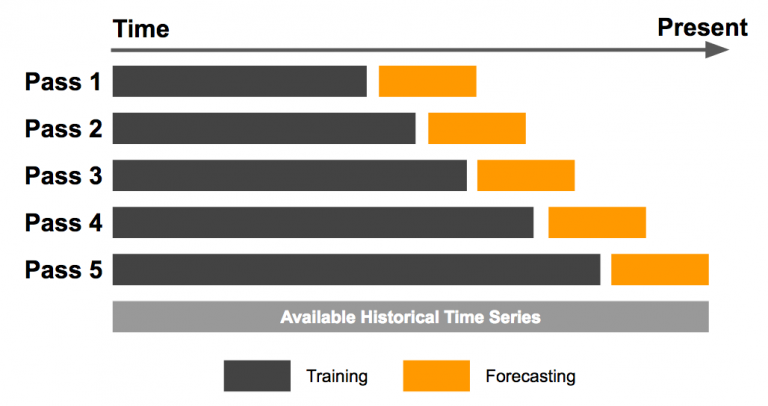

In algorithmic trading, utilizing efficient data analysis methods is crucial for success. As traders and analysts strive to navigate complex financial markets, the implementation of sophisticated strategies and techniques becomes essential. Among these, the expanding window method stands out as a powerful tool for gaining insights and making informed decisions. Unlike traditional static approaches, this method offers a dynamic way of handling time series data by progressively incorporating new information as it becomes available. This continuous growth of the dataset allows for the detection of trends and patterns over time, helping traders anticipate market movements and adjust their strategies accordingly.

The expanding window method is fundamentally different from rolling windows, which maintain a fixed window size that shifts forward as new data points enter the series. While rolling windows are effective for capturing short-term variations, the expanding window approach accumulates data continuously, providing a comprehensive view of long-term trends. This article aims to provide a thorough understanding of the expanding window method and its invaluable applications in algorithmic trading. We will address its distinctive features, uncover the advantages it offers over rolling windows, and discuss strategies for effective implementation. Through this approach, traders can enhance their analytical capabilities and improve decision-making, ultimately gaining a competitive edge in the fast-paced trading environment.



## Table of Contents

## Understanding Expanding Window Method

The expanding window method is a prevalent technique in time series analysis, particularly in fields that require continuous assessment of evolving data, such as algorithmic trading. Unlike the rolling window method, which maintains a fixed window size as it moves across the dataset, the expanding window method begins with a fixed starting point and progressively adds new data points as they become available. This incremental growth of the data window enables analysts and traders to derive cumulative insights from the expanding dataset.

Mathematically, if $X_t$ denotes a time series, the expanding window method allows for calculations on the sequence of data points $\{ X_1, X_2, \ldots, X_t \}$ at any time $t$, resulting in summary [statistics](/wiki/bayesian-statistics) that reflect the cumulative history of the data. For instance, the expanding mean can be expressed as:

$$
\text{Expanding Mean at time } t = \frac{1}{t} \sum_{i=1}^{t} X_i
$$

Such cumulative calculations are particularly useful in trading. Traders often use expanding windows to compute aggregates such as moving averages and mean values over an extended period. This allows them to observe how these metrics evolve as more data is captured, providing a holistic view of trends and patterns.

The expanding window method's capability to incorporate all past data points up to the current time period makes it an attractive choice for calculations that benefit from long-term data insights. This methodology ensures that conclusions drawn from the data take into account the entire historical dataset available, reducing the likelihood of making decisions based on short-term fluctuations. As such, expanding windows are instrumental in strategies that benefit from leveraging historical market behaviors to inform future trading decisions.

## Benefits of Using Expanding Windows in Algo Trading

Expanding windows are instrumental in [algorithmic trading](/wiki/algorithmic-trading) as they mitigate look-ahead bias by relying exclusively on data available up to the current point in time. This ensures that the insights gained are realistic and applicable for decision-making. By progressively incorporating new data, traders can adapt to market changes more efficiently. This adaptability is crucial in volatile markets, where conditions can shift rapidly.

Furthermore, expanding windows are adept at capturing long-term trends, offering a deeper understanding of the market's evolving nature. This capability allows traders to generate more accurate predictions as they work with a continually growing dataset. The accumulation of data over time enhances decision-making by providing a comprehensive view of historical trends and patterns.

This method enables traders to devise strategies that are not only reactive to immediate market fluctuations but also informed by broader temporal trends. Unlike some traditional methods that might overlook longer-term patterns, expanding windows ensure that the entirety of the available data is considered, thereby giving traders an edge when making decisions over large temporal frames. By effectively implementing expanding windows, traders can develop robust strategies that account for both current data and historical insights.

## Expanding Windows vs. Rolling Windows

In analyzing time series data, expanding and rolling windows are pivotal techniques, each serving distinct objectives. Rolling windows are designed to capture short-term patterns by maintaining a fixed window size that moves forward through the dataset. This approach is particularly useful for identifying recent behaviors and immediate changes in the data stream. For instance, when using a 10-day rolling window to compute a moving average, only the most recent 10 days are considered, discarding older data points as the window progresses. Such a method is effective for traders focused on short-term analysis and quick market adjustments.

Conversely, expanding windows offer a broader perspective by encompassing all available data from a fixed starting point to the current point in time. Unlike rolling windows, where the size remains constant, the size of an expanding window increases as new data points are added. This method is suited for long-term observation, allowing traders to derive insights from the cumulative trends and patterns that emerge over extended periods. For example, calculating the mean of data using an expanding window involves all data points up to the present, thereby providing comprehensive historical context and aiding in the recognition of enduring trends.

The choice between these two methods depends on the trader's specific objectives. If the focus is on short-term [volatility](/wiki/volatility-trading-strategies) and capturing swift market movements, a rolling window is more appropriate. However, for understanding cumulative growth and long-term trend analysis, expanding windows are superior due to their ability to incorporate all past data. In practical implementations, traders must assess their strategy goals to determine which window type aligns best with their analytical needs.

## Implementing Expanding Windows in Algorithmic Trading

Implementing expanding windows in algorithmic trading requires developing strategies that dynamically adjust as more data becomes available. This implementation often involves programming languages such as Python, paired with libraries like Pandas, which provide robust functionalities for handling time series data.

### Using Python and Pandas

Python's Pandas library is particularly well-suited for creating expanding windows due to its efficient data manipulation capabilities. An expanding window in Pandas can be implemented using the `expanding()` function, which allows users to compute cumulative metrics over an increasing dataset. The following is an example of how to calculate a cumulative moving average using expanding windows:

```python
import pandas as pd

# Sample data
data = {'Price': [101, 102, 103, 104, 105]}
df = pd.DataFrame(data)

# Calculate expanding window mean (cumulative moving average)
df['Cumulative_Mean'] = df['Price'].expanding().mean()

print(df)
```

This code snippet calculates the cumulative mean of a dataset, where each new observation contributes to the average, reflecting the expanding nature of the window.

### Setting Minimum Periods

When implementing expanding windows, it's crucial to define a minimum number of data points required before any analysis. This ensures the computation is reliable and meaningful. In Pandas, the `min_periods` parameter can be used with the `expanding()` function to specify this minimum requirement. For example:

```python
df['Cumulative_Mean'] = df['Price'].expanding(min_periods=2).mean()
```

This modification stipulates that at least two observations are needed before calculating the cumulative mean.

### Integrating into Backtesting Frameworks

The utility of expanding windows extends to [backtesting](/wiki/backtesting) frameworks, essential for evaluating trading strategies against historical data. One of the primary goals of backtesting is to ensure that trading signals and decisions are made based on the information available at that point in time, thus preventing the look-ahead bias. Expanding windows naturally align with this objective by only using past data to make inferences.

To integrate expanding windows into a backtesting framework, traders can employ libraries such as `Backtrader` or `Zipline` alongside Pandas. These libraries facilitate the simulation of trading strategies under historical conditions by accommodating dynamic data handling techniques like expanding windows.

By incorporating expanding windows into algorithmic strategies, traders can refine their understanding of market conditions and improve their decision-making processes, leveraging the progressive insights gained from expanding datasets. This approach not only enhances the adaptability of strategies but also fortifies them against potential biases, contributing to more robust and reliable trading outcomes.

## Practical Applications of Expanding Windows

Expanding window methods play a significant role in financial data analysis by adapting to new information and providing ongoing insights. A common application of expanding windows is calculating moving averages, which smoothes out price data to identify trends over time. Unlike fixed window methods, expanding windows offer a cumulative perspective, capturing the entire data history up to the present moment. This is particularly useful for understanding long-term trends and avoiding look-ahead bias, as decisions are based purely on historical data available at the time.

In volatility assessment, expanding windows serve as a dynamic tool for measuring the evolving risk of an asset. Traders can incorporate new price data to monitor fluctuations and adapt their strategies accordingly. For instance, an expanding window can be used to calculate cumulative standard deviation or variance, providing insights into volatility patterns that inform risk management strategies.

Predictive modeling is another area where expanding windows are beneficial. By using historical data incrementally, expanding windows can enhance [machine learning](/wiki/machine-learning) models by continually updating the training set with new information. This approach supports cumulative learning, improving the model's predictive accuracy over time. For example, a linear regression model or a [neural network](/wiki/neural-network) can be retrained with expanding dataset windows to predict future asset prices better.

Here is a Python example using the Pandas library to implement an expanding window for calculating a simple moving average:

```python
import pandas as pd

# Sample price data
data = {'Price': [100, 101, 102, 103, 102, 101, 100, 99, 98]}
df = pd.DataFrame(data)

# Calculate expanding moving average
df['Expanding_MA'] = df['Price'].expanding().mean()

print(df)
```

This code provides a framework for calculating the expanding moving average of prices, indicating how traders might use such calculations to inform trading decisions.

Furthermore, expanding windows support strategies requiring cumulative learning and adaptation. As the dataset grows, so does the model's understanding of market dynamics, making it a valuable component in algorithmic trading strategies that rely on data-driven insights. In a rapidly changing market environment, the ability to incorporate fresh data while maintaining a comprehensive view of historical trends provides traders with a sophisticated advantage.

## Challenges and Considerations

While expanding windows offer numerous benefits, including leveraging cumulative data insights for algorithmic trading, they also introduce several challenges that traders must be aware of. One of the primary concerns is the increasing computational requirements as the dataset grows over time. As new data is continually added, the window expands, necessitating efficient coding practices to manage and process the data effectively. This can be particularly demanding when working with large datasets or real-time data streams that require instantaneous analysis and decision-making. 

To address these computational challenges, traders need to employ capable computing resources. Using optimized algorithms and parallel processing techniques can help mitigate some of the computational load. Additionally, utilizing programming languages that support data manipulation and analysis, such as Python, along with libraries like NumPy and Pandas, can enhance the efficiency of calculations on growing datasets. For instance, Python's Pandas library allows for efficient data manipulation, which is crucial when implementing expanding windows:

```python
import pandas as pd

# Suppose df is a DataFrame containing a time series
df['expanding_mean'] = df['price'].expanding().mean()
```

Another critical consideration is the risk of model overfitting. As the dataset expands, the model may begin to capture noise rather than signal, leading to poor performance on unseen data. To counteract this, traders must continually validate model performance, ensuring that the insights derived remain meaningful and not overly tailored to historical data. Techniques such as cross-validation and regularization can be employed to maintain robust model predictions.

Traders also need to maintain computational efficiency, especially when transitions occur between batch processing of historical data and real-time streaming data. This requires balancing between latency, throughput, and resource usage to optimize the execution of trading strategies effectively.

In conclusion, while expanding windows are a valuable tool for gaining long-term market insights, traders must be vigilant about managing the computational and analytical complexities they introduce. By integrating advanced computational techniques and maintaining rigorous validation processes, they can harness the full potential of expanding windows in algorithmic trading.

## Conclusion

The expanding window method is a powerful tool for traders looking to utilize cumulative insights from historical data. By progressively incorporating more data over time, this approach allows traders to gain a deeper understanding of market trends and improve the accuracy of their predictions. This cumulative approach aids in the development of more robust algorithmic trading strategies, offering a competitive edge in an ever-evolving financial landscape.

Traders who implement expanding windows can benefit significantly from integrating this method into their broader analysis framework. However, it is essential to balance the use of expanding windows with other techniques to optimize trading strategies effectively. This balance ensures that traders capture both short-term and long-term market dynamics, addressing various aspects of market behavior.

Future explorations in trading could focus on integrating expanding windows with advanced machine learning algorithms, further enhancing predictive analytics capabilities. By combining the method's cumulative insights with sophisticated algorithms, traders can develop models that are more responsive to new data, thereby refining decision-making processes and potentially increasing profitability. This integration also holds promise for better managing risks and adapting to market changes promptly, thereby improving overall trading performance.

## References & Further Reading

[1]: Bergstra, J., Bardenet, R., Bengio, Y., & Kégl, B. (2011). ["Algorithms for Hyper-Parameter Optimization."](https://dl.acm.org/doi/10.5555/2986459.2986743) Advances in Neural Information Processing Systems 24.

[2]: ["Advances in Financial Machine Learning"](https://www.amazon.com/Advances-Financial-Machine-Learning-Marcos/dp/1119482089) by Marcos Lopez de Prado

[3]: ["Evidence-Based Technical Analysis: Applying the Scientific Method and Statistical Inference to Trading Signals"](https://www.amazon.com/Evidence-Based-Technical-Analysis-Scientific-Statistical/dp/0470008741) by David Aronson

[4]: ["Machine Learning for Algorithmic Trading"](https://github.com/stefan-jansen/machine-learning-for-trading) by Stefan Jansen

[5]: ["Quantitative Trading: How to Build Your Own Algorithmic Trading Business"](https://books.google.com/books/about/Quantitative_Trading.html?id=j70yEAAAQBAJ) by Ernest P. Chan