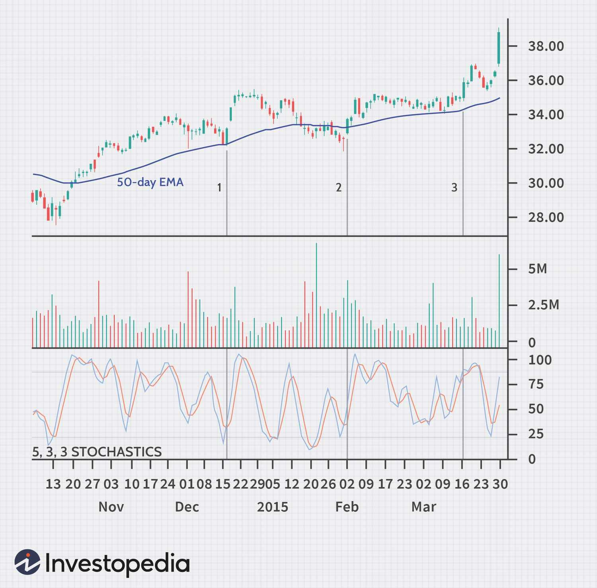

## Table of Contents

## What is an Expansion Bar Signal in trading?

An Expansion Bar Signal in trading is a type of chart pattern that traders use to spot potential big moves in the price of a stock or other financial asset. It happens when a price bar on a chart is much bigger than the ones before it. This bigger bar shows that there's a lot more activity and interest in the asset, which could mean the price is about to make a big move up or down.

Traders watch for these expansion bars because they can signal the start of a new trend or a big change in an existing trend. When they see an expansion bar, traders might decide to buy or sell based on whether they think the price will keep going in the direction of the expansion bar. It's important for traders to also look at other signs and not just rely on expansion bars alone to make their trading decisions.

## How does an Expansion Bar Signal differ from other trading signals?

An Expansion Bar Signal is different from other trading signals because it focuses on the size of the price bar compared to recent bars. When a bar is much larger, it shows that there's been a big change in how people are buying or selling the asset. This is different from signals like moving averages or RSI, which look at things like average prices over time or how fast the price is moving. An Expansion Bar Signal is more about sudden changes and can be a sign that the price might keep moving in a big way.

Other signals might be more about steady trends or smaller changes. For example, a moving average crossover might show a slow change in trend, while an Expansion Bar Signal can show a quick, big move. Traders might use an Expansion Bar Signal to get ready for a fast trade, while other signals might be used for longer-term decisions. So, an Expansion Bar Signal is unique because it's about spotting those big, sudden moves that can be important for quick trading decisions.

## What are the key components of an Expansion Bar?

An Expansion Bar has two main parts: the size of the bar and how it compares to the bars before it. The size of the bar is how much the price changes from the start to the end of the bar. If this change is a lot bigger than what you usually see, it's an Expansion Bar. The other part is looking at the bars that came before. If the new bar is much bigger than the ones before it, that's a sign that something big is happening with the price.

Traders pay attention to Expansion Bars because they can show that the price might keep moving a lot. The bigger size of the bar means more people are buying or selling, which can start a new trend or make a current trend stronger. It's important for traders to check other things too, not just the Expansion Bar, to make sure they're making good trading choices.

## How can a beginner identify an Expansion Bar on a trading chart?

To spot an Expansion Bar on a trading chart, a beginner should first look at the size of the price bars. An Expansion Bar is much bigger than the bars around it. This means the price moved a lot more during that time than it usually does. You can see this by looking at how long the bar is from top to bottom. If it's a lot longer than the other bars, it might be an Expansion Bar.

Next, compare the Expansion Bar to the bars that came before it. If the new bar is much bigger than the last few bars, that's a good sign it's an Expansion Bar. It shows that something big happened with the price, like a lot more people started buying or selling. Remember, it's important to look at other things on the chart too, not just the Expansion Bar, to make sure you understand what's going on with the price.

## What time frames are most effective for using Expansion Bar Signals?

Expansion Bar Signals can work well on different time frames, but they are often most useful on shorter ones like 1-minute, 5-minute, or 15-minute charts. These short time frames show quick changes in the price, and an Expansion Bar can stand out more clearly. Traders who like to make fast trades might find these short time frames helpful because they can spot big moves quickly and act on them.

For people who prefer to hold onto their trades for a longer time, looking at Expansion Bars on longer time frames like hourly or daily charts can also be useful. On these longer charts, an Expansion Bar might show a big change in the trend that could last for days or weeks. No matter which time frame you use, it's important to check other signs on the chart too, to make sure you understand what the Expansion Bar is telling you about the price.

## Can Expansion Bar Signals be used in conjunction with other technical indicators?

Yes, Expansion Bar Signals can be used along with other technical indicators to make better trading decisions. For example, if you see an Expansion Bar, you might also look at the Relative Strength Index (RSI) to see if the price is overbought or oversold. This can help you decide if the big move shown by the Expansion Bar is likely to keep going or if it might be time for the price to change direction.

Another way to use Expansion Bars with other indicators is to check the moving averages. If an Expansion Bar happens when the price crosses above or below a moving average, it might be a stronger sign that a new trend is starting. By using Expansion Bars together with other tools, you can get a fuller picture of what's happening with the price and make more informed choices about when to buy or sell.

## What are the common entry and exit strategies when trading with Expansion Bar Signals?

When trading with Expansion Bar Signals, a common entry strategy is to enter a trade right after you see an Expansion Bar. If the bar is moving up a lot, you might buy the asset because it looks like the price could keep going up. If the bar is moving down a lot, you might sell or short the asset, thinking the price will keep going down. It's good to wait for the bar to close before you make your move, to make sure the big move is real and not just a quick spike.

For [exit](/wiki/exit-strategy) strategies, one way is to set a target price based on how big the Expansion Bar is. For example, if the bar moved up a lot, you might set your target to make a profit that's the same size as the bar or a bit less. Another way is to use a stop-loss to limit your losses. You might put the stop-loss just below the low of the Expansion Bar if you're buying, or just above the high if you're selling. This helps you get out of the trade if the price moves against you. It's important to always think about other signs on the chart too, not just the Expansion Bar, to make smart choices about when to get in and out of trades.

## How do market conditions affect the reliability of Expansion Bar Signals?

Market conditions can change how reliable Expansion Bar Signals are. When the market is moving a lot and there's a lot of trading going on, Expansion Bars can be more useful. They can show big moves in the price that might keep going, which can help traders make quick decisions. But if the market is quiet and not moving much, an Expansion Bar might not mean as much. It could just be a one-time thing and not the start of a new trend.

It's also important to think about what's happening in the market overall. If there's big news or events that make the market go up and down a lot, Expansion Bars can be more common and might not be as strong a signal. Traders need to look at other things too, like other chart patterns and indicators, to make sure they're not just seeing random moves. So, the reliability of Expansion Bar Signals depends a lot on how the market is acting at the time.

## What are the psychological aspects to consider when trading based on Expansion Bar Signals?

When you trade using Expansion Bar Signals, it's important to think about your feelings and how they can affect your choices. Seeing a big Expansion Bar can make you feel excited or scared. If you're excited, you might jump into a trade too quickly without thinking it through. If you're scared, you might miss out on a good chance because you're too afraid to make a move. It's good to stay calm and not let your feelings take over when you see an Expansion Bar.

Another thing to keep in mind is how other traders might be feeling. When a lot of people see a big Expansion Bar, they might all want to do the same thing, like buying or selling at the same time. This can make the price move even more, but it can also lead to quick changes if everyone changes their minds. It's important to think about what everyone else might be thinking and feeling, so you can make smarter choices about when to get in or out of a trade.

## How can one backtest the effectiveness of Expansion Bar Signals?

To backtest the effectiveness of Expansion Bar Signals, you need to look at past price charts and see how well the signals worked before. You can do this by going through old data and marking down every time you see an Expansion Bar. Then, you check what happened to the price after each Expansion Bar. Did the price keep moving in the same direction as the bar, or did it change? By doing this for a lot of past Expansion Bars, you can figure out how often the signals led to good trades.

It's also helpful to use a trading platform or software that lets you run backtests automatically. You can set up rules for what counts as an Expansion Bar and what to do when you see one, like buying or selling. The software will then go through the old data and show you how your trades would have done. This way, you can see if using Expansion Bar Signals would have made you money or not, and you can try different settings to see what works best.

## What advanced techniques can be applied to enhance the performance of Expansion Bar Signals?

To make Expansion Bar Signals work better, you can use them together with other tools like moving averages or the Relative Strength Index (RSI). For example, if you see an Expansion Bar and the price is also moving above a moving average, it might be a stronger sign that the price will keep going up. Or, if the RSI shows the price is not overbought, it could mean there's still room for the price to move more in the direction of the Expansion Bar. By looking at these other signs, you can be more sure about when to buy or sell.

Another way to improve Expansion Bar Signals is by using different time frames. You can look at Expansion Bars on short time frames like 5-minute charts to spot quick moves, and then check longer time frames like daily charts to see if the big move fits with the bigger trend. This can help you decide if the Expansion Bar is just a one-time thing or part of a bigger change in the price. By combining signals from different time frames, you can make smarter trading choices and maybe make more money.

## What are the limitations and potential pitfalls of relying on Expansion Bar Signals in trading?

Using Expansion Bar Signals in trading has some problems. One big issue is that they can give you false signals. This means you might see a big bar and think the price will keep moving that way, but then it doesn't. This can make you lose money if you trade based on the signal. Also, Expansion Bars can happen a lot in a busy market, so it can be hard to know which ones are really important. If you don't look at other things on the chart, you might miss out on important signs that the Expansion Bar is not a good signal.

Another problem is that your feelings can mess up your trading when you see an Expansion Bar. It's easy to get excited or scared and make quick decisions without thinking them through. This can lead to bad trades. Also, if everyone sees the same Expansion Bar and starts trading at the same time, the price can move a lot but then change direction quickly. So, it's important to use Expansion Bar Signals with other tools and not rely on them alone, and to keep your feelings in check when you trade.

## References & Further Reading

[1]: Bergstra, J., Bardenet, R., Bengio, Y., & Kégl, B. (2011). ["Algorithms for Hyper-Parameter Optimization."](https://dl.acm.org/doi/10.5555/2986459.2986743) Advances in Neural Information Processing Systems 24.

[2]: ["Advances in Financial Machine Learning"](https://www.amazon.com/Advances-Financial-Machine-Learning-Marcos/dp/1119482089) by Marcos Lopez de Prado

[3]: ["Evidence-Based Technical Analysis: Applying the Scientific Method and Statistical Inference to Trading Signals"](https://www.amazon.com/Evidence-Based-Technical-Analysis-Scientific-Statistical/dp/0470008741) by David Aronson

[4]: ["Machine Learning for Algorithmic Trading"](https://github.com/stefan-jansen/machine-learning-for-trading) by Stefan Jansen

[5]: ["Quantitative Trading: How to Build Your Own Algorithmic Trading Business"](https://github.com/LucindaYa/quant-resources/blob/master/Quantitative%20Trading%20How%20to%20Build%20Your%20Own%20Algorithmic%20Trading%20Business.pdf) by Ernest P. Chan