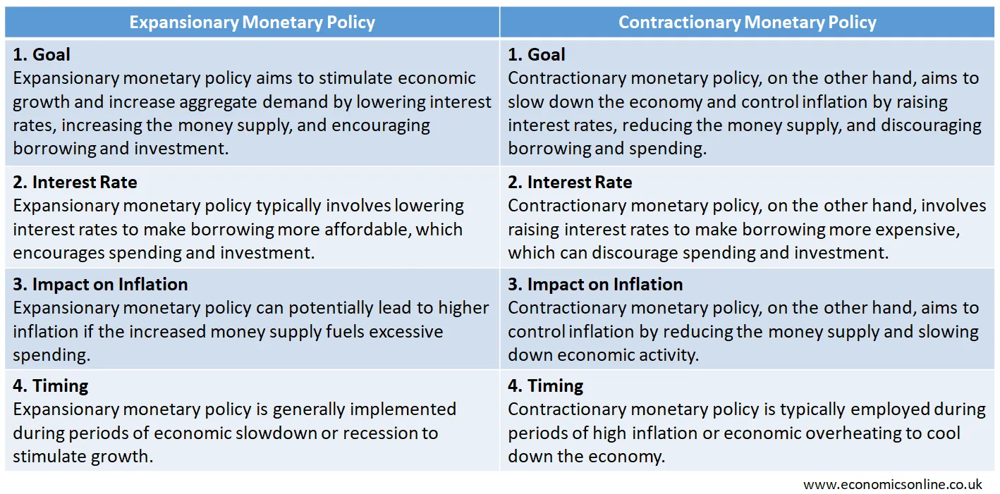

## Table of Contents

## What is expansionary monetary policy?

Expansionary monetary policy is when a country's central bank takes actions to increase the money supply and encourage more spending and investment. This is usually done to help boost economic growth, especially during times of slow economic activity or recession. The central bank can use several tools to do this, such as lowering interest rates, buying government bonds, or reducing reserve requirements for banks. By making borrowing cheaper and increasing the amount of money available, people and businesses are more likely to spend and invest, which can help stimulate the economy.

When interest rates are lowered, it becomes less expensive for people and businesses to borrow money. This can lead to more spending on things like homes, cars, and business projects. Lower interest rates can also make saving less attractive, encouraging people to spend their money instead. By buying government bonds, the central bank puts more money into the economy, which can also help increase spending. Overall, expansionary monetary policy aims to get the economy moving by making it easier for money to flow and encouraging more economic activity.

## Why is expansionary monetary policy used?

Expansionary monetary policy is used to help the economy grow when it's not doing well. When the economy is slow or in a recession, people and businesses might not spend or invest as much. This can make the economy even slower. To fix this, the central bank can use expansionary monetary policy to put more money into the economy and make it easier for people to borrow. By doing this, they hope to encourage more spending and investment, which can help the economy start growing again.

For example, the central bank might lower interest rates. When interest rates are low, it costs less for people to borrow money for things like buying a house or starting a business. This can lead to more spending and investment. The central bank might also buy government bonds, which puts more money into the economy. All these actions are meant to make the economy more active and help it recover from slow times.

## Can you explain how expansionary monetary policy affects interest rates?

Expansionary monetary policy is when the central bank tries to help the economy grow by making more money available. One way they do this is by lowering interest rates. When interest rates go down, it becomes cheaper for people and businesses to borrow money. This means they might be more likely to take out loans to buy things like houses or to start new projects. Lower interest rates can also make saving money less attractive, so people might spend their money instead of keeping it in the bank.

When the central bank lowers interest rates, it can lead to more spending and investment in the economy. This is because when borrowing is cheaper, people and businesses feel more confident about taking on debt. More spending and investment can help the economy grow faster. The central bank might also buy government bonds, which puts more money into the economy and can help keep interest rates low. All of these actions are meant to make the economy more active and help it recover from slow times.

## What are some common tools used in expansionary monetary policy?

Expansionary monetary policy is when the central bank tries to help the economy grow by making more money available. One common tool they use is lowering interest rates. When interest rates are low, it's cheaper for people and businesses to borrow money. This can encourage them to take out loans to buy things like houses or start new projects. Lower interest rates can also make saving less attractive, so people might spend their money instead of keeping it in the bank.

Another tool is buying government bonds. When the central bank buys these bonds, it puts more money into the economy. This can help keep interest rates low and encourage more spending and investment. A third tool is reducing reserve requirements for banks. This means banks have to keep less money on hand and can lend more to people and businesses. All these actions are meant to make the economy more active and help it recover from slow times.

## Can you provide a simple example of expansionary monetary policy in action?

Imagine the economy is slowing down and people are not spending much money. The central bank decides to use expansionary monetary policy to help. They start by lowering interest rates. This makes it cheaper for people to borrow money from banks. Now, more people can afford to take out loans to buy things like houses or cars. Businesses also find it easier to borrow money to start new projects or expand.

Because borrowing is cheaper, people and businesses start spending more. This extra spending helps the economy grow faster. The central bank also buys government bonds, which puts more money into the economy. All these actions make it easier for money to flow and encourage more economic activity. This is how expansionary monetary policy works to help the economy recover from slow times.

## How does expansionary monetary policy influence inflation?

Expansionary monetary policy can lead to higher inflation. When the central bank uses this policy, they put more money into the economy. This means there's more money chasing the same amount of goods and services. When there's more money around, prices can go up because people are willing to pay more for things. This is how inflation happens.

But, it's not always a bad thing. A little bit of inflation can be good for the economy. It can encourage people to spend their money now instead of saving it, which can help the economy grow. The central bank has to be careful, though. If they put too much money into the economy, inflation can get out of control. So, they need to find the right balance to help the economy without causing too much inflation.

## What are the potential risks of implementing expansionary monetary policy?

One risk of using expansionary monetary policy is that it can cause inflation to go up too much. When the central bank puts more money into the economy, there's more money chasing the same amount of goods and services. This can make prices go up, which is inflation. If inflation gets too high, it can make life harder for people because their money doesn't go as far. It can also make it harder for businesses to plan for the future because they don't know what prices will be.

Another risk is that it might create a bubble in the economy. When borrowing is cheap because of low interest rates, people and businesses might take on too much debt. They might invest in things like houses or stocks, hoping the prices will keep going up. But if too many people do this, it can create a bubble. If the bubble bursts, it can lead to a big drop in prices and even a financial crisis. The central bank has to be careful to avoid causing these problems when using expansionary monetary policy.

## How does expansionary monetary policy impact the economy's growth?

Expansionary monetary policy helps the economy grow by making it easier for people and businesses to spend and invest. When the central bank lowers interest rates, borrowing money becomes cheaper. This means more people can take out loans to buy things like houses or cars, and businesses can borrow money to start new projects or expand. When people and businesses spend more, it creates more demand for goods and services, which can lead to more jobs and higher economic growth.

However, there are risks to using expansionary monetary policy. If the central bank puts too much money into the economy, it can cause inflation to go up too much. When prices rise quickly, it can make life harder for people because their money doesn't go as far. Another risk is that low interest rates might lead to too much borrowing and create a bubble in the economy. If the bubble bursts, it can cause a big drop in prices and even a financial crisis. The central bank has to balance these risks to help the economy grow without causing too many problems.

## Can you discuss a historical example where expansionary monetary policy was effectively used?

One good example of expansionary monetary policy being used effectively was in the United States during the Great Recession that started in 2007. The Federal Reserve, which is the central bank of the U.S., took several steps to help the economy. They lowered interest rates to almost zero, making it very cheap for people and businesses to borrow money. This encouraged more spending and investment, which helped to slowly bring the economy back to life.

The Federal Reserve also used a tool called quantitative easing. This meant they bought a lot of government bonds and other securities, putting more money into the economy. By doing this, they kept interest rates low and made sure there was enough money flowing around to help businesses and people. Over time, these actions helped the U.S. economy recover from the recession, showing how expansionary monetary policy can be a powerful tool to help a struggling economy.

## How do central banks decide when to implement expansionary monetary policy?

Central banks decide to use expansionary monetary policy when they see the economy is not doing well. They look at things like how fast the economy is growing, how many people have jobs, and how much people are spending. If these numbers are low, it means the economy might be slowing down or in a recession. The central bank wants to help the economy grow again, so they might decide to put more money into the economy to make it easier for people to spend and invest.

To do this, the central bank can lower interest rates, which makes borrowing money cheaper. They might also buy government bonds, which puts more money into the economy. The central bank has to be careful, though. They need to make sure they are not putting too much money into the economy, which could cause prices to go up too fast. By looking at all these factors, the central bank can decide if it's the right time to use expansionary monetary policy to help the economy grow.

## What are the differences between expansionary monetary policy and fiscal policy?

Expansionary monetary policy and fiscal policy are two ways to help the economy grow, but they work in different ways. Expansionary monetary policy is when the central bank, like the Federal Reserve in the U.S., tries to put more money into the economy. They do this by lowering interest rates, which makes it cheaper for people and businesses to borrow money. They might also buy government bonds to put more money into the economy. The goal is to make people spend and invest more, which helps the economy grow.

Fiscal policy, on the other hand, is when the government changes how much it spends or how much it taxes to help the economy. If the government wants to help the economy grow, it might spend more money on things like building roads or giving money to people who need help. They might also lower taxes so people have more money to spend. The difference is that fiscal policy is about the government's spending and taxes, while monetary policy is about the central bank controlling the money supply and interest rates. Both can help the economy, but they use different tools to do it.

## How can the effectiveness of expansionary monetary policy be measured and evaluated?

The effectiveness of expansionary monetary policy can be measured by looking at how the economy grows after the policy is used. When the central bank lowers interest rates or buys government bonds, they want to see if more people are spending and investing. They look at things like how fast the economy is growing, how many people have jobs, and how much people are spending. If these numbers go up after the policy is used, it means the policy is working. Economists also look at inflation to make sure it's not going up too fast because of the extra money in the economy.

Evaluating the policy can take some time because changes in the economy don't happen right away. It might take months or even years to see the full effect of lower interest rates or more money in the economy. Economists use different tools and models to understand how the policy is working. They compare what happens in the economy to what they expected would happen. If the economy grows more than expected and inflation stays under control, then the expansionary monetary policy can be seen as effective.

## What is the Economic Strategy of Expansionary Policy?

Expansionary policy is a crucial macroeconomic approach aimed at stimulating economic growth, particularly during periods of economic stagnation or recession. This policy encompasses various tools that work cohesively to reignite economic activity and combat downturns. The primary instruments include [interest rate](/wiki/interest-rate-trading-strategies) reductions and increased government spending.

Interest rate reductions are one of the most effective tools in expansionary policy. By lowering the interest rates, central banks make borrowing cheaper for consumers and businesses. This encourages spending and investment, leading to increased demand for goods and services. Lower interest rates also reduce the cost of existing debt, potentially freeing up additional resources for consumption or investment. The formula often used to assess the impact of interest rate changes on investment is derived from the basic present value formula:

$$
PV = \frac{C}{(1 + r)^n}
$$

where $PV$ is the present value of cash flows, $C$ is the cash flow in each period, $r$ is the interest rate, and $n$ is the number of periods. A reduction in $r$ decreases the denominator, thus increasing the present value of future cash flows and making investments more attractive.

Increased government spending is another critical component of expansionary policy. By boosting public expenditure, the government directly injects money into the economy, aiming to increase overall demand. This spending can take various forms, such as infrastructure projects, subsidies, or direct financial aid to individuals. The multiplier effect amplifies the impact of government spending, where an initial increase in spending leads to increased income and consumption, further stimulating demand.

Mathematically, the multiplier effect can be represented as:

$$
\text{Multiplier} = \frac{1}{1 - MPC}
$$

where $MPC$ stands for the marginal propensity to consume. A higher MPC indicates that consumers are more likely to spend additional income, thus enhancing the multiplier effect and the overall impact of increased government spending.

The combined effect of reduced interest rates and heightened government expenditure aims to stabilize the economy by boosting consumer confidence, increasing employment, and fostering economic growth. These tools must be carefully calibrated to avoid potential side effects, such as inflation or budget deficits, which can arise from prolonged or excessive application. Understanding the delicate balance between these instruments is crucial for policymakers striving to achieve economic stability and growth.

## References & Further Reading

[1]: Woodford, M. (2003). ["Interest and Prices: Foundations of a Theory of Monetary Policy."](https://www.jstor.org/stable/j.ctv30pnvmf) Princeton University Press.

[2]: Taylor, J. B. (1993). ["Discretion versus policy rules in practice."](https://www.sciencedirect.com/science/article/pii/016722319390009L) Carnegie-Rochester Conference Series on Public Policy, 39, 195-214.

[3]: Friedman, B. M. (2006). ["The Science and Practice of Monetary Policy Today."](https://papers.ssrn.com/sol3/papers.cfm?abstract_id=254018) The Journal of Economic Perspectives, 20(4), 3-22.

[4]: [Federal Reserve’s Economic Policy Symposium Proceedings](https://www.kansascityfed.org/research/jackson-hole-economic-symposium/economic-symposium-conference-proceedings/) - Reports on key economic policy discussions and trends.

[5]: Easley, D., López de Prado, M., & O'Hara, M. (2012). ["The Volume Clock: Insights into the High Frequency Paradigm."](https://www.semanticscholar.org/paper/Flow-Toxicity-and-Liquidity-in-a-High-Frequency-Easley-Prado/9369430bd005d194f9332ae7cbd5a57ace5e9ab3) Management Science, 58(8), 1375-1390.

[6]: Lewis, M. (2014). ["Flash Boys: A Wall Street Revolt."](https://en.wikipedia.org/wiki/Flash_Boys) W.W. Norton & Company.

[7]: [Bank for International Settlements (BIS) Publications](https://www.bis.org/bispapers/index.htm) - Analyses on global monetary policies and financial stability.

[8]: Tortoriello, R. (2010). ["Quantitative Strategies for Achieving Alpha."](https://www.amazon.com/Quantitative-Strategies-Achieving-Alpha-McGraw-Hill/dp/0071549846) McGraw-Hill Education.