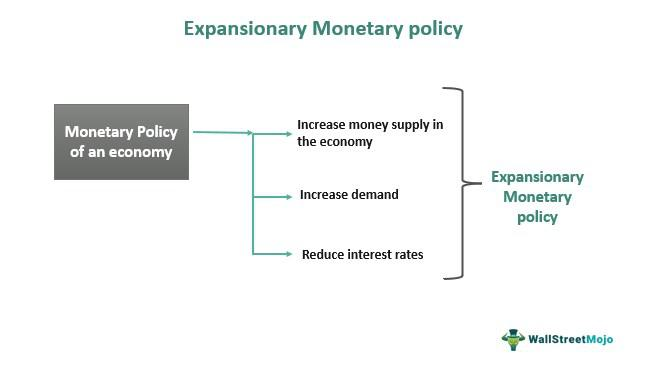

The modern economic landscape is increasingly defined by the interplay of complex economic strategies, with expansionary monetary policy and algorithmic trading playing pivotal roles. These elements are fundamental in understanding how economies can achieve expansion, how monetary policy is crafted, and how algorithmic trading shapes and interacts with these strategies within financial markets.

Expansionary monetary policy is a crucial tool employed by central banks to stimulate economic growth, especially during times of economic stagnation or recession. This policy aims to increase the money supply, reduce interest rates, and ultimately encourage spending and investment. As a result, expansionary strategies are essential in promoting economic stability and facilitating recovery during economic downturns. 

Simultaneously, algorithmic trading has transformed the trading landscape. By utilizing complex algorithms to automate trading decisions, this form of trading significantly enhances market efficiency and liquidity. It operates at high speeds and volumes that humans cannot achieve, influencing price discovery and market dynamics. The interaction between algorithmic trading and monetary policy is intricate, as algorithms may respond swiftly to policy changes, sometimes amplifying market movements and posing challenges to the effective implementation of monetary policy.

Together, these economic strategies and technologies create a dynamic environment where financial market stability is both supported and sometimes challenged. Understanding their synergy is essential for policymakers, financial professionals, and investors aiming to navigate today's global economic landscape. This exploration into the intersections of expansionary economic strategies, monetary policies, and algorithmic trading provides critical insight into the functioning and future direction of financial systems worldwide.

## Table of Contents

## Economic Strategy: Expansionary Policy

Expansionary policy is a crucial macroeconomic approach aimed at stimulating economic growth, particularly during periods of economic stagnation or recession. This policy encompasses various tools that work cohesively to reignite economic activity and combat downturns. The primary instruments include interest rate reductions and increased government spending.

Interest rate reductions are one of the most effective tools in expansionary policy. By lowering the interest rates, central banks make borrowing cheaper for consumers and businesses. This encourages spending and investment, leading to increased demand for goods and services. Lower interest rates also reduce the cost of existing debt, potentially freeing up additional resources for consumption or investment. The formula often used to assess the impact of interest rate changes on investment is derived from the basic present value formula:

$$
PV = \frac{C}{(1 + r)^n}
$$

where $PV$ is the present value of cash flows, $C$ is the cash flow in each period, $r$ is the interest rate, and $n$ is the number of periods. A reduction in $r$ decreases the denominator, thus increasing the present value of future cash flows and making investments more attractive.

Increased government spending is another critical component of expansionary policy. By boosting public expenditure, the government directly injects money into the economy, aiming to increase overall demand. This spending can take various forms, such as infrastructure projects, subsidies, or direct financial aid to individuals. The multiplier effect amplifies the impact of government spending, where an initial increase in spending leads to increased income and consumption, further stimulating demand.

Mathematically, the multiplier effect can be represented as:

$$
\text{Multiplier} = \frac{1}{1 - MPC}
$$

where $MPC$ stands for the marginal propensity to consume. A higher MPC indicates that consumers are more likely to spend additional income, thus enhancing the multiplier effect and the overall impact of increased government spending.

The combined effect of reduced interest rates and heightened government expenditure aims to stabilize the economy by boosting consumer confidence, increasing employment, and fostering economic growth. These tools must be carefully calibrated to avoid potential side effects, such as inflation or budget deficits, which can arise from prolonged or excessive application. Understanding the delicate balance between these instruments is crucial for policymakers striving to achieve economic stability and growth.

## Monetary Policy and Its Expansionary Tools

Monetary policy is a pivotal instrument of economic management, primarily executed by a nation's central bank to influence macroeconomic conditions. This policy framework aims at stabilizing the economy through controlling the money supply and interest rates. Expansionary monetary policy, in particular, is utilized to stimulate economic growth, especially in periods of economic sluggishness or recession.

A central tool of expansionary monetary policy is the lowering of interest rates. When a central bank reduces the benchmark interest rates, borrowing becomes cheaper, incentivizing businesses and consumers to take loans for investment and spending. This increased borrowing can lead to a rise in capital investment and consumer spending, thereby boosting economic activity. For instance, the adjustment of the federal funds rate by the Federal Reserve in the United States serves as a quintessential example of how interest rates can be manipulated to influence the broader economy.

Open market operations (OMOs) constitute another critical strategy. Through the purchase of government securities, a central bank injects [liquidity](/wiki/liquidity-risk-premium) into the banking system, expanding the money supply. For example, when a central bank buys government bonds, it credits the bank accounts of the sellers, effectively increasing the funds available for lending and spending. This process not only enhances liquidity but also puts downward pressure on interest rates, further supporting economic activity.

Quantitative easing (QE) extends the principles of OMOs by involving large-scale purchases of financial assets to inject liquidity when traditional monetary policy tools have become ineffective, particularly when interest rates approach zero. QE aims to lower long-term interest rates, encourage borrowing, and stimulate investment in situations where standard monetary interventions are insufficient.

Another mechanism central banks use is adjusting reserve requirements, which are the minimum amounts banks must hold against deposits. By lowering these requirements, central banks free up additional capital that banks can lend. This increase in available credit bolsters economic activity through boosted lending and investing capabilities.

The ultimate objective of utilizing these expansionary tools is to increase the money supply within the economy, facilitating an environment conducive to growth. Through encouraging spending and investment, these policies aim to create employment opportunities, increase production, and thereby foster overall economic expansion.

In summary, the effective deployment of [interest rate](/wiki/interest-rate-trading-strategies) reductions, open market operations, quantitative easing, and adjustments in reserve requirements by central banks orchestrates the expansionary monetary policy's goal of spurring economic growth. These tools collectively work to ensure that economies remain buoyant and resilient in the face of recessionary pressures.

## Real-World Applications and Case Studies

The Great Recession, which lasted from December 2007 to June 2009, is a significant example of employing expansionary monetary policies to mitigate economic downturns. During this period, central banks worldwide implemented various measures to stabilize and stimulate their respective economies. In the United States, the Federal Reserve (Fed) reduced the federal funds rate to near-zero levels, applying an aggressive approach to encourage borrowing and spending. This reduction in interest rates was complemented by a series of unconventional monetary policy instruments, such as quantitative easing (QE), which involved massive purchases of government securities and mortgage-backed securities. The objective of QE was to inject liquidity directly into the financial system, lower long-term interest rates, and promote credit flow.

Historical data from the Great Recession shows the mixed success of these expansionary monetary policies. The U.S. economy eventually stabilized and resumed growth, but not without significant lags and uneven recovery. GDP growth rates increased while unemployment rates gradually decreased, although many of the effects took several years to materialize fully. This highlighted the complexities involved in policy implementation and the challenges posed by such severe economic contractions.

Similarly, during the COVID-19 pandemic in 2020, expansionary monetary policies were at the forefront of efforts to cushion the economic impacts of the global health crisis. As lockdowns and disruptions unfolded, central banks acted swiftly to lower interest rates and adopted QE on an unprecedented scale. The Federal Reserve, for instance, cut interest rates to near zero again and launched multiple rounds of QE. This time, however, the asset purchase programs were more diverse, including corporate bonds, municipal bonds, and beyond, aiming to stabilize various sectors of the market and ensure the availability of credit.

The response to the COVID-19 pandemic revealed the adaptability and agility of central banks in deploying monetary policy tools effectively. The immediate injection of liquidity and reduction in borrowing costs helped to avert a deeper financial crisis, with some economies experiencing a quicker rebound compared to the Great Recession. Real-time data indicated rapid recoveries in stock markets and financial conditions, although the real economy, including employment and small businesses, faced continued challenges.

Both of these instances illustrate the critical role expansionary monetary policy plays in stabilizing economies during crises. While effective in supporting financial markets and providing liquidity, these measures also exposed limitations—such as slower impacts on employment and certain sectors. Moreover, they raised questions about longer-term implications, including potential asset bubbles and the sustainability of massive public debt levels.

In summary, historical data from the Great Recession and the COVID-19 pandemic underscores the importance and challenges of expansionary monetary policies in modern economic management. These case studies provide valuable insights into the effectiveness of such policies and highlight areas for future study and policy refinement.

## The Role of Algorithmic Trading in Financial Markets

Algorithmic trading represents a significant technological advancement in financial markets, automating trading strategies using complex algorithms. These algorithms are designed to execute trades based on pre-defined criteria, such as timing, price, or quantity, without direct human intervention. This automation brings several benefits, notably improved market liquidity and efficiency. 

### Interactions with Monetary Policy

Algorithmic trading can influence how monetary policy changes translate into market behaviors. As central banks implement expansionary monetary policies, such as reducing interest rates or engaging in quantitative easing, [algorithmic trading](/wiki/algorithmic-trading) platforms can swiftly respond to these changes. By quickly adjusting their trading strategies in light of monetary policy shifts, algorithms can enhance the speed at which markets absorb new information, thus facilitating faster market adjustments. 

However, this rapid integration of policy changes poses challenges. For instance, if many algorithms respond similarly to a monetary policy announcement, it could potentially amplify market movements, leading to increased [volatility](/wiki/volatility-trading-strategies). This phenomenon may temporarily destabilize markets, complicating the central banks' efforts to manage economic expectations.

### Challenges and Opportunities of High-Frequency Trading

High-frequency trading ([HFT](/wiki/high-frequency-trading-strategies)), a subset of algorithmic trading, involves executing a large number of orders at extremely high speeds. HFT can contribute significantly to market liquidity, as these traders often act as market makers, providing buy and sell offers that allow other participants to trade more efficiently. By narrowing bid-ask spreads, HFT improves overall market efficiency, benefiting all participants.

Despite these advantages, HFT presents challenges. The sheer speed and [volume](/wiki/volume-trading-strategy) of transactions can create systemic risks, particularly if algorithms malfunction or if trading strategies exacerbate market trends. Furthermore, the potential for market manipulation through practices like "spoofing" — where traders place orders without the intention of executing them to create misleading demand — can undermine market integrity.

To address these issues, regulatory frameworks are evolving to ensure fair and transparent markets. Financial authorities are monitoring algorithmic and high-frequency trading strategies to mitigate any adverse impacts on market stability. Measures include imposing speed bumps to slow down trading, enhancing transparency requirements, and scrutinizing trading algorithms to prevent manipulative practices.

In summary, while algorithmic trading significantly impacts financial market dynamics, enhancing liquidity and market efficiency, it also presents unique challenges that must be carefully managed. The relationship between algorithmic trading and monetary policy is complex and requires continuous evaluation to maximize benefits while safeguarding market stability.

## Impact of Algorithmic Trading on Monetary Policy Effectiveness

Algorithmic trading, characterized by the use of complex algorithms to automate trading decisions, has a profound impact on the effectiveness of monetary policy. By swiftly reacting to market signals and executing high-frequency trades, algorithmic trading can significantly amplify market moves, thus complicating the implementation of monetary policy. When central banks adjust monetary policies, such as altering interest rates or conducting open market operations, algorithmic trading systems can lead to rapid adjustments in asset prices, often based on the anticipated effects of these policy changes.

One of the primary challenges algorithmic trading poses to monetary policy is its potential to create volatile market conditions. For instance, during unexpected central bank announcements or economic news releases, algorithmic trading can trigger abrupt price movements and spikes in trading volumes. This can lead to liquidity shortages and herd behavior, where many algorithms execute similar trades simultaneously, causing large swings that might not correspond to fundamental economic conditions.

Historically, instances such as the Flash Crash of May 6, 2010, have demonstrated how high-frequency trading, a subset of algorithmic trading, can exacerbate market instability. On that day, the Dow Jones Industrial Average plummeted nearly 1,000 points within minutes, driven by automated trading systems reacting en masse. While the Flash Crash was an extreme event, it underscored the need for improved regulatory measures to ensure that algorithmic trading does not undermine financial stability.

Considering the potential destabilizing effects of algorithmic trading, regulatory frameworks need to evolve to address these challenges. Future regulations could involve enforcing stricter controls on high-frequency trading, such as introducing circuit breakers that temporarily halt trading following rapid price movements, thus allowing markets to recalibrate. Additionally, improving transparency in trading algorithms and promoting fair market access can mitigate unintended consequences on monetary policy implementation.

Moreover, central banks might need to adapt their communication strategies to account for the rapid response of algorithmic trading systems. Providing clearer guidance about policy intentions and reducing uncertainty can enhance the predictability of policy changes, thereby reducing knee-jerk reactions from automated trading systems.

In summary, while algorithmic trading offers benefits like increased market efficiency and liquidity, its interaction with monetary policy poses notable challenges. As financial markets continue to evolve with technology, both market participants and regulators must work in tandem to ensure that algorithmic trading supports, rather than hinders, the goals of monetary policy.

## Conclusion

The intersection of expansionary economic strategies, monetary policy, and algorithmic trading forms the backbone of modern financial systems. Expansionary economic strategies, such as lowering interest rates and increasing government spending, serve as critical tools in times of economic stagnation or recession by stimulating economic activity and promoting growth. Meanwhile, monetary policies enacted by central banks aim to increase the money supply and encourage spending and investment. Tools like open market operations and quantitative easing are pivotal in facilitating this objective.

Algorithmic trading, which employs complex algorithms for automating trading strategies, plays a crucial role in enhancing market liquidity and efficiency. These systems can quickly process vast amounts of financial data, making them essential for maintaining order in increasingly fast-paced and volatile markets. However, the interaction between algorithmic trading and monetary policy can also amplify market moves, posing potential challenges to policy implementation and occasionally destabilizing markets. An example of this complexity is observed in high-frequency trading, which, while improving liquidity, can result in significant market fluctuations during periods of economic policy change.

To reap the benefits of these economic mechanisms while mitigating their risks, careful management and understanding are vital. Policymakers need to consider the synergistic effects of monetary policy and algorithmic trading when crafting economic strategies. This involves developing regulatory frameworks that address the rapid changes and potential unpredictabilities introduced by algorithmic trading in financial systems. Financial professionals and investors also benefit from understanding these interactions, allowing them to make informed decisions that align with broader economic strategies.

In conclusion, the continuous evolution of these elements requires robust knowledge and vigilance from all stakeholders involved in navigating the global economic landscape. Through strategic implementation and ongoing assessment, the balance between growth, stability, and risk can be maintained, ensuring the resilience and prosperity of modern financial systems.

## References and Further Reading

Key publications and articles on expansionary monetary policy and algorithmic trading provide essential insights into these economic strategies. Below is a list of comprehensive resources, studies, and reports from leading economic research bodies and financial institutions that will enhance the reader’s understanding of these topics:

1. **"Interest and Prices: Foundations of a Theory of Monetary Policy" by Michael Woodford**: This book provides a comprehensive analysis of monetary policy and its effects on economic stability and growth [DOI: 10.2307/25056030].

2. **"A General-Equilibrium Approach to Monetary Theory" by John B. Taylor**: This paper discusses the frameworks for understanding how monetary policy impacts the broader economy. It offers a mathematical approach using general equilibrium analysis [DOI: 10.2307/2938249].

3. **"The Science and Practice of Monetary Policy Today" by Benjamin M. Friedman**: A detailed examination of contemporary monetary policy practices and their implications for economic policy [DOI: 10.1257/0895330054048723].

4. **Federal Reserve’s Economic Policy Symposium Proceedings**: Annual reports and discussions that highlight key trends and policies affecting the U.S. and global economies. These proceedings provide critical insights into the real-world applications of monetary policy [https://www.kansascityfed.org/research].

5. **"High-Frequency Trading" by David Easley, Marcos López de Prado, and Maureen O'Hara**: An exploration of the mechanisms behind algorithmic trading and its impact on market efficiency and stability. This paper is essential for understanding the implications of rapid trading strategies on monetary policy effectiveness [DOI: 10.1287/mnsc.2011.1737].

6. **"Flash Boys: A Wall Street Revolt" by Michael Lewis**: While a non-technical book, it provides a narrative on the rise of high-frequency trading and its effects on financial markets, offering a real-world perspective complementing technical analyses.

7. **"Quantitative Strategies for Achieving Alpha" edited by Richard Tortoriello**: This resource provides insights into the tools and strategies employed in algorithmic trading, emphasizing quantitative approaches within financial markets [ISBN: 9781883249770].

8. **Bank for International Settlements (BIS) Reports**: Regular publications from BIS offer detailed analyses on global monetary policies, financial stability, and the interaction of various economic strategies within financial markets [https://www.bis.org].

These resources provide extensive information on expansionary monetary policy and algorithmic trading, offering both theoretical and practical perspectives that are crucial for further exploration and research in these fields.

## References & Further Reading

[1]: Woodford, M. (2003). ["Interest and Prices: Foundations of a Theory of Monetary Policy."](https://www.jstor.org/stable/j.ctv30pnvmf) Princeton University Press.

[2]: Taylor, J. B. (1993). ["Discretion versus policy rules in practice."](https://www.sciencedirect.com/science/article/pii/016722319390009L) Carnegie-Rochester Conference Series on Public Policy, 39, 195-214.

[3]: Friedman, B. M. (2006). ["The Science and Practice of Monetary Policy Today."](https://papers.ssrn.com/sol3/papers.cfm?abstract_id=254018) The Journal of Economic Perspectives, 20(4), 3-22.

[4]: [Federal Reserve’s Economic Policy Symposium Proceedings](https://www.kansascityfed.org/research/jackson-hole-economic-symposium/economic-symposium-conference-proceedings/) - Reports on key economic policy discussions and trends.

[5]: Easley, D., López de Prado, M., & O'Hara, M. (2012). ["The Volume Clock: Insights into the High Frequency Paradigm."](https://www.semanticscholar.org/paper/Flow-Toxicity-and-Liquidity-in-a-High-Frequency-Easley-Prado/9369430bd005d194f9332ae7cbd5a57ace5e9ab3) Management Science, 58(8), 1375-1390.

[6]: Lewis, M. (2014). ["Flash Boys: A Wall Street Revolt."](https://en.wikipedia.org/wiki/Flash_Boys) W.W. Norton & Company.

[7]: [Bank for International Settlements (BIS) Publications](https://www.bis.org/bispapers/index.htm) - Analyses on global monetary policies and financial stability.

[8]: Tortoriello, R. (2010). ["Quantitative Strategies for Achieving Alpha."](https://www.amazon.com/Quantitative-Strategies-Achieving-Alpha-McGraw-Hill/dp/0071549846) McGraw-Hill Education.