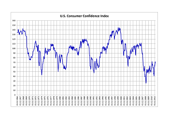

## Table of Contents

## What is the Expectations Index?

The Expectations Index is a part of the Consumer Confidence Survey. It measures how people feel about the future of the economy. Specifically, it looks at what people think will happen with their income, business conditions, and jobs over the next six months.

This index is important because it helps predict how much people will spend in the future. If people are hopeful about the economy, they are more likely to spend money. But if they are worried, they might save their money instead. Economists and businesses use this information to make plans and decisions.

## How is the Expectations Index calculated?

The Expectations Index is calculated by asking people a set of questions about their views on the future of the economy. These questions focus on what people think will happen with their income, business conditions, and job availability over the next six months. Each person's answers are turned into numbers, and these numbers are added up to make the index.

To make the index, the answers are given points. For example, if someone says they think business conditions will be better in six months, they get a certain number of points. If they think it will be worse, they get fewer points. These points are then averaged across all the people who answered the survey. The final number is the Expectations Index, which shows how optimistic or pessimistic people are about the future.

## What are the components of the Expectations Index?

The Expectations Index is made up of three main parts. The first part is about what people think will happen to their income in the next six months. If people think their income will go up, they are more likely to feel good about the future. The second part is about business conditions. This part asks people if they think business will get better or worse in the next six months. The third part is about jobs. It looks at whether people think it will be easier or harder to find a job in the future.

These three parts together help make the Expectations Index. Each part is important because it shows a different side of what people think will happen. By putting all these parts together, the index gives a full picture of how people feel about the future of the economy. If the index is high, it means people are hopeful. If it is low, it means they are worried.

## Who uses the Expectations Index and for what purposes?

Economists, businesses, and policymakers use the Expectations Index to understand how people feel about the future of the economy. It helps them make better decisions. For example, economists use the index to predict how much people will spend in the future. If people are hopeful, they are more likely to spend money, which can help the economy grow. Businesses use the index to plan their strategies. If the index shows people are worried, a business might decide to wait before starting a new project or expanding.

Policymakers also find the Expectations Index useful. They use it to decide on policies that can help the economy. If the index shows people are worried, policymakers might create programs to boost confidence and spending. This could include things like tax cuts or job training programs. By understanding what people think about the future, policymakers can take steps to make the economy stronger and more stable.

## How does the Expectations Index differ from other economic indicators?

The Expectations Index is different from other economic indicators because it focuses on how people feel about the future. Many other indicators, like the unemployment rate or GDP, look at what is happening right now in the economy. The Expectations Index, on the other hand, tries to predict what will happen by asking people about their hopes and worries for the next six months. This makes it a useful tool for understanding how people's feelings might affect their spending and saving habits.

Another way the Expectations Index is different is that it is made up of people's opinions, not hard data. For example, the Consumer Price Index measures the actual prices of goods and services, while the Expectations Index measures what people think will happen to their income, business conditions, and jobs. Because it is based on people's feelings, the Expectations Index can change quickly if people's views on the future change. This makes it a good early warning system for economists and policymakers to see where the economy might be headed.

## What historical trends can be observed in the Expectations Index?

The Expectations Index has shown many ups and downs over the years. When the economy is doing well, the index usually goes up because people feel hopeful about the future. For example, during the late 1990s, when the economy was booming, the Expectations Index was high. People were feeling good about their jobs and incomes. But when there are economic problems, like during the 2008 financial crisis, the index drops. People get worried about losing their jobs or not having enough money, so they are less hopeful about what will happen next.

Another trend we can see is that the Expectations Index often changes before other economic indicators. This means it can be a good way to see what might happen to the economy in the future. For instance, if the index starts to go down, it might mean that people are starting to worry about the economy before we see things like higher unemployment or slower growth. This can give economists and policymakers a heads-up to take action before things get worse. Overall, the Expectations Index helps us understand how people's feelings about the future can affect the economy.

## How reliable is the Expectations Index as a predictor of economic performance?

The Expectations Index is pretty good at predicting how the economy will do, but it's not perfect. It works well because it shows how people feel about the future. If people are hopeful, they tend to spend more money, which helps the economy grow. But if they're worried, they might save their money instead, which can slow things down. Economists look at the index to get an idea of what might happen next, but they also use other information to make sure their predictions are as accurate as possible.

Sometimes, the Expectations Index can be off the mark. People's feelings can change quickly, and what they think will happen might not always come true. For example, if there's a big event like a war or a natural disaster, people might suddenly feel very different about the future. Also, the index is based on what people say in surveys, and not everyone's opinion might be included. So, while the Expectations Index is a helpful tool, it's best used along with other economic indicators to get a full picture of what's going on.

## What are the limitations of the Expectations Index?

The Expectations Index has some limits that can make it less useful at times. One big problem is that it's based on what people say they think will happen, not on what actually happens. People can be wrong about the future, and their feelings can change quickly. For example, if there's a sudden event like a big storm or a war, people might feel very different about the future than they did just a few days before. Also, the index might not include everyone's opinions because it's based on surveys. Some people might not be asked, or some groups might be left out.

Another issue is that the Expectations Index can be influenced by short-term events that don't really affect the economy in the long run. For instance, if there's a lot of news about a possible recession, people might feel worried even if the economy is still doing okay. This can make the index go down even though nothing has really changed yet. Because of these things, it's important to use the Expectations Index along with other economic indicators to get a better idea of what's going on. By looking at many different pieces of information, economists and policymakers can make better decisions.

## How does the methodology of the Expectations Index evolve over time?

The way the Expectations Index is made changes over time to stay useful and accurate. The people who make the index, like The Conference Board, always try to make the survey questions better. They might change the questions to make sure they are easy to understand and cover the most important things people worry about. They also update how they pick people to answer the survey. This means they might include more different kinds of people to make sure the index shows what everyone is thinking, not just a few.

Another way the methodology evolves is by using new technology. Surveys used to be done over the phone or by mail, but now they can be done online. This makes it easier to reach more people and get results faster. The people who make the index also look at how well it predicts the future and make changes if it's not working as well as it should. By keeping up with these changes, the Expectations Index stays a helpful tool for understanding how people feel about the economy's future.

## Can the Expectations Index be influenced by external factors like media and policy changes?

Yes, the Expectations Index can be influenced by things like the news and new rules from the government. If the news is full of stories about a possible recession or a big economic problem, people might start to feel worried. This can make the Expectations Index go down, even if the economy is still doing okay. On the other hand, if the news is good and talks about how the economy is growing, people might feel more hopeful, and the index might go up.

Changes in government rules can also affect how people feel about the future. For example, if the government starts a new program to help people find jobs, people might feel more hopeful about their future income and job chances. This could make the Expectations Index go up. But if the government makes new rules that make it harder for businesses, people might worry about their jobs and the economy, which could make the index go down. So, both the news and government actions can play a big role in how people answer the survey and what the Expectations Index shows.

## What advanced statistical methods are used to analyze the Expectations Index data?

To understand the Expectations Index better, economists use some advanced math tools. One common method is regression analysis. This helps them see how different things, like people's income or the unemployment rate, affect the index. By using regression, they can figure out which factors are the most important for how people feel about the future. Another tool they use is time series analysis. This looks at how the Expectations Index changes over time and helps predict what might happen next. It's like looking at a long line of numbers to find patterns and make guesses about the future.

Another way economists study the Expectations Index is by using something called [factor](/wiki/factor-investing) analysis. This helps them break down the index into smaller parts to see what's really driving people's feelings. For example, they might find out that worries about jobs are more important than worries about income. Economists also use something called cluster analysis to group people with similar views together. This can show if certain groups of people are more hopeful or worried than others. By using these advanced methods, economists get a clearer picture of what the Expectations Index is telling them about the future of the economy.

## How can the Expectations Index be integrated with other data to enhance economic forecasting models?

The Expectations Index can be used with other data to make better guesses about the economy's future. Economists often mix the index with numbers like the unemployment rate, how much people are spending, and the growth of the economy. By looking at the Expectations Index along with these other numbers, they can see if people's feelings match what's really happening in the economy. For example, if the index shows people are worried but the economy is doing well, it might mean people are being too cautious. This can help economists predict if people will start spending more or if they'll keep saving their money.

Using the Expectations Index with other data also helps economists see patterns that might be hard to spot with just one set of numbers. They might use a special kind of math called regression analysis to see how the index, along with other things like interest rates or inflation, affects how the economy will do in the future. By putting all this information together, economists can make more accurate predictions. This helps businesses and the government plan better and make decisions that can keep the economy strong and stable.

## What is Algorithmic Trading and How Has It Evolved?

Algorithmic trading automates financial market transactions through the use of pre-defined strategy algorithms, eliminating the emotional and psychological constraints of manual trading. These algorithms execute trades by systematically analyzing a variety of inputs and market conditions. The origins of [algorithmic trading](/wiki/algorithmic-trading) can be traced back to the early 1970s, with the advent of electronic trading platforms and advances in computer processing power. Over the decades, advancements in computational technology have made algorithmic trading not only more efficient but also more widespread across global markets.

These algorithms are capable of processing vast volumes of data at a speed and accuracy unattainable by human traders. They are tailored to perform specific trading functions, such as [arbitrage](/wiki/arbitrage), [market making](/wiki/market-making), or trend-following strategies, and can rapidly adapt to different market conditions. Algorithms assess real-time market data, executing trades based on predefined conditions that aim to capitalize on market inefficiencies.

Incorporating economic indicators into algorithmic trading strategies has proven beneficial as it enhances trading performance by predicting potential market shifts. For example, algorithms might be programmed to initiate buy orders when certain positive economic indicators are released, anticipating a market upswing. This is expressed mathematically by algorithms that look for an increase in a specific economic indicator $E(t)$ above a predefined threshold level $\theta$ at time $t$, triggering a buy order:

$$
\text{if } E(t) > \theta, \text{ then initiate buy order}
$$

Sentiment analysis is an emerging aspect of algorithmic trading, particularly focused on consumer confidence. By analyzing large sets of sentiment data collected from surveys, news articles, and social media, algorithms can discern market mood and potential changes in consumer behavior. This is achieved through natural language processing (NLP) techniques that quantify sentiment into usable data, which can be integrated into trading strategies.

For instance, Python libraries like [TextBlob](https://textblob.readthedocs.io/en/dev/) or [VADER](https://github.com/cjhutto/vaderSentiment) can be used to perform sentiment analysis. Below is a simple Python code snippet using TextBlob to analyze sentiment from a sample text:

```python
from textblob import TextBlob

# Sample text
sample_text = "Consumer confidence is at an all-time high, suggesting a positive market trend."

# Create a TextBlob object
analysis = TextBlob(sample_text)

# Perform sentiment analysis
sentiment_score = analysis.sentiment.polarity

# Determine buying action
if sentiment_score > 0:
    print("Initiate buy order based on positive sentiment")
else:
    print("No action required")
```

As the landscape of trading continues to evolve, sentiment analysis is becoming increasingly pivotal in refining algorithmic trading strategies, enabling more informed decision-making by predicting potential market trends based on consumer sentiment. This integration marks a significant shift from reliance solely on quantitative data, offering traders a more nuanced view of the market dynamics.

## References & Further Reading

[1]: ["Machine Learning for Algorithmic Trading"](https://github.com/stefan-jansen/machine-learning-for-trading) by Stefan Jansen

[2]: ["Advances in Financial Machine Learning"](https://www.amazon.com/Advances-Financial-Machine-Learning-Marcos/dp/1119482089) by Marcos Lopez de Prado

[3]: ["Algorithms for Hyper-Parameter Optimization."](https://papers.nips.cc/paper/4443-algorithms-for-hyper-parameter-optimization.pdf) Advances in Neural Information Processing Systems 24 by Bergstra, J., Bardenet, R., Bengio, Y., & Kégl, B. (2011)

[4]: ["Evidence-Based Technical Analysis: Applying the Scientific Method and Statistical Inference to Trading Signals"](https://www.amazon.com/Evidence-Based-Technical-Analysis-Scientific-Statistical/dp/0470008741) by David Aronson

[5]: ["Quantitative Trading: How to Build Your Own Algorithmic Trading Business"](https://www.amazon.com/Quantitative-Trading-Build-Algorithmic-Business/dp/1119800064) by Ernest P. Chan