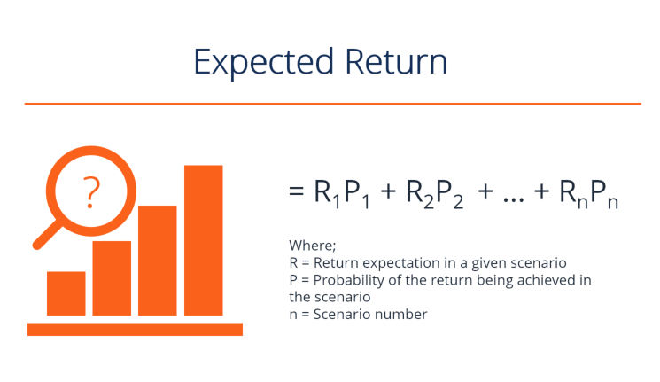

## Table of Contents

## What is expected return in finance?

Expected return in finance is a way to guess how much money you might make from an investment. It's like trying to predict the future, but with numbers. You look at all the possible outcomes of an investment and how likely each one is to happen. Then, you add up all these possibilities, taking into account their chances, to get an overall expected return. This helps investors decide if an investment is worth the risk.

For example, if you are thinking about buying a stock, you would look at how the stock has done in the past, what experts think about the company, and other things that could affect the stock's price. You might find that there's a 50% chance the stock will go up by 10% and a 50% chance it will go down by 5% over the next year. To find the expected return, you would calculate (0.5 * 10%) + (0.5 * -5%), which equals 2.5%. This means you can expect to make a 2.5% return on your investment over the next year, on average.

## How is expected return calculated for a single investment?

To calculate the expected return for a single investment, you need to think about all the different things that could happen to your investment and how likely each one is. Let's say you're investing in a stock. You might think there's a chance the stock could go up, stay the same, or go down. For each of these possibilities, you need to guess how much the stock price might change and how likely that change is to happen.

Once you have these guesses, you can figure out the expected return by adding up all the possible outcomes, but you have to weigh each outcome by how likely it is. For example, if there's a 60% chance the stock will go up by 8% and a 40% chance it will go down by 3%, you would calculate the expected return like this: (0.60 * 8%) + (0.40 * -3%). This gives you an expected return of 4.8% - 1.2% = 3.6%. So, on average, you can expect to make a 3.6% return on your investment.

## What is the difference between expected return and actual return?

Expected return is a guess about how much money you might make from an investment. It's like trying to predict the future by looking at all the possible things that could happen to your investment and how likely each one is. You use math to add up all these possibilities to come up with a number that tells you what you might expect to earn on average. It's useful for planning and deciding if an investment is worth the risk.

Actual return, on the other hand, is what really happens to your investment. It's the real amount of money you make or lose after a certain period of time. Unlike expected return, which is just a prediction, actual return is based on what actually happened in the market. Sometimes the actual return can be very different from the expected return because the future is hard to predict, and many things can affect how an investment performs.

The difference between expected return and actual return is important because it shows how well your predictions matched up with reality. If your expected return was high but your actual return was low, it might mean you didn't consider all the risks or that something unexpected happened. Understanding this difference helps investors learn from their past choices and make better decisions in the future.

## How do you calculate expected return for a portfolio of investments?

To figure out the expected return for a portfolio, you need to look at each investment in the portfolio separately first. You calculate the expected return for each investment the same way you would for a single investment. You think about all the things that could happen to each investment and how likely each thing is. Then, you add up all these possibilities, taking into account their chances, to get the expected return for each investment. Once you have the expected return for each investment, you need to know how much of your money is in each one. This is called the weight of each investment in your portfolio.

Next, you multiply the expected return of each investment by its weight in the portfolio. This tells you how much each investment contributes to the overall expected return of your portfolio. After you do this for all the investments, you add up all these contributions. The total is the expected return for your whole portfolio. For example, if you have two investments, one with an expected return of 5% and a weight of 60%, and another with an expected return of 3% and a weight of 40%, you would calculate (0.60 * 5%) + (0.40 * 3%) to get an expected return of 4.2% for your portfolio. This way, you can see how your whole group of investments might perform on average.

## What role does expected return play in investment decision-making?

Expected return is super important when you're trying to decide where to put your money. It's like a guess about how much money you might make from an investment. When you're looking at different investments, you want to know which one might give you the most money back. So, you look at the expected return to help you decide. If one investment has a higher expected return than another, you might choose that one, but you also need to think about how risky it is. Higher expected returns often come with higher risks, so you have to balance what you might gain with what you might lose.

But expected return isn't just about [picking](/wiki/asset-class-picking) the best investment. It's also used to figure out if an investment fits with your overall plan. For example, if you need a certain amount of money by a certain time, you can use expected return to see if an investment will help you reach your goal. It helps you make a plan for your money and see if you're on track. By looking at the expected return, you can decide if you need to change your investments or if you're doing okay. It's a big part of making smart choices with your money.

## How does the concept of risk relate to expected return?

Risk and expected return are like two sides of the same coin when it comes to investing. Expected return is what you guess you might earn from an investment, but risk is about the chance that things might not go as planned. Higher expected returns often come with higher risks. This means if you want to make more money, you might have to be okay with the possibility of losing more money too. It's like choosing between a safe bet with a small win or a big bet with a chance for a big win or a big loss.

Understanding the balance between risk and expected return helps you make better choices with your money. If you're not comfortable with a lot of risk, you might choose investments with lower expected returns because they're safer. But if you're willing to take more chances, you might go for investments with higher expected returns, knowing that you could lose money too. It's all about figuring out what you're comfortable with and what fits your goals. By thinking about both risk and expected return, you can pick the right investments for you.

## What are some common methods to estimate expected returns?

One common way to estimate expected returns is by looking at past performance. If a stock or an investment has done well in the past, you might guess it will do well in the future. You can look at the average return over the last few years and use that as your expected return. But remember, past performance doesn't always tell you what will happen next. Things can change, and the future might be different.

Another way is to use financial models. These are like math formulas that try to predict what might happen to an investment. One popular model is the Capital Asset Pricing Model (CAPM), which looks at how risky an investment is compared to the whole market. It uses this risk to guess how much return you might get. Other models might look at the company's earnings, the economy, or other things that could affect the investment. These models help you make a more educated guess about the future, but they're still just guesses.

Sometimes, you can also use expert opinions or forecasts. Financial analysts and experts often make predictions about how well certain investments will do. They might use their own research and models to come up with these guesses. While it's good to listen to what experts say, remember that they don't have a crystal ball. Their predictions can be wrong, so it's best to use their advice along with other methods to get a fuller picture of what might happen.

## How do historical returns influence expected return calculations?

Historical returns are like looking back at a report card to see how an investment did in the past. When you want to guess how much money you might make from an investment in the future, you often start by looking at how it did before. If a stock went up by an average of 7% each year over the last ten years, you might think it could do something similar in the future. This is a simple way to estimate the expected return. But, it's important to remember that just because something happened before doesn't mean it will happen again. The world changes, and so do the things that affect investments.

Even though historical returns are useful, they're not the whole story. They can give you a starting point, but you need to think about other things too. For example, what's happening in the economy, how the company is doing, or if there are new laws that could change things. These factors can make the future very different from the past. So, while historical returns are a good clue, you should use them along with other methods to get a better guess about what might happen to your investment.

## Can expected return be negative, and what does that signify?

Yes, expected return can be negative. This means that, on average, you might lose money on your investment. When you calculate the expected return, you look at all the things that could happen and how likely they are. If the chances of losing money are higher than the chances of making money, the expected return will be negative. It's like guessing that you'll end up with less money than you started with.

A negative expected return is a warning sign for investors. It tells you that the investment might not be a good choice because you're more likely to lose money than gain it. But, it's important to remember that expected return is just a guess. Even if the expected return is negative, you could still make money if things turn out better than expected. It's all about weighing the risks and deciding if you're okay with the chance of losing money.

## How do macroeconomic factors affect expected returns?

Macroeconomic factors are big things that affect the whole economy, like interest rates, inflation, and unemployment. These things can change how much money you might make from an investment. For example, if interest rates go up, borrowing money becomes more expensive. This can slow down the economy because people and businesses might spend less. If the economy slows down, companies might not make as much money, and their stock prices could go down. So, if you're guessing how much money you might make from a stock, you need to think about what might happen to interest rates.

Another way macroeconomic factors can affect expected returns is through inflation. If prices are going up a lot, that's called high inflation. High inflation can make money worth less over time. If you're investing in something that doesn't grow as fast as inflation, you could actually lose money even if the investment's price stays the same. So, when you're figuring out the expected return, you need to think about what might happen with inflation. It's all about looking at the big picture of the economy and how it might change the future of your investment.

## What advanced statistical models are used to forecast expected returns?

One advanced statistical model used to forecast expected returns is the Capital Asset Pricing Model (CAPM). This model helps you guess how much return you might get from an investment by looking at how risky it is compared to the whole market. It uses something called the beta, which tells you how much the investment moves with the market. If the investment is riskier than the market, it might have a higher expected return. CAPM is like a math formula that takes the risk-free rate (like what you'd get from a super safe investment) and adds extra return based on the investment's risk. It's a way to see if the expected return is worth the risk you're taking.

Another model is the Arbitrage Pricing Theory (APT). This one looks at different things that can affect an investment, not just the market as a whole. These things are called factors, and they could be stuff like inflation, interest rates, or how well the economy is doing. APT tries to figure out how these factors might change the expected return of your investment. It's more complicated than CAPM because it looks at many different things at once, but it can give you a better guess if you have a lot of information about what might happen in the future. Both CAPM and APT help you make smarter guesses about expected returns by using math and [statistics](/wiki/bayesian-statistics) to think about risk and other big things that affect investments.

## How do financial professionals adjust expected return estimates in response to market changes?

Financial professionals keep an eye on the market all the time because things can change quickly. When they see big changes, like a sudden drop in stock prices or a change in interest rates, they need to update their guesses about expected returns. They do this by looking at new information and using it to change their math models. For example, if the economy starts to grow faster than they thought, they might guess that companies will make more money, so they would increase the expected return for stocks. On the other hand, if there's bad news, like a new law that makes it harder for companies to make money, they might lower their expected return estimates.

It's not just about big changes, though. Financial professionals also look at smaller shifts in the market, like changes in how much people are buying or selling certain investments. They might use fancy computer programs to help them see patterns and make new guesses about expected returns. They also talk to other experts and read reports to get more information. All of this helps them keep their expected return estimates as up-to-date as possible, so they can give good advice to people who want to invest their money.

## What is Understanding Expected Return?

Expected return is a financial metric that represents the potential profit or loss from an investment, taking into account the probability of different outcomes. This metric plays a crucial role in investment decision-making and portfolio management because it allows investors to estimate the average return that they might expect from an asset or a portfolio under varying market conditions. By understanding expected return, investors can make more informed decisions about where to allocate their resources to maximize potential gains while considering associated risks.

### Calculation of Expected Return

The expected return for a particular investment is typically calculated as the weighted average of all possible returns, with each possible return being weighted according to its probability of occurrence. Mathematically, the expected return $E(R)$ can be expressed as:

$$
E(R) = \sum_{i=1}^{n} p_i \times r_i
$$

where $p_i$ is the probability of scenario $i$ occurring, $r_i$ is the return in scenario $i$, and $n$ is the total number of possible scenarios.

For example, consider an investment with the following possible returns and probabilities:

- A return of 10% with a probability of 40%
- A return of 5% with a probability of 50%
- A return of -5% with a probability of 10%

The expected return $E(R)$ would be calculated as:

$$
E(R) = (0.40 \times 0.10) + (0.50 \times 0.05) + (0.10 \times -0.05) = 0.04 + 0.025 - 0.005 = 0.06
$$

Thus, the expected return is 6%.

### Importance in Forecasting and Decision-Making

In investment analysis, the expected return is used as a tool for forecasting future financial performance. By estimating the expected return, investors and portfolio managers can identify which investments are likely to offer the most attractive risk-reward trade-offs. This estimation aids in constructing optimal portfolios that can achieve desired financial goals while minimizing risk exposure.

Expected return is instrumental in:

1. **Risk Assessment**: By understanding the expected return, investors can compare it against the risk associated with an investment. A higher expected return generally comes with higher risk, so this metric helps in balancing portfolios to align with investors' risk appetites.

2. **Comparative Analysis**: Investors use expected returns to compare different investment opportunities. By comparing the expected returns of various securities or asset classes, investors can allocate capital more efficiently by prioritizing investments with higher potential returns.

3. **Performance Benchmarking**: Expected return serves as a critical benchmark against which the actual performance of an investment is measured. By comparing actual returns against expected returns, investors can assess whether an investment is underperforming or outperforming expectations.

In summary, the expected return is a vital component of investment analysis, providing investors with a statistical basis for understanding potential outcomes and making informed decisions. It offers a quantitative framework through which investors can evaluate and select investments that meet their risk-return objectives.

## What is Expected Return Theory and Models?

Modern Portfolio Theory (MPT), introduced by Harry Markowitz in 1952, revolutionized financial investments by formalizing how risk and return can be quantified and managed. At the heart of MPT is the concept of expected return, which is used to construct an optimal portfolio that offers the best possible returns for a given level of risk. The expected return in MPT is calculated as a weighted sum of the expected returns of individual assets, with weights corresponding to the proportion of each asset in the portfolio. Mathematically, it is expressed as:

$$
E(R_p) = \sum_{i=1}^{n} w_i \cdot E(R_i)
$$

where $E(R_p)$ is the expected return of the portfolio, $w_i$ is the weight of asset $i$ in the portfolio, and $E(R_i)$ is the expected return of asset $i$.

MPT also considers the variance and covariance of asset returns to minimize risk. By selecting assets that do not perfectly correlate, investors can reduce portfolio [volatility](/wiki/volatility-trading-strategies), adhering to the risk-return trade-off principle.

The Black-Scholes Options Pricing Model further integrates expected return into its complex framework for pricing European call and put options. Developed by Fischer Black, Myron Scholes, and Robert Merton in the early 1970s, this model assumes that the price of an asset follows a geometric Brownian motion with constant volatility and drift. Although the model primarily focuses on estimating option prices rather than directly calculating expected returns, it inherently considers expected returns through the risk-neutral valuation approach. Under this framework, the expected return of the underlying asset in a risk-neutral world is the risk-free rate, facilitating the valuation of derivative securities.

Both MPT and the Black-Scholes model illustrate how expected return features in theoretical models to evaluate investments. MPT uses it to balance risk and returns across various asset classes, while the Black-Scholes model leverages expected return assumptions to ascertain fair market prices for options. Investors and portfolio managers can therefore make informed decisions by applying these theories to forecast investment outcomes and align them with risk tolerance levels.

These models have become foundational tools in financial analysis and investment strategy development, highlighting the importance of expected return in improving the predictability and performance of investment portfolios. Moreover, they underscore how integrating mathematical models and financial theories can enhance portfolio management and investment returns.

## What are the limitations of expected return?

Expected return is a valuable tool in investment analysis, serving as an indicator of the potential average outcome of an investment. However, it has certain limitations that investors must consider. One of the primary limitations is that expected return calculations do not account for unsystematic risks and market volatilities. Unsystematic risks, also known as idiosyncratic or specific risks, are events that can affect individual securities or a small group of assets but not the entire market. These can include company-specific events like management changes or product recalls. Since expected return only considers average outcomes based on historical or assumed probabilities, it does not capture these kinds of risks which can significantly impact actual returns.

Moreover, expected return does not inherently account for market volatilities, which are better captured by measures such as standard deviation and variance. Standard deviation provides a measure of [dispersion](/wiki/dispersion-trading), quantifying the amount by which individual returns might deviate from the expected return. A higher standard deviation indicates greater volatility and, consequently, greater risk. Variance, the square of standard deviation, also measures this dispersion. As a formula, standard deviation ($\sigma$) of returns ($R_i$) is calculated as:

$$
\sigma = \sqrt{\frac{1}{N}\sum_{i=1}^{N}(R_i - \bar{R})^2}
$$

where $N$ is the number of observations and $\bar{R}$ is the mean return. These statistical measures provide deeper insight into the risk profile of an investment than expected return alone.

To address the limitations of relying solely on expected return metrics, investors often employ diversification and risk management techniques. Diversification involves spreading investments across various assets to reduce exposure to unsystematic risk. The rationale behind diversification is rooted in the concept that while individual asset returns can be volatile, a diversified portfolio's overall return is usually more stable. This stability is achieved because poor performance in some assets may be offset by better performance in others.

Additionally, risk management strategies such as hedging, asset allocation, and using financial derivatives can mitigate the risks associated with investments. For example, hedging involves taking a position in a related security to protect against potential losses in another, thereby managing the overall risk. Effective asset allocation, which involves distributing investment funds among different asset classes, aligns investment strategies with risk tolerance and investment goals.

In conclusion, while expected return is a fundamental component of financial analysis, its effectiveness is limited by its inability to consider unsystematic risks and market volatilities. By integrating complementary measures such as standard deviation and variance, alongside diversification and rigorous risk management strategies, investors can create a more robust framework for evaluating potential investments and optimizing their portfolios.

## How do you calculate expected return in algorithmic trading?

In [algorithmic trading](/wiki/algorithmic-trading), calculating expected return is essential for developing quantitative strategies that guide trading decisions. Various methods can be employed to estimate expected returns, each with particular applications and assumptions.

### Historical Mean Return

The historical mean return method involves calculating the average return of an asset over a specific historical period. This straightforward approach assumes that past performance is indicative of future results. Given a series of historical return observations $r_1, r_2, \ldots, r_n$, the historical mean return $\overline{r}$ is computed as:

$$
\overline{r} = \frac{1}{n} \sum_{i=1}^{n} r_i
$$

While simple, reliance solely on historical data can be problematic, especially in volatile markets. This method does not account for changes in market conditions or asset-specific risks, hence should be complemented with other analyses.

### Probability Distribution

Probability distribution models provide a more comprehensive approach by considering different scenarios and their likelihoods. An expected return $E(R)$ can be calculated using:

$$
E(R) = \sum_{i=1}^{n} P_i \cdot R_i
$$

where $P_i$ is the probability of return $R_i$. By assigning probabilities to different outcomes, this method offers a nuanced view of potential returns. However, determining accurate probabilities can be challenging and requires robust statistical analysis.

### Dividend Discount Models (DDM)

The dividend discount model is used primarily for equities that pay dividends. It calculates expected return based on the present value of projected dividend payments. The Gordon Growth Model, a type of DDM, estimates return $r$ as:

$$
r = \frac{D_1}{P_0} + g
$$

where $D_1$ is the expected dividend next year, $P_0$ is the current stock price, and $g$ is the growth rate of dividends. This model is highly dependent on accurate estimates of future dividends and growth rates and is best applied within stable, dividend-paying industries.

### Enhancing Calculations with Machine Learning and AI

Machine learning and AI have increasingly been integrated into algorithmic trading to enhance the accuracy of expected return calculations. Techniques such as regression models, neural networks, and decision trees analyze vast datasets to identify patterns and correlations not visible through traditional methods.

Python, a popular language in quantitative finance, offers libraries like scikit-learn and TensorFlow that facilitate [machine learning](/wiki/machine-learning) applications. For instance, using a simple linear regression to predict future returns might look like this in Python:

```python
from sklearn.linear_model import LinearRegression
import numpy as np

# Sample data: historical returns and corresponding expected returns
historical_returns = np.array([[1.2], [1.5], [1.7], [2.0], [1.8]])
expected_returns = np.array([1.3, 1.4, 1.6, 1.7, 1.9])

# Create and train the model
model = LinearRegression()
model.fit(historical_returns, expected_returns)

# Make predictions
predicted_return = model.predict(np.array([[2.1]]))
print("Predicted Return:", predicted_return[0])
```

Machine learning models can handle complex variables and improve the reliability of expected return estimations by dynamically adjusting predictions based on real-time market data. This adaptability makes them invaluable in developing sophisticated, data-driven trading strategies.

## References & Further Reading

[1]: Markowitz, H. (1952). ["Portfolio Selection."](https://www.jstor.org/stable/2975974) Journal of Finance, 7(1), 77-91.

[2]: Black, F., & Scholes, M. (1973). ["The Pricing of Options and Corporate Liabilities."](https://www.cs.princeton.edu/courses/archive/fall09/cos323/papers/black_scholes73.pdf) Journal of Political Economy, 81(3), 637-654.

[3]: Hull, J. C. (2018). ["Options, Futures, and Other Derivatives."](https://www.semanticscholar.org/paper/Options%2C-Futures%2C-and-Other-Derivatives-Hull/89bdee500c8623864fc9eb7a471546aa713acc44) Pearson.

[4]: Lopez de Prado, M. (2018). ["Advances in Financial Machine Learning."](https://www.amazon.com/Advances-Financial-Machine-Learning-Marcos/dp/1119482089) Wiley.

[5]: Chan, E. P. (2009). ["Quantitative Trading: How to Build Your Own Algorithmic Trading Business."](https://github.com/ftvision/quant_trading_echan_book) Wiley.

[6]: Jansen, S. (2020). ["Machine Learning for Algorithmic Trading: Predictive Models to Extract Signals From Market and Alternative Data for Systematic Trading Strategies with Python."](https://www.amazon.com/Machine-Learning-Algorithmic-Trading-alternative/dp/1839217715) Packt Publishing.

[7]: Aronson, D. (2006). ["Evidence-Based Technical Analysis: Applying the Scientific Method and Statistical Inference to Trading Signals."](https://www.wiley.com/en-us/Evidence+Based+Technical+Analysis%3A+Applying+the+Scientific+Method+and+Statistical+Inference+to+Trading+Signals-p-9780470008744) Wiley.

[8]: Bergstra, J., Bardenet, R., Bengio, Y., & Kégl, B. (2011). ["Algorithms for Hyper-Parameter Optimization."](https://dl.acm.org/doi/10.5555/2986459.2986743) Advances in Neural Information Processing Systems 24.