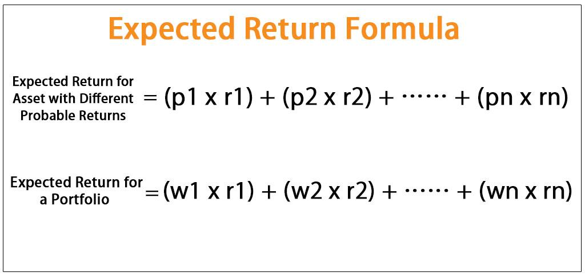

The world of finance presents investors with a diverse array of investment opportunities, each characterized by different potential returns driven by market dynamics, risk levels, and economic conditions. Among the various concepts integral to informed investment decision-making, the expected return plays a pivotal role. Essentially, the expected return is a statistical measure that forecasts the weighted average of potential profits or losses from an investment, thus providing insights into its anticipated performance.

In the context of algorithmic trading, understanding and accurately calculating expected returns becomes even more critical. Algorithmic trading involves the use of sophisticated algorithms to execute trades at speeds and frequencies beyond human capabilities, using pre-set criteria to make data-driven decisions. This method leverages vast amounts of historical data and real-time market information to fine-tune trading strategies. As such, the expected return is integral to evaluating the potential success and optimizing the performance of these strategies.



This article aims to explore the concept of expected return by examining its calculation and significance within financial analysis and algorithmic trading. By understanding how to compute expected returns and integrate them effectively, investors can enhance their ability to identify the best investment options tailored to their risk preferences and financial goals. Moreover, the article will highlight modern tools and strategies that facilitate optimizing investment returns, underscoring their relevance in today's rapidly evolving financial markets.

## Table of Contents

## Understanding Expected Return

Expected return is a financial metric that represents the potential profit or loss from an investment, taking into account the probability of different outcomes. This metric plays a crucial role in investment decision-making and portfolio management because it allows investors to estimate the average return that they might expect from an asset or a portfolio under varying market conditions. By understanding expected return, investors can make more informed decisions about where to allocate their resources to maximize potential gains while considering associated risks.

### Calculation of Expected Return

The expected return for a particular investment is typically calculated as the weighted average of all possible returns, with each possible return being weighted according to its probability of occurrence. Mathematically, the expected return $E(R)$ can be expressed as:

$$
E(R) = \sum_{i=1}^{n} p_i \times r_i
$$

where $p_i$ is the probability of scenario $i$ occurring, $r_i$ is the return in scenario $i$, and $n$ is the total number of possible scenarios.

For example, consider an investment with the following possible returns and probabilities:

- A return of 10% with a probability of 40%
- A return of 5% with a probability of 50%
- A return of -5% with a probability of 10%

The expected return $E(R)$ would be calculated as:

$$
E(R) = (0.40 \times 0.10) + (0.50 \times 0.05) + (0.10 \times -0.05) = 0.04 + 0.025 - 0.005 = 0.06
$$

Thus, the expected return is 6%.

### Importance in Forecasting and Decision-Making

In investment analysis, the expected return is used as a tool for forecasting future financial performance. By estimating the expected return, investors and portfolio managers can identify which investments are likely to offer the most attractive risk-reward trade-offs. This estimation aids in constructing optimal portfolios that can achieve desired financial goals while minimizing risk exposure.

Expected return is instrumental in:

1. **Risk Assessment**: By understanding the expected return, investors can compare it against the risk associated with an investment. A higher expected return generally comes with higher risk, so this metric helps in balancing portfolios to align with investors' risk appetites.

2. **Comparative Analysis**: Investors use expected returns to compare different investment opportunities. By comparing the expected returns of various securities or asset classes, investors can allocate capital more efficiently by prioritizing investments with higher potential returns.

3. **Performance Benchmarking**: Expected return serves as a critical benchmark against which the actual performance of an investment is measured. By comparing actual returns against expected returns, investors can assess whether an investment is underperforming or outperforming expectations.

In summary, the expected return is a vital component of investment analysis, providing investors with a statistical basis for understanding potential outcomes and making informed decisions. It offers a quantitative framework through which investors can evaluate and select investments that meet their risk-return objectives.

## Expected Return Theory and Models

Modern Portfolio Theory (MPT), introduced by Harry Markowitz in 1952, revolutionized financial investments by formalizing how risk and return can be quantified and managed. At the heart of MPT is the concept of expected return, which is used to construct an optimal portfolio that offers the best possible returns for a given level of risk. The expected return in MPT is calculated as a weighted sum of the expected returns of individual assets, with weights corresponding to the proportion of each asset in the portfolio. Mathematically, it is expressed as:

$$
E(R_p) = \sum_{i=1}^{n} w_i \cdot E(R_i)
$$

where $E(R_p)$ is the expected return of the portfolio, $w_i$ is the weight of asset $i$ in the portfolio, and $E(R_i)$ is the expected return of asset $i$.

MPT also considers the variance and covariance of asset returns to minimize risk. By selecting assets that do not perfectly correlate, investors can reduce portfolio [volatility](/wiki/volatility-trading-strategies), adhering to the risk-return trade-off principle.

The Black-Scholes Options Pricing Model further integrates expected return into its complex framework for pricing European call and put options. Developed by Fischer Black, Myron Scholes, and Robert Merton in the early 1970s, this model assumes that the price of an asset follows a geometric Brownian motion with constant volatility and drift. Although the model primarily focuses on estimating option prices rather than directly calculating expected returns, it inherently considers expected returns through the risk-neutral valuation approach. Under this framework, the expected return of the underlying asset in a risk-neutral world is the risk-free rate, facilitating the valuation of derivative securities.

Both MPT and the Black-Scholes model illustrate how expected return features in theoretical models to evaluate investments. MPT uses it to balance risk and returns across various asset classes, while the Black-Scholes model leverages expected return assumptions to ascertain fair market prices for options. Investors and portfolio managers can therefore make informed decisions by applying these theories to forecast investment outcomes and align them with risk tolerance levels.

These models have become foundational tools in financial analysis and investment strategy development, highlighting the importance of expected return in improving the predictability and performance of investment portfolios. Moreover, they underscore how integrating mathematical models and financial theories can enhance portfolio management and investment returns.

## Limitations of Expected Return

Expected return is a valuable tool in investment analysis, serving as an indicator of the potential average outcome of an investment. However, it has certain limitations that investors must consider. One of the primary limitations is that expected return calculations do not account for unsystematic risks and market volatilities. Unsystematic risks, also known as idiosyncratic or specific risks, are events that can affect individual securities or a small group of assets but not the entire market. These can include company-specific events like management changes or product recalls. Since expected return only considers average outcomes based on historical or assumed probabilities, it does not capture these kinds of risks which can significantly impact actual returns.

Moreover, expected return does not inherently account for market volatilities, which are better captured by measures such as standard deviation and variance. Standard deviation provides a measure of [dispersion](/wiki/dispersion-trading), quantifying the amount by which individual returns might deviate from the expected return. A higher standard deviation indicates greater volatility and, consequently, greater risk. Variance, the square of standard deviation, also measures this dispersion. As a formula, standard deviation ($\sigma$) of returns ($R_i$) is calculated as:

$$
\sigma = \sqrt{\frac{1}{N}\sum_{i=1}^{N}(R_i - \bar{R})^2}
$$

where $N$ is the number of observations and $\bar{R}$ is the mean return. These statistical measures provide deeper insight into the risk profile of an investment than expected return alone.

To address the limitations of relying solely on expected return metrics, investors often employ diversification and risk management techniques. Diversification involves spreading investments across various assets to reduce exposure to unsystematic risk. The rationale behind diversification is rooted in the concept that while individual asset returns can be volatile, a diversified portfolio's overall return is usually more stable. This stability is achieved because poor performance in some assets may be offset by better performance in others.

Additionally, risk management strategies such as hedging, asset allocation, and using financial derivatives can mitigate the risks associated with investments. For example, hedging involves taking a position in a related security to protect against potential losses in another, thereby managing the overall risk. Effective asset allocation, which involves distributing investment funds among different asset classes, aligns investment strategies with risk tolerance and investment goals.

In conclusion, while expected return is a fundamental component of financial analysis, its effectiveness is limited by its inability to consider unsystematic risks and market volatilities. By integrating complementary measures such as standard deviation and variance, alongside diversification and rigorous risk management strategies, investors can create a more robust framework for evaluating potential investments and optimizing their portfolios.

## Algorithmic Trading and Investment Returns

Algorithmic trading refers to the use of automated systems to execute trades based on predefined criteria. These systems rely heavily on quantitative models that incorporate various financial metrics, including the expected return, to optimize investment outcomes. Expected return serves as a critical metric in [algorithmic trading](/wiki/algorithmic-trading) strategies, acting as a foundation upon which algorithms evaluate and execute trades to maximize potential profits or minimize losses.

The integration of expected return into algorithmic trading involves several sophisticated strategies. One of the key strategies is [backtesting](/wiki/backtesting), a process where trading ideas and models are tested against historical data to assess their performance. By evaluating how a strategy would have performed in past market conditions, traders can estimate the strategy’s expected return. This assessment helps refine the trading model to improve accuracy and profitability before applying it to real-time trading scenarios.

Real-time decision-making in algorithmic trading benefits immensely from expected return calculations. Algorithms continuously monitor market conditions and evaluate potential trades against the expected return to determine whether to execute a trade. This allows for quick adjustments to portfolios based on real-time data, ensuring that trades are consistent with predefined risk and return thresholds.

Portfolio optimization through algorithms further enhances investment returns. This involves selecting the optimal mix of assets that maximizes expected returns given a certain level of risk. Algorithms use expected return alongside other financial metrics such as covariance and variance to construct efficient portfolios. The goal is to balance the trade-off between risk and return effectively, guided by the principles of modern portfolio theory.

An example of incorporating these concepts in code involves using Python libraries such as NumPy and Pandas to perform calculations and analyze data. Here’s a basic illustration of calculating expected return for a portfolio of assets using Python:

```python
import numpy as np

# Define asset returns and their probabilities
asset_returns = np.array([0.05, 0.1, 0.15])
probabilities = np.array([0.3, 0.4, 0.3])

# Calculate expected return
expected_return = np.sum(asset_returns * probabilities)

print("Expected Return:", expected_return)
```

This snippet demonstrates a simple calculation of an expected return based on a probability-weighted average of potential asset returns. In a more sophisticated algorithmic trading system, this type of calculation is integrated into larger models that consider numerous factors influencing asset prices and investor behavior.

Ultimately, algorithmic trading using expected return as a metric enables a systematic and disciplined approach to trading. By integrating predictive analytics, [machine learning](/wiki/machine-learning) algorithms, and robust quantitative models, traders can enhance their capabilities in forecasting and responding to market dynamics, thereby optimizing investment returns.

## Calculating Expected Return in Algorithmic Trading

In algorithmic trading, calculating expected return is essential for developing quantitative strategies that guide trading decisions. Various methods can be employed to estimate expected returns, each with particular applications and assumptions.

### Historical Mean Return

The historical mean return method involves calculating the average return of an asset over a specific historical period. This straightforward approach assumes that past performance is indicative of future results. Given a series of historical return observations $r_1, r_2, \ldots, r_n$, the historical mean return $\overline{r}$ is computed as:

$$
\overline{r} = \frac{1}{n} \sum_{i=1}^{n} r_i
$$

While simple, reliance solely on historical data can be problematic, especially in volatile markets. This method does not account for changes in market conditions or asset-specific risks, hence should be complemented with other analyses.

### Probability Distribution

Probability distribution models provide a more comprehensive approach by considering different scenarios and their likelihoods. An expected return $E(R)$ can be calculated using:

$$
E(R) = \sum_{i=1}^{n} P_i \cdot R_i
$$

where $P_i$ is the probability of return $R_i$. By assigning probabilities to different outcomes, this method offers a nuanced view of potential returns. However, determining accurate probabilities can be challenging and requires robust statistical analysis.

### Dividend Discount Models (DDM)

The dividend discount model is used primarily for equities that pay dividends. It calculates expected return based on the present value of projected dividend payments. The Gordon Growth Model, a type of DDM, estimates return $r$ as:

$$
r = \frac{D_1}{P_0} + g
$$

where $D_1$ is the expected dividend next year, $P_0$ is the current stock price, and $g$ is the growth rate of dividends. This model is highly dependent on accurate estimates of future dividends and growth rates and is best applied within stable, dividend-paying industries.

### Enhancing Calculations with Machine Learning and AI

Machine learning and AI have increasingly been integrated into algorithmic trading to enhance the accuracy of expected return calculations. Techniques such as regression models, neural networks, and decision trees analyze vast datasets to identify patterns and correlations not visible through traditional methods.

Python, a popular language in quantitative finance, offers libraries like scikit-learn and TensorFlow that facilitate machine learning applications. For instance, using a simple linear regression to predict future returns might look like this in Python:

```python
from sklearn.linear_model import LinearRegression
import numpy as np

# Sample data: historical returns and corresponding expected returns
historical_returns = np.array([[1.2], [1.5], [1.7], [2.0], [1.8]])
expected_returns = np.array([1.3, 1.4, 1.6, 1.7, 1.9])

# Create and train the model
model = LinearRegression()
model.fit(historical_returns, expected_returns)

# Make predictions
predicted_return = model.predict(np.array([[2.1]]))
print("Predicted Return:", predicted_return[0])
```

Machine learning models can handle complex variables and improve the reliability of expected return estimations by dynamically adjusting predictions based on real-time market data. This adaptability makes them invaluable in developing sophisticated, data-driven trading strategies.

## Practical Applications and Tools

QuantConnect and Alpaca are two prominent platforms that significantly enhance the application of expected return metrics within algorithmic trading strategies. These platforms provide essential tools and infrastructure that enable traders and developers to construct, backtest, and deploy trading algorithms effectively.

**QuantConnect** is a cloud-based algorithmic trading platform that supports multiple programming languages, including C#, F#, and Python. It offers a comprehensive suite of features that facilitate the integration of expected return calculations into trading strategies. One of the key aspects of QuantConnect is its Lean Engine, an open-source algorithmic trading engine that supports equities, cryptocurrencies, futures, forex, and options across various global exchanges. This engine allows traders to backtest their algorithms against historical data, enabling the modeling of expected returns under different market conditions before live execution.

Using QuantConnect, traders can implement algorithms that calculate expected return using historical data analysis. For instance, a basic Python script might use historical mean return calculations incorporating pandas DataFrames:

```python
import pandas as pd

# Sample historical data in a pandas DataFrame
data = {
    'Date': ['2023-01-01', '2023-01-02', '2023-01-03'],
    'Return': [0.01, 0.02, -0.005]
}
df = pd.DataFrame(data)

# Calculate the expected return
expected_return = df['Return'].mean()
print("Expected Return:", expected_return)
```

This simple example illustrates how expected return metrics can be utilized in the initial stages of the algorithm development process, serving as a crucial input for more complex trading strategies.

**Alpaca** offers a developer-friendly trading platform with an emphasis on ease of use and accessibility for algorithmic traders. It provides a commission-free trading environment with RESTful APIs that enable integration with various trading applications. Alpaca's infrastructure allows traders to implement algorithms that interact with real-time market data and execute trades based on calculated expected returns. The platform's simplicity and focus on API access also make it ideal for retail traders looking to automate their trading strategies effectively.

The integration of expected return calculations into real-time trading scenarios using Alpaca often involves Python scripts, as illustrated by a basic example of executing trades based on a predefined expected return threshold:

```python
import alpaca_trade_api as tradeapi

# Initialize API
api = tradeapi.REST('APCA-API-KEY-ID', 'APCA-API-SECRET-KEY', base_url='https://paper-api.alpaca.markets')

# Get account information
account = api.get_account()

# Calculate expected return and place order based on condition
expected_return = 0.015  # Example expected return
threshold = 0.01  # Threshold for executing a trade

if expected_return > threshold:
    api.submit_order(
        symbol='AAPL',
        qty=10,
        side='buy',
        type='market',
        time_in_force='gtc'
    )
    print("Trade Executed: Buy AAPL")
```

This code initializes the Alpaca API and submits a market order to buy shares of Apple Inc. if the calculated expected return exceeds a specified threshold. Such applications demonstrate how expected return metrics can guide trading decisions in real-time environments.

In summary, platforms like QuantConnect and Alpaca streamline the process of incorporating expected return calculations into algorithmic trading strategies. By providing robust tools and resources, they enable traders to develop and test algorithms with the potential for optimized investment returns, considering both historical performance and real-time market dynamics.

## Conclusion

Expected return serves as a cornerstone in investment analysis, offering a statistical basis for estimating the potential gains or losses from an investment. It quantifies the expected outcomes of investment decisions, allowing investors to make informed choices based on anticipated performance. Despite its utility, the concept of expected return is not without its limitations. It mainly considers historical data and may fail to account for unsystematic risks and volatility in the markets. Therefore, it should be used alongside other metrics like standard deviation, beta, and the Sharpe ratio to paint a comprehensive picture of potential investment outcomes.

The integration of expected return into algorithmic trading strategies provides a robust framework for optimizing portfolios. Algorithmic trading leverages various financial models and analytical techniques, enabling dynamic strategy adjustments and real-time decision making. With the rise of machine learning and AI, the predictive accuracy of expected return calculations has significantly improved, allowing for more precise and adaptive trading strategies. For example, machine learning models can process vast amounts of historical and real-time market data to identify patterns, optimize trading algorithms, and potentially improve expected returns.

As financial markets continue to evolve, understanding and applying expected return in investment strategies becomes increasingly important. The growing complexity of financial instruments and the rapid pace at which markets operate necessitate sophisticated approaches to investment analysis. By combining expected return with modern technological tools and methodologies, investors can enhance their capacity to achieve risk-adjusted returns. This fosters an environment where informed decision-making, underpinned by robust statistical analysis, leads to more successful investment outcomes. In conclusion, while expected return is not a standalone solution, its integration into contemporary trading strategies ensures that investors can navigate the challenges of modern financial markets effectively.

## References & Further Reading

[1]: Markowitz, H. (1952). ["Portfolio Selection."](https://www.jstor.org/stable/2975974) Journal of Finance, 7(1), 77-91.

[2]: Black, F., & Scholes, M. (1973). ["The Pricing of Options and Corporate Liabilities."](https://www.cs.princeton.edu/courses/archive/fall09/cos323/papers/black_scholes73.pdf) Journal of Political Economy, 81(3), 637-654.

[3]: Hull, J. C. (2018). ["Options, Futures, and Other Derivatives."](https://www.semanticscholar.org/paper/Options%2C-Futures%2C-and-Other-Derivatives-Hull/89bdee500c8623864fc9eb7a471546aa713acc44) Pearson.

[4]: Lopez de Prado, M. (2018). ["Advances in Financial Machine Learning."](https://www.amazon.com/Advances-Financial-Machine-Learning-Marcos/dp/1119482089) Wiley.

[5]: Chan, E. P. (2009). ["Quantitative Trading: How to Build Your Own Algorithmic Trading Business."](https://github.com/ftvision/quant_trading_echan_book) Wiley.

[6]: Jansen, S. (2020). ["Machine Learning for Algorithmic Trading: Predictive Models to Extract Signals From Market and Alternative Data for Systematic Trading Strategies with Python."](https://www.amazon.com/Machine-Learning-Algorithmic-Trading-alternative/dp/1839217715) Packt Publishing.

[7]: Aronson, D. (2006). ["Evidence-Based Technical Analysis: Applying the Scientific Method and Statistical Inference to Trading Signals."](https://www.wiley.com/en-us/Evidence+Based+Technical+Analysis%3A+Applying+the+Scientific+Method+and+Statistical+Inference+to+Trading+Signals-p-9780470008744) Wiley.

[8]: Bergstra, J., Bardenet, R., Bengio, Y., & Kégl, B. (2011). ["Algorithms for Hyper-Parameter Optimization."](https://dl.acm.org/doi/10.5555/2986459.2986743) Advances in Neural Information Processing Systems 24.