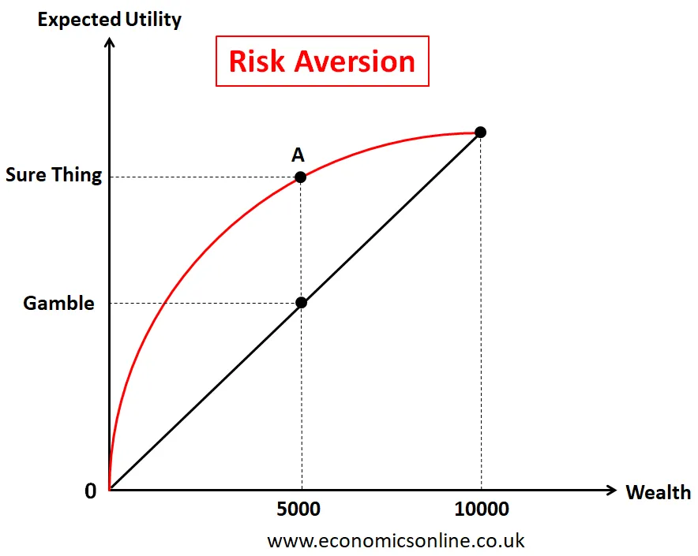

## Table of Contents

## What is Expected Utility Theory?

Expected Utility Theory is a way to make decisions when you're not sure what will happen. It helps you figure out the best choice by thinking about how much you like different outcomes and how likely those outcomes are. Imagine you're deciding whether to bring an umbrella when it might rain. You think about how much you'd dislike getting wet versus how much you'd dislike carrying an umbrella if it doesn't rain. Then, you consider the chances of rain. If the chance of rain is high and you really hate getting wet, you might decide to bring the umbrella.

This theory uses a simple math formula to combine your preferences and the probabilities. You assign a number, called a utility, to each possible outcome to show how much you like it. Then, you multiply each utility by the chance of that outcome happening. Add up all these numbers, and you get the expected utility for each choice. The choice with the highest expected utility is the one you should go with. It's like a way to make the best guess about what will make you happiest in the end.

## Who developed Expected Utility Theory?

Expected Utility Theory was mainly developed by a guy named Daniel Bernoulli in the 1700s. He came up with it while trying to solve a puzzle called the St. Petersburg Paradox. This puzzle asked why people wouldn't pay a lot of money for a gamble that, on paper, should be worth a huge amount. Bernoulli thought that people care more about the usefulness, or utility, of money rather than the actual amount. So, he suggested that we should look at the expected utility of outcomes instead of just their monetary value.

Later on, in the 20th century, economists like John von Neumann and Oskar Morgenstern built on Bernoulli's ideas. They made the theory more formal and mathematical, turning it into what we now call the von Neumann-Morgenstern utility theorem. This helped make Expected Utility Theory a big part of economics and decision-making studies. It's now used to understand how people make choices when they're not sure what will happen.

## What are the basic principles of Expected Utility Theory?

Expected Utility Theory is all about making choices when you don't know what will happen. The main idea is that you should pick the option that gives you the highest expected utility. To figure this out, you need to think about all the different things that could happen because of your choice. Each of these possible outcomes gets a number called a utility, which shows how much you like or dislike that outcome. You also need to know how likely each outcome is to happen. Then, you multiply the utility of each outcome by its chance of happening and add up all these numbers. The choice with the biggest total is the one you should go with.

Another important principle is that people's preferences should follow certain rules. For example, if you like outcome A more than outcome B, and outcome B more than outcome C, then you should like outcome A more than outcome C. This is called transitivity. Also, if you have a choice between a sure thing and a gamble, you should compare the utility of the sure thing to the expected utility of the gamble. If the gamble's expected utility is higher, you should take the gamble. These rules help make sure that your choices make sense and are consistent.

## How does Expected Utility Theory differ from other decision-making theories?

Expected Utility Theory is different from other decision-making theories because it focuses on combining the likelihood of different outcomes with how much a person values those outcomes. It uses a math formula to figure out the best choice by multiplying the utility (how much you like something) of each possible result by its chance of happening and then adding all these up. This method helps people make decisions when they're not sure what will happen. Other theories might not use this specific math approach or might focus more on other things, like how people feel about risk or how they might change their minds over time.

For example, Prospect Theory, which was developed by Daniel Kahneman and Amos Tversky, looks at how people actually make choices rather than how they should make them according to Expected Utility Theory. Prospect Theory says that people care more about gains and losses compared to a starting point, and they feel losses more strongly than gains. This is different from Expected Utility Theory, which assumes that people always try to maximize their overall happiness or utility without focusing on gains and losses in the same way. Also, some other theories might look at how people's choices can be influenced by emotions, social pressures, or the way choices are presented, which Expected Utility Theory doesn't consider as much.

## What is the formula for calculating expected utility?

The formula for calculating expected utility is pretty straightforward. Imagine you have a few different outcomes that could happen because of your choice. Each outcome has a chance of happening, and you can give it a number called utility that shows how much you like or dislike that outcome. To find the expected utility, you multiply the utility of each outcome by the chance it will happen. Then, you add up all these numbers. The formula looks like this: Expected Utility = (Utility of Outcome 1 × Probability of Outcome 1) + (Utility of Outcome 2 × Probability of Outcome 2) + ... and so on for all possible outcomes.

For example, let's say you're deciding whether to go to a party. There's a 50% chance you'll have a great time (which you rate as a utility of 10), a 30% chance it'll be okay (utility of 5), and a 20% chance you'll have a bad time (utility of -3). To find the expected utility of going to the party, you do this math: (10 × 0.50) + (5 × 0.30) + (-3 × 0.20). That works out to 5 + 1.5 - 0.6, which equals 5.9. So, the expected utility of going to the party is 5.9. If other choices, like staying home, have a lower expected utility, then according to Expected Utility Theory, you should go to the party.

## Can you explain the concept of utility in Expected Utility Theory?

In Expected Utility Theory, utility is a way to measure how much you like or dislike different outcomes. Imagine you're choosing between different options, like what to eat for dinner. Each choice could lead to different results, like enjoying a tasty meal or getting a stomach ache. You can give each of these results a number, called a utility, to show how much you value it. A high utility number means you really like the outcome, while a low or negative number means you don't like it.

To figure out the best choice, you need to think about both the utility of each outcome and how likely it is to happen. For example, if there's a small chance you might win a big prize, you'd give that outcome a high utility because winning would make you very happy. But since the chance is small, the expected utility might not be as high as a sure thing that makes you moderately happy. By multiplying the utility of each outcome by its chance of happening and adding them up, you can find the expected utility of each choice and pick the one that makes you happiest overall.

## What are some common applications of Expected Utility Theory?

Expected Utility Theory is used a lot in economics to help people make better choices when they're not sure what will happen. For example, it's used in financial planning to decide things like how much money to invest in different places. If you're thinking about buying stocks, you might look at the possible outcomes, like the stock going up or down, and how much you'd like each of those outcomes. Then, you'd consider how likely each outcome is. By using Expected Utility Theory, you can figure out if the potential gain from the stock is worth the risk.

This theory is also used in everyday decisions, like choosing insurance. When you buy insurance, you're paying money now to avoid a bigger loss later if something bad happens. Expected Utility Theory helps you weigh the cost of the insurance against the peace of mind it gives you. If the expected utility of having insurance is higher than not having it, it makes sense to buy it. So, whether it's big financial decisions or smaller everyday choices, Expected Utility Theory helps people think through their options and pick the one that will make them happiest in the long run.

## How does risk and uncertainty affect decisions under Expected Utility Theory?

Risk and uncertainty play a big role in how people make choices using Expected Utility Theory. When you're not sure what will happen, you have to think about all the different things that could happen and how likely they are. For example, if you're deciding whether to take a new job, you might consider the chance of getting a raise or the chance of being unhappy. Each of these outcomes has a certain chance of happening, and you can give each one a number called a utility to show how much you like it. By multiplying the utility of each outcome by its chance and adding them up, you can figure out the expected utility of taking the job. If the expected utility is higher than staying in your current job, then according to Expected Utility Theory, you should take the new job.

The tricky part is that people often feel differently about risk and uncertainty. Some people are more willing to take chances, while others want to play it safe. Expected Utility Theory assumes that everyone makes choices based on the same math, but in real life, how people feel about risk can change their decisions. For example, if you're really afraid of losing money, you might not invest in a stock even if the expected utility says you should. This is why understanding how people feel about risk is important when using Expected Utility Theory to make decisions. It helps you see why someone might choose differently even when the numbers say one thing.

## What are the limitations and criticisms of Expected Utility Theory?

Expected Utility Theory has some problems that people have pointed out. One big issue is that it assumes everyone makes choices the same way, using math to figure out what will make them happiest. But in real life, people don't always think like that. They might be scared of losing money or they might change their minds a lot. Also, the theory doesn't consider how people feel about risk. Some people love taking chances, while others want to play it safe. Expected Utility Theory doesn't explain why these feelings can make people choose differently, even when the numbers say they should do something else.

Another criticism is that it can be hard to figure out the right numbers for utilities and probabilities. People might not know how much they like something until it happens, and guessing the chances of things can be tough too. This makes it hard to use the theory in real life. Also, some people think the theory doesn't work well for big decisions where the outcomes are really different, like choosing between a safe job and a risky business venture. In these cases, the simple math of Expected Utility Theory might not capture all the things people think about when making choices.

## How has Expected Utility Theory evolved over time?

Expected Utility Theory started with Daniel Bernoulli in the 1700s. He came up with it to solve a puzzle called the St. Petersburg Paradox. Bernoulli thought that people care more about what money can do for them, not just how much money they have. He suggested using a number called utility to show how much people like different outcomes. Then, you multiply this utility by how likely the outcome is to happen. Bernoulli's idea was a big step forward, but it was still pretty simple.

Later on, in the 20th century, economists like John von Neumann and Oskar Morgenstern made the theory more detailed and mathematical. They turned it into what we now call the von Neumann-Morgenstern utility theorem. This made Expected Utility Theory a big part of economics and decision-making studies. Over time, people realized that the theory has some problems, like not considering how people feel about risk or how hard it can be to guess the right numbers for utilities and probabilities. Despite these issues, Expected Utility Theory is still used a lot to help people make choices when they're not sure what will happen.

## Can you provide an example of how Expected Utility Theory is applied in real-world scenarios?

Imagine you're thinking about buying insurance for your car. You know that if you don't buy insurance and your car gets damaged, you'll have to pay a lot of money to fix it. But if you do buy insurance, you'll have to pay a smaller amount every month, but the insurance company will cover the big repair costs if something bad happens. To decide, you can use Expected Utility Theory. You think about the chance of your car getting damaged and how much you'd dislike having to pay for repairs out of pocket. Then, you compare that to the smaller, regular payments for insurance and the peace of mind it gives you. If the expected utility of having insurance is higher than not having it, you should buy the insurance.

Another example is choosing whether to invest in the stock market. You might be thinking about buying a certain stock. You know there's a chance the stock could go up in value, which would make you happy because you'd make money. But there's also a chance it could go down, which would make you unhappy because you'd lose money. To figure out if you should buy the stock, you use Expected Utility Theory. You give a number to how much you'd like making money (high utility) and how much you'd dislike losing money (low or negative utility). Then, you multiply these numbers by how likely you think each outcome is. If the expected utility of buying the stock is higher than not buying it, then according to the theory, you should go ahead and invest.

## What are some advanced concepts or extensions of Expected Utility Theory?

One advanced concept that builds on Expected Utility Theory is called Subjective Expected Utility (SEU) Theory. This idea, developed by Leonard Savage in the 1950s, takes into account that people might not agree on how likely different outcomes are. Instead of using fixed probabilities, SEU Theory lets people use their own guesses about chances. For example, if you think it's more likely to rain than someone else does, your decision about whether to bring an umbrella would be different. SEU Theory helps explain why people can make different choices even when they're looking at the same options, because they might have different beliefs about what will happen.

Another extension is Cumulative Prospect Theory, which was developed by Daniel Kahneman and Amos Tversky in the 1990s. This theory tries to fix some of the problems people found with Expected Utility Theory, like how it doesn't explain why people feel losses more strongly than gains. Cumulative Prospect Theory looks at how people actually make choices, not just how they should make them. It uses something called a value function to show how much people like or dislike outcomes, and it also uses a weighting function to show how people think about the chances of different outcomes. This theory helps explain why people might make choices that seem to go against what Expected Utility Theory would suggest, like turning down a good bet because they're too scared of losing.

## What is Expected Utility and How is it Used as a Tool for Decision Making?

Expected utility theory provides a structured methodology for evaluating decisions under conditions of uncertainty. It calculates the weighted average of potential utilities, effectively synthesizing multiple possible outcomes by assigning a probability to each. The approach serves to determine which option offers the maximum expected utility, thereby aiding decision-makers in selecting the most advantageous [course](/wiki/best-algorithmic-trading-courses) of action even when the actual outcome remains unknown.

Mathematically, expected utility $E(U)$ is expressed as:

$$

E(U) = \sum_{i=1}^{n} p_i \cdot u(x_i) 
$$

where $p_i$ is the probability of each outcome $i$, $u(x_i)$ is the utility of outcome $i$, and $n$ is the total number of possible outcomes. This formulation emphasizes the probabilistic nature of decision-making, enabling individuals to weigh different scenarios according to their likelihood and subjective valuations.

The utility function $u(x)$ captures an individual's preferences over different outcomes, factoring in risk attitudes such as risk aversion, neutrality, or seeking behavior. As a centerpiece to the decision-making process, expected utility theory facilitates choices across varying contexts, from simple consumer decisions to complex financial investments.

By employing probabilities, expected utility theory allows decision-makers to forecast outcomes and choose options yielding the highest expected benefit. It is particularly instrumental in risk assessment, providing a quantitative measure to compare choices. Hence, it forms the backbone of various decision-making processes in uncertain environments, ensuring a systematic evaluation based on individual risk profiles and preference structures.

## What is the relationship between Algorithmic Trading and Utility Theory?

Algorithmic trading leverages utility theory to craft strategies that optimize decision-making based on quantitative evaluations of risk and reward. By integrating utility functions into algorithmic frameworks, trading systems can systematically measure the utility of various trades and adjust strategies dynamically to maximize expected utility.

The expected utility framework is central to these algorithmic strategies, as it allows traders to weigh the potential benefits and drawbacks of different trading actions under uncertainty. The fundamental equation for expected utility $E[U(x)]$ is defined as:

$$

E[U(x)] = \sum_{i=1}^{n} p_i \cdot U(x_i) 
$$

where $n$ is the number of possible outcomes, $p_i$ is the probability of outcome $x_i$, and $U(x_i)$ is the utility of outcome $x_i$.

In the context of [algorithmic trading](/wiki/algorithmic-trading), expected utility aids in the formulation of algorithms that assess the probabilistic returns associated with various market movements and adapt to evolving market conditions. This involves not only predicting prices but also determining the optimal trade size and timing to maximize the utility function, which often represents profit adjusted for risk.

Sophisticated trading algorithms can automatically adjust trading positions by calculating the expected utility of potential trades in real-time. For example, if a trading algorithm identifies a discrepancy between the expected utility of a current trade and an alternative, it could reallocate assets to optimize the overall expected utility of the portfolio. This requires continuous monitoring and updating inputs such as price changes, market [volatility](/wiki/volatility-trading-strategies), and evolving risk assessments.

Furthermore, the mathematical basis provided by utility theory supports the construction of models that integrate multiple risk factors. For instance, utility functions can be tailored to incorporate an individual trader's risk aversion, leading to a personalized trading strategy that aligns with specific risk preferences. The algorithm then works to maintain a portfolio that reflects this balance, optimizing trade executions according to pre-defined utility thresholds.

By encoding these relationships in algorithms, traders can enhance their decision-making processes, leveraging computational power to identify and exploit fleeting opportunities in the market. This not only improves execution efficiency but also aligns trading activities with broader financial objectives guided by utility theory. Through continuous advancements in algorithmic trading, the integration of utility theory is poised to refine risk management practices and improve financial outcomes across highly dynamic trading environments.

## What are the practical applications of portfolio optimization?

Utility theory plays a significant role in portfolio optimization by integrating both risk and expected returns in decision-making. Investors aim to construct and balance their portfolios to maximize expected utility, which quantifies the satisfaction or expected satisfaction from various investment outcomes. This approach allows investors to select portfolios that align with their risk tolerance and return expectations.

One of the pioneering frameworks in portfolio optimization is the Markowitz Modern Portfolio Theory (MPT). Proposed by Harry Markowitz in 1952, MPT uses utility functions to determine the optimal asset allocation that maximizes expected return for a given level of risk or minimizes risk for a given level of expected return. The fundamental principle behind MPT is the diversification of investments to reduce risk, utilizing the mean-variance analysis to identify efficient portfolios. The utility function in this context can be expressed as:

$$
U(R) = E(R) - \frac{\lambda}{2}\sigma^2(R)
$$

where $U(R)$ is the utility of the expected return $E(R)$, $\lambda$ is the risk aversion coefficient, and $\sigma^2(R)$ is the variance of the return, representing risk. This formula reflects a trade-off between return and risk, adjusted for the investor's risk aversion.

In practical portfolio management, investors perform continuous evaluations to ensure that asset distributions remain utility-driven. This involves adjusting portfolios in response to changes in market conditions, asset performance, and shifts in the investor's objectives or risk tolerance. Tools and techniques like mean-variance optimization are commonly employed, and the portfolio's expected utility is recalculated to identify necessary adjustments.

The role of computational tools and algorithms in portfolio optimization has grown, allowing for more sophisticated analyses and implementations of utility theory. These tools assess large volumes of data efficiently and provide more accurate forecasts for asset behavior, ultimately leading to better-informed investment decisions. For instance, Python libraries like NumPy and pandas are used extensively in quantitative finance for data manipulation and analysis, while libraries like PyPortfolioOpt offer implementations of risk-return optimization models.

By integrating utility theory into portfolio optimization, investors can effectively balance expected returns with associated risks, leading to more robust and adaptable investment strategies that are aligned with their long-term financial goals.

## References & Further Reading

[1]: Bernoulli, D. (1954). ["Exposition of a New Theory on the Measurement of Risk."](https://www.semanticscholar.org/paper/Exposition-of-a-New-Theory-on-the-Measurement-of-Bernoulli/ef512f15aa1c294c7575aa329a7fecd80be6633b) Econometrica, 22(1), 23-36. [Original work published in 1738 as "Specimen Theoriae Novae de Mensura Sortis"]

[2]: Kahneman, D., & Tversky, A. (1979). ["Prospect Theory: An Analysis of Decision under Risk."](https://www.jstor.org/stable/1914185) Econometrica, 47(2), 263-292.

[3]: Markowitz, H. (1952). ["Portfolio Selection."](https://onlinelibrary.wiley.com/doi/abs/10.1111/j.1540-6261.1952.tb01525.x) The Journal of Finance, 7(1), 77-91.

[4]: Thaler, R. H. (1993). ["Advances in Behavioral Finance."](https://psycnet.apa.org/record/1993-98595-000) Russell Sage Foundation.

[5]: Lopez de Prado, M. (2018). ["Advances in Financial Machine Learning."](https://www.amazon.com/Advances-Financial-Machine-Learning-Marcos/dp/1119482089) Wiley.

[6]: Chan, E. P. (2009). ["Quantitative Trading: How to Build Your Own Algorithmic Trading Business."](https://github.com/ftvision/quant_trading_echan_book) Wiley.

[7]: Jansen, S. (2018). ["Machine Learning for Algorithmic Trading."](https://github.com/stefan-jansen/machine-learning-for-trading) Packt Publishing.

[8]: Aronson, D. (2006). ["Evidence-Based Technical Analysis: Applying the Scientific Method and Statistical Inference to Trading Signals."](https://www.amazon.com/Evidence-Based-Technical-Analysis-Scientific-Statistical/dp/0470008741) Wiley.