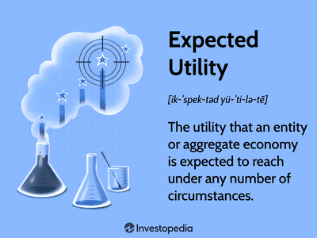

Utility theory serves as a foundational concept in decision-making processes within economics and finance by providing a structured framework for understanding how individuals and entities allocate resources under conditions of uncertainty. The core idea is that individuals aim to maximize their utility, or satisfaction, derived from the outcomes of their decisions. This theory helps in modeling rational behavior through mathematical formulations, enabling a systematic approach to evaluate choices involving risk.

Expected utility theory extends this framework by incorporating a probabilistic approach to uncertain outcomes, providing a tool for evaluating decisions where the results are not deterministic. Formally, the expected utility $E(U)$ of a random variable $X$ with possible outcomes $x_i$ and probabilities $p_i$ is calculated as:

$$
E(U) = \sum p_i \cdot U(x_i)
$$

where $U(x_i)$ represents the utility of outcome $x_i$. This allows decision-makers to weigh the potential benefits and risks associated with each possible outcome, aiding them in selecting the option that maximizes expected utility.

In algorithmic trading, expected utility is leveraged to optimize decision-making and enhance outcomes in often volatile and complex market environments. By employing sophisticated algorithms, traders can automate the decision-making process based on pre-defined utility functions and statistical methods. This technology-driven approach offers significant advantages in speed and efficiency, allowing traders to manage vast amounts of data and execute trades at optimal times, which would be infeasible manually.

This article explores the application of utility calculation and decision theory in algorithmic trading. We will discuss the basics of utility theory, expected utility, and demonstrate their relevance in formulating robust trading strategies that account for risk preferences and uncertainty, ultimately leading to better financial decision outcomes.

## Table of Contents

## Understanding Utility Theory

Utility theory is a crucial framework in economics and finance, employed to quantify the level of satisfaction or utility an individual derives from different outcomes. The concept was significantly advanced by Daniel Bernoulli in the 18th century, who introduced the idea to address problems related to decision-making under uncertainty, such as the St. Petersburg paradox. 

The fundamental component of utility theory is the utility function, which mathematically represents an individual's preferences and risk tolerance. A utility function, denoted as $U(x)$, where $x$ represents wealth or another variable of interest, is used to assign a numerical value to every possible outcome. The shape of the utility function provides insights into the risk preferences of the decision-maker. A concave utility function indicates risk aversion, where the individual prefers certainty over a gamble with an equivalent expected value. Conversely, a convex utility function denotes risk-seeking behavior, while a linear utility function suggests risk neutrality.

In the context of trading, utility theory is instrumental in helping traders evaluate their risk tolerance and make informed portfolio choices. By assessing various investment strategies through their utility functions, traders can identify portfolios that align with their risk preferences. This process involves maximizing expected utility, which reflects the overall satisfaction a trader anticipates from different investment outcomes, weighted by their probabilities.

Utility theory's applications extend beyond individual trading decisions to influence broader financial models and theories. It underpins many contemporary approaches to portfolio management and financial decision-making, providing a structured way to assess the trade-offs between risk and return.

## Expected Utility: A Tool for Decision Making

Expected utility theory provides a structured methodology for evaluating decisions under conditions of uncertainty. It calculates the weighted average of potential utilities, effectively synthesizing multiple possible outcomes by assigning a probability to each. The approach serves to determine which option offers the maximum expected utility, thereby aiding decision-makers in selecting the most advantageous [course](/wiki/best-algorithmic-trading-courses) of action even when the actual outcome remains unknown.

Mathematically, expected utility $E(U)$ is expressed as:

$$

E(U) = \sum_{i=1}^{n} p_i \cdot u(x_i) 
$$

where $p_i$ is the probability of each outcome $i$, $u(x_i)$ is the utility of outcome $i$, and $n$ is the total number of possible outcomes. This formulation emphasizes the probabilistic nature of decision-making, enabling individuals to weigh different scenarios according to their likelihood and subjective valuations.

The utility function $u(x)$ captures an individual's preferences over different outcomes, factoring in risk attitudes such as risk aversion, neutrality, or seeking behavior. As a centerpiece to the decision-making process, expected utility theory facilitates choices across varying contexts, from simple consumer decisions to complex financial investments.

By employing probabilities, expected utility theory allows decision-makers to forecast outcomes and choose options yielding the highest expected benefit. It is particularly instrumental in risk assessment, providing a quantitative measure to compare choices. Hence, it forms the backbone of various decision-making processes in uncertain environments, ensuring a systematic evaluation based on individual risk profiles and preference structures.

## Algorithmic Trading and Utility Theory

Algorithmic trading leverages utility theory to craft strategies that optimize decision-making based on quantitative evaluations of risk and reward. By integrating utility functions into algorithmic frameworks, trading systems can systematically measure the utility of various trades and adjust strategies dynamically to maximize expected utility.

The expected utility framework is central to these algorithmic strategies, as it allows traders to weigh the potential benefits and drawbacks of different trading actions under uncertainty. The fundamental equation for expected utility $E[U(x)]$ is defined as:

$$

E[U(x)] = \sum_{i=1}^{n} p_i \cdot U(x_i) 
$$

where $n$ is the number of possible outcomes, $p_i$ is the probability of outcome $x_i$, and $U(x_i)$ is the utility of outcome $x_i$.

In the context of [algorithmic trading](/wiki/algorithmic-trading), expected utility aids in the formulation of algorithms that assess the probabilistic returns associated with various market movements and adapt to evolving market conditions. This involves not only predicting prices but also determining the optimal trade size and timing to maximize the utility function, which often represents profit adjusted for risk.

Sophisticated trading algorithms can automatically adjust trading positions by calculating the expected utility of potential trades in real-time. For example, if a trading algorithm identifies a discrepancy between the expected utility of a current trade and an alternative, it could reallocate assets to optimize the overall expected utility of the portfolio. This requires continuous monitoring and updating inputs such as price changes, market [volatility](/wiki/volatility-trading-strategies), and evolving risk assessments.

Furthermore, the mathematical basis provided by utility theory supports the construction of models that integrate multiple risk factors. For instance, utility functions can be tailored to incorporate an individual trader's risk aversion, leading to a personalized trading strategy that aligns with specific risk preferences. The algorithm then works to maintain a portfolio that reflects this balance, optimizing trade executions according to pre-defined utility thresholds.

By encoding these relationships in algorithms, traders can enhance their decision-making processes, leveraging computational power to identify and exploit fleeting opportunities in the market. This not only improves execution efficiency but also aligns trading activities with broader financial objectives guided by utility theory. Through continuous advancements in algorithmic trading, the integration of utility theory is poised to refine risk management practices and improve financial outcomes across highly dynamic trading environments.

## Practical Application: Portfolio Optimization

Utility theory plays a significant role in portfolio optimization by integrating both risk and expected returns in decision-making. Investors aim to construct and balance their portfolios to maximize expected utility, which quantifies the satisfaction or expected satisfaction from various investment outcomes. This approach allows investors to select portfolios that align with their risk tolerance and return expectations.

One of the pioneering frameworks in portfolio optimization is the Markowitz Modern Portfolio Theory (MPT). Proposed by Harry Markowitz in 1952, MPT uses utility functions to determine the optimal asset allocation that maximizes expected return for a given level of risk or minimizes risk for a given level of expected return. The fundamental principle behind MPT is the diversification of investments to reduce risk, utilizing the mean-variance analysis to identify efficient portfolios. The utility function in this context can be expressed as:

$$
U(R) = E(R) - \frac{\lambda}{2}\sigma^2(R)
$$

where $U(R)$ is the utility of the expected return $E(R)$, $\lambda$ is the risk aversion coefficient, and $\sigma^2(R)$ is the variance of the return, representing risk. This formula reflects a trade-off between return and risk, adjusted for the investor's risk aversion.

In practical portfolio management, investors perform continuous evaluations to ensure that asset distributions remain utility-driven. This involves adjusting portfolios in response to changes in market conditions, asset performance, and shifts in the investor's objectives or risk tolerance. Tools and techniques like mean-variance optimization are commonly employed, and the portfolio's expected utility is recalculated to identify necessary adjustments.

The role of computational tools and algorithms in portfolio optimization has grown, allowing for more sophisticated analyses and implementations of utility theory. These tools assess large volumes of data efficiently and provide more accurate forecasts for asset behavior, ultimately leading to better-informed investment decisions. For instance, Python libraries like NumPy and pandas are used extensively in quantitative finance for data manipulation and analysis, while libraries like PyPortfolioOpt offer implementations of risk-return optimization models.

By integrating utility theory into portfolio optimization, investors can effectively balance expected returns with associated risks, leading to more robust and adaptable investment strategies that are aligned with their long-term financial goals.

## Behavioral Aspects and Critiques

Utility theory, a staple of economic decision-making, posits that individuals act rationally to maximize their satisfaction or utility. However, this assumption often faces challenges when applied to real-world financial decisions, where behavioral patterns frequently diverge from pure rationality.

Behavioral finance examines these deviations, highlighting phenomena like loss aversion and overconfidence. Loss aversion, introduced by Kahneman and Tversky, suggests that individuals experience losses more intensely than equivalent gains, leading to choices that avoid losses rather than seeking optimal outcomes. This contradicts the expected utility theory, which predicts consistent decision-making based purely on outcome probabilities and utilities. Another behavioral deviation is overconfidence, where individuals overestimate their knowledge or predictive abilities, often resulting in excessive trading and suboptimal portfolio returns.

Critics of utility theory argue that it cannot fully address the psychological nuances influencing financial decisions. Real-world scenarios often involve complex human emotions and biases that traditional utility models do not account for. These critiques have prompted the development of alternative theories like Prospect Theory, which enhances the descriptive accuracy of decision-making models by incorporating elements such as reference dependence and varying sensitivity to gains and losses.

Prospect Theory introduces the concept of value functions, which are generally concave for gains and convex for losses, reflecting the diminishing sensitivity towards increasing gains or losses. Additionally, probability weights are applied differently in Prospect Theory compared to expected utility theory, wherein individuals tend to overweight small probabilities and underweight large probabilities.

These behavioral aspects challenge the classical utility maximization approach, suggesting that a more nuanced understanding of decision-making can improve predictions of financial behavior and enhance trading strategies. Consequently, the integration of behavioral insights into algorithmic trading and portfolio management continues to evolve, incorporating elements that simulate more realistic human decision-making patterns.

## Conclusion

Utility calculation and decision theory are integral to contemporary algorithmic trading and investment decision-making. These theories provide essential tools for traders to navigate complex financial environments characterized by uncertainty and volatility. By leveraging utility theory, traders can systematically evaluate and manage risk, aligning their strategies to maximize potential returns while adhering to their risk preferences. This process involves quantifying the utility or satisfaction gained from different financial outcomes, allowing traders to make informed choices based on both expected returns and associated risks.

Although utility theory has its limitations—primarily due to its assumptions of rationality—it remains a valuable framework for assessing multifaceted financial scenarios. Critics point out that human behaviors often deviate from purely rational decisions due to psychological biases. Nevertheless, the mathematical foundation offered by utility theory enables traders to create structured models, providing significant advantages in crafting trading strategies.

As the field of algorithmic trading continues to evolve, incorporating sophisticated models and computational techniques, the integration of decision theory is poised to enhance trading results further. Algorithms now increasingly use adaptive learning mechanisms and real-time data analytics, underpinned by utility calculations, to respond dynamically to market changes. This ongoing advancement ensures that decision theory will play an even more crucial role in developing algorithms capable of optimizing trading outcomes. As these technologies progress, the synergy between decision theory and algorithmic trading will likely yield innovative solutions to the complex challenges of modern financial markets, ultimately offering more robust and adaptive trading systems.

## References & Further Reading

[1]: Bernoulli, D. (1954). ["Exposition of a New Theory on the Measurement of Risk."](https://www.semanticscholar.org/paper/Exposition-of-a-New-Theory-on-the-Measurement-of-Bernoulli/ef512f15aa1c294c7575aa329a7fecd80be6633b) Econometrica, 22(1), 23-36. [Original work published in 1738 as "Specimen Theoriae Novae de Mensura Sortis"]

[2]: Kahneman, D., & Tversky, A. (1979). ["Prospect Theory: An Analysis of Decision under Risk."](https://www.jstor.org/stable/1914185) Econometrica, 47(2), 263-292.

[3]: Markowitz, H. (1952). ["Portfolio Selection."](https://onlinelibrary.wiley.com/doi/abs/10.1111/j.1540-6261.1952.tb01525.x) The Journal of Finance, 7(1), 77-91.

[4]: Thaler, R. H. (1993). ["Advances in Behavioral Finance."](https://psycnet.apa.org/record/1993-98595-000) Russell Sage Foundation.

[5]: Lopez de Prado, M. (2018). ["Advances in Financial Machine Learning."](https://www.amazon.com/Advances-Financial-Machine-Learning-Marcos/dp/1119482089) Wiley.

[6]: Chan, E. P. (2009). ["Quantitative Trading: How to Build Your Own Algorithmic Trading Business."](https://github.com/ftvision/quant_trading_echan_book) Wiley.

[7]: Jansen, S. (2018). ["Machine Learning for Algorithmic Trading."](https://github.com/stefan-jansen/machine-learning-for-trading) Packt Publishing.

[8]: Aronson, D. (2006). ["Evidence-Based Technical Analysis: Applying the Scientific Method and Statistical Inference to Trading Signals."](https://www.amazon.com/Evidence-Based-Technical-Analysis-Scientific-Statistical/dp/0470008741) Wiley.