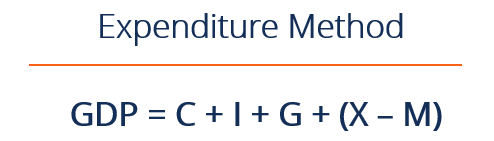

## Table of Contents

## What is GDP and why is it important?

GDP, or Gross Domestic Product, is the total value of all goods and services produced within a country's borders in a specific time period, usually a year. It's like a big scoreboard that shows how much a country's economy is producing. GDP helps us understand if a country's economy is growing, shrinking, or staying the same. When GDP goes up, it usually means more people are working and earning money, and businesses are doing well.

GDP is important because it gives us a way to compare the economic performance of different countries. For example, if one country's GDP is growing faster than another's, it might mean that the first country is doing a better job at creating jobs and improving living standards. Governments and businesses use GDP to make decisions about where to invest money and how to plan for the future. Even though GDP doesn't tell us everything about a country's well-being, it's a key piece of information that helps us understand the big picture of an economy.

## What is the expenditure approach to calculating GDP?

The expenditure approach to calculating GDP is like adding up all the money spent in a country. It looks at four main types of spending: what consumers buy, what businesses invest in, what the government spends, and what other countries spend on our goods and services. When you add up all these different kinds of spending, you get the total GDP.

This method makes sense because every time someone buys something, it means that something was produced. So, by adding up all the spending, we can see the total value of everything that was made in the country. It's important to remember that we also need to subtract the value of imports, because those are goods and services produced in other countries. By doing this, the expenditure approach gives us a clear picture of the country's economic activity.

## What are the main components of the expenditure approach?

The expenditure approach to calculating GDP looks at all the money spent in a country. It adds up four main types of spending: what people buy for themselves, what businesses spend on things like buildings and equipment, what the government spends on things like schools and roads, and what other countries spend when they buy our goods and services. These four parts together show us how much money is moving around in the economy.

We also need to remember to take away the money spent on imports. Imports are things we buy from other countries, so they don't count towards our own GDP. By adding up all the spending and subtracting the imports, the expenditure approach helps us see the total value of everything made in our country. It's like looking at a big shopping list to understand how much the economy is producing.

## How is consumer spending calculated in the expenditure approach?

Consumer spending, also called personal consumption expenditures, is a big part of the GDP. It's all the money that people spend on things they want and need, like food, clothes, cars, and going out to eat. To figure out consumer spending, we look at how much money people are spending on these things over a certain time, usually a year. We use surveys and data from stores to see what people are buying and how much they're spending.

This information is really important because it helps us understand how much of the economy is driven by what people buy. When people spend more, it can mean the economy is doing well, because businesses are selling more stuff. But if people start spending less, it might mean they're worried about money, and that can slow down the economy. So, keeping track of consumer spending helps us see where the economy might be heading.

## What role does investment play in the expenditure approach to GDP?

Investment in the expenditure approach to GDP is all about the money businesses spend on things that help them grow and make more stuff. This includes buying new machines, building factories, and even adding to their stock of goods. When businesses invest more, it's a good sign because it means they think the economy will keep doing well. They're spending money now to make more money later.

This investment part of GDP is important because it shows how confident businesses are about the future. If they're spending a lot on new equipment and buildings, it can help the economy grow even more. More investment can lead to more jobs and more things being made, which makes the whole economy stronger. So, watching how much businesses are investing helps us understand if the economy is getting bigger or if it might be slowing down.

## How are government expenditures included in GDP calculation?

Government expenditures are all the money the government spends on things like building roads, schools, and hospitals, and paying for services like police and firefighters. When we calculate GDP using the expenditure approach, we add up all this government spending. It's important because it shows how much the government is putting back into the economy. When the government spends more, it can help the economy grow by creating jobs and making things better for people.

We include government spending in GDP because it's money spent on goods and services produced within the country. This spending can make a big difference, especially when businesses and people aren't spending as much. By adding government expenditures to the total, we get a fuller picture of how the economy is doing. It helps us see if the government is helping to keep the economy strong or if it needs to do more.

## What is net exports and how does it affect GDP?

Net exports are what we get when we subtract the value of what we buy from other countries (imports) from the value of what other countries buy from us (exports). If we sell more to other countries than we buy from them, our net exports are positive. But if we buy more from other countries than we sell to them, our net exports are negative.

Net exports are an important part of GDP because they show how much our country is making from trade with other countries. When our net exports are positive, it means our country is [earning](/wiki/earning-announcement) more from selling things to other countries than it's spending on buying things from them. This can help our GDP grow because it's like extra money coming into our economy. But if our net exports are negative, it means we're spending more on imports than we're earning from exports, which can make our GDP smaller. So, net exports can either boost our GDP or drag it down, depending on whether we're selling more or buying more.

## Can you explain the formula used in the expenditure approach?

The formula for the expenditure approach to calculating GDP is pretty straightforward. It adds up all the spending that happens in a country over a certain time, usually a year. The formula is: GDP = Consumer Spending + Investment + Government Spending + Net Exports. Each part of this formula represents a different kind of spending that happens in the economy.

Consumer spending is all the money people spend on things they want and need, like food, clothes, and entertainment. Investment is the money businesses spend on things like new machines and buildings to help them grow. Government spending is what the government pays for things like schools, roads, and public services. Net exports are what we get when we subtract the value of imports (things we buy from other countries) from the value of exports (things we sell to other countries). By adding up all these parts, we get the total value of everything produced in the country, which is the GDP.

## How does the expenditure approach differ from the income and production approaches?

The expenditure approach, income approach, and production approach are three different ways to calculate GDP, but they all end up with the same total. The expenditure approach looks at all the money spent in the country. It adds up what people spend on things they want and need, what businesses spend on investments, what the government spends on services and projects, and what other countries spend on our goods and services. This approach is like looking at a big shopping list to see how much money is moving around in the economy.

The income approach, on the other hand, looks at all the money people and businesses earn. It adds up wages, profits, rent, and other types of income. This way of calculating GDP is like looking at everyone's paychecks and profits to see how much money is being made in the country. Both the expenditure and income approaches should give the same total because every dollar spent by someone is a dollar earned by someone else.

The production approach focuses on the value of all the goods and services produced in the country. It adds up the value of everything made, from cars and computers to haircuts and healthcare. This approach is like looking at a big factory and seeing everything that comes out of it. Just like the other two methods, the production approach should also give the same GDP total because it's just another way of looking at the same economic activity from a different angle.

## What are the challenges and limitations of using the expenditure approach?

Using the expenditure approach to calculate GDP can be tricky because it's hard to get all the numbers right. For example, it's tough to know exactly how much people are spending on things like food or clothes because not everyone keeps track of every penny they spend. Also, businesses might not report all their investments correctly, and the government's spending can change a lot from year to year. Plus, figuring out how much other countries are spending on our stuff can be complicated because trade numbers can be messy and change a lot.

Another problem is that the expenditure approach might not show the whole picture of the economy. It focuses on spending, but it doesn't tell us about things like how happy people are or how clean the environment is. Also, if people start saving more money instead of spending it, the GDP might look like it's going down even if the economy is still doing okay. And sometimes, the numbers can be off because of things like inflation, which makes prices go up but doesn't mean more stuff is being made. So, while the expenditure approach is a good way to measure GDP, it has its limits and we need to be careful when using it to understand the economy.

## How do economists adjust for inflation when calculating GDP using the expenditure approach?

Economists adjust for inflation when calculating GDP using the expenditure approach by using something called real GDP. Real GDP takes away the effect of rising prices so we can see how much the economy is really growing. They do this by using a price index, like the GDP deflator, which measures how much prices have gone up over time. By dividing the nominal GDP (the total spending without adjusting for inflation) by the GDP deflator, economists can figure out the real GDP. This way, they can see if the economy is actually producing more stuff, not just if prices are going up.

It's important to adjust for inflation because if we don't, we might think the economy is doing better than it really is. For example, if prices go up a lot, the nominal GDP will look bigger even if people aren't buying more things. By using real GDP, economists can get a clearer picture of whether the economy is growing because more goods and services are being made, or if it's just because prices are higher. This helps everyone understand the true health of the economy and make better decisions.

## What advanced techniques are used to refine GDP estimates using the expenditure approach?

To make GDP estimates more accurate using the expenditure approach, economists use something called seasonal adjustment. This helps them see past the ups and downs that happen at certain times of the year, like more spending during holidays. They use fancy math to smooth out these changes and get a clearer picture of how the economy is doing over time. Another technique is called data reconciliation, where they compare numbers from different sources to make sure they all line up. If the numbers don't match, they figure out why and fix it, so the GDP numbers are as correct as possible.

Economists also use something called input-output tables to get a better understanding of how different parts of the economy are connected. These tables show how industries buy and sell from each other, which helps economists see the full impact of spending on the economy. For example, if people buy more cars, it doesn't just affect car factories but also the companies that make car parts. By looking at these connections, economists can make better guesses about how changes in one part of the economy will affect the whole thing. This helps them come up with more accurate GDP numbers.

## What is GDP and why is it important?

Gross Domestic Product (GDP) serves as a foundational metric for evaluating the economic performance and health of a country. It quantifies the total value of all goods and services produced over a specific time period within a nation's borders. Understanding GDP provides policymakers, economists, and investors with critical insights into economic conditions and guides decision-making in various sectors.

There are three primary approaches to calculating GDP: the expenditure approach, the production (or output) approach, and the income approach. Each method offers a unique perspective on the economic activity within a country, with the expenditure approach being the most commonly discussed in economic analysis.

The expenditure approach aggregates all expenditures made in the economy and is represented by the formula:

$$
\text{GDP} = C + G + I + (X - M)
$$

where:
- $C$ stands for consumer spending, encapsulating expenditures by households on goods and services.
- $G$ denotes government spending, representing government consumption and investment.
- $I$ indicates business investments in capital goods such as machinery and infrastructure.
- $X$ and $M$ represent exports and imports, respectively, with $(X - M)$ providing the net exports value.

This approach adds all spending on final goods and services to calculate the economy's total output, offering a view of both domestic consumption and international trade activity.

Adjustments for inflation are essential when interpreting GDP figures. Nominal GDP reflects the market value of goods and services at current prices, while real GDP adjusts for inflation, representing these values in constant prices from a base year. This distinction is pivotal because nominal GDP can be deceptive if inflation skews the perception of economic growth. Consequently, real GDP serves as a more reliable metric for comparing economic performance over time, as it isolates true growth from inflationary effects.

Understanding the difference between real and nominal GDP is vital for forming accurate economic interpretations and making informed policy decisions. Nominal GDP might suggest economic expansion, but only real GDP accurately indicates whether there is an increase in the quantity of goods and services produced, absent price level changes. Such clarity is necessary in ensuring that economic policies target genuine growth rather than merely responding to inflation.

## What are the types and components of GDP?

Gross Domestic Product (GDP) serves as a pivotal measure of economic activity and provides insights into the economic health of a country. Two principal types of GDP are nominal GDP and real GDP. Nominal GDP represents the market value of all finished goods and services produced within a country in a given period and is measured using current prices. It is useful for comparing the economic output of a country over short periods. However, nominal GDP can be misleading over longer periods due to inflation effects. 

Real GDP addresses this limitation by accounting for inflation, offering a more accurate reflection of an economy’s size and how it grows over time. It is calculated by adjusting nominal GDP for price changes and is expressed in terms of a base year’s prices. The formula applied is:

$$
\text{Real GDP} = \frac{\text{Nominal GDP}}{\text{GDP Deflator}} \times 100
$$

The expenditure method, one of the most common approaches for calculating GDP, breaks down GDP into four main components: consumer spending, government spending, investment, and net exports. The GDP formula is expressed as:

$$
\text{GDP} = C + G + I + (X - M)
$$

Where:
- $C$ represents consumer spending, which is the total value of all goods and services consumed by households. It is often the largest GDP component and includes expenditures on durable goods, nondurable goods, and services. Consumer spending indicates the population's consumption habits and directly influences economic growth.
- $G$ stands for government spending, encompassing all government consumption, investment in defense and infrastructure, and public sector salaries. This component illustrates the government’s role in economic stimulation and public welfare.
- $I$ is investment, reflecting business expenditures on capital goods such as machinery, technology, and infrastructure. It includes residential construction and changes in inventories. Investment indicates business optimism and future production capacity, affecting long-term economic growth.
- $X - M$ represents net exports, calculated as the value of exports ($X$) minus imports ($M$). It highlights the international economic position and the trade balance with other nations. Positive net exports indicate a trade surplus, while negative values denote a trade deficit.

Understanding these components provides valuable insights for financial analysis as each component reacts differently to economic policies and global market trends. Consumer behavior, government policies, business investment strategies, and international trade dynamics all contribute to shaping the GDP and, therefore, a comprehensive understanding of these components is essential for accurately interpreting economic data and forecasting future economic conditions. 

By monitoring shifts in these components, analysts can anticipate changes in GDP growth, enabling more informed investment decisions and policy formulation.

## What is the GDP Formula: A Closer Look?

Gross Domestic Product (GDP) is a comprehensive measure of national economic activity. It is calculated using the expenditure approach, which follows the formula:

$$
\text{GDP} = C + G + I + (X - M)
$$

where:
- $C$ represents consumption,
- $G$ denotes government spending,
- $I$ stands for investment, and
- $(X - M)$ reflects net exports, calculated as exports ($X$) minus imports ($M$).

### Consumption (C)
Consumption refers to the total value of all goods and services consumed by households. It is typically the largest component of GDP and includes expenditures on durable goods, nondurable goods, and services. The level of consumer spending is a strong indicator of economic health, as it reflects both consumer confidence and the ability to purchase goods and services.

### Government Spending (G)
Government spending comprises the total government expenditures on goods and services. This includes spending on defense, education, public safety, and infrastructure but excludes transfer payments like pensions or unemployment benefits, as they do not reflect purchases of goods or services. Government spending can influence GDP directly through fiscal policy aimed at stimulating economic growth.

### Investment (I)
Investment in GDP terms includes business expenditures on capital, residential construction, and changes in inventories. Investment is a volatile component of GDP due to its sensitivity to interest rates and economic conditions, but it is critical for long-term economic growth as it enhances productive capacity. Businesses invest in machinery, technology, and buildings to increase productivity.

### Net Exports (X - M)
Net exports represent the value of a country's exports minus imports. A positive net export value indicates a trade surplus, while a negative value indicates a trade deficit. Trade balances are important as they reflect international competitiveness and the demand for goods produced in the country versus those bought from abroad.

### Python Example for GDP Calculation
To illustrate GDP calculation, consider a simple Python script:

```python
def calculate_gdp(consumption, government_spending, investment, exports, imports):
    net_exports = exports - imports
    gdp = consumption + government_spending + investment + net_exports
    return gdp

# Example values in billion dollars
consumption = 14200
government_spending = 3300
investment = 3900
exports = 2200
imports = 2600

gdp_value = calculate_gdp(consumption, government_spending, investment, exports, imports)
print(f"The calculated GDP is ${gdp_value} billion.")
```

This script calculates GDP by summing the components of the expenditure method. Each component is essential for understanding economic dynamics and policy implications. Consumption indicates household economic activity; government spending represents fiscal policy impact; investment reflects future growth potential; and net exports show global trade engagement.

## References & Further Reading

[1]: Mankiw, N. G. (2019). ["Macroeconomics"](https://archive.org/details/macro-economics-mankew). Worth Publishers.

[2]: Mishkin, F. S. (2018). ["The Economics of Money, Banking, and Financial Markets"](https://www.pearsonhighered.com/assets/preface/0/1/3/4/0134855388.pdf). Pearson.

[3]: ["Advances in Financial Machine Learning"](https://www.amazon.com/Advances-Financial-Machine-Learning-Marcos/dp/1119482089) by Marcos Lopez de Prado

[4]: Bergstra, J., Bardenet, R., Bengio, Y., & Kégl, B. (2011). ["Algorithms for Hyper-Parameter Optimization."](https://dl.acm.org/doi/10.5555/2986459.2986743) Advances in Neural Information Processing Systems 24.

[5]: ["Algorithmic Trading and DMA: An Introduction to Direct Access Trading Strategies"](https://www.amazon.com/Algorithmic-Trading-DMA-introduction-strategies/dp/0956399207) by Barry Johnson