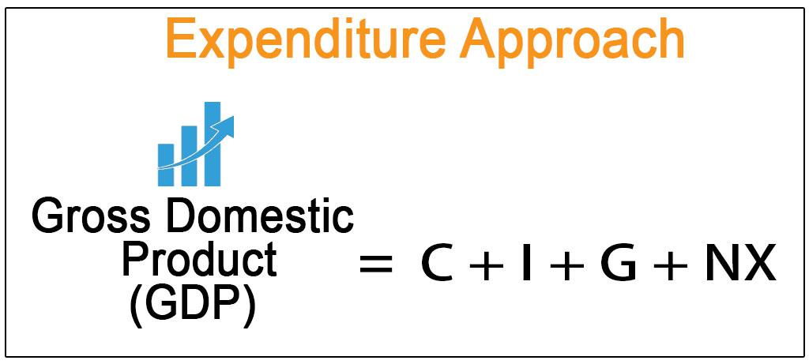

Gross Domestic Product (GDP) stands as a fundamental economic indicator, widely used to gauge the size and health of an economy. Its significance extends to various stakeholders, including policymakers, economists, and investors, who rely on it to assess economic performance and guide decision-making processes. GDP essentially measures the total monetary value of all finished goods and services produced within a country's borders over a specific period, usually annually or quarterly.

Among the several methods to calculate GDP, the expenditure approach is particularly prominent. This approach aggregates the overall spending on final goods and services, consolidating key economic actors and their contributions. The expenditure formula for GDP is represented as:



$$
\text{GDP} = C + G + I + (X - M)
$$

Where:
- $C$ represents consumer spending, the expenditures by households on goods and services.
- $G$ denotes government spending, encompassing all government consumption, investment, and transfer payments.
- $I$ refers to business investments, which include investments in capital goods that will be used for future production.
- $(X - M)$ stands for net exports, calculated as exports minus imports, indicating the balance of trade.

This expenditure-based calculation of GDP not only serves to portray the aggregate economic activity but also unveils insights into the diverse segments influencing economic dynamics. By dissecting these components, stakeholders gain a nuanced understanding of economic trends and structural shifts within the economy.

In contemporary financial markets, GDP data finds a novel application through algorithmic trading. This technique employs automated, sophisticated algorithms utilizing quantitative data to make trading decisions at speeds and frequencies beyond human capability. Algorithmic trading leverages economic indicators like GDP to refine trading strategies, predict market trends, and optimize investments. Understanding the components of GDP thus becomes instrumental in crafting strategies that both anticipate and adapt to changes in economic conditions, offering traders and investors valuable insights into market dynamics.

## Table of Contents

## Understanding GDP and Its Importance

Gross Domestic Product (GDP) serves as a foundational metric for evaluating the economic performance and health of a country. It quantifies the total value of all goods and services produced over a specific time period within a nation's borders. Understanding GDP provides policymakers, economists, and investors with critical insights into economic conditions and guides decision-making in various sectors.

There are three primary approaches to calculating GDP: the expenditure approach, the production (or output) approach, and the income approach. Each method offers a unique perspective on the economic activity within a country, with the expenditure approach being the most commonly discussed in economic analysis.

The expenditure approach aggregates all expenditures made in the economy and is represented by the formula:

$$
\text{GDP} = C + G + I + (X - M)
$$

where:
- $C$ stands for consumer spending, encapsulating expenditures by households on goods and services.
- $G$ denotes government spending, representing government consumption and investment.
- $I$ indicates business investments in capital goods such as machinery and infrastructure.
- $X$ and $M$ represent exports and imports, respectively, with $(X - M)$ providing the net exports value.

This approach adds all spending on final goods and services to calculate the economy's total output, offering a view of both domestic consumption and international trade activity.

Adjustments for inflation are essential when interpreting GDP figures. Nominal GDP reflects the market value of goods and services at current prices, while real GDP adjusts for inflation, representing these values in constant prices from a base year. This distinction is pivotal because nominal GDP can be deceptive if inflation skews the perception of economic growth. Consequently, real GDP serves as a more reliable metric for comparing economic performance over time, as it isolates true growth from inflationary effects.

Understanding the difference between real and nominal GDP is vital for forming accurate economic interpretations and making informed policy decisions. Nominal GDP might suggest economic expansion, but only real GDP accurately indicates whether there is an increase in the quantity of goods and services produced, absent price level changes. Such clarity is necessary in ensuring that economic policies target genuine growth rather than merely responding to inflation.

## Types and Components of GDP

Gross Domestic Product (GDP) serves as a pivotal measure of economic activity and provides insights into the economic health of a country. Two principal types of GDP are nominal GDP and real GDP. Nominal GDP represents the market value of all finished goods and services produced within a country in a given period and is measured using current prices. It is useful for comparing the economic output of a country over short periods. However, nominal GDP can be misleading over longer periods due to inflation effects. 

Real GDP addresses this limitation by accounting for inflation, offering a more accurate reflection of an economy’s size and how it grows over time. It is calculated by adjusting nominal GDP for price changes and is expressed in terms of a base year’s prices. The formula applied is:

$$
\text{Real GDP} = \frac{\text{Nominal GDP}}{\text{GDP Deflator}} \times 100
$$

The expenditure method, one of the most common approaches for calculating GDP, breaks down GDP into four main components: consumer spending, government spending, investment, and net exports. The GDP formula is expressed as:

$$
\text{GDP} = C + G + I + (X - M)
$$

Where:
- $C$ represents consumer spending, which is the total value of all goods and services consumed by households. It is often the largest GDP component and includes expenditures on durable goods, nondurable goods, and services. Consumer spending indicates the population's consumption habits and directly influences economic growth.
- $G$ stands for government spending, encompassing all government consumption, investment in defense and infrastructure, and public sector salaries. This component illustrates the government’s role in economic stimulation and public welfare.
- $I$ is investment, reflecting business expenditures on capital goods such as machinery, technology, and infrastructure. It includes residential construction and changes in inventories. Investment indicates business optimism and future production capacity, affecting long-term economic growth.
- $X - M$ represents net exports, calculated as the value of exports ($X$) minus imports ($M$). It highlights the international economic position and the trade balance with other nations. Positive net exports indicate a trade surplus, while negative values denote a trade deficit.

Understanding these components provides valuable insights for financial analysis as each component reacts differently to economic policies and global market trends. Consumer behavior, government policies, business investment strategies, and international trade dynamics all contribute to shaping the GDP and, therefore, a comprehensive understanding of these components is essential for accurately interpreting economic data and forecasting future economic conditions. 

By monitoring shifts in these components, analysts can anticipate changes in GDP growth, enabling more informed investment decisions and policy formulation.

## The GDP Formula: A Closer Look

Gross Domestic Product (GDP) is a comprehensive measure of national economic activity. It is calculated using the expenditure approach, which follows the formula:

$$
\text{GDP} = C + G + I + (X - M)
$$

where:
- $C$ represents consumption,
- $G$ denotes government spending,
- $I$ stands for investment, and
- $(X - M)$ reflects net exports, calculated as exports ($X$) minus imports ($M$).

### Consumption (C)
Consumption refers to the total value of all goods and services consumed by households. It is typically the largest component of GDP and includes expenditures on durable goods, nondurable goods, and services. The level of consumer spending is a strong indicator of economic health, as it reflects both consumer confidence and the ability to purchase goods and services.

### Government Spending (G)
Government spending comprises the total government expenditures on goods and services. This includes spending on defense, education, public safety, and infrastructure but excludes transfer payments like pensions or unemployment benefits, as they do not reflect purchases of goods or services. Government spending can influence GDP directly through fiscal policy aimed at stimulating economic growth.

### Investment (I)
Investment in GDP terms includes business expenditures on capital, residential construction, and changes in inventories. Investment is a volatile component of GDP due to its sensitivity to interest rates and economic conditions, but it is critical for long-term economic growth as it enhances productive capacity. Businesses invest in machinery, technology, and buildings to increase productivity.

### Net Exports (X - M)
Net exports represent the value of a country's exports minus imports. A positive net export value indicates a trade surplus, while a negative value indicates a trade deficit. Trade balances are important as they reflect international competitiveness and the demand for goods produced in the country versus those bought from abroad.

### Python Example for GDP Calculation
To illustrate GDP calculation, consider a simple Python script:

```python
def calculate_gdp(consumption, government_spending, investment, exports, imports):
    net_exports = exports - imports
    gdp = consumption + government_spending + investment + net_exports
    return gdp

# Example values in billion dollars
consumption = 14200
government_spending = 3300
investment = 3900
exports = 2200
imports = 2600

gdp_value = calculate_gdp(consumption, government_spending, investment, exports, imports)
print(f"The calculated GDP is ${gdp_value} billion.")
```

This script calculates GDP by summing the components of the expenditure method. Each component is essential for understanding economic dynamics and policy implications. Consumption indicates household economic activity; government spending represents fiscal policy impact; investment reflects future growth potential; and net exports show global trade engagement.

## Algorithmic Trading: Leveraging Economic Data

Algorithmic trading, also known as algo-trading, involves the use of sophisticated software to execute trades based on pre-defined criteria, leveraging quantitative data and complex algorithms. GDP data, representing macroeconomic health, plays a crucial role in these trading strategies as it provides insights into economic trends that can impact asset prices.

GDP figures can be integrated into [algorithmic trading](/wiki/algorithmic-trading) models to anticipate market movements. For instance, a strong GDP growth rate may signal robust economic health, potentially leading to bullish stock markets, while unexpectedly low GDP growth could indicate economic slowdown, prompting bearish market sentiment.

Algorithms can utilize GDP data in several ways:

1. **Trend Analysis**: Historical GDP time series can be used to identify economic cycles, aiding in forecasting future market conditions. By analyzing GDP growth or contraction phases, algorithms can adjust trading positions to capitalize on expected market trends.

2. **Correlation Studies**: Algorithms can evaluate the correlation between GDP components (e.g., consumption, investment) and specific asset classes or sectors. A Python script could, for example, calculate correlation coefficients to determine how consumer spending affects retail stocks.

    ```python
    import pandas as pd
    import numpy as np

    # Sample GDP and stock data
    gdp_data = pd.Series([2.1, 2.5, 2.3, 2.8, 3.0])
    stock_returns = pd.Series([0.5, 0.7, 0.6, 0.9, 1.1])

    # Calculating correlation
    correlation = np.corrcoef(gdp_data, stock_returns)[0, 1]
    print("Correlation between GDP and stock returns:", correlation)
    ```

3. **Predictive Modeling**: GDP indicators can feed into machine learning models like decision trees or neural networks to predict future price movements. These models analyze patterns in economic indicators and their impact on asset prices.

4. **Event-Driven Strategies**: Algorithms can react to real-time GDP announcements. Such algorithms are programmed to make rapid decisions when GDP figures are released, adjusting portfolios based on deviations from expected growth rates.

Economic forecasts generated from GDP data can lead to dynamic portfolio adjustments. For example, if a country's GDP is projected to grow, an algorithm might increase exposure to cyclical stocks. Conversely, if a contraction is anticipated, the algorithm might allocate more to defensive assets.

The interplay between GDP data and algorithmic trading underscores the need for continuous updating and testing of models to ensure they accurately respond to economic signals. This practice offers traders enhanced efficiency and precision in capitalizing on economic trends.

## The Interplay Between GDP and Algorithmic Trading

The symbiotic relationship between GDP data monitoring and algorithmic trading strategies is underscored by the ways in which real-time economic indicators are used to enhance decision-making in financial markets. GDP figures, as a comprehensive measure of national economic activity, serve as critical inputs for algorithmic models that anticipate market movements. The integration of GDP data into these models allows traders to refine their strategies based on economic performance and forecasts.

Real-time GDP data streaming into algorithmic trading platforms enables dynamic adjustment of trading positions. For instance, an unexpected GDP growth rate may lead traders to reassess asset valuations, favoring equities over bonds due to anticipated economic expansion. Conversely, a lower-than-expected GDP might prompt a shift towards more conservative investments. Algorithms can be pre-programmed to respond to such deviations from predicted economic data, optimizing portfolios without human intervention.

A notable case study highlighting the impact of GDP announcements is the market response to quarterly GDP reports in major economies like the United States. These reports often lead to heightened [volatility](/wiki/volatility-trading-strategies) as markets adjust to new economic realities. For example, during a GDP release showing stronger-than-anticipated economic growth, algorithmic trading programs might increase their allocation in sectors poised for growth, such as consumer goods and technology.

Here's a simplified Python snippet demonstrating how GDP data could influence an algorithmic trading strategy:

```python
def adjust_portfolio_based_on_gdp(gdp_growth, portfolio):
    if gdp_growth > expected_growth:
        # Increase investments in growth stocks
        portfolio['growth_stocks'] *= 1.1
        portfolio['bonds'] *= 0.9
    else:
        # Increase bond holdings for stability
        portfolio['growth_stocks'] *= 0.9
        portfolio['bonds'] *= 1.1
    return portfolio

expected_growth = 2.0  # expected GDP growth rate in percentage
current_gdp_growth = 2.5  # actual GDP growth rate reported
portfolio = {'growth_stocks': 10000, 'bonds': 5000}

new_portfolio = adjust_portfolio_based_on_gdp(current_gdp_growth, portfolio)
print(new_portfolio)
```

This code demonstrates how a simplistic trading algorithm could modify asset allocations based on GDP growth discrepancies, leading to real-time adjustments that align with market expectations.

The practical application of leveraging GDP data is evident not only in immediate trading adjustments but also in the strategic planning of long-term investments. Understanding GDP trends helps in identifying cyclic investment opportunities, allowing traders to capitalize on expansions and protect capital during downturns.

Overall, the interplay between GDP data and algorithmic trading illustrates how traditional economic indicators can be harnessed through modern technology to refine and automate financial strategies, ultimately enhancing market efficiency and potentially increasing returns for investors.

## Conclusion

Gross Domestic Product (GDP) stands as a fundamental metric in economic analysis, providing a comprehensive measure of a nation's economic activity and health. It encapsulates the sum of all goods and services produced over a specific time period, and serves as a benchmark against which economic policies and conditions can be evaluated. In recent years, the integration of GDP data into algorithmic trading has emerged as a significant development in financial markets. This fusion of traditional economic indicators with advanced technological methodologies underscores the dynamic evolution of both economic measurement and trading strategies.

The advancement of technology has enabled traders and investors to harness GDP data with unprecedented speed and precision. Algorithmic trading systems capitalize on this data to identify market trends, optimize trading strategies, and make real-time adjustments to portfolios. For instance, in Python, one could use the pandas and numpy libraries to manipulate GDP datasets, integrate them into trading algorithms, and predict market changes based on economic trends. Here is a simple example:

```python
import pandas as pd
import numpy as np

# Assume gdp_data is a pandas DataFrame containing GDP data over several years
gdp_data = pd.read_csv('gdp_data.csv')

# Calculate growth rate
gdp_data['GDP_Growth'] = gdp_data['GDP'].pct_change()

# Example: Adjust trading strategy based on GDP growth
def adjust_trading_strategy(gdp_growth):
    if gdp_growth > 0.02:
        action = "Buy"
    elif gdp_growth < -0.02:
        action = "Sell"
    else:
        action = "Hold"
    return action

gdp_data['Strategy_Action'] = gdp_data['GDP_Growth'].apply(adjust_trading_strategy)
```

Moreover, the constant evolution of economic measurement methodologies and technology continually opens up new opportunities for market participants. With innovations such as [artificial intelligence](/wiki/ai-artificial-intelligence) and [machine learning](/wiki/machine-learning), traders can now craft more sophisticated models that incorporate not only GDP but a wide array of economic indicators, enhancing their predictive power and adaptability.

To remain competitive in today's fast-paced financial environment, there is an increasing necessity for adaptive trading strategies. These strategies must effectively blend classical economic insight derived from indicators like GDP with cutting-edge technology. This adaptability not only facilitates better-informed investment decisions but also ensures responsiveness to ever-changing market conditions and economic landscapes.

In conclusion, the role of GDP as a pillar in economic analysis and its integration with algorithmic trading highlights a synergy between traditional economic measures and modern technological advancements. By embracing this paradigm, traders and investors are better equipped to navigate the complexities of financial markets and seize emerging opportunities.

## References & Further Reading

[1]: Mankiw, N. G. (2019). ["Macroeconomics"](https://archive.org/details/macro-economics-mankew). Worth Publishers.

[2]: Mishkin, F. S. (2018). ["The Economics of Money, Banking, and Financial Markets"](https://www.pearsonhighered.com/assets/preface/0/1/3/4/0134855388.pdf). Pearson.

[3]: ["Advances in Financial Machine Learning"](https://www.amazon.com/Advances-Financial-Machine-Learning-Marcos/dp/1119482089) by Marcos Lopez de Prado

[4]: Bergstra, J., Bardenet, R., Bengio, Y., & Kégl, B. (2011). ["Algorithms for Hyper-Parameter Optimization."](https://dl.acm.org/doi/10.5555/2986459.2986743) Advances in Neural Information Processing Systems 24.

[5]: ["Algorithmic Trading and DMA: An Introduction to Direct Access Trading Strategies"](https://www.amazon.com/Algorithmic-Trading-DMA-introduction-strategies/dp/0956399207) by Barry Johnson