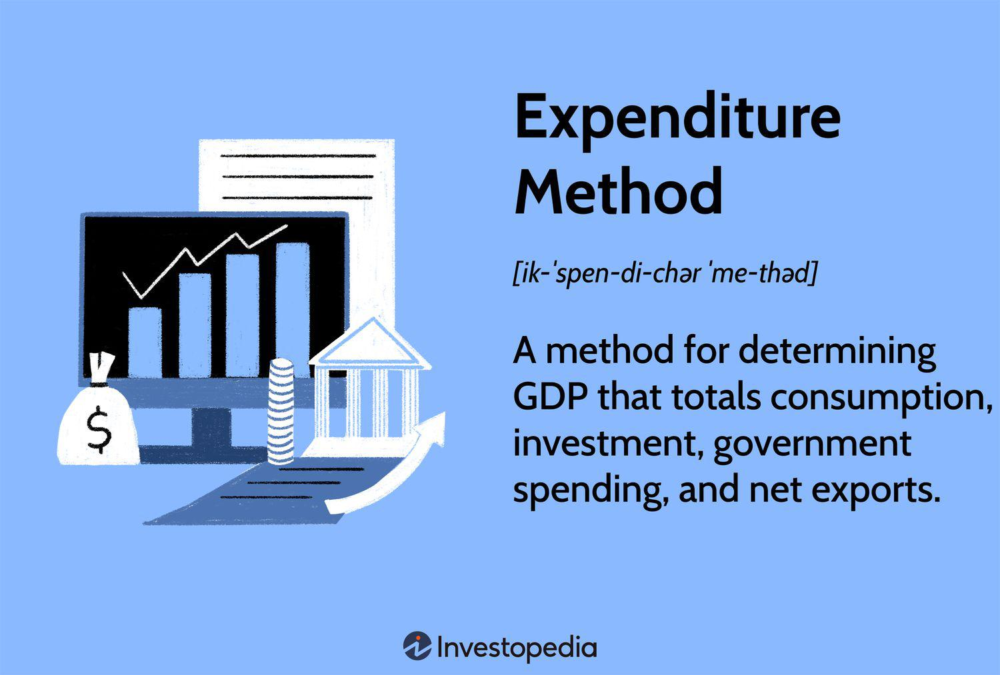

Economics and finance are disciplines that are inherently intertwined with complex calculations and methodologies designed to measure and evaluate a country's economic health. One pivotal method employed is the expenditure approach, which is instrumental in determining a nation's Gross Domestic Product (GDP). The GDP, essentially the monetary value of all finished goods and services produced within a country during a specific period, serves as a comprehensive gauge of a country's economic performance. The expenditure method specifically examines GDP by summing up the total expenditures incurred within an economy.

With technological advancements, the financial landscape has transformed significantly. Algorithmic trading represents a cutting-edge evolution in trading and financial analysis, utilizing sophisticated algorithms to execute trades at speeds and efficiencies beyond human capability. This technological sophistication has not only revolutionized trading practices but has also brought economic calculations, like those needed for GDP determination, closer to practical and strategic applications in financial markets.



The relationship between economic calculations and algorithmic trading is of particular interest, highlighting a fascinating synergy. Economic indicators, especially GDP calculated through the expenditure method, provide critical data that can be integrated into trading algorithms. This integration can yield competitive advantages in markets that are increasingly driven by data. Understanding this interplay allows investors and policymakers to make informed decisions, ultimately contributing to an enhanced and more efficient financial ecosystem.

## Table of Contents

## Understanding the Expenditure Method

The expenditure method is a fundamental technique for calculating a country's Gross Domestic Product (GDP), which is an essential measure of its economic performance. This method involves summing up all expenditures made on final goods and services within an economy over a specific period. The GDP calculated using this approach reflects the total spending by various economic [agents](/wiki/agents), including households, businesses, and the government, while also accounting for net exports. 

The formula for GDP using the expenditure method is expressed as:

$$
\text{GDP} = C + I + G + (X - M)
$$

where:
- $C$ represents personal consumption expenditures, capturing total spending by households on goods and services.
- $I$ denotes gross private domestic investment, incorporating business investments in capital goods and changes in inventories.
- $G$ stands for government consumption expenditures and gross investment, encompassing government spending on goods and public services.
- $(X - M)$ illustrates net exports, defined as the difference between a country's exports (X) and imports (M).

Understanding these components provides crucial insight into the underlying economic activities within a nation. Personal consumption expenditures ($C$) typically account for the largest portion of GDP, reflecting the consumption patterns of households and indicating overall consumer confidence and economic well-being.

Gross private domestic investment ($I$) includes expenditures on fixed assets such as machinery and infrastructure and changes in business inventories. An increase in this component suggests business growth and confidence in future economic prospects.

Government spending ($G$) on products and services is crucial in stimulating economic activity, especially in times of economic downturns. It includes expenditures on defense, education, healthcare, and infrastructure projects.

The net exports component ($X - M$) reflects a country's balance of trade. A positive value means exports exceed imports, contributing positively to GDP, whereas a negative balance indicates higher imports, which can suggest a dependency on foreign goods.

These elements, when combined and analyzed over time, offer a comprehensive view of an economy's health and trajectory. Understanding these economic activities can aid analysts in identifying trends, forecasting economic conditions, and formulating policy recommendations. Additionally, monitoring these elements helps governments and policymakers design effective economic interventions to stimulate growth or address economic challenges.

## Calculation Components

The expenditure method for calculating Gross Domestic Product (GDP) is based on aggregating various types of spending within an economy. Each component provides insight into different economic activities, representing distinct aspects of national expenditure.

1. **Personal Consumption Expenditures (C)**: This component reflects the total expenditure by households on goods and services. It is the largest component of GDP in most economies and includes spending on durable goods (such as cars and appliances), nondurable goods (such as food and clothing), and services (such as healthcare and education). 

2. **Gross Private Domestic Investment (I)**: Investment is a crucial engine of economic growth. This component includes business investments in equipment and structures, residential construction, and changes in business inventories. Investments in capital goods increase the productive capacity of an economy, while inventory changes reflect fluctuations in demand relative to supply.

3. **Government Consumption Expenditures and Gross Investment (G)**: This encompasses government spending on goods and services intended for public use, infrastructure investment, and services such as defense, education, and healthcare. It is a reflection of governmental fiscal policies and plays a key role in stabilizing the economy during various phases of the business cycle.

4. **Net Exports (X-M)**: The net exports component is the value of a country's total exports minus its total imports. Exports contribute positively to GDP while imports are subtracted, as they represent spending on goods and services produced outside the domestic economy. A positive net export indicates a trade surplus, while a negative value signifies a trade deficit.

The formula for GDP using the expenditure method is typically expressed as:

$$
\text{GDP} = C + I + G + (X - M)
$$

In this formula, each term represents one of the four components described above. Understanding and accurately measuring these components is essential for gauging the economic health of a nation, as they collectively encompass all monetary expenditures made within the economy.

## Comparing Expenditure and Income Methods

The calculation of Gross Domestic Product (GDP) can be approached via two primary methods: the expenditure method and the income method. While both methods aim to arrive at the same GDP figure, they do so from different perspectives, offering distinct insights into economic performance.

The expenditure method calculates GDP by summing the total spending on final goods and services produced within a nation during a given period. This method is defined by the formula:

$$

GDP = C + I + G + (X - M) 
$$

where $C$ represents personal consumption expenditures, $I$ denotes gross private domestic investment, $G$ is government consumption expenditures and gross investment, and $(X - M)$ stands for net exports, which is the difference between exports ($X$) and imports ($M$).

In contrast, the income method calculates GDP by aggregating all incomes earned by individuals and businesses in the production of goods and services. The core components of this approach include wages, rents, interests, and profits. The income method can be expressed as follows:

$$

GDP = W + R + i + P + T 
$$

where $W$ is wages, $R$ is rents, $i$ denotes interest, $P$ stands for profits, and $T$ represents taxes less subsidies on production and imports.

Both methods, while aiming to measure the same economic performance, provide varied insights. The expenditure method emphasizes consumer behavior and spending patterns, reflecting the demand side of the economy. In contrast, the income method sheds light on how income is distributed across different factors of production, offering a perspective on the economy's supply side.

Understanding the differences between these methods is crucial for comprehensive economic analysis. Each method's perspective can assist policymakers in identifying various aspects of economic activity and guide them in crafting policies that address demand and supply-side dynamics effectively. Additionally, recognizing these differences helps economists cross-verify GDP data and ensure its reliability and accuracy in reflecting the true economic state of a nation.

## Limitations of GDP Measurements

Gross Domestic Product (GDP) serves as a crucial indicator of a country's economic strength, encapsulating the total market value of all final goods and services produced within a country during a specific period. However, GDP measurement presents several limitations that can impact the accurate portrayal of economic health and societal well-being.

Firstly, GDP does not consider the work-life balance or quality of life. While it can reflect economic output, it fails to account for non-economic factors contributing significantly to well-being, such as leisure time, family life, and social connections. A nation might report substantial GDP growth, yet its citizens could experience declining life satisfaction and increasing stress levels.

Moreover, GDP measurement does not include informal economic activities. The informal sector, which often encompasses small-scale, home-based businesses and unregistered labor, might contribute significantly to an economy. Because these activities are not captured in formal [statistics](/wiki/bayesian-statistics), GDP figures might underestimate the actual economic productivity of developing countries, where the informal sector is prominent.

GDP calculations also ignore environmental degradation and sustainability issues. Economic activities are often associated with the consumption of natural resources and environmental pollution. Despite contributing to GDP, activities causing environmental harm can lead to long-term economic costs. For instance, deforestation might boost logging revenues temporarily, but it can result in biodiversity loss and climate-induced disasters later, affecting future economic stability.

Finally, GDP treats all expenditures equally, whether beneficial or detrimental. For instance, costs arising from natural disasters, wars, or pollution control efforts increase GDP, although they may not contribute positively to real economic progress or societal welfare.

Understanding these limitations is crucial for policymakers and economists. It allows them to interpret GDP data more accurately and adopt supplementary metrics to achieve a comprehensive view of economic health. Alternative measures, such as the Human Development Index (HDI), Genuine Progress Indicator (GPI), and Green GDP, can provide additional insights into sustainable development and societal well-being, addressing areas where GDP might fall short. This comprehensive approach can inform policy decisions that promote not only economic growth but also improved quality of life for citizens.

## Algorithmic Trading and Economic Calculations

Algorithmic trading is a method of executing trades that utilizes pre-programmed and complex algorithms to calculate optimal trading decisions. The primary advantage of [algorithmic trading](/wiki/algorithmic-trading) lies in its ability to process vast quantities of financial data at high speeds, enabling traders to capitalize on market opportunities that might be missed by human observation alone.

Economic data, particularly Gross Domestic Product (GDP), serves as a fundamental input for these algorithms. GDP, as a comprehensive measure of a nation's economic output, provides insights into various economic conditions, which are critical in formulating trading strategies. By understanding GDP data, algorithmic trading can tailor strategies that anticipate market trends based on economic growth, recessions, or other economic shifts.

Incorporating GDP and other economic data into trading algorithms involves several steps:

1. **Data Acquisition**: Collecting accurate and timely GDP data and related economic indicators. This process might include accessing governmental databases, financial newsfeeds, and real-time economic forecasts.

2. **Data Preprocessing**: Cleaning and structuring the data to ensure it is in a suitable format for analysis. This step might involve handling missing values, normalizing data, and adjusting for seasonal effects.

3. **Feature Engineering**: Creating input variables that can be used to train trading algorithms. These features could include GDP growth rates, sector-specific GDP contributions, and correlations with other economic indicators.

4. **Model Development**: Designing and testing algorithmic models that can interpret GDP data to make predictive trading decisions. Machine learning models, such as regression models or neural networks, can be trained on historical data to identify effective trading strategies that react appropriately to shifts in economic data.

Python code can be employed to implement these processes. For instance, a simple regression model might look as follows:

```python
import pandas as pd
from sklearn.model_selection import train_test_split
from sklearn.linear_model import LinearRegression
from sklearn.metrics import mean_squared_error

# Load GDP data and other economic indicators
data = pd.read_csv('economic_data.csv')

# Preprocess data
data = data.dropna()
X = data[['GDP_growth', 'CPI', 'market_index']]
y = data['stock_return']

# Split data into training and testing sets
X_train, X_test, y_train, y_test = train_test_split(X, y, test_size=0.2, random_state=42)

# Create and train the model
model = LinearRegression()
model.fit(X_train, y_train)

# Predict and calculate errors
predictions = model.predict(X_test)
mse = mean_squared_error(y_test, predictions)
print(f"Mean Squared Error: {mse}")
```

This example demonstrates how GDP growth, along with other economic indicators like the Consumer Price Index (CPI) and market index performance, can be used to predict stock returns, forming an integral part of an algorithmic trading system.

By effectively integrating solid economic fundamentals like GDP into these systems, algorithmic trading models can exhibit enhanced performance, adapting to economic cycles, and potentially yielding higher returns. These calculations thus bolster the strategies of traders and investors, providing a robust framework for making informed financial decisions.

## Integrating Economic Data in Trading Algorithms

Integrating GDP data and other economic indicators into trading algorithms provides traders with a substantial competitive advantage by allowing them to make informed decisions based on comprehensive economic analysis. Advanced trading algorithms leverage high-speed computing capabilities to process large volumes of economic data, identify trends and patterns, and adjust trading strategies efficiently. This integration involves the use of GDP growth rates, inflation rates, employment statistics, and other macroeconomic indicators as critical inputs in algorithmic models.

Economic data can be incorporated into [machine learning](/wiki/machine-learning) models, where the algorithms are trained to recognize historical patterns and predict future market movements. For example, a trading algorithm may use changes in GDP growth rates to anticipate shifts in market trends. By considering economic forecasts and real-time updates, these algorithms can optimize the timing and execution of trades, thus enhancing profitability.

A typical approach to integrating economic data involves feature engineering, where economic indicators are transformed into useful input variables for predictive models. Consider the following Python snippet as an example of how GDP growth data can be prepared and used in a simple linear regression model:

```python
import pandas as pd
from sklearn.model_selection import train_test_split
from sklearn.linear_model import LinearRegression

# Load GDP data and stock prices into DataFrame
data = pd.read_csv('economic_data.csv')

# Feature Engineering: Use GDP growth rate as an independent variable
data['GDP_Growth_Rate'] = data['GDP_Current_Year'] / data['GDP_Previous_Year'] - 1

# Define independent and dependent variables
X = data[['GDP_Growth_Rate']]
y = data['Stock_Returns']

# Split data into training and testing sets
X_train, X_test, y_train, y_test = train_test_split(X, y, test_size=0.2, random_state=42)

# Create a Linear Regression model and fit it to the training data
model = LinearRegression()
model.fit(X_train, y_train)

# Predict stock returns based on testing set
y_pred = model.predict(X_test)
```

This code showcases a simplistic example that correlates GDP growth rates with stock returns using a linear regression model. More sophisticated algorithms might employ neural networks or ensemble methods to capture complex, non-linear relationships between multiple economic indicators and market outcomes.

In practice, successful integration of economic data into trading algorithms can significantly impact market efficiency. These algorithms contribute to price discovery and [liquidity](/wiki/liquidity-risk-premium) by reacting promptly to new information and helping align asset prices with economic fundamentals. Consequently, investors can exploit these advancements to achieve better risk-adjusted returns, while market participants benefit from improved transparency and reduced transaction costs.

## Conclusion

The expenditure method serves as a robust measure for assessing a nation's Gross Domestic Product (GDP), thereby offering insights into its overall economic performance. By focusing on the summation of expenditures on final goods and services, it provides a clear picture of economic activities across households, businesses, and governments, while also considering net exports.

The integration of GDP calculations with algorithmic trading represents a powerful synergy that can significantly enhance trading strategies and market efficiency. Algorithmic trading, which relies on sophisticated algorithms and high-speed data processing, can leverage economic indicators like GDP to create informed and strategic trading decisions. The fusion of these economic calculations with advanced trading algorithms enables the detection of market patterns and trends, offering traders a competitive advantage.

Understanding how economic data influences trading decisions is crucial for investors and policymakers. It allows for more informed decision-making, fostering a more resilient and adaptive financial ecosystem. By utilizing GDP data within trading algorithms, financial markets can achieve greater efficiency, potentially stabilizing economies and benefiting stakeholders. This integration not only supports improved trading outcomes but also contributes to informed economic policies, thereby enhancing the overall robustness of financial systems.

## References & Further Reading

[1]: ["Gross Domestic Product (GDP): An Economy's All"](https://www.imf.org/en/Publications/fandd/issues/Series/Back-to-Basics/gross-domestic-product-GDP) by the International Monetary Fund

[2]: Blume, L. E., & Durlauf, S. N. (Eds.). (2010). ["Algorithmic Trading"](https://link.springer.com/content/pdf/10.1007/978-1-349-58802-2_498) in "The New Palgrave Dictionary of Economics"

[3]: Tsay, R. S. (2005). ["Analysis of Financial Time Series"](https://onlinelibrary.wiley.com/doi/book/10.1002/9780470644560). Wiley Series in Probability and Statistics.

[4]: Glasserman, P. (2004). ["Monte Carlo Methods in Financial Engineering"](https://link.springer.com/book/10.1007/978-0-387-21617-1) (Vol. 53). Springer Science & Business Media.

[5]: Patterson, D. (2020). ["Python for Finance: Analyze Big Financial Data"](https://books.google.com/books/about/Python_for_Finance.html?id=E93SBQAAQBAJ) (2nd ed.). O'Reilly Media.