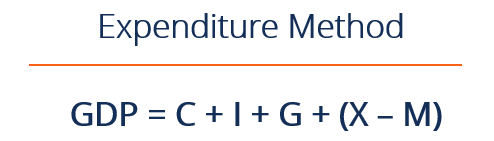

## Table of Contents

## What is the expenditure method in economics?

The expenditure method in economics is a way to calculate a country's total economic output, known as Gross Domestic Product (GDP). This method adds up all the money spent on goods and services produced within the country during a certain period. It includes spending by households, businesses, the government, and foreigners. By looking at how much everyone is spending, economists can figure out the size of the economy.

This approach is useful because it gives a clear picture of where the money is going in the economy. For example, if people are spending a lot on cars, it shows that the car industry is doing well. On the other hand, if government spending is high, it might mean that public services like schools and hospitals are getting more support. By understanding these spending patterns, policymakers can make better decisions to help the economy grow and improve people's lives.

## How does the expenditure method differ from other methods of calculating GDP?

The expenditure method is one of three main ways to calculate GDP, along with the income method and the production method. The expenditure method focuses on adding up all the spending that happens in the economy. This includes what households spend on things like food and clothes, what businesses spend on equipment and buildings, what the government spends on services like schools and roads, and what foreigners spend on our country's exports. By looking at all this spending, we get a total that represents the value of all goods and services produced in the country.

On the other hand, the income method looks at all the income earned by everyone in the economy. This includes wages, profits, rents, and other types of income. The idea is that all the money spent on goods and services eventually ends up as income for someone, so the total income should equal the total spending. The production method, also called the value-added method, calculates GDP by adding up the value added at each stage of production across all industries. This means looking at the difference between the value of goods and services at the beginning and end of each production process. Even though these methods look at different aspects of the economy, they should all give the same total GDP if done correctly.

## What are the main components of the expenditure method?

The expenditure method of calculating GDP breaks down the total spending in an economy into four main parts. The first part is what households spend on things they need and want, like food, clothes, and entertainment. This is called consumer spending. The second part is what businesses spend on things they need to keep running and growing, like new machines and buildings. This is called investment spending. Together, these two parts make up a big chunk of the total spending in the economy.

The other two parts come from outside the household and business sectors. The third part is what the government spends on services and projects, like building roads, running schools, and paying for healthcare. This is called government spending. The fourth and final part is what foreigners spend on the goods and services our country makes, minus what we spend on goods and services from other countries. This is called net exports. By adding up all these parts, we get the total GDP using the expenditure method.

## Can you explain the formula used in the expenditure method?

The formula for the expenditure method is simple. It says that GDP is equal to the total of four things: what households spend, what businesses spend, what the government spends, and what foreigners spend on our stuff minus what we spend on their stuff. In short, GDP = Consumer Spending + Investment Spending + Government Spending + Net Exports.

Let's break it down a bit. Consumer spending is all the money people use to buy things they need and want, like groceries and TVs. Investment spending is what businesses spend on things like new factories or computers. Government spending is what the government uses to pay for things like schools and roads. Net exports is what other countries spend on our goods and services, minus what we spend on theirs. When you add all these up, you get the total value of everything produced in the country, which is the GDP.

## How is consumer spending calculated in the expenditure method?

Consumer spending, also known as personal consumption expenditures, is a big part of figuring out a country's GDP using the expenditure method. It's all about adding up how much money people spend on things they need and want every day. This includes stuff like food, clothes, and even going out to eat or seeing a movie. Economists look at receipts and other data to see how much people are spending in stores, online, and in other places.

To get a good picture of consumer spending, economists often use surveys and data from businesses. They ask people about what they bought and how much they spent. They also look at sales numbers from stores and other places where people buy things. By putting all this information together, they can figure out the total amount of consumer spending, which is a key piece of the puzzle when calculating GDP.

## What role does government spending play in the expenditure method?

Government spending is an important part of the expenditure method for figuring out GDP. It's all about adding up what the government spends on things like schools, roads, and hospitals. This includes money used to pay for public services and big projects that help the country run smoothly. When we include government spending in the GDP calculation, it helps us see how much the government is helping the economy grow.

By looking at government spending, we can understand how much the government is investing in the country. If the government is spending a lot, it might mean they're trying to improve public services or start new projects. This spending can make a big difference in the total GDP because it shows how much money is being pumped into the economy by the government. It's a key piece of the puzzle when we want to know the size of the whole economy.

## How are investments accounted for in the expenditure method?

Investments in the expenditure method are all about counting the money businesses spend on things that help them grow and keep running. This includes buying new machines, building new factories, or even adding more stock to sell. When businesses spend on these things, it's called investment spending, and it's a big part of figuring out the GDP. Economists look at how much businesses are spending on these investments to see how much they're contributing to the economy.

This part of the expenditure method is important because it shows how much businesses believe in the future of the economy. If they're spending a lot on new equipment and buildings, it means they think they'll be able to sell more stuff and make more money later on. By adding up all this investment spending, we get a clearer picture of how businesses are helping the economy grow, which is a key piece of the GDP puzzle.

## What is the significance of net exports in the expenditure method?

Net exports are an important part of the expenditure method because they show how much other countries are spending on the stuff we make, minus what we spend on stuff from other countries. If we sell more to other countries than we buy from them, net exports add to our GDP. This means our economy is doing well because other countries want our goods and services. On the other hand, if we buy more from other countries than we sell to them, net exports will be negative, which means they take away from our GDP.

Looking at net exports helps us understand how our country is doing in the global market. If net exports are high, it's a good sign that our products are popular around the world. This can lead to more jobs and a stronger economy at home. But if net exports are low or negative, it might mean we need to focus on making our products better or finding new markets to sell to. Either way, net exports are a key piece of figuring out our total GDP using the expenditure method.

## How do economists adjust for inflation when using the expenditure method?

Economists adjust for inflation when using the expenditure method by using something called real GDP. Real GDP is a way to measure the value of all the goods and services produced in a country, but it takes away the effect of rising prices. They do this by using a price index, like the Consumer Price Index (CPI), to see how much prices have gone up over time. Then, they use this information to change the numbers so they show what the spending would be if prices hadn't changed. This helps them see if the economy is really growing or if it just looks like it's growing because things cost more.

By using real GDP, economists can get a clearer picture of how the economy is doing. If they didn't adjust for inflation, they might think the economy is growing when it's really just prices going up. For example, if people are spending more money but it's just because everything costs more, that doesn't mean the economy is getting bigger. By taking away the effect of inflation, economists can see the true growth of the economy and make better decisions about how to help it grow even more.

## What are the common challenges and limitations of using the expenditure method?

Using the expenditure method to calculate GDP can be tricky because it's hard to get all the numbers right. People might not always tell the truth about how much they spend, or businesses might not report all their investments correctly. Also, it can be tough to keep track of everything the government spends, especially when it's spread across different departments and projects. Another problem is that some spending, like buying a used car, doesn't really add to the economy's total output, but it can still show up in the numbers. All these issues mean that the final GDP number might not be as accurate as we'd like.

Another challenge with the expenditure method is that it can be hard to adjust for inflation. If prices go up, spending goes up too, but that doesn't mean the economy is growing. Economists use price indexes to try to fix this, but it's not always perfect. They have to guess how much prices have changed, and sometimes they get it wrong. This can make it hard to tell if the economy is really doing better or if it's just that everything costs more. So, while the expenditure method is useful, it has its limits and we need to be careful when using it to understand the economy.

## How can the expenditure method be used to analyze economic growth?

The expenditure method helps us see how an economy is growing by looking at all the money spent on goods and services. When people, businesses, the government, and other countries spend more, it usually means the economy is getting bigger. For example, if more people are buying cars and houses, and businesses are investing in new machines, it shows that the economy is doing well. By adding up all this spending, economists can figure out the GDP, which tells us how much the whole economy is producing.

But it's not just about looking at the total spending. Economists also need to adjust for inflation to see the real growth. If prices go up, spending goes up too, but that doesn't always mean the economy is growing. They use special tools like price indexes to take away the effect of higher prices. This way, they can see if the economy is really getting bigger or if it's just that things cost more. By understanding these details, policymakers can make better choices to help the economy grow and improve people's lives.

## What advanced techniques can be applied to improve the accuracy of the expenditure method?

One way to make the expenditure method more accurate is by using better data collection methods. Economists can use surveys and electronic data from businesses and households to get more detailed and up-to-date information about spending. They can also use technology like big data analytics to look at lots of information at once. This helps them see patterns and trends that might be missed with older ways of collecting data. By using these advanced techniques, they can get a clearer picture of how much people, businesses, and the government are spending, which makes the GDP numbers more reliable.

Another technique is to use more advanced ways to adjust for inflation. Instead of just using one price index, economists can use several different ones to get a better idea of how prices are changing. They can also use special math models to predict how prices will change in the future. This helps them take away the effect of inflation more accurately, so they can see the real growth of the economy. By combining these advanced techniques, economists can make the expenditure method more accurate and useful for understanding how the economy is doing.

## What is the Expenditure Method and how is it understood?

The expenditure method is a fundamental technique for calculating a country's Gross Domestic Product (GDP), which is an essential measure of its economic performance. This method involves summing up all expenditures made on final goods and services within an economy over a specific period. The GDP calculated using this approach reflects the total spending by various economic [agents](/wiki/agents), including households, businesses, and the government, while also accounting for net exports. 

The formula for GDP using the expenditure method is expressed as:

$$
\text{GDP} = C + I + G + (X - M)
$$

where:
- $C$ represents personal consumption expenditures, capturing total spending by households on goods and services.
- $I$ denotes gross private domestic investment, incorporating business investments in capital goods and changes in inventories.
- $G$ stands for government consumption expenditures and gross investment, encompassing government spending on goods and public services.
- $(X - M)$ illustrates net exports, defined as the difference between a country's exports (X) and imports (M).

Understanding these components provides crucial insight into the underlying economic activities within a nation. Personal consumption expenditures ($C$) typically account for the largest portion of GDP, reflecting the consumption patterns of households and indicating overall consumer confidence and economic well-being.

Gross private domestic investment ($I$) includes expenditures on fixed assets such as machinery and infrastructure and changes in business inventories. An increase in this component suggests business growth and confidence in future economic prospects.

Government spending ($G$) on products and services is crucial in stimulating economic activity, especially in times of economic downturns. It includes expenditures on defense, education, healthcare, and infrastructure projects.

The net exports component ($X - M$) reflects a country's balance of trade. A positive value means exports exceed imports, contributing positively to GDP, whereas a negative balance indicates higher imports, which can suggest a dependency on foreign goods.

These elements, when combined and analyzed over time, offer a comprehensive view of an economy's health and trajectory. Understanding these economic activities can aid analysts in identifying trends, forecasting economic conditions, and formulating policy recommendations. Additionally, monitoring these elements helps governments and policymakers design effective economic interventions to stimulate growth or address economic challenges.

## What are the components of a calculation?

The expenditure method for calculating Gross Domestic Product (GDP) is based on aggregating various types of spending within an economy. Each component provides insight into different economic activities, representing distinct aspects of national expenditure.

1. **Personal Consumption Expenditures (C)**: This component reflects the total expenditure by households on goods and services. It is the largest component of GDP in most economies and includes spending on durable goods (such as cars and appliances), nondurable goods (such as food and clothing), and services (such as healthcare and education). 

2. **Gross Private Domestic Investment (I)**: Investment is a crucial engine of economic growth. This component includes business investments in equipment and structures, residential construction, and changes in business inventories. Investments in capital goods increase the productive capacity of an economy, while inventory changes reflect fluctuations in demand relative to supply.

3. **Government Consumption Expenditures and Gross Investment (G)**: This encompasses government spending on goods and services intended for public use, infrastructure investment, and services such as defense, education, and healthcare. It is a reflection of governmental fiscal policies and plays a key role in stabilizing the economy during various phases of the business cycle.

4. **Net Exports (X-M)**: The net exports component is the value of a country's total exports minus its total imports. Exports contribute positively to GDP while imports are subtracted, as they represent spending on goods and services produced outside the domestic economy. A positive net export indicates a trade surplus, while a negative value signifies a trade deficit.

The formula for GDP using the expenditure method is typically expressed as:

$$
\text{GDP} = C + I + G + (X - M)
$$

In this formula, each term represents one of the four components described above. Understanding and accurately measuring these components is essential for gauging the economic health of a nation, as they collectively encompass all monetary expenditures made within the economy.

## How do the expenditure and income methods compare?

The calculation of Gross Domestic Product (GDP) can be approached via two primary methods: the expenditure method and the income method. While both methods aim to arrive at the same GDP figure, they do so from different perspectives, offering distinct insights into economic performance.

The expenditure method calculates GDP by summing the total spending on final goods and services produced within a nation during a given period. This method is defined by the formula:

$$

GDP = C + I + G + (X - M) 
$$

where $C$ represents personal consumption expenditures, $I$ denotes gross private domestic investment, $G$ is government consumption expenditures and gross investment, and $(X - M)$ stands for net exports, which is the difference between exports ($X$) and imports ($M$).

In contrast, the income method calculates GDP by aggregating all incomes earned by individuals and businesses in the production of goods and services. The core components of this approach include wages, rents, interests, and profits. The income method can be expressed as follows:

$$

GDP = W + R + i + P + T 
$$

where $W$ is wages, $R$ is rents, $i$ denotes interest, $P$ stands for profits, and $T$ represents taxes less subsidies on production and imports.

Both methods, while aiming to measure the same economic performance, provide varied insights. The expenditure method emphasizes consumer behavior and spending patterns, reflecting the demand side of the economy. In contrast, the income method sheds light on how income is distributed across different factors of production, offering a perspective on the economy's supply side.

Understanding the differences between these methods is crucial for comprehensive economic analysis. Each method's perspective can assist policymakers in identifying various aspects of economic activity and guide them in crafting policies that address demand and supply-side dynamics effectively. Additionally, recognizing these differences helps economists cross-verify GDP data and ensure its reliability and accuracy in reflecting the true economic state of a nation.

## References & Further Reading

[1]: ["Gross Domestic Product (GDP): An Economy's All"](https://www.imf.org/en/Publications/fandd/issues/Series/Back-to-Basics/gross-domestic-product-GDP) by the International Monetary Fund

[2]: Blume, L. E., & Durlauf, S. N. (Eds.). (2010). ["Algorithmic Trading"](https://link.springer.com/content/pdf/10.1007/978-1-349-58802-2_498) in "The New Palgrave Dictionary of Economics"

[3]: Tsay, R. S. (2005). ["Analysis of Financial Time Series"](https://onlinelibrary.wiley.com/doi/book/10.1002/9780470644560). Wiley Series in Probability and Statistics.

[4]: Glasserman, P. (2004). ["Monte Carlo Methods in Financial Engineering"](https://link.springer.com/book/10.1007/978-0-387-21617-1) (Vol. 53). Springer Science & Business Media.

[5]: Patterson, D. (2020). ["Python for Finance: Analyze Big Financial Data"](https://books.google.com/books/about/Python_for_Finance.html?id=E93SBQAAQBAJ) (2nd ed.). O'Reilly Media.