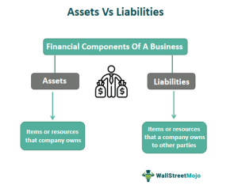

In the modern financial landscape, effective financial management, budgeting, and algorithmic trading (algo trading) play significant roles. As financial markets evolve with rapid technological advancements, these components are becoming increasingly interdependent and critical for success. Algo trading, a sophisticated method of executing trades using pre-programmed algorithms, demands efficient financial management and strategic budgeting to maximize profitability and manage risks effectively.

Expense limits are integral to maintaining fiscal discipline within financial entities, ensuring that operational costs do not exceed predefined thresholds. In conjunction with financial management, these limits provide a framework that supports transparent and responsible trading practices. By setting clear caps on expenses, organizations can present a more predictable financial profile to investors, enhancing their attractiveness and competitiveness in the market.



Budgeting is another pivotal element that intersects with algo trading. It involves anticipating costs and aligning them with expected revenues, thereby facilitating strategic decision-making and resource allocation. Well-structured budgeting practices allow companies to manage liquidity and operational risks, which are paramount in a volatile trading environment. Moreover, the use of advanced software tools has revolutionized budgeting processes, enabling real-time tracking and analysis of financial data, thus supporting better decision-making and performance evaluation.

Integrating these components—expense limits, financial management, and budgeting—into the framework of algo trading provides firms with the tools needed to optimize their trading strategies. This integration not only aids in achieving strategic financial goals but also enhances fiscal efficiency and promotes strategic growth. A comprehensive understanding and implementation of these elements are vital for firms looking to maintain a competitive edge and drive sustainable profitability in the fast-paced world of algorithmic trading.

## Table of Contents

## Understanding Expense Limits

Expense limits function as caps on the operational expenditures incurred by investment funds, particularly impacting mutual fund fees. These limits are crucial for maintaining transparency and accountability within the financial sector. Expressed as a percentage of a fund's net assets, expense limits ensure that investors are aware of the maximum fees they will incur, thereby making funds with capped expenses more attractive.

For instance, if a mutual fund manages assets worth $1 billion, and has an expense limit set at 1.5%, the maximum allowable expenses the fund can charge is $15 million. This figure is derived by multiplying the net assets by the expense limit percentage, i.e., $1,000,000,000 × 0.015. Such a structure promotes corporate transparency by clearly defining operational cost boundaries.

Investors can substantially benefit from funds with clear expense limits, as these caps prevent fees from exceeding a predefined threshold. This assurance is vital for individual and institutional investors seeking predictable expense structures. Moreover, capped expense funds often signal better governance practices—making these funds more appealing than those with fluctuating and higher fees.

Understanding expense limits is paramount when selecting investment options. Investors should consider both the immediate fee savings and the long-term implications of engaging with a fund that manages its expenses effectively. By choosing funds with favorable expense limits, investors can optimize their returns, as lower fees directly correlate with higher net returns on investment.

Additionally, funds that rigorously adhere to expense limits are likely to engage in prudent financial management practices, reflecting positively on their overall performance. Such funds are operationally efficient, leveraging minimal expenses to maximize investor returns, which is an attractive trait for savvy investors looking to ensure cost-effective growth of their portfolios.

In summary, expense limits are a vital consideration for investors in mutual funds, as they ensure corporate transparency, consistency in fee structures, and potentially higher net returns. An informed choice regarding these limits can significantly influence the financial success of an investment strategy.

## Financial Management in Algo Trading

Financial management in [algorithmic trading](/wiki/algorithmic-trading) is characterized by the precise handling of expenditures and thorough future planning. The core of this process lies in the effective deployment of expense management strategies, which are essential for monitoring and aligning expenses with organizational goals. When these strategies are adeptly implemented, they ensure that financial resources are optimized for developing and executing algorithmic trading strategies.

Expense management involves the adherence to budget constraints and the continuous assessment of economic performance. One key aspect is the maintenance of accurate financial records. These records serve as a foundation for data-driven trading strategies, enabling analysts and traders to glean insights from historical data and trends. Maintaining high-quality financial records ensures that the metrics derived are both reliable and actionable, facilitating informed decision-making processes.

Automation plays a pivotal role in enhancing the efficiency of expense tracking. By integrating automated systems, trading firms can achieve real-time data analysis, which significantly reduces the time and potential errors associated with manual tracking. Automated systems can process and analyze vast amounts of data, offering insights that support quick decision-making and enhancing responsiveness to market changes.

Real-time data analysis is another cornerstone of financial management in algorithmic trading. It allows for continuous monitoring of expenditures and provides immediate feedback on performance relative to set budgets. This capability enables trading entities to adjust their strategies and resource allocation dynamically, ensuring that they remain aligned with their financial goals.

In cooperation with programming languages such as Python, trading firms can leverage [machine learning](/wiki/machine-learning) algorithms and analytical tools to refine their strategies. For instance, a Python script utilizing libraries like pandas for data manipulation or NumPy for numerical operations can efficiently manage financial records and conduct predictive analysis. Such scripts can be designed to identify trends and offer predictive insights, enhancing the strategic foresight of financial managers.

Here is an example of a simple Python script for analyzing financial data:

```python
import pandas as pd
import numpy as np

# Load financial data
data = pd.read_csv('financial_data.csv')

# Calculate average expenses
average_expenses = data['expenses'].mean()

# Predict future expenses using a simple linear model
time = np.arange(len(data))
expenses = data['expenses'].values

# Linear regression model
coefficients = np.polyfit(time, expenses, 1)
predict = np.polyval(coefficients, time)

# Display results
print("Average Expenses:", average_expenses)
print("Predicted Expenses:", predict)
```

This script reads financial data from a CSV file, calculates the average expenses, and predicts future expenses using a basic linear regression model. Such automation and real-time analysis tools are integral to maintaining efficient expense management and support the overarching goal of enhancing the effectiveness of algorithmic trading strategies.

## The Role of Budgeting

Budgeting is a fundamental component of financial management and plays a crucial role in anticipating costs and aligning them with expected revenues. It serves as a financial blueprint that aids businesses in maintaining financial health and ensuring that they can meet their strategic objectives. A well-structured budget provides a clear framework for managing [liquidity](/wiki/liquidity-risk-premium) and operational risks, enabling organizations to plan for both short-term and long-term financial stability.

Effective budgeting practices are essential for managing liquidity, which refers to the ability of a company to cover its short-term obligations without raising external capital. Budgeting helps in estimating future cash flows accurately, thereby ensuring that a company has enough liquid assets to meet its operational needs. It also plays a key role in operational risk management by identifying potential financial shortfalls and allowing companies to make informed decisions to mitigate these risks.

One of the significant advantages of budgeting is that it enables real-time tracking of expenses and budget allocations. This capability allows businesses to make immediate adjustments and repurpose resources strategically. For instance, if a particular department is exceeding its budget, resources can be reallocated from underutilized areas to ensure overall organizational efficiency. This dynamic approach to budgeting ensures that resources are deployed effectively, maximizing the return on investment.

Advanced software tools have revolutionized how businesses monitor and analyze their financial data. These tools facilitate better tracking and analysis by offering features such as automated data entry, real-time reporting, and predictive analytics. Software solutions like QuickBooks, Microsoft Dynamics, and SAP provide sophisticated functionalities that enable companies to integrate financial data from various sources, enhancing the accuracy and timeliness of financial reporting. Additionally, the use of machine learning algorithms in budgeting software can provide predictive insights, helping businesses to forecast future financial trends with greater precision.

For example, consider the following Python code snippet that utilizes a basic machine learning model to predict future expenses based on historical financial data:

```python
import pandas as pd
from sklearn.model_selection import train_test_split
from sklearn.ensemble import RandomForestRegressor

# Sample data loading
data = pd.read_csv('financial_data.csv')  # Assume this CSV contains historical financial metrics
X = data.drop('future_expenses', axis=1)
y = data['future_expenses']

# Split the data into training and test sets
X_train, X_test, y_train, y_test = train_test_split(X, y, test_size=0.2, random_state=42)

# Initialize and fit the random forest model
model = RandomForestRegressor(n_estimators=100, random_state=42)
model.fit(X_train, y_train)

# Predict future expenses
predictions = model.predict(X_test)

# Output predictions
print("Predicted future expenses:", predictions)
```

By leveraging such technology, companies can automate the budgeting process, reduce the risk of human error, and improve the accuracy of their financial projections. This proactive approach to budgeting and expense management not only optimizes the allocation of resources but also enhances strategic planning, allowing businesses to remain agile and competitive in the rapidly evolving financial landscape.

## Algorithmic Trading and Expense Ratios

Expense ratios are critical in evaluating the cost-effectiveness of funds utilized in algorithmic trading. They represent the annual fee charged by a fund, expressed as a percentage of its average net assets. Lower expense ratios are desirable within algorithmic strategies where cost efficiency directly impacts net returns. In algorithmic trading, where margins are often razor-thin, even slight variations in expense ratios can significantly affect profitability.

A lower expense ratio signifies a more efficient fund, allowing a larger portion of returns to be retained by the investor rather than being consumed by fees. For instance, if two funds have identical gross returns, but one has an expense ratio of 0.5% and the other 1.5%, the net return disparity can be substantial over time.

Grasping expense ratios is essential for informed fund selection and risk management. Algorithmic traders often evaluate multiple funds or strategies concurrently, assessing the expense ratios alongside other factors such as historical performance, [volatility](/wiki/volatility-trading-strategies), and market conditions. Selecting funds with optimized expense ratios can enhance overall strategy yields and contribute to better risk-adjusted returns.

Backtesting is a fundamental component in developing and refining algorithmic trading strategies. Incorporating expense ratio data into [backtesting](/wiki/backtesting) scenarios allows traders to generate more realistic performance projections. For instance, if a strategy exhibits a gross annual return rate of 10% but the underlying fund carries an expense ratio of 1.25%, the net return is consequently reduced to 8.75%. By integrating these considerations into backtest models, traders can ensure their strategies are viable in practice, accounting for the cost implications of various fund options.

In summary, expense ratios are a pivotal metric in algorithmic trading, influencing both fund choice and strategic planning. Understanding and utilizing these metrics enhance the effectiveness of algorithmic strategies and ensure alignment with long-term financial objectives.

## Challenges and Best Practices

Managing accrued expenses in algorithmic trading demands a thorough understanding and application of accounting principles. This process is fraught with challenges, primarily maintaining data accuracy and ensuring compliance with an ever-evolving landscape of financial regulations.

### Challenges

The dynamic nature of algo trading, characterized by rapid transactions and massive data flows, amplifies the complexity of managing accrued expenses. Ensuring the accuracy of financial data is a significant challenge. Accurate records are essential for projecting cash flow needs and aligning financial strategies with operational goals. Any discrepancy can lead to flawed trading strategies and potential financial pitfalls.

Ensuring compliance with financial regulations is another critical challenge. Regulations can vary significantly across jurisdictions and can change rapidly in response to economic events or policy shifts. Firms engaged in algo trading must remain vigilant, monitoring these changes to avoid costly compliance violations. They must implement robust compliance frameworks that can adapt to regulatory changes without disrupting trading activities.

### Best Practices

To address these challenges, several best practices can be established. Regular audits are essential to verify the accuracy of financial records and ensure compliance with applicable laws. These audits should be comprehensive and frequent, allowing for the identification and rectification of any discrepancies before they can impact trading performance.

The adoption of automated reporting tools can enhance accuracy and efficiency in financial recordkeeping. Automation reduces the potential for human error, accelerates data processing, and provides timely insights into financial performance. Advanced algorithms can be designed to flag unusual patterns or potential compliance issues, offering an additional layer of scrutiny.

Strategic cost control is another key practice. By implementing cost-control mechanisms, firms can manage their expenses more effectively, ensuring that accrued costs do not spiral out of control. This can involve negotiating favorable terms with service providers, optimizing resource allocation, and continuously monitoring expense patterns to identify areas for cost reduction.

### Continuous Evaluation

Continuous evaluation of financial processes is crucial for maintaining a competitive advantage in the fast-paced world of algo trading. This involves regularly reviewing existing processes to identify inefficiencies or areas for improvement. By fostering a culture of continuous improvement, firms can not only address current challenges but also anticipate future ones, leveraging technological advancements to enhance financial management.

In conclusion, while managing accrued expenses in algorithmic trading presents multiple challenges, adhering to best practices such as regular audits, automated reporting, and strategic cost control can significantly mitigate these issues. Continuous evaluation of financial processes will further ensure that firms remain competitive, agile, and profitable.

## Conclusion

Expense limit management and effective budgeting hold significant importance in the context of algorithmic trading. These practices are foundational for firms seeking to optimize their trading strategies and achieve defined financial goals. By efficiently managing expense limits, firms ensure that their resources are utilized effectively, preventing overspending and safeguarding against unexpected financial pitfalls. This financial prudence allows algorithmic trading operations to function within predefined cost structures, thereby enhancing overall strategic efficiency.

Looking ahead, technological advancements promise to further bolster these integrations, offering new avenues for financial innovation and management. The continuous evolution of algorithmic trading platforms and financial software is expected to enhance data analysis capabilities, improve precision in budgeting, and streamline expense management processes. This technological progression provides firms with tools that enable more detailed tracking and adjustment of financial strategies in real-time.

A thorough understanding and meticulous management of expense limits and budgeting in algorithmic trading can significantly boost a firm's profitability and competitiveness. Firms that prioritize these elements are more likely to maintain a competitive edge by deploying capital more efficiently and responding swiftly to market changes. They also stand to benefit from enhanced decision-making capabilities and improved risk management practices. Thus, integrating effective expense control and advanced budgeting strategies remains a cornerstone of successful financial management in the dynamic landscape of algorithmic trading.

## References & Further Reading

[1]: Bergstra, J., Bardenet, R., Bengio, Y., & Kégl, B. (2011). ["Algorithms for Hyper-Parameter Optimization."](https://dl.acm.org/doi/10.5555/2986459.2986743) Advances in Neural Information Processing Systems 24.

[2]: ["Advances in Financial Machine Learning"](https://www.amazon.com/Advances-Financial-Machine-Learning-Marcos/dp/1119482089) by Marcos Lopez de Prado

[3]: ["Evidence-Based Technical Analysis: Applying the Scientific Method and Statistical Inference to Trading Signals"](https://www.amazon.com/Evidence-Based-Technical-Analysis-Scientific-Statistical/dp/0470008741) by David Aronson

[4]: ["Machine Learning for Algorithmic Trading"](https://github.com/stefan-jansen/machine-learning-for-trading) by Stefan Jansen

[5]: ["Quantitative Trading: How to Build Your Own Algorithmic Trading Business"](https://github.com/LucindaYa/quant-resources/blob/master/Quantitative%20Trading%20How%20to%20Build%20Your%20Own%20Algorithmic%20Trading%20Business.pdf) by Ernest P. Chan