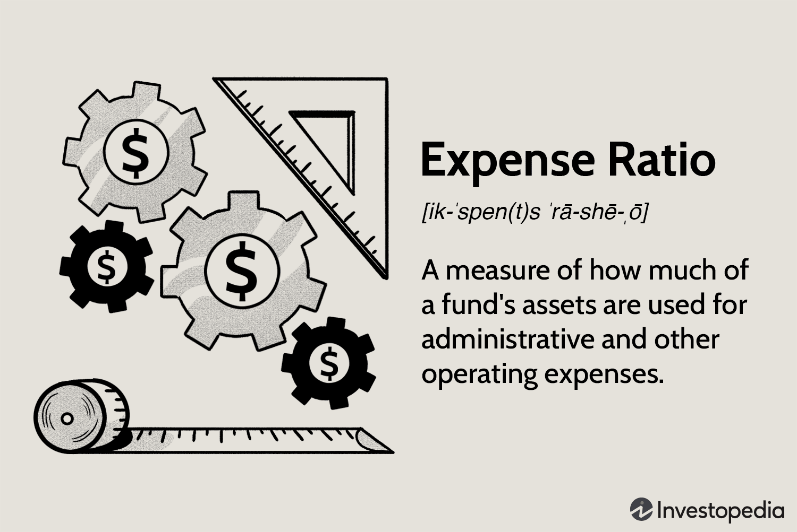

Investment funds are pooled investment vehicles, managed professionally, which allow individual and institutional investors to collectively invest in a diversified portfolio of securities. These funds play a critical role in the financial market by providing liquidity, enabling capital formation, and offering a platform for investors to participate in a broad array of investment opportunities. The major types of investment funds include mutual funds, exchange-traded funds (ETFs), and hedge funds, each serving unique investment objectives and risk profiles.

A pertinent aspect of investment funds is the expense ratio, which represents the annual fee expressed as a percentage of assets under management, charged to investors for fund management and operational expenses. Expense ratios encompass management fees, administrative costs, and other miscellaneous fees, directly impacting the net return an investor receives. Lower expense ratios are generally favorable, as they consume a smaller portion of the investment returns, especially in passive funds like ETFs, which are designed to replicate the performance of a specific index.



To evaluate the financial performance of investment funds, several metrics, such as Return on Investment (ROI), risk-adjusted returns, alpha, and beta, are employed. These metrics provide insights into how well a fund is achieving its investment objectives, relative to its risk. Investors utilize these metrics to compare fund performances, assisting in informed decision-making regarding fund selection.

Algorithmic trading, the use of automated, pre-programmed trading strategies, has become increasingly influential in the investment landscape. It allows for high-frequency trading and the efficient execution of large orders, impacting liquidity and market dynamics. Algorithmic trading strategies can optimize trading costs and execution, providing funds with a competitive edge in rapidly evolving markets.

This article aims to explore the intersection of expense ratios, financial performance metrics, and algorithmic trading in investment funds. Understanding these elements and their interplay is vital for investors seeking to enhance their investment outcomes through strategic fund selection and management.

## Table of Contents

## Understanding Investment Funds

Investment funds are collective investment vehicles that pool capital from multiple investors to purchase securities. These funds are managed by professional fund managers whose primary responsibility is to allocate the fund's assets in order to achieve investment objectives. Investment funds play a significant role in providing retail investors with diversified, professional management that may otherwise be inaccessible on an individual basis.

### Types of Investment Funds

#### Mutual Funds

Mutual funds are one of the most popular types of investment funds. They allow investors to pool their money to invest in a diversified portfolio of stocks, bonds, or other securities. Mutual funds are actively managed by fund managers who adjust the fund’s holdings based on market conditions and investment objectives. Investors purchase shares in the mutual fund, and each share represents a portion of the fund's holdings. The value of mutual fund shares is calculated at the end of the trading day using the Net Asset Value (NAV).

#### Exchange-Traded Funds (ETFs)

Exchange-Traded Funds (ETFs) represent a category of investment funds that are traded on stock exchanges much like individual stocks. ETFs are typically passively managed and track a specific index, sector, commodity, or asset class. This makes them more cost-effective compared to mutual funds. Unlike mutual funds, [ETF](/wiki/etf-trading-strategies) prices fluctuate throughout the trading day as they are bought and sold on the market.

#### Hedge Funds

Hedge funds are private investment funds that engage in diverse strategies to achieve high returns. They often utilize leverage and derivative instruments to enhance returns or manage risk. Hedge funds are less regulated than mutual funds, which allows them flexible investment strategies. However, they are usually only accessible to accredited investors due to their higher risk and minimum investment requirements.

### Operation and Role in Portfolio Diversification

Investment funds operate by pooling resources from multiple investors, which are then used to acquire a diversified portfolio of assets. This diversification helps to mitigate risk; ideally, poor performance in one asset class may be offset by better performance in another. Diversification is a fundamental principle used to reduce [volatility](/wiki/volatility-trading-strategies) and achieve more stable returns over time, a crucial aspect of investment strategy for both individual and institutional investors.

### Selecting the Right Fund for Investment Goals

Choosing the right investment fund is pivotal in meeting specific investment goals, whether they are for capital appreciation, income generation, or preservation of wealth. Factors investors should consider include:

- **Investment Objectives**: Funds have varying objectives such as growth, income, or preservation of capital. The selected fund should align with the investor's financial goals.

- **Risk Tolerance**: Different funds carry different levels of risk. Equity funds generally have higher risk compared to bond funds. Matching the fund's risk level with the investor's risk tolerance is essential.

- **Time Horizon**: Investment duration significantly impacts fund selection. Long-term goals may align better with growth-oriented funds, while short-term goals may necessitate more stable, income-generating funds.

- **Costs and Fees**: Understanding the expenses associated with a fund, such as management fees and expense ratios, is important as they can impact net returns.

In conclusion, investment funds are an effective means for individual investors to gain diversified exposure to the financial markets. By carefully selecting funds that match their investment objectives, risk profile, and financial circumstances, investors can enhance their potential for achieving long-term financial goals.

## Decoding Expense Ratios

An expense ratio is a measure used to determine the proportion of a fund's assets that are used for operational expenses. It is expressed as a percentage of the fund's average net assets and is calculated using the formula:

$$
\text{Expense Ratio} = \frac{\text{Total Annual Fund Operating Expenses}}{\text{Average Annual Net Assets}}
$$

The expense ratio encompasses various components, including management fees, administrative fees, operating expenses, and distribution (12b-1) fees. For instance, management fees cover the cost of the fund management team, while administrative fees may include charges for recordkeeping, custodial services, and shareholder communication.

The relationship between expense ratios and fund performance is significant. A lower expense ratio generally benefits investors, as it indicates that a smaller portion of the fund's returns is being consumed by operational costs, potentially leading to higher net returns. Conversely, a higher expense ratio can diminish investment returns, particularly in the case of actively managed funds where these percentages can be substantial. For example, an actively managed fund might have an expense ratio of 1.5% compared to 0.1% for a passively managed index fund. Over time, this difference can significantly impact the cumulative returns.

Investors must scrutinize expense ratios when assessing funds. One strategy is to compare the ratio with similar funds within the same category or benchmark. For instance, if an investor is evaluating a large-cap equity fund, it is prudent to compare its expense ratio with other large-cap funds. Furthermore, investors should balance the expense ratio with the fund’s performance history. A slightly higher expense ratio may be justified if the fund consistently delivers superior returns relative to its peers.

Another approach is to consider the impact of the expense ratio over extended investment horizons. To illustrate, using a simple Python function, investors can assess the long-term effect of different expense ratios on an investment of $10,000 over 20 years at an annual return of 7%:

```python
def future_value(initial_investment, annual_return, years, expense_ratio):
    return initial_investment * ((1 + annual_return - expense_ratio) ** years)

investment = 10000
annual_return = 0.07
years = 20
low_expense_ratio = 0.001  # 0.1% for index fund
high_expense_ratio = 0.015  # 1.5% for actively managed fund

low_er_value = future_value(investment, annual_return, years, low_expense_ratio)
high_er_value = future_value(investment, annual_return, years, high_expense_ratio)

print(f"Future value with low expense ratio: ${low_er_value:.2f}")
print(f"Future value with high expense ratio: ${high_er_value:.2f}")
```

Understanding these aspects of expense ratios allows investors to make informed decisions and optimize their investment fund selections to align with their specific financial goals.

## Analyzing Financial Performance of Investment Funds

Investment funds are evaluated extensively to ensure that they align with investment goals and maximize returns while managing risk effectively. A comprehensive analysis of financial performance not only involves understanding key financial metrics but also comparing historical and relative fund performance.

**Key Financial Metrics**

1. **Return on Investment (ROI):** This is a fundamental measure used to evaluate the gain or loss generated on an investment relative to its initial cost. ROI is calculated as follows:
$$
   \text{ROI} = \left( \frac{\text{Current Value of Investment} - \text{Cost of Investment}}{\text{Cost of Investment}} \right) \times 100

$$

   A higher ROI indicates a more profitable investment.

2. **Risk-Adjusted Returns:** The performance of an investment fund should always be viewed in light of risk exposure. Metrics like the Sharpe Ratio help in assessing risk-adjusted returns. The Sharpe Ratio is given by:
$$
   \text{Sharpe Ratio} = \frac{\text{Average Portfolio Return} - \text{Risk-Free Rate}}{\text{Standard Deviation of Portfolio Return}}

$$

   A higher Sharpe Ratio indicates better risk-adjusted performance.

3. **Alpha and Beta:** These metrics provide insights into a fund’s performance relative to a benchmark index. Alpha measures the active return on an investment, while Beta indicates the volatility or systemic risk compared to the broader market.

4. **Expense Ratios and Net Performance:** The expense ratio has a direct impact on net performance. It represents the fund's operational costs and is deducted from gross returns to provide net results.

**Historical Performance Analysis**

Analyzing historical performance is crucial in understanding a fund's behavior in different market conditions. Past performance, while not a definitive predictor of future results, provides essential insights into the fund’s management effectiveness and strategy robustness over varying economic cycles.

1. **Long-Term Historical Data:** Evaluating a fund’s long-term performance helps in identifying consistent trends and mitigating short-term market noise.

2. **Market Cycle Analysis:** Understanding a fund’s performance across different market cycles can indicate how well it copes with volatility or downturns.

**Comparative Performance Analysis**

When assessing investment funds with similar objectives, it is crucial to compare their performance across the same parameters to ensure an apples-to-apples evaluation.

1. **Benchmarking Against Peers:** Funds with similar investment strategies should be compared to benchmarks and peers within the same category. This helps in distinguishing the fund’s standalone performance versus market trends.

2. **Performance Consistency:** Funds that consistently outperform peers or benchmarks may exhibit superior management practices or strategic advantages, making them particularly attractive to investors.

To sum up, a multifaceted analysis involving key financial metrics, historical performance, and peer comparisons provides a comprehensive snapshot of an investment fund’s financial performance. Understanding these parameters can aid investors in making informed decisions aligned with their investment goals and risk tolerance levels.

## The Role of Algorithmic Trading in Investment Funds

Algorithmic trading refers to the use of computer algorithms to execute trading orders in financial markets. These algorithms, often based on complex mathematical models, are designed to make high-speed trading decisions without human intervention. The primary functionalities of [algorithmic trading](/wiki/algorithmic-trading) include automating repetitive tasks, optimizing trade execution for cost reduction, and exploiting market inefficiencies through rapid and accurate decision-making.

One of the most significant impacts of algorithmic trading on investment strategies is its ability to facilitate high-frequency trading ([HFT](/wiki/high-frequency-trading-strategies)), which involves executing a large number of trades at extremely high speeds. This capability can enhance [liquidity](/wiki/liquidity-risk-premium) in financial markets and reduce transaction costs. Additionally, algorithmic trading allows for [backtesting](/wiki/backtesting) of trading strategies against historical data, providing a more robust method for assessing potential outcomes before committing capital. It also supports the execution of complex strategies that may involve multiple asset classes and are difficult to manage manually.

While algorithmic trading offers numerous advantages, it also presents certain challenges. One such challenge is the potential for systemic risks, where the rapid execution of trades by numerous algorithms might lead to increased market volatility. This was notably observed during events like the Flash Crash of 2010, where the Dow Jones Industrial Average plummeted nearly 1,000 points within a short span, only to recover minutes later. Another challenge is the potential for overfitting in algorithmic models, where algorithms perform excellently on historical data but fail to generalize to real market conditions. Additionally, algorithmic trading systems require ongoing maintenance and development to ensure they adapt to evolving market conditions and regulatory environments.

Despite these challenges, algorithmic trading presents significant opportunities in managing funds efficiently. It enables fund managers to deploy strategies that capitalize on tiny price discrepancies in the market, often impossible to detect and exploit through traditional trading methods. Algorithms can also manage large volumes of data at speeds unachievable by humans, thereby distilling valuable insights for more informed decision-making.

In essence, algorithmic trading reshapes how investment funds operate by enabling more precise, efficient, and informed trading practices, thus enhancing the overall performance of these funds when effectively integrated into their trading strategies.

## The Interplay Between Expense Ratios, Financial Performance, and Algo Trading

Expense ratios, financial performance, and algorithmic trading (algo trading) are three critical factors shaping the success of investment funds. Their interplay significantly influences the funds' overall returns and cost structures.

Expense ratios represent the annual fees expressed as a percentage of average assets under management, covering operational costs. Lower expense ratios generally enhance net returns for investors. However, funds with higher expense ratios might offer superior expertise or access to unique markets that justify the cost. In funds utilizing algo trading, expense ratios play an even more critical role, as even a small change can substantially affect net returns.

Algorithmic trading introduces efficiencies that can optimize trading strategies, potentially offsetting high expense ratios. Automated systems can execute large volumes of trades faster and more accurately than human traders. This efficiency can reduce transaction costs and widen bid-ask spreads, potentially leading to better fund performance. However, implementation of algo trading usually involves substantial initial and ongoing costs, including hardware, software, and skilled personnel, thus affecting the overall expense structure of the fund.

Investors must consider the trade-off between expense ratios and the potential performance enhancements offered by algo trading. High-quality algorithmic systems may justify higher expense ratios if they deliver consistent excess returns compared to funds without such technologies.

In notable case studies, certain hedge funds employing sophisticated algo trading strategies have managed to outperform their peers despite higher expense ratios. For instance, funds implementing high-frequency trading algorithms have been able to capitalize on minute price discrepancies in real-time, leading to considerable profits that easily offset their operating costs.

Ultimately, investors need to evaluate how these elements interact to affect their investment decisions. They must assess whether the algo trading capabilities of a fund add sufficient alpha (excess returns over benchmark) to justify its expense ratio. An effective investment strategy will balance these complex dynamics to maximize net returns.

## Best Practices for Investors

When making investment decisions, it is crucial to evaluate expense ratios and financial performance comprehensively. An expense ratio represents the annual cost of owning a fund, expressed as a percentage of the fund's average assets. These costs can significantly impact the net returns that investors receive. Thus, understanding and effectively considering these factors can enhance your investment strategy.

### Evaluating Expense Ratios

Expense ratios include management fees, administrative costs, and other operational expenses. To assess acceptable expense ratios, compare similar funds to identify those with lower ratios while maintaining strong performance. A common approach is to prioritize funds with expense ratios that are below the average for their category. Ideally, investors should look for funds whose performance justifies the costs. For instance, an actively managed fund may have a higher expense ratio compared to a passive index fund, but this is acceptable if it consistently outperforms the index.

### Analyzing Financial Performance

Financial performance is assessed through various metrics such as Return on Investment (ROI), risk-adjusted returns, the Sharpe ratio, and historical performance analytics. These metrics provide insights into how well a fund has performed relative to the risk it carried. Analyzing historical performance helps understand the consistency and reliability of a fund's returns. Comparing funds with similar investment objectives reveals which offer better risk-reward trade-offs.

### Importance of Algorithmic Trading

Algorithmic trading has become integral in modern investing, allowing for rapid, data-driven decisions. These algorithms can exploit market inefficiencies and execute trades with precision and speed, potentially improving fund performance. Understanding its role can inform investors about how a fund manager might gain an edge over competitors. However, investors should be aware of the risks, such as over-reliance on algorithms that may not adapt well to unforeseen market events.

### Integrating Factors into Investment Strategy

Crafting an investment strategy that considers these elements involves several steps:

1. **Diligent Research**: Regularly review funds' expense ratios and financial performance using tools like Morningstar, which provides detailed fund ratings and comparisons.

2. **Diversification**: Use a mix of funds with different strategies and risk profiles. This can mitigate the impact of poor performance from a single fund.

3. **Periodic Rebalancing**: Adjust your portfolio to maintain your desired level of risk and take advantage of changing market conditions influenced by algorithmic trading.

4. **Cost-Benefit Analysis**: Weigh the cost of higher expense ratios against potential higher returns. Mathematical models or software can automate this analysis, providing efficient and precise evaluations.

For example, use Python libraries like Pandas for handling financial data and calculating returns:

```python
import pandas as pd

# Load fund performance data
data = pd.read_csv('fund_performance.csv')
data['ROI'] = (data['End Value'] - data['Start Value']) / data['Start Value']

# Calculate average ROI and compare against expense ratios
average_roi = data.groupby('Fund')['ROI'].mean()
expense_ratios = data.groupby('Fund')['Expense Ratio'].mean()
evaluation_df = pd.DataFrame({'Average ROI': average_roi, 'Expense Ratio': expense_ratios})

# Select funds with high ROI relative to expense ratios
selected_funds = evaluation_df[evaluation_df['Average ROI'] / evaluation_df['Expense Ratio'] > threshold]
```

By considering expense ratios, understanding the value of algorithmic trading, and evaluating financial performance metrics, investors can develop a robust strategy. This preparation is vital for navigating the complexities of the financial markets and optimizing returns over time.

## Conclusion

The interplay between expense ratios, financial performance, and algorithmic trading forms a pivotal triad influencing the success of investment funds. Expense ratios, representing the annual fee funds charge investors, are critical in determining net returns. Lower expense ratios often lead to better outcomes, provided the funds maintain comparable performance levels. Investors should be mindful of these charges, especially if compounded over time, as high expense ratios can significantly erode potential gains. 

Financial performance metrics, including Return on Investment (ROI) and risk-adjusted returns like the Sharpe Ratio, are essential for evaluating a fund's effectiveness in meeting its investment objectives. Such metrics provide insights into historical performance and potential future outcomes, allowing investors to make informed decisions.

Algorithmic trading, characterized by using computer algorithms to execute trades at optimal speeds and efficiencies, adds a modern dimension to fund management. It offers improved liquidity, reduced transaction costs, and potentially superior risk management. However, it also introduces complexities and challenges, such as algorithm failures and the necessity for continuous adaptive strategies.

Balancing these elements—expense ratios, financial performance assessments, and the integration of algorithmic trading—is paramount for enhancing investment outcomes. An optimal combination can lead to improved fund efficiency, competitive advantage, and better alignment with investor expectations.

Investors are encouraged to stay informed and adapt to the evolving landscape. Continuous education on these factors, along with the broader financial technology environment, will serve as a strategic advantage, enabling enhanced decision-making and potentially better financial returns. Adapting to these dynamically changing components will ensure that investors can capture the benefits while mitigating associated risks.

## References

1. Statman, M. (2000). Investment Portfolio Protection in Bear Markets: A Case Study. Journal of Behavioral Finance, 1(4), 191–200.

2. Fama, E. F., & French, K. R. (1993). Common Risk Factors in the Returns on Stocks and Bonds. Journal of Financial Economics, 33(1), 3–56.

3. Sharpe, W. F. (1966). Mutual Fund Performance. The Journal of Business, 39(1), 119–138.

4. Bogle, J. C. (1994). Bogle on Mutual Funds: New Perspectives for the Intelligent Investor. New York: Dell Publishing.

5. Harris, L. (2003). Trading and Exchanges: Market Microstructure for Practitioners. Oxford University Press.

6. Aldridge, I. (2013). High-Frequency Trading: A Practical Guide to Algorithmic Strategies and Trading Systems. John Wiley & Sons.

7. Grinold, R. C., & Kahn, R. N. (1999). Active Portfolio Management: A Quantitative Approach for Producing Superior Returns and Controlling Risk. McGraw-Hill Education.

8. Carhart, M. M. (1997). On Persistence in Mutual Fund Performance. The Journal of Finance, 52(1), 57–82.

9. Tetlock, P. C. (2007). Giving Content to Investor Sentiment: The Role of Media in the Stock Market. The Journal of Finance, 62(3), 1139–1168.

10. Brogaard, J., Hendershott, T., & Riordan, R. (2014). High-Frequency Trading and Price Discovery. The Review of Financial Studies, 27(8), 2267–2306.

11. Hull, J. C. (2018). Options, Futures, and Other Derivatives. Pearson.

12. Barber, B. M., & Odean, T. (2000). Trading Is Hazardous to Your Wealth: The Common Stock Investment Performance of Individual Investors. The Journal of Finance, 55(2), 773–806.

## References & Further Reading

[1]: Statman, M. (2000). ["Investment Portfolio Protection in Bear Markets: A Case Study."](https://www.jstor.org/stable/2676187) Journal of Behavioral Finance, 1(4), 191–200.

[2]: Fama, E. F., & French, K. R. (1993). ["Common Risk Factors in the Returns on Stocks and Bonds."](https://people.hec.edu/rosu/wp-content/uploads/sites/43/2023/09/Fama-French-Common-risk-factors-1993.pdf) Journal of Financial Economics, 33(1), 3–56.

[3]: Bogle, J. C. (1994). ["Bogle on Mutual Funds: New Perspectives for the Intelligent Investor."](https://archive.org/details/bogleonmutualfu000bogl) New York: Dell Publishing.

[4]: Harris, L. (2003). ["Trading and Exchanges: Market Microstructure for Practitioners."](https://academic.oup.com/book/52292) Oxford University Press.

[5]: Aldridge, I. (2013). ["High-Frequency Trading: A Practical Guide to Algorithmic Strategies and Trading Systems."](https://www.amazon.com/High-Frequency-Trading-Practical-Algorithmic-Strategies/dp/1118343506) John Wiley & Sons.

[6]: Grinold, R. C., & Kahn, R. N. (1999). ["Active Portfolio Management: A Quantitative Approach for Producing Superior Returns and Controlling Risk."](https://www.amazon.com/Active-Portfolio-Management-Quantitative-Controlling/dp/0070248826) McGraw-Hill Education.

[7]: Carhart, M. M. (1997). ["On Persistence in Mutual Fund Performance."](https://onlinelibrary.wiley.com/doi/full/10.1111/j.1540-6261.1997.tb03808.x) The Journal of Finance, 52(1), 57–82.

[8]: Brogaard, J., Hendershott, T., & Riordan, R. (2014). ["High-Frequency Trading and Price Discovery."](https://academic.oup.com/rfs/article/27/8/2267/1582754) The Review of Financial Studies, 27(8), 2267–2306.

[9]: Hull, J. C. (2018). ["Options, Futures, and Other Derivatives."](https://www.semanticscholar.org/paper/Options%2C-Futures%2C-and-Other-Derivatives-Hull/89bdee500c8623864fc9eb7a471546aa713acc44) Pearson.