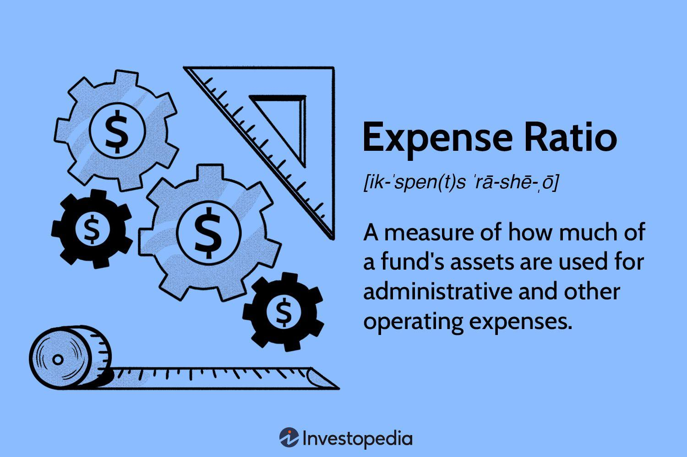

## Table of Contents

## What is an expense ratio?

An expense ratio is a measure of how much it costs to manage and operate a mutual fund or an exchange-traded fund (ETF). It is shown as a percentage of the fund's total assets and is taken out of the fund's returns each year. For example, if a fund has an expense ratio of 1%, it means that 1% of the fund's total assets will be used to cover the costs of running the fund.

The expense ratio includes various costs like management fees, administrative fees, and other operational expenses. A lower expense ratio is generally better for investors because it means more of the fund's returns go into their pockets. However, it's important to consider other factors like the fund's performance and investment strategy when choosing a fund, not just the expense ratio.

## Why is the expense ratio important for investors?

The expense ratio is important for investors because it shows how much of their money is being used to pay for the costs of running the fund. If a fund has a high expense ratio, it means a bigger part of the fund's returns will go towards these costs instead of going into the investor's pocket. So, a lower expense ratio can help investors keep more of their returns.

But, the expense ratio is not the only thing investors should look at. They should also think about how well the fund has done in the past and what kind of investments the fund makes. Sometimes, a fund with a higher expense ratio might still be a good choice if it does very well or if it fits well with the investor's goals. So, while the expense ratio is important, it's just one piece of the puzzle when choosing a fund.

## How is the expense ratio calculated?

The expense ratio is calculated by dividing the total annual operating expenses of a fund by its total assets. This gives a percentage that shows how much of the fund's assets are used to pay for its costs each year. For example, if a fund has $100 million in assets and its annual operating expenses are $1 million, the expense ratio would be 1% ($1 million divided by $100 million).

This calculation includes various costs like management fees, administrative fees, and other expenses needed to run the fund. The expense ratio is important because it directly affects the returns that investors get. A lower expense ratio means more of the fund's returns go to the investors, while a higher expense ratio means less money for investors because more is being used to cover the fund's costs.

## What are the components of an expense ratio?

The expense ratio of a fund includes different costs that add up to what it takes to run the fund. These costs can be things like management fees, which are what the fund managers get paid for [picking](/wiki/asset-class-picking) the investments and making sure the fund is doing well. There are also administrative fees, which cover things like keeping records, sending out statements, and other office work that keeps the fund running smoothly.

Other costs that might be part of the expense ratio are things like marketing and distribution fees, which help get the word out about the fund so more people will invest in it. There might also be legal and audit fees, which are needed to make sure the fund follows all the rules and everything is done correctly. All these costs together make up the expense ratio, and they are taken out of the fund's total assets every year.

The expense ratio is important because it shows how much of the fund's money is being used to pay for these costs instead of going to the investors. A lower expense ratio means more money stays in the fund for the investors, while a higher expense ratio means less money for investors because more is being used to cover the costs of running the fund.

## Can you provide a simple example of calculating an expense ratio?

Let's say a mutual fund has $10 million in total assets. The fund's total annual operating expenses are $100,000. To find the expense ratio, you divide the total annual operating expenses by the total assets. So, $100,000 divided by $10 million equals 0.01, or 1%. This means the expense ratio of the fund is 1%.

This 1% expense ratio tells us that for every dollar in the fund, one cent is used to pay for the costs of running the fund. These costs can include things like management fees, administrative fees, and other expenses needed to keep the fund going. A lower expense ratio, like this 1%, is good for investors because it means more of the fund's money stays in the fund, which can lead to higher returns for them.

## How do expense ratios vary across different types of funds?

Expense ratios can be different for different types of funds. For example, actively managed funds usually have higher expense ratios than passively managed funds. This is because actively managed funds have people who pick the investments and try to do better than the market, and this costs more money. On the other hand, passively managed funds, like index funds, just try to match the performance of a certain market index, like the S&P 500, which doesn't need as much work and so costs less.

Another thing that can affect expense ratios is the size of the fund. Bigger funds can spread their costs over more money, so they often have lower expense ratios. Smaller funds might have higher expense ratios because they have fewer assets to cover their costs. Also, the type of investments the fund makes can make a difference. Funds that invest in more complicated or less common things, like international stocks or bonds, might have higher expense ratios because it costs more to manage and trade these kinds of investments.

## What is considered a high or low expense ratio?

A low expense ratio is usually around 0.05% to 0.50%. These are often found in passively managed funds like index funds, which just try to match the market instead of beating it. A low expense ratio is good for investors because it means more of the fund's money stays in the fund, which can lead to higher returns for them.

On the other hand, a high expense ratio is usually over 1%. These are more common in actively managed funds, where people pick the investments and try to do better than the market. A high expense ratio means more of the fund's money is used to pay for costs like management fees, so less money stays in the fund for the investors. It's important for investors to look at the expense ratio along with other things like how well the fund has done and what it invests in, to decide if a fund is a good choice for them.

## How do expense ratios impact long-term investment returns?

Expense ratios can have a big impact on long-term investment returns. Even a small difference in the expense ratio can add up over time, because it's taken out of the fund's returns every year. For example, if you invest $10,000 in a fund with a 0.5% expense ratio and another $10,000 in a fund with a 1% expense ratio, the fund with the lower expense ratio will likely give you more money in the end. This is because less of your money is being used to pay for the costs of running the fund, so more stays in your pocket.

Over many years, the effect of expense ratios can be even bigger. If you're investing for a long time, like for retirement, choosing a fund with a lower expense ratio can make a big difference in how much money you end up with. For example, if both funds in the earlier example grow at the same rate, the one with the 0.5% expense ratio will give you more money after 20 or 30 years than the one with the 1% expense ratio. So, it's a good idea to look at expense ratios when picking funds, especially if you're planning to invest for the long term.

## What are the differences between gross and net expense ratios?

The gross expense ratio and the net expense ratio are two ways to look at how much it costs to run a fund. The gross expense ratio is the total cost of running the fund before any fees are waived or paid back to the investors. This number shows all the costs, like management fees, administrative fees, and other expenses, without any adjustments. It gives you a clear picture of how much it really costs to manage the fund.

The net expense ratio, on the other hand, is the cost of running the fund after some fees are waived or paid back. Fund companies sometimes agree to lower the fees for a while to make their funds more attractive to investors. So, the net expense ratio is usually lower than the gross expense ratio because it takes these waivers into account. When you're looking at a fund, the net expense ratio is what you'll actually pay, but it's good to know the gross expense ratio too, because the waivers might not last forever.

## How can investors find the expense ratio of a fund?

Investors can find the expense ratio of a fund by looking at the fund's prospectus. The prospectus is a big document that tells you all about the fund, including what it invests in, how it's managed, and how much it costs to run. You can usually find the prospectus on the website of the company that runs the fund, or you can ask them to send you a copy.

Another easy way to find the expense ratio is by using financial websites like Morningstar or Yahoo Finance. These websites have lots of information about different funds, including their expense ratios. Just type in the name or the ticker symbol of the fund you're interested in, and you'll see the expense ratio listed along with other details about the fund.

## What strategies can fund managers use to minimize expense ratios?

Fund managers can minimize expense ratios by focusing on economies of scale. This means they try to grow the size of the fund so that the costs of running it can be spread out over more money. When a fund gets bigger, the same amount of costs is divided by a larger amount of assets, which can lower the expense ratio. Another way to minimize costs is by using technology and automation to handle tasks that used to be done by people, which can save money on things like administrative fees.

Another strategy is to choose a passive management approach instead of an active one. Passive funds, like index funds, just try to match the market instead of trying to beat it, which means they don't need as many people to pick investments and manage the fund. This can lead to lower management fees and a lower expense ratio overall. Fund managers can also negotiate better deals with service providers, like custodians or auditors, to lower the costs of running the fund. By keeping these costs down, they can offer a lower expense ratio to investors.

## How do regulatory changes affect expense ratios in the investment industry?

Regulatory changes can have a big impact on expense ratios in the investment industry. When new rules come out, they can change how much it costs to run a fund. For example, if a new rule makes it more expensive for funds to do certain things, like reporting or keeping records, the expense ratio might go up because these costs are part of what makes up the expense ratio. On the other hand, if a new rule helps funds save money, like by making it easier to do business or by cutting out some fees, the expense ratio might go down.

Sometimes, regulatory changes can also make fund managers look for ways to keep their costs low. If a new rule puts a limit on how much they can charge in fees, they might have to find other ways to save money so they can still make a profit. This could mean using technology more or finding cheaper ways to manage the fund. So, regulatory changes can push fund managers to be more careful about costs, which can affect the expense ratios that investors see.

## What is the process of decoding expense ratios?

An expense ratio is a measure used to determine the proportion of a fund's assets that are used for operational expenses. It is expressed as a percentage of the fund's average net assets and is calculated using the formula:

$$
\text{Expense Ratio} = \frac{\text{Total Annual Fund Operating Expenses}}{\text{Average Annual Net Assets}}
$$

The expense ratio encompasses various components, including management fees, administrative fees, operating expenses, and distribution (12b-1) fees. For instance, management fees cover the cost of the fund management team, while administrative fees may include charges for recordkeeping, custodial services, and shareholder communication.

The relationship between expense ratios and fund performance is significant. A lower expense ratio generally benefits investors, as it indicates that a smaller portion of the fund's returns is being consumed by operational costs, potentially leading to higher net returns. Conversely, a higher expense ratio can diminish investment returns, particularly in the case of actively managed funds where these percentages can be substantial. For example, an actively managed fund might have an expense ratio of 1.5% compared to 0.1% for a passively managed index fund. Over time, this difference can significantly impact the cumulative returns.

Investors must scrutinize expense ratios when assessing funds. One strategy is to compare the ratio with similar funds within the same category or benchmark. For instance, if an investor is evaluating a large-cap equity fund, it is prudent to compare its expense ratio with other large-cap funds. Furthermore, investors should balance the expense ratio with the fund’s performance history. A slightly higher expense ratio may be justified if the fund consistently delivers superior returns relative to its peers.

Another approach is to consider the impact of the expense ratio over extended investment horizons. To illustrate, using a simple Python function, investors can assess the long-term effect of different expense ratios on an investment of $10,000 over 20 years at an annual return of 7%:

```python
def future_value(initial_investment, annual_return, years, expense_ratio):
    return initial_investment * ((1 + annual_return - expense_ratio) ** years)

investment = 10000
annual_return = 0.07
years = 20
low_expense_ratio = 0.001  # 0.1% for index fund
high_expense_ratio = 0.015  # 1.5% for actively managed fund

low_er_value = future_value(investment, annual_return, years, low_expense_ratio)
high_er_value = future_value(investment, annual_return, years, high_expense_ratio)

print(f"Future value with low expense ratio: ${low_er_value:.2f}")
print(f"Future value with high expense ratio: ${high_er_value:.2f}")
```

Understanding these aspects of expense ratios allows investors to make informed decisions and optimize their investment fund selections to align with their specific financial goals.

## What is the analysis of the financial performance of investment funds?

Investment funds are evaluated extensively to ensure that they align with investment goals and maximize returns while managing risk effectively. A comprehensive analysis of financial performance not only involves understanding key financial metrics but also comparing historical and relative fund performance.

**Key Financial Metrics**

1. **Return on Investment (ROI):** This is a fundamental measure used to evaluate the gain or loss generated on an investment relative to its initial cost. ROI is calculated as follows:
$$
   \text{ROI} = \left( \frac{\text{Current Value of Investment} - \text{Cost of Investment}}{\text{Cost of Investment}} \right) \times 100

$$

   A higher ROI indicates a more profitable investment.

2. **Risk-Adjusted Returns:** The performance of an investment fund should always be viewed in light of risk exposure. Metrics like the Sharpe Ratio help in assessing risk-adjusted returns. The Sharpe Ratio is given by:
$$
   \text{Sharpe Ratio} = \frac{\text{Average Portfolio Return} - \text{Risk-Free Rate}}{\text{Standard Deviation of Portfolio Return}}

$$

   A higher Sharpe Ratio indicates better risk-adjusted performance.

3. **Alpha and Beta:** These metrics provide insights into a fund’s performance relative to a benchmark index. Alpha measures the active return on an investment, while Beta indicates the volatility or systemic risk compared to the broader market.

4. **Expense Ratios and Net Performance:** The expense ratio has a direct impact on net performance. It represents the fund's operational costs and is deducted from gross returns to provide net results.

**Historical Performance Analysis**

Analyzing historical performance is crucial in understanding a fund's behavior in different market conditions. Past performance, while not a definitive predictor of future results, provides essential insights into the fund’s management effectiveness and strategy robustness over varying economic cycles.

1. **Long-Term Historical Data:** Evaluating a fund’s long-term performance helps in identifying consistent trends and mitigating short-term market noise.

2. **Market Cycle Analysis:** Understanding a fund’s performance across different market cycles can indicate how well it copes with volatility or downturns.

**Comparative Performance Analysis**

When assessing investment funds with similar objectives, it is crucial to compare their performance across the same parameters to ensure an apples-to-apples evaluation.

1. **Benchmarking Against Peers:** Funds with similar investment strategies should be compared to benchmarks and peers within the same category. This helps in distinguishing the fund’s standalone performance versus market trends.

2. **Performance Consistency:** Funds that consistently outperform peers or benchmarks may exhibit superior management practices or strategic advantages, making them particularly attractive to investors.

To sum up, a multifaceted analysis involving key financial metrics, historical performance, and peer comparisons provides a comprehensive snapshot of an investment fund’s financial performance. Understanding these parameters can aid investors in making informed decisions aligned with their investment goals and risk tolerance levels.

## References & Further Reading

[1]: Statman, M. (2000). ["Investment Portfolio Protection in Bear Markets: A Case Study."](https://www.jstor.org/stable/2676187) Journal of Behavioral Finance, 1(4), 191–200.

[2]: Fama, E. F., & French, K. R. (1993). ["Common Risk Factors in the Returns on Stocks and Bonds."](https://people.hec.edu/rosu/wp-content/uploads/sites/43/2023/09/Fama-French-Common-risk-factors-1993.pdf) Journal of Financial Economics, 33(1), 3–56.

[3]: Bogle, J. C. (1994). ["Bogle on Mutual Funds: New Perspectives for the Intelligent Investor."](https://archive.org/details/bogleonmutualfu000bogl) New York: Dell Publishing.

[4]: Harris, L. (2003). ["Trading and Exchanges: Market Microstructure for Practitioners."](https://academic.oup.com/book/52292) Oxford University Press.

[5]: Aldridge, I. (2013). ["High-Frequency Trading: A Practical Guide to Algorithmic Strategies and Trading Systems."](https://www.amazon.com/High-Frequency-Trading-Practical-Algorithmic-Strategies/dp/1118343506) John Wiley & Sons.

[6]: Grinold, R. C., & Kahn, R. N. (1999). ["Active Portfolio Management: A Quantitative Approach for Producing Superior Returns and Controlling Risk."](https://www.amazon.com/Active-Portfolio-Management-Quantitative-Controlling/dp/0070248826) McGraw-Hill Education.

[7]: Carhart, M. M. (1997). ["On Persistence in Mutual Fund Performance."](https://onlinelibrary.wiley.com/doi/full/10.1111/j.1540-6261.1997.tb03808.x) The Journal of Finance, 52(1), 57–82.

[8]: Brogaard, J., Hendershott, T., & Riordan, R. (2014). ["High-Frequency Trading and Price Discovery."](https://academic.oup.com/rfs/article/27/8/2267/1582754) The Review of Financial Studies, 27(8), 2267–2306.

[9]: Hull, J. C. (2018). ["Options, Futures, and Other Derivatives."](https://www.semanticscholar.org/paper/Options%2C-Futures%2C-and-Other-Derivatives-Hull/89bdee500c8623864fc9eb7a471546aa713acc44) Pearson.