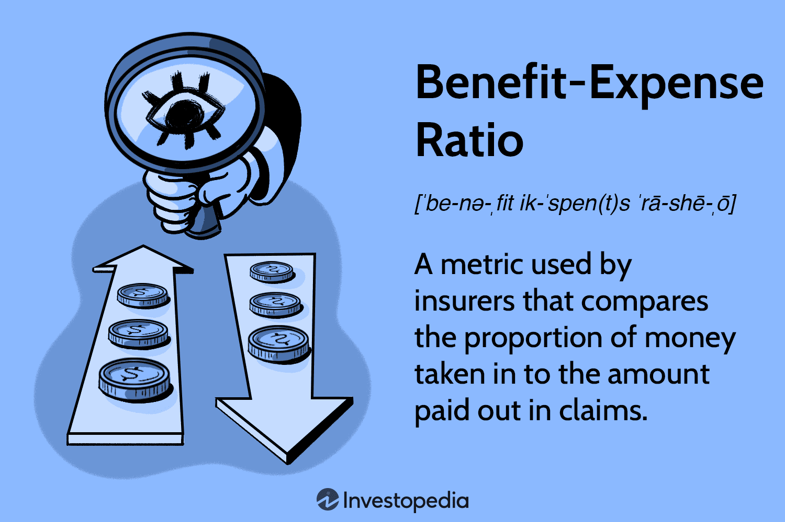

## Table of Contents

## What is an expense ratio in insurance?

An expense ratio in insurance is a way to measure how much of the money an insurance company earns from premiums is used to cover its operating costs. These operating costs can include things like employee salaries, rent for office space, and the costs of running their computer systems. The expense ratio is calculated by dividing the total operating expenses by the total premiums collected. A lower expense ratio means that the insurance company is more efficient because it spends less money on running the business and more on paying out claims to policyholders.

Understanding the expense ratio is important for both insurance companies and their customers. For insurance companies, a lower expense ratio can make them more competitive because they can offer lower premiums or better coverage. For customers, knowing the expense ratio can help them choose an insurance company that is efficient and likely to have enough money to pay out claims when needed. A high expense ratio might mean that the company is spending too much on its operations, which could lead to higher premiums or less money available for claims.

## How is the expense ratio calculated in insurance?

The expense ratio in insurance is calculated by dividing the total operating expenses of an insurance company by the total premiums it collects. Operating expenses include things like employee salaries, rent for office space, and the costs of running computer systems. Premiums are the payments that customers make for their insurance policies. So, if an insurance company has operating expenses of $50 million and collects $200 million in premiums, the expense ratio would be $50 million divided by $200 million, which equals 0.25 or 25%.

This ratio helps show how efficiently an insurance company is managing its costs. A lower expense ratio means the company is spending less money on running its business and more on paying out claims to policyholders. For example, if another insurance company has an expense ratio of 30%, it means they are spending more on their operations compared to the first company. Customers and investors often look at the expense ratio to see if an insurance company is a good choice, because a lower ratio can mean lower premiums and better financial health for the company.

## Why is the expense ratio important for insurance companies?

The expense ratio is important for insurance companies because it shows how well they are managing their money. If the expense ratio is low, it means the company is good at keeping its costs down. This is good because it means the company can use more of the money it gets from customers to pay for claims. When people buy insurance, they want to know that the company will have enough money to help them if something bad happens. A low expense ratio helps make sure the company can do that.

A high expense ratio can be a problem for insurance companies. It means they are spending a lot of money just to keep the business running. This can make it harder for them to offer low prices to customers or to pay out big claims. If customers see that a company has a high expense ratio, they might choose to go with a different company that seems more efficient. So, keeping the expense ratio low is important for staying competitive and keeping customers happy.

## What are the components that make up the expense ratio in insurance?

The expense ratio in insurance is made up of two main parts: the total operating expenses and the total premiums collected. Operating expenses are all the costs that an insurance company has to pay to keep its business running. This includes things like salaries for employees, rent for office space, and the costs of running their computer systems. Premiums are the payments that customers make for their insurance policies. The expense ratio is calculated by dividing the total operating expenses by the total premiums collected.

Understanding these components helps to see why the expense ratio is important. If an insurance company has high operating expenses, it means they are spending a lot of money just to keep the business going. This can lead to a higher expense ratio. On the other hand, if they collect a lot of premiums but keep their operating costs low, the expense ratio will be lower. A lower expense ratio is better because it means the company is using more of the money from premiums to pay claims, which is what customers want.

## How does the expense ratio affect insurance premiums?

The expense ratio can affect how much people pay for insurance. If an insurance company has a high expense ratio, it means they are spending a lot of money on things like employee salaries and office rent. To cover these costs, they might need to charge higher premiums to their customers. So, a high expense ratio can lead to higher insurance premiums because the company needs more money to pay for its operations.

On the other hand, if an insurance company has a low expense ratio, it means they are good at keeping their costs down. This can help them offer lower premiums to their customers. When a company spends less on running the business, they can use more of the money they get from premiums to pay claims. This makes the company more attractive to customers because they can get insurance at a better price.

## What is considered a good expense ratio in the insurance industry?

In the insurance industry, a good expense ratio is usually around 20% or less. This means that the insurance company is spending no more than 20 cents of every dollar it collects in premiums on running its business. A lower expense ratio is better because it shows the company is efficient and can use more money to pay claims to customers.

If an insurance company has an expense ratio higher than 30%, it might be spending too much on things like salaries and office costs. This can make it harder for the company to offer low prices to customers or to have enough money to pay claims. So, when looking for insurance, people often choose companies with lower expense ratios because it means they might get better value for their money.

## How do insurance companies manage to keep their expense ratios low?

Insurance companies try to keep their expense ratios low by being careful with how they spend money. They look for ways to save on things like office rent by choosing less expensive locations or using shared workspaces. They also try to keep employee costs down by hiring the right number of people and using technology to do some of the work that people used to do. This means they can spend less money on salaries and more on paying claims to customers.

Another way insurance companies keep their expense ratios low is by using technology smartly. They use computer systems to handle tasks like processing claims and managing customer information, which can be cheaper and faster than doing it by hand. They also use online tools to sell insurance and communicate with customers, which cuts down on the costs of paper and postage. By being smart with their spending and using technology, insurance companies can keep their costs low and offer better prices to customers.

## Can the expense ratio vary between different types of insurance policies?

Yes, the expense ratio can be different for different types of insurance policies. For example, health insurance might have a different expense ratio than car insurance. This is because the costs of running each type of insurance can be different. Health insurance companies might need to spend more money on things like processing medical claims and working with doctors, which can make their expense ratio higher. On the other hand, car insurance might not need as much money for these things, so their expense ratio could be lower.

These differences in expense ratios can affect how much people pay for their insurance. If one type of insurance has a higher expense ratio, the company might need to charge more for that policy to cover their costs. For example, if life insurance has a lower expense ratio than home insurance, the premiums for life insurance might be cheaper. People should look at the expense ratio when choosing insurance to see which type might give them the best value for their money.

## How does the expense ratio impact the profitability of an insurance company?

The expense ratio is important for the profitability of an insurance company because it shows how much of the money they get from customers goes towards running the business. If the expense ratio is low, it means the company is spending less money on things like salaries and office rent. This leaves more money to pay out claims and to keep as profit. A low expense ratio helps the company make more money because they are being efficient with their costs.

On the other hand, if the expense ratio is high, it means the company is spending a lot of money just to keep the business going. This can make it harder for the company to be profitable because they have less money left over after paying their bills. A high expense ratio can eat into the profits of the company, making it less attractive to investors and possibly leading to higher premiums for customers. So, keeping the expense ratio low is key for an insurance company to stay profitable and competitive.

## What are the regulatory considerations regarding expense ratios in insurance?

Insurance companies have to follow rules set by government agencies about how they manage their money, including their expense ratios. These rules are there to make sure insurance companies are being fair to their customers and that they have enough money to pay claims. Different places might have different rules, but usually, the rules say that insurance companies need to keep their expense ratios at a reasonable level. This helps make sure that the companies are not spending too much money on running their business and are using the money from premiums to help their customers when they need it.

If an insurance company's expense ratio is too high, it might get in trouble with the regulators. The regulators can check the company's books and ask them to explain their costs. If the company can't show that they are being efficient, they might have to change how they do things or even face fines. This is important because it helps keep insurance companies honest and makes sure they are looking out for their customers' best interests, not just trying to make as much money as possible for themselves.

## How do expense ratios in insurance compare to those in mutual funds?

Expense ratios in insurance and mutual funds are similar because they both show how much money is spent on running the business. For insurance, the expense ratio is the total operating costs divided by the total premiums collected. This helps customers see if the insurance company is spending too much money on things like salaries and office rent instead of using it to pay claims. For mutual funds, the expense ratio is the total costs of managing the fund divided by the total assets in the fund. This tells investors how much they are paying for the fund to be managed.

However, there are some differences between the two. In insurance, a good expense ratio is usually around 20% or less, which means the company is spending no more than 20 cents of every dollar on running the business. In mutual funds, a good expense ratio is often much lower, sometimes even less than 1%. This is because mutual funds don't have to deal with things like processing claims, so their costs can be smaller. Both ratios are important for customers and investors to look at, but the numbers and what they mean can be different depending on whether you're talking about insurance or mutual funds.

## What trends are currently affecting expense ratios in the insurance industry?

One big trend affecting expense ratios in the insurance industry is the use of technology. More and more insurance companies are using computers and software to do things like process claims and manage customer information. This can help them save money on things like paper and postage, and also means they don't need as many people to do the work. When companies spend less money on these things, their expense ratios go down. This is good because it means they can offer lower prices to customers and still have enough money to pay claims.

Another trend is the focus on keeping costs down. Insurance companies are always looking for ways to save money, like choosing cheaper office spaces or finding ways to make their employees more efficient. Some companies are even moving to places where it costs less to do business. When they can keep their costs low, their expense ratios stay low too. This helps them stay competitive and attract more customers who want good value for their money.

## What is the Expense Ratio in Insurance and How Can It Be Understood?

The expense ratio is a critical metric in the insurance industry, representing the proportion of an insurance company's operating expenses relative to its earned premiums. This ratio serves as an indicator of the company’s operational efficiency and cost management practices.

The expense ratio is calculated using the formula:

$$
\text{Expense Ratio} = \left( \frac{\text{Operating Expenses}}{\text{Earned Premiums}} \right) \times 100
$$

Operating expenses typically include costs related to advertising, salaries and wages for employees, administrative overheads, and other general and administrative expenses. Understanding these components is crucial for assessing an insurance company's ability to manage its non-claim related expenditures efficiently.

Accounting conventions play a significant role in how the expense ratio is calculated. Under Generally Accepted Accounting Principles (GAAP), expenses are generally recognized as they are incurred, matching them with the revenue they help to generate. GAAP provides a comprehensive approach to capturing the full economic impact of incurred expenses during the period. On the other hand, statutory accounting, used for regulatory purposes by insurance companies, often requires more conservative recognition and categorization of expenses. Statutory accounting practices are designed to ensure that insurance companies maintain sufficient reserves to meet their policyholder obligations, often leading to differences in the reported expense ratio compared to GAAP.

The expense ratio is a valuable tool for measuring an insurance company's efficiency. By evaluating this ratio, stakeholders can determine how well a company controls its operating costs independent of claims and investment income. A lower expense ratio is generally indicative of a streamlined operation, signifying effective management and operational efficiency, which can lead to improved profitability. However, it is important for insurance companies to balance cost-cutting measures with maintaining adequate service quality and competitive positioning in the market.

## What are the relationships between insurance costs and profitability metrics?

The combined ratio is a pivotal metric in assessing the profitability of insurance companies, particularly from their underwriting operations. It is composed of two primary elements: the loss ratio and the expense ratio. 

The loss ratio is derived by dividing the incurred losses by the earned premiums. It reflects the proportion of premiums used to pay claims. Essentially, the loss ratio measures how effectively an insurer is managing the underwriting risks, and a lower loss ratio usually signifies better risk management and claims prediction.

The expense ratio, as previously discussed, includes costs related to acquiring, underwriting, and servicing insurance policies. It is calculated by dividing the underwriting expenses by the net premiums earned. Together with the loss ratio, the expense ratio completes the picture of an insurer's operational costs related to underwriting.

Mathematically, the combined ratio is expressed as:

$$
\text{Combined Ratio} = \text{Loss Ratio} + \text{Expense Ratio}
$$

A combined ratio of less than 100% indicates profitability from underwriting activities. This implies that the insurer is [earning](/wiki/earning-announcement) more in premiums than it is paying out in claims and expenses. Conversely, a ratio above 100% signals an underwriting loss, suggesting that the insurer may need to rely on investment income to maintain profitability.

The combined ratio serves as a critical indicator of operational efficiency and cost management within the insurance industry. It enables insurers to gauge the effectiveness of their underwriting and expense control strategies. By analyzing this metric, companies can make informed decisions about pricing adjustments, risk assessment, and overall strategic direction. Moreover, stakeholders, including investors and analysts, often scrutinize the combined ratio as a measure of the insurance firm's fundamental financial health and capabilities in cost management.

## References & Further Reading

[1]: ["Advances in Financial Machine Learning"](https://www.amazon.com/Advances-Financial-Machine-Learning-Marcos/dp/1119482089) by Marcos Lopez de Prado

[2]: ["Algorithms for Hyper-Parameter Optimization"](https://dl.acm.org/doi/10.5555/2986459.2986743) by Bergstra, J., Bardenet, R., Bengio, Y., & Kégl, B. in Advances in Neural Information Processing Systems 24.

[3]: ["Financial Ratios Explained: Advanced Guide"](https://corporatefinanceinstitute.com/resources/accounting/financial-ratios/) - An article on CNBNC discussing various financial ratios including the expense ratio and combined ratio.

[4]: ["Quantitative Trading: How to Build Your Own Algorithmic Trading Business"](https://www.amazon.com/Quantitative-Trading-Build-Algorithmic-Business/dp/1119800064) by Ernest P. Chan

[5]: ["Machine Learning for Algorithmic Trading"](https://github.com/stefan-jansen/machine-learning-for-trading) by Stefan Jansen

[6]: ["Evidence-Based Technical Analysis: Applying the Scientific Method and Statistical Inference to Trading Signals"](https://www.amazon.com/Evidence-Based-Technical-Analysis-Scientific-Statistical/dp/0470008741) by David Aronson