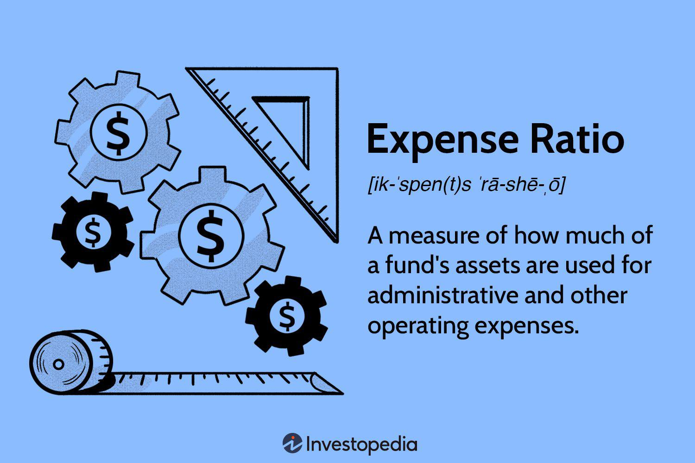

The insurance industry is a multifaceted field where understanding financial metrics is crucial for maintaining profitability and operational efficiency. Among the most critical indicators are the expense ratio and the combined ratio, each serving as a barometer for evaluating an insurance company's performance. The expense ratio, which calculates the portion of premiums used to cover operating expenses, provides insights into a company's cost management efficiency. Meanwhile, the combined ratio, integrating both the loss ratio and the expense ratio, offers a comprehensive measure of underwriting profitability.

One of the most transformative trends in the insurance sector is the advent of algorithmic trading. This innovation leverages intricate algorithms and vast datasets to optimize investment strategies, enhancing decision-making processes. Algorithmic trading is reshaping how insurance companies approach investment, risk assessment, and premium pricing, offering potential improvements in profitability and operational efficiency.



This article examines the intersection of expense ratios and algorithmic trading within the insurance industry, exploring their combined impact on costs and profitability. The interaction of these elements illustrates how technological advancements can enhance traditional financial metrics, paving the way for more strategic and data-driven business models in insurance.

## Table of Contents

## Understanding the Expense Ratio in Insurance

The expense ratio is a critical metric in the insurance industry, representing the proportion of an insurance company's operating expenses relative to its earned premiums. This ratio serves as an indicator of the company’s operational efficiency and cost management practices.

The expense ratio is calculated using the formula:

$$
\text{Expense Ratio} = \left( \frac{\text{Operating Expenses}}{\text{Earned Premiums}} \right) \times 100
$$

Operating expenses typically include costs related to advertising, salaries and wages for employees, administrative overheads, and other general and administrative expenses. Understanding these components is crucial for assessing an insurance company's ability to manage its non-claim related expenditures efficiently.

Accounting conventions play a significant role in how the expense ratio is calculated. Under Generally Accepted Accounting Principles (GAAP), expenses are generally recognized as they are incurred, matching them with the revenue they help to generate. GAAP provides a comprehensive approach to capturing the full economic impact of incurred expenses during the period. On the other hand, statutory accounting, used for regulatory purposes by insurance companies, often requires more conservative recognition and categorization of expenses. Statutory accounting practices are designed to ensure that insurance companies maintain sufficient reserves to meet their policyholder obligations, often leading to differences in the reported expense ratio compared to GAAP.

The expense ratio is a valuable tool for measuring an insurance company's efficiency. By evaluating this ratio, stakeholders can determine how well a company controls its operating costs independent of claims and investment income. A lower expense ratio is generally indicative of a streamlined operation, signifying effective management and operational efficiency, which can lead to improved profitability. However, it is important for insurance companies to balance cost-cutting measures with maintaining adequate service quality and competitive positioning in the market.

## Insurance Costs and Profitability Metrics

The combined ratio is a pivotal metric in assessing the profitability of insurance companies, particularly from their underwriting operations. It is composed of two primary elements: the loss ratio and the expense ratio. 

The loss ratio is derived by dividing the incurred losses by the earned premiums. It reflects the proportion of premiums used to pay claims. Essentially, the loss ratio measures how effectively an insurer is managing the underwriting risks, and a lower loss ratio usually signifies better risk management and claims prediction.

The expense ratio, as previously discussed, includes costs related to acquiring, underwriting, and servicing insurance policies. It is calculated by dividing the underwriting expenses by the net premiums earned. Together with the loss ratio, the expense ratio completes the picture of an insurer's operational costs related to underwriting.

Mathematically, the combined ratio is expressed as:

$$
\text{Combined Ratio} = \text{Loss Ratio} + \text{Expense Ratio}
$$

A combined ratio of less than 100% indicates profitability from underwriting activities. This implies that the insurer is [earning](/wiki/earning-announcement) more in premiums than it is paying out in claims and expenses. Conversely, a ratio above 100% signals an underwriting loss, suggesting that the insurer may need to rely on investment income to maintain profitability.

The combined ratio serves as a critical indicator of operational efficiency and cost management within the insurance industry. It enables insurers to gauge the effectiveness of their underwriting and expense control strategies. By analyzing this metric, companies can make informed decisions about pricing adjustments, risk assessment, and overall strategic direction. Moreover, stakeholders, including investors and analysts, often scrutinize the combined ratio as a measure of the insurance firm's fundamental financial health and capabilities in cost management.

## Algorithmic Trading and Its Impact on the Insurance Sector

Algorithmic trading, defined as the use of computer algorithms to automate trading decisions, has become increasingly influential in financial markets. These algorithms systematically process large datasets to enhance decision-making, executing trades at speeds and frequencies far beyond human capabilities. The growth of [algorithmic trading](/wiki/algorithmic-trading) is largely attributed to advancements in technology, including computational power and data availability, which have enabled more sophisticated and efficient trading strategies.

In the insurance sector, algorithmic trading plays a crucial role in risk assessment and premium pricing. Insurance companies collect vast amounts of data related to policyholders, claims, market trends, and economic conditions. Algorithms analyze this data to identify patterns and correlations that inform risk profiles and pricing strategies. This data-driven approach allows insurers to more accurately assess the likelihood of future claims and adjust premiums accordingly, thus optimizing their financial performance and competitiveness.

The integration of algorithmic trading with metrics specific to the insurance industry, such as the combined ratio, further exemplifies its impact. The combined ratio, a key measure of underwriting profitability, is calculated as the sum of the loss ratio and the expense ratio. In real-time investment decisions, algorithmic trading models can incorporate this metric to identify opportune moments for asset allocation or divestment. For instance, if an insurer's combined ratio indicates strong underwriting performance (i.e., below 100%), algorithms may suggest increased investment in growth-oriented strategies.

Consider a Python script example that utilizes the combined ratio in an algorithmic trading decision-making system:

```python
def calculate_combined_ratio(loss_ratio, expense_ratio):
    return loss_ratio + expense_ratio

def trading_decision(combined_ratio, threshold=100):
    if combined_ratio < threshold:
        return "Increase investment in growth strategies"
    else:
        return "Reevaluate investment positions"

# Example metrics
loss_ratio = 60  # in percentage
expense_ratio = 30  # in percentage

# Calculate combined ratio
combined_ratio = calculate_combined_ratio(loss_ratio, expense_ratio)

# Make trading decision
decision = trading_decision(combined_ratio)

print(f"Combined Ratio: {combined_ratio}%")
print(f"Trading Decision: {decision}")
```

This script highlights a simplistic approach to utilizing the combined ratio within an algorithmic framework. By programmatically assessing the combined ratio, insurers can make informed, data-backed investment decisions that align with current underwriting performance.

As the insurance sector continues to evolve with data-driven practices, algorithmic trading is likely to facilitate more refined risk management and strategic pricing approaches. Through processing large and complex datasets, algorithms enable insurers to optimize their operations, reduce human bias, and respond swiftly to market changes, ultimately reshaping profitability and competitive dynamics in the industry.

## Challenges and Future Directions in Insurance Algo Trading

Algorithmic trading is progressively altering the dynamics of the insurance industry, offering numerous opportunities for optimizing investment strategies and enhancing operational efficiencies. However, there are several challenges that accompany these advancements, particularly the issue of increased market [volatility](/wiki/volatility-trading-strategies). Algorithm-driven trades occur at high speeds and volumes, which can exacerbate short-term market fluctuations. These fluctuations may result in significant financial implications for insurance companies relying on these trades for investment income.

One critical challenge is the need for robust regulatory frameworks to govern the ethical use of AI and algorithmic trading in insurance. Regulatory bodies must ensure that algorithms operate transparently and adhere to ethical standards, mitigating risks such as biased decision-making and systemic vulnerabilities. Regulators are tasked with creating guidelines that address the transparency, accountability, and fairness of AI systems, fostering trust and reliability in this burgeoning domain.

Leveraging data analytics is another crucial aspect of refining underwriting and claims management processes. Advanced analytics can provide deeper insights into customer behavior, risk assessment, and the likelihood of claims. Insurers can utilize these insights to create more accurate risk profiles and tailor their products accordingly. For instance, [machine learning](/wiki/machine-learning) models can process vast amounts of historical data to predict future claims, enabling insurers to set premiums that reflect actual risk levels more precisely.

Looking ahead, there are promising prospects for AI-driven personalized insurance products and strategic pricing decisions. AI systems are capable of analyzing complex datasets to understand individual customer needs and preferences, paving the way for personalized insurance offerings. These AI-driven products can also dynamically adjust pricing strategies based on real-time data, potentially leading to more competitive pricing and enhanced customer satisfaction.

In conclusion, while the integration of algorithmic trading in insurance harbors considerable potential, it also necessitates addressing the challenges of market volatility and regulatory oversight. The ongoing evolution in data analytics and AI promises to refine underwriting processes and enable the development of tailored insurance products, setting the stage for a more dynamic and responsive insurance landscape.

## Conclusion

The combined ratio and expense ratio are fundamental metrics in evaluating an insurance company's performance. They provide insights into how efficiently a company operates before factoring in investment income. The combined ratio, which includes both the loss ratio and the expense ratio, serves as a comprehensive indicator of profitability. A combined ratio below 100% suggests that the company is making an underwriting profit, indicating effective cost management and operational efficiency. 

Algorithmic trading is transforming financial analysis and strategy formulation in insurance by facilitating more nuanced decision-making processes. Through the use of advanced computational techniques, algorithms can sift through vast datasets to optimize investment strategies and pricing models, potentially leading to more competitive premiums and improved risk assessment. This technology allows insurers to respond swiftly to market changes, enhancing their ability to manage portfolios and leverage insights from metrics such as the combined ratio.

Balancing technological advancements with effective risk management is crucial in this evolving landscape. While algorithmic trading offers substantial benefits, it also introduces challenges such as market volatility and regulatory concerns. Insurers must develop robust frameworks to ensure that these technologies are harnessed ethically and responsibly. Ensuring regulatory compliance and safeguarding against potential algorithmic biases are critical steps in maintaining the stability of financial markets and protecting consumer interests.

Looking to the future, the integration of insurance metrics with advanced trading models is expected to drive innovation in the sector. Emerging trends may include the development of AI-driven personalized insurance products that cater to individual risk profiles and behaviors. Moreover, strategic pricing decisions informed by real-time data analysis could redefine underwriting processes. As insurers embrace these technological advancements, they must remain vigilant in aligning them with sound risk management practices to harness their full potential responsibly.

## References & Further Reading

[1]: ["Advances in Financial Machine Learning"](https://www.amazon.com/Advances-Financial-Machine-Learning-Marcos/dp/1119482089) by Marcos Lopez de Prado

[2]: ["Algorithms for Hyper-Parameter Optimization"](https://dl.acm.org/doi/10.5555/2986459.2986743) by Bergstra, J., Bardenet, R., Bengio, Y., & Kégl, B. in Advances in Neural Information Processing Systems 24.

[3]: ["Financial Ratios Explained: Advanced Guide"](https://corporatefinanceinstitute.com/resources/accounting/financial-ratios/) - An article on CNBNC discussing various financial ratios including the expense ratio and combined ratio.

[4]: ["Quantitative Trading: How to Build Your Own Algorithmic Trading Business"](https://www.amazon.com/Quantitative-Trading-Build-Algorithmic-Business/dp/1119800064) by Ernest P. Chan

[5]: ["Machine Learning for Algorithmic Trading"](https://github.com/stefan-jansen/machine-learning-for-trading) by Stefan Jansen

[6]: ["Evidence-Based Technical Analysis: Applying the Scientific Method and Statistical Inference to Trading Signals"](https://www.amazon.com/Evidence-Based-Technical-Analysis-Scientific-Statistical/dp/0470008741) by David Aronson