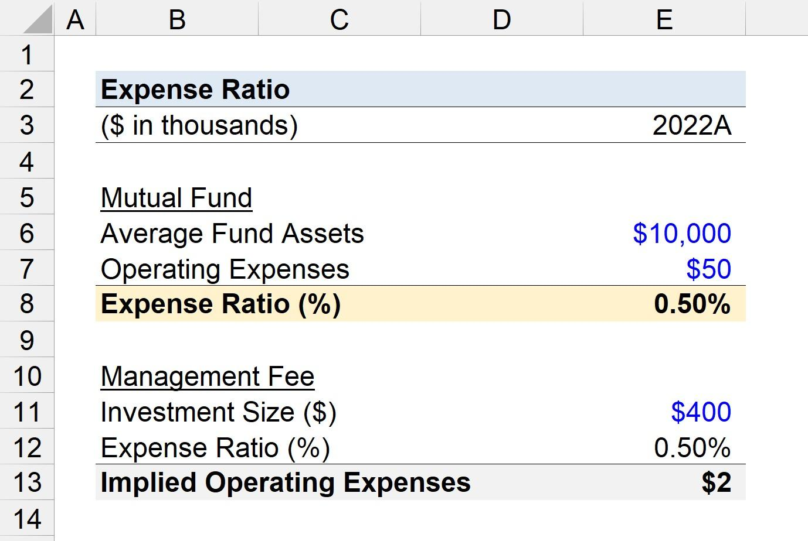

## Table of Contents

## What is an expense ratio in mutual funds?

An expense ratio in mutual funds is a fee that investors pay each year to cover the costs of managing and operating the fund. It is expressed as a percentage of the fund's average net assets. This fee is automatically deducted from the fund's returns, so it directly affects the overall performance and the amount of money investors actually earn.

For example, if a mutual fund has an expense ratio of 1%, it means that for every $100 invested, $1 is used to pay for the fund's expenses. These expenses can include management fees, administrative costs, and other operational costs. A lower expense ratio is generally better for investors because it means more of their money stays invested and can grow over time.

## How is the expense ratio calculated?

The expense ratio is calculated by dividing the total annual expenses of the mutual fund by its average net assets. The total annual expenses include management fees, administrative costs, and other operational costs that the fund incurs over a year. The average net assets are the average value of the fund's assets over the same period. This calculation gives a percentage that shows how much of the fund's assets are used to cover its expenses.

For example, if a mutual fund has total annual expenses of $10 million and average net assets of $1 billion, the expense ratio would be 1%. This means that for every dollar invested in the fund, one cent goes towards covering the fund's expenses. The expense ratio is important because it directly affects the returns that investors receive; a lower expense ratio means more of the fund's returns go to the investors.

## Why are expense ratios important for investors?

Expense ratios are important for investors because they show how much it costs to own a mutual fund. This cost is taken out of the fund's returns every year, so a high expense ratio can eat into the money an investor makes. If two funds perform the same but one has a lower expense ratio, the investor will keep more of their earnings from the fund with the lower fee.

Choosing a fund with a lower expense ratio can make a big difference over time. Even small differences in fees can add up, especially over many years. This means that over the long term, a fund with a lower expense ratio can help investors save money and potentially earn more from their investments.

## What is considered a high or low expense ratio?

A high expense ratio is usually one that is above 1%. This means that for every $100 you invest, more than $1 is taken out each year to pay for the fund's costs. Funds with high expense ratios are often actively managed, where a team of experts picks the investments. These funds might be more expensive because of the extra work and research that goes into managing them.

A low expense ratio is generally considered to be 0.5% or less. For every $100 you invest, you would pay 50 cents or less in fees each year. Funds with low expense ratios are often index funds or ETFs, which track a market index like the S&P 500. These funds are usually cheaper because they don't need as much active management.

The difference between high and low expense ratios can really add up over time. If you're investing for the long term, choosing a fund with a lower expense ratio can help you keep more of your money and potentially earn more from your investments.

## How do expense ratios affect the returns of a mutual fund?

Expense ratios directly affect the returns of a mutual fund by reducing the amount of money that investors actually earn. When you invest in a mutual fund, the fund's expenses are taken out of its total returns every year. This means that if a fund makes 10% in a year but has an expense ratio of 1%, you will only get to keep 9% of that return. The higher the expense ratio, the more it eats into your earnings, leaving you with less money at the end of the year.

Over time, even small differences in expense ratios can make a big difference in your investment's growth. For example, if you invest $10,000 in a fund with a 1% expense ratio and another $10,000 in a fund with a 0.1% expense ratio, the fund with the lower expense ratio will grow faster because less money is being taken out for fees. This can add up over many years, making it important to choose funds with lower expense ratios if you want to keep more of your investment returns.

## Can expense ratios change over time, and if so, why?

Yes, expense ratios can change over time. This happens because the costs of running a mutual fund can go up or down. For example, if the fund needs to pay more for managing the investments or if there are changes in how the fund is run, the expense ratio might go up. On the other hand, if the fund gets bigger and can spread its costs over more money, the expense ratio might go down.

These changes can affect how much money you keep from your investments. If the expense ratio goes up, more of your returns will be used to pay for the fund's costs, leaving you with less money. If it goes down, you get to keep more of your earnings. It's good to check the expense ratio now and then to see if it's changed and how it might impact your investment over time.

## What are the different components that make up the expense ratio?

The expense ratio of a mutual fund is made up of different costs that the fund has to pay to keep running. One big part of it is the management fee, which is what the fund pays to the people who pick the investments and manage the money. Another part is the administrative costs, which cover things like keeping records, sending out reports to investors, and other office work. There are also other costs like paying for legal help, accounting services, and sometimes even marketing the fund to new investors.

All these costs together make up the total annual expenses of the fund. When you divide these total expenses by the fund's average net assets, you get the expense ratio. This ratio is important because it shows how much of the fund's money is used to pay for running the fund, and less of it is left for the investors to earn. So, a lower expense ratio means more money stays in the fund to grow and be shared with investors.

## How do expense ratios of actively managed funds compare to those of passively managed funds?

Actively managed funds usually have higher expense ratios than passively managed funds. This is because actively managed funds hire people to pick the investments and try to do better than the market. All this work costs money, so the fees are higher. On average, the expense ratio for an actively managed fund can be around 1% or even more. This means for every $100 you invest, $1 or more goes to pay for running the fund.

Passively managed funds, like index funds and ETFs, have lower expense ratios. These funds just try to match the performance of a market index, like the S&P 500, instead of trying to beat it. Because they don't need as much work to manage, their costs are lower. The expense ratio for a passively managed fund can be as low as 0.05% to 0.5%. So, for every $100 you invest, you might only pay 5 cents to 50 cents in fees. Over time, these lower costs can make a big difference in how much money you keep from your investments.

## What role does the fund size play in determining the expense ratio?

The size of a mutual fund can affect its expense ratio. Bigger funds often have lower expense ratios because they can spread their costs over more money. For example, if a fund has a lot of money, the costs of running it, like paying for managers and office work, are divided among a larger amount of money. This means each investor pays a smaller share of the costs, which leads to a lower expense ratio.

However, smaller funds might have higher expense ratios. Since they have less money to work with, the same costs are spread over a smaller amount. This means each investor has to pay a bigger share of the costs, which can make the expense ratio higher. So, when you're looking at funds to invest in, it's good to think about how the size of the fund might affect the fees you pay.

## How can investors find the expense ratio of a mutual fund?

Investors can find the expense ratio of a mutual fund by looking at the fund's prospectus. The prospectus is a document that gives all the important details about the fund, including its fees and costs. You can usually find the prospectus on the website of the company that runs the fund, or you can ask them to send you a copy.

Another easy way to find the expense ratio is by using financial websites. Websites like Morningstar, Yahoo Finance, or the fund company's own site often list the expense ratio right on the fund's page. Just type in the name of the fund, and you should be able to see the expense ratio along with other information about the fund.

## Are there any regulatory limits on expense ratios in different countries?

In the United States, there are no strict regulatory limits set by the government on how high a mutual fund's expense ratio can be. However, the Securities and Exchange Commission (SEC) requires that funds fully disclose their fees to investors. This means that funds must be clear about their expense ratios in their prospectus and other documents. The SEC also watches to make sure that the fees charged are fair and not too high compared to what the fund is doing for its investors.

In other countries, the rules can be different. For example, in the European Union, there are some rules that try to keep fees reasonable. The Undertakings for Collective Investment in Transferable Securities (UCITS) directive sets some standards for funds sold in the EU, including rules about how fees are shown to investors. But like in the U.S., there are no hard limits on how high the expense ratio can go. Each country might have its own rules, so it's good to check what the rules are where you live.

## What strategies can investors use to minimize the impact of high expense ratios on their investment returns?

Investors can minimize the impact of high expense ratios by choosing funds with lower fees. One good way to do this is by looking at index funds or ETFs, which usually have lower expense ratios than actively managed funds. These funds track a market index like the S&P 500 and don't need a team of people to pick investments, so they cost less to run. By picking these cheaper funds, investors can keep more of their money and let it grow over time.

Another strategy is to pay attention to the size of the fund. Bigger funds often have lower expense ratios because they can spread their costs over more money. So, if you're choosing between two similar funds, the one with more money in it might have a lower expense ratio. Also, it's smart to check the expense ratio every now and then because it can change. If it goes up a lot, you might want to think about switching to a different fund with lower fees to keep more of your investment returns.

## What are Mutual Funds Expense Ratios and How Can They Be Understood?

A mutual fund expense ratio is a crucial indicator for investors, representing the percentage of a fund's assets used for administrative and operating expenses. This ratio provides insight into the costs associated with managing a mutual fund, influencing its net returns to investors. The expense ratio is calculated by dividing a mutual fund's total annual expenses by its average net assets. Mathematically, it can be expressed as:

$$
\text{Expense Ratio (\%)} = \left( \frac{\text{Total Annual Expenses}}{\text{Average Net Assets}} \right) \times 100
$$

The typical components included in an expense ratio encompass management fees, which are payments to the fund manager for their expertise and decision-making; administrative costs for record-keeping and customer service; and operational costs, such as legal and accounting fees. Some funds might also include marketing and distribution fees, known as 12b-1 fees.

Expense ratios can be classified as high or low, providing investors with an understanding of a mutual fund's efficiency and cost-effectiveness. A high expense ratio indicates that a significant portion of the fund's assets is consumed by management and operational fees, potentially reducing returns. Conversely, a low expense ratio suggests minimal expenses relative to the size of the assets, potentially leading to higher net returns for investors.

Actively managed funds typically exhibit higher expense ratios due to the higher costs associated with frequent trading, comprehensive research, and active management strategies. According to the Investment Company Institute, actively managed funds have average expense ratios ranging from 0.50% to 1.50% annually. In contrast, passively managed funds, including index funds, tend to have lower expense ratios, often below 0.20%, as they replicate a market index and entail less trading and management effort.

Understanding the expense ratio is vital for investors to assess a fund's potential impact on their investment returns, allowing for informed decision-making when building a diversified and cost-effective investment portfolio.

## What is the impact of expense ratios on investment returns?

Expense ratios play a crucial role in determining the net returns of mutual fund investments. They represent the annual fees expressed as a percentage of the fund's assets and encompass various costs such as management fees, administrative expenses, and other operational costs. Understanding and considering these ratios can make a significant difference in the long-term performance of an investment portfolio.

**Impact on Net Returns**

Imagine an investor choosing between two mutual funds: Fund A with a low expense ratio of 0.5% and Fund B with a higher expense ratio of 1.5%. If both funds are expected to generate a gross return of 7% per annum, the net return after fees for Fund A would be 6.5% and for Fund B, 5.5%. Over time, even a seemingly small difference in expense ratios can lead to substantial divergences in wealth accumulation due to the effects of compounding.

**Example of Cost Implications**

To illustrate, consider an initial investment of $10,000 in both funds. Over a 20-year period, the accumulated return can be calculated using the compound interest formula:

$$
A = P \times (1 + r)^n
$$

where $A$ is the amount of money accumulated after n years, including interest, $P$ is the principal amount (initial investment), $r$ is the annual interest rate (net return), and $n$ is the number of years the money is invested.

For Fund A:

$$
A = 10000 \times (1 + 0.065)^{20} \approx 34935
$$

For Fund B:

$$
A = 10000 \times (1 + 0.055)^{20} \approx 29220
$$

The difference in final amounts illustrates how Fund B's higher expense ratio reduces the ending balance by approximately $5,715 after 20 years, showcasing the impact on net returns.

**Compounding Costs**

The concept of compounding costs is crucial in understanding expense ratios. Compounding not only amplifies gains but also magnifies the erosion caused by costs. In the previous example, the lost potential of the extra $5,715 becomes evident over the investment's duration. Although Fund B earns 1% less annually due to higher fees, this 1% compounds each year, significantly reducing the investor's net return over time.

Investors frequently underestimate the long-term effects of high expense ratios. While a 1% difference might seem trivial annually, it compounds into a substantial reduction in the total return, underlining the importance of minimizing costs.

Through this understanding, investors can appreciate the significance of selecting funds with lower expense ratios, comprehend the gradual erosion of returns caused by high expenses, and consequently make more informed investment decisions.

## What are some strategies to minimize investment costs?

To effectively manage and reduce expense-related investment costs, investors should consider various strategies that prioritize cost efficiency while maintaining portfolio performance. One key approach is the utilization of low-cost investment options, such as index funds and exchange-traded funds (ETFs), which typically offer lower expense ratios compared to actively managed mutual funds. By tracking market indices, these investment vehicles inherently require less management intervention, resulting in reduced fees. Index funds, replicating the composition of indexes like the S&P 500, tend to have expense ratios often below 0.20%, whereas actively managed funds might exceed 1%.[^1^]

Regular portfolio reviews and adjustments are essential to maintaining cost efficiency. An investor should periodically assess the performance and expense ratios of their holdings. A methodical review could identify funds that drag on overall returns due to high fees or underperformance. Investors might sum up their holdings' expense ratios and compare them against targeted benchmarks or peer funds. Suppose the goal is an average expense ratio no higher than 0.50%. The formula to calculate the weighted average expense ratio of a portfolio is:

$$

\text{Weighted Average Expense Ratio} = \sum \left( \frac{\text{Value of Investment in Fund}_i}{\text{Total Portfolio Value}} \times \text{Expense Ratio Fund}_i \right) 
$$

Implementing cost-efficient strategies involves consistently evaluating investment vehicles and reallocating resources towards funds with favorable expense structures. Switching to lower-cost funds following a favorable analysis can enhance long-term net returns. Additionally, automated rebalancing tools, available through many brokerage platforms, can aid investors in maintaining their intended asset allocation with minimal turnover and associated costs.

Another effective technique is leveraging tax-efficient strategies. Exchange-traded funds often provide a tax advantage over mutual funds by using the in-kind creation and redemption process, which minimizes capital gains distributions. This aspect makes ETFs a compelling alternative for taxable investment accounts.

Investors should implement a disciplined approach to examining the cost structures of different investment options while remaining vigilant in managing their portfolios. Taking advantage of lower-cost alternatives like index funds and ETFs, combined with regular portfolio assessments, can result in significant cost savings and optimize long-term financial performance.

[^1^]: [Morningstar. (2022). 2022 Fund Fee Study. Morningstar Inc.](https://www.morningstar.com/lp/annual-mutual-fund-fee-study)

## References & Further Reading

[1]: ["2022 Fund Fee Study"](https://newsroom.morningstar.com/newsroom/news-archive/press-release-details/2023/Morningstar-Finds-Investors-Saved-Nearly-9.8-Billion-In-Fund-Fees-In-2022/default.aspx) by Morningstar Inc.

[2]: Bergstra, J., Bardenet, R., Bengio, Y., & Kégl, B. (2011). ["Algorithms for Hyper-Parameter Optimization."](https://dl.acm.org/doi/10.5555/2986459.2986743) Advances in Neural Information Processing Systems 24.

[3]: ["Advances in Financial Machine Learning"](https://www.amazon.com/Advances-Financial-Machine-Learning-Marcos/dp/1119482089) by Marcos Lopez de Prado

[4]: ["Evidence-Based Technical Analysis: Applying the Scientific Method and Statistical Inference to Trading Signals"](https://www.amazon.com/Evidence-Based-Technical-Analysis-Scientific-Statistical/dp/0470008741) by David Aronson

[5]: ["Machine Learning for Algorithmic Trading"](https://github.com/stefan-jansen/machine-learning-for-trading) by Stefan Jansen

[6]: ["Quantitative Trading: How to Build Your Own Algorithmic Trading Business"](https://books.google.com/books/about/Quantitative_Trading.html?id=j70yEAAAQBAJ) by Ernest P. Chan