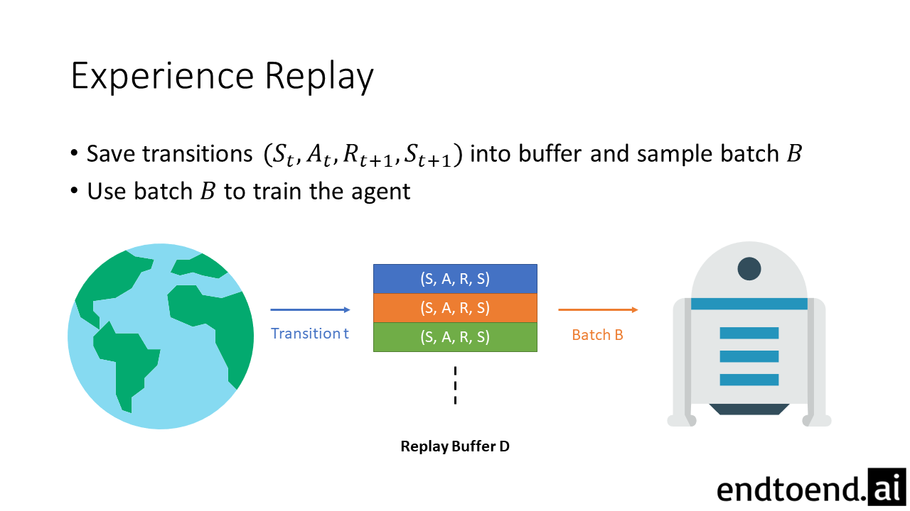

## Table of Contents

## What is Experience Replay in machine learning?

Experience Replay is a technique used in reinforcement learning to improve the efficiency and stability of learning algorithms. In reinforcement learning, an agent learns by interacting with an environment, taking actions, and receiving rewards or penalties. The agent stores these experiences, which include the state of the environment, the action taken, the reward received, and the next state, in a memory buffer known as the replay buffer. Instead of learning from experiences in the order they occur, the agent randomly samples a batch of experiences from the replay buffer to train on. This random sampling helps break the correlation between consecutive experiences, leading to more stable and robust learning.

The key benefit of Experience Replay is that it allows the agent to learn from past experiences multiple times, which can lead to better generalization and faster learning. By revisiting old experiences, the agent can discover new patterns and relationships that it might have missed during the initial encounter. Additionally, Experience Replay helps mitigate the problem of catastrophic forgetting, where an agent forgets previously learned information when learning new information. By continually mixing old and new experiences, the agent can maintain and refine its knowledge over time, resulting in a more effective learning process.

## Why is Experience Replay important in reinforcement learning?

Experience Replay is important in reinforcement learning because it helps the agent learn more effectively and efficiently. When an agent interacts with its environment, it collects experiences which include the state it was in, the action it took, the reward it received, and the next state. Instead of learning from these experiences in the order they happen, the agent stores them in a memory called a replay buffer. Then, it randomly picks a group of experiences from this buffer to learn from. This randomness helps break the pattern of learning from similar experiences one after the other, making the learning process more stable and less likely to get stuck on bad patterns.

Another reason Experience Replay is important is that it allows the agent to learn from the same experiences multiple times. This repeated learning can help the agent find new ways to understand the environment that it might have missed before. It also helps prevent the agent from forgetting old lessons when learning new ones, a problem known as catastrophic forgetting. By mixing old and new experiences, the agent can keep improving its knowledge over time, making it smarter and better at making decisions.

## How does Experience Replay improve the efficiency of learning in neural networks?

Experience Replay helps make learning faster and better for neural networks in [reinforcement learning](/wiki/reinforcement-learning). When a [neural network](/wiki/neural-network) learns, it usually sees experiences one after another. But with Experience Replay, the network doesn't just learn from new experiences right away. Instead, it saves all its experiences in a big memory called a replay buffer. Then, it picks some experiences randomly from this buffer to learn from. This randomness helps the network learn from different kinds of experiences, not just the newest ones. It's like studying from a mix of old and new notes, which can help the network understand things better and learn quicker.

Another way Experience Replay helps is by letting the neural network see the same experiences many times. When the network learns from an experience again, it might notice things it missed the first time. This is important because it can help the network find better ways to solve problems. Also, by mixing old and new experiences, the network doesn't forget what it learned before when it learns something new. This keeps the network's knowledge strong and growing, making it smarter over time.

## Can you explain the basic mechanism of Experience Replay?

Experience Replay is a technique used in reinforcement learning to help an agent learn better. When an agent interacts with its environment, it collects information about what it did, what happened, and what reward it got. Instead of learning from this information right away, the agent saves all these experiences in a big memory called a replay buffer. Then, instead of learning from the experiences in the order they happened, the agent picks some experiences randomly from the buffer to learn from. This randomness helps the agent learn from different kinds of experiences, not just the newest ones, making the learning process more stable and effective.

By using Experience Replay, the agent can see the same experiences many times. This is helpful because the agent might notice things it missed the first time around. For example, if the agent sees an experience again, it might find a better way to solve a problem. Also, by mixing old and new experiences, the agent doesn't forget what it learned before when it learns something new. This keeps the agent's knowledge strong and growing, making it smarter over time.

## What are the key components of an Experience Replay buffer?

An Experience Replay buffer is like a big container that holds all the experiences an agent has while learning. Each experience includes four main things: the state the agent was in, the action the agent took, the reward the agent got, and the next state the agent moved to. These pieces of information are really important because they help the agent understand what happened and what to do next. The buffer keeps all these experiences together so the agent can look at them again later.

When the agent wants to learn, it doesn't just use the newest experiences. Instead, it picks some experiences randomly from the buffer. This randomness helps the agent learn from different kinds of experiences, not just the ones that happened recently. By looking at old and new experiences mixed together, the agent can find new ways to solve problems and remember what it learned before. This makes the learning process more stable and helps the agent get smarter over time.

## How do you implement an Experience Replay buffer in code?

To implement an Experience Replay buffer in code, you'll need to create a class that can store and retrieve experiences. An experience typically includes the state, action, reward, and next state. You can use a list or a deque from Python's collections module to store these experiences. When you want to add a new experience, you can use the `append` method if you're using a list, or `appendleft` if you're using a deque. To keep the buffer from growing too large, you might want to set a maximum size. If the buffer is full and you try to add a new experience, you can remove the oldest experience first.

Here is a simple example of how you might implement an Experience Replay buffer in Python:

```python
from collections import deque

class ExperienceReplayBuffer:
    def __init__(self, capacity):
        self.buffer = deque(maxlen=capacity)

    def add(self, state, action, reward, next_state):
        experience = (state, action, reward, next_state)
        self.buffer.appendleft(experience)

    def sample(self, batch_size):
        indices = np.random.choice(len(self.buffer), batch_size, replace=False)
        states, actions, rewards, next_states = zip(*(self.buffer[idx] for idx in indices))
        return states, actions, rewards, next_states

    def __len__(self):
        return len(self.buffer)
```

In this code, the `ExperienceReplayBuffer` class has methods to add new experiences and to sample a batch of experiences randomly. The `add` method takes in the state, action, reward, and next state, and adds them to the buffer as a tuple. The `sample` method uses NumPy to randomly select a batch of experiences from the buffer. This way, the agent can learn from a mix of old and new experiences, which helps improve the learning process.

## What are the benefits of using Experience Replay in deep Q-learning?

Experience Replay in deep Q-learning helps make learning more stable and efficient. When an agent learns, it usually sees experiences one after another. But with Experience Replay, the agent doesn't just learn from new experiences right away. Instead, it saves all its experiences in a big memory called a replay buffer. Then, it picks some experiences randomly from this buffer to learn from. This randomness helps the agent learn from different kinds of experiences, not just the newest ones. It's like studying from a mix of old and new notes, which can help the agent understand things better and learn quicker.

Another way Experience Replay helps in deep Q-learning is by letting the agent see the same experiences many times. When the agent learns from an experience again, it might notice things it missed the first time. This is important because it can help the agent find better ways to solve problems. Also, by mixing old and new experiences, the agent doesn't forget what it learned before when it learns something new. This keeps the agent's knowledge strong and growing, making it smarter over time.

## How does Experience Replay help in breaking the correlation of sequential data?

When an agent learns from experiences one after another, those experiences can be very similar, especially if the agent is stuck in a loop or following a certain pattern. This can make the learning process unstable because the agent keeps seeing the same kind of information over and over. Experience Replay helps by storing all these experiences in a big memory called a replay buffer. Instead of learning from them in the order they happened, the agent picks experiences randomly from this buffer. This randomness breaks the pattern of learning from similar experiences one after the other, making the learning process more stable and less likely to get stuck on bad patterns.

By using Experience Replay, the agent can learn from a mix of old and new experiences. This helps the agent see different kinds of situations and learn from them in a more balanced way. When the agent sees an experience again, it might notice things it missed the first time around. This repeated learning can help the agent find new ways to understand the environment and solve problems better. Also, by mixing old and new experiences, the agent doesn't forget what it learned before when it learns something new. This keeps the agent's knowledge strong and growing, making it smarter over time.

## What are some common challenges faced when using Experience Replay?

One common challenge when using Experience Replay is managing the size of the replay buffer. If the buffer grows too large, it can use a lot of memory and slow down the learning process. To solve this, people often set a maximum size for the buffer. When it's full and a new experience comes in, the oldest experience is removed to make room for the new one. This way, the buffer stays at a manageable size, but it means the agent might lose some old experiences that could still be useful.

Another challenge is deciding how to sample experiences from the buffer. Random sampling helps break the correlation of sequential data, but it might not be the best way to learn from important experiences. Some experiences are more valuable than others because they might show the agent something new or important. To deal with this, people sometimes use methods like prioritized experience replay, where experiences that are more important or less understood get sampled more often. This can help the agent learn faster, but it also makes the system more complex to manage.

A third challenge is making sure the agent doesn't forget old lessons when learning new ones, a problem known as catastrophic forgetting. Experience Replay helps by letting the agent see old experiences again, but if the buffer isn't big enough or if the sampling isn't done right, the agent might still forget. To avoid this, people sometimes keep a separate buffer for old experiences or use techniques to make sure the agent keeps revisiting what it has learned before. This can help the agent keep its knowledge strong and growing over time.

## How can the size of the Experience Replay buffer affect the performance of a model?

The size of the Experience Replay buffer can really change how well a model learns. If the buffer is too small, it might not hold enough different experiences for the model to learn from. This can make the model forget important lessons or miss out on new ways to solve problems. On the other hand, if the buffer is too big, it can use up a lot of memory and slow down the learning process. The model might spend too much time looking at old experiences that aren't as helpful anymore, instead of focusing on new ones.

Finding the right size for the Experience Replay buffer is a bit like finding the right amount of notes to study from. You want enough notes to cover all the important stuff, but not so many that you get overwhelmed and can't focus on what's new. By choosing a good size for the buffer, you can help the model learn faster and better, without using too much memory or forgetting what it learned before.

## What advanced techniques can be used to optimize Experience Replay?

One advanced technique to optimize Experience Replay is called Prioritized Experience Replay. Instead of [picking](/wiki/asset-class-picking) experiences randomly from the buffer, this method chooses experiences based on how important they are. Experiences that the model hasn't learned well or that are more valuable get picked more often. This can help the model learn faster because it focuses on the experiences that matter most. But it also makes the system more complex because you need to keep track of how important each experience is.

Another technique is using a separate buffer for old experiences to help prevent the model from forgetting what it learned before. This is called a "replay buffer with separate memory for old experiences." By keeping some old experiences in a different place, the model can still learn from new experiences but also revisit the old ones to keep its knowledge strong. This can help the model avoid a problem called catastrophic forgetting, where it forgets old lessons when learning new ones. Balancing the use of old and new experiences can make the model smarter over time.

## How does prioritized Experience Replay work and what are its advantages?

Prioritized Experience Replay works by choosing experiences from the replay buffer based on how important they are, instead of picking them randomly. Each experience gets a score that shows how much the model needs to learn from it. Experiences that the model hasn't learned well or that are more valuable get higher scores. When the model wants to learn, it picks experiences with higher scores more often. This way, the model can focus on the experiences that matter most and learn faster.

The main advantage of prioritized Experience Replay is that it helps the model learn more quickly and efficiently. By focusing on the most important experiences, the model can find new ways to solve problems and improve its understanding of the environment. But, this method also makes the system more complex because you need to keep track of the scores for each experience and update them as the model learns. Despite this, the benefits of faster learning and better performance make it a valuable technique in reinforcement learning.

## References & Further Reading

[1]: Mnih, V., Kavukcuoglu, K., Silver, D., Graves, A., Antonoglou, I., Wierstra, D., & Riedmiller, M. (2013). ["Playing Atari with Deep Reinforcement Learning."](https://arxiv.org/abs/1312.5602) arXiv preprint arXiv:1312.5602.

[2]: Lin, L. J. (1992). ["Self-Improving Reactive Agents Based on Reinforcement Learning, Planning, and Teaching."](https://link.springer.com/article/10.1007/BF00992699) Machine Learning, 8, 293-321.

[3]: Schaul, T., Quan, J., Antonoglou, I., & Silver, D. (2015). ["Prioritized Experience Replay."](https://arxiv.org/abs/1511.05952) arXiv preprint arXiv:1511.05952.

[4]: Sutton, R. S., & Barto, A. G. (2018). ["Reinforcement Learning: An Introduction."](https://web.stanford.edu/class/psych209/Readings/SuttonBartoIPRLBook2ndEd.pdf) MIT Press.

[5]: van Hasselt, H., Guez, A., & Silver, D. (2016). ["Deep Reinforcement Learning with Double Q-learning."](https://arxiv.org/abs/1509.06461) In Proceedings of the AAAI Conference on Artificial Intelligence (Vol. 30, No. 1).